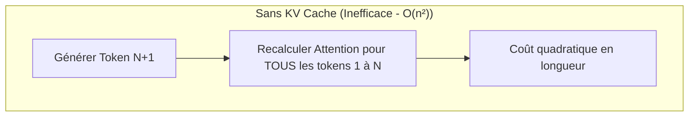
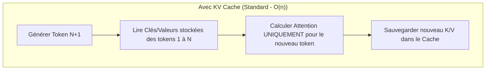

> [!tip] En bref
> Les poids du modèle occupent une VRAM fixe. Mais plus votre conversation est longue, plus le KV Cache grandit et peut consommer autant de VRAM que le modèle lui-même. Ce chapitre explique ce mécanisme et comment le maîtriser.

Si le poids d'un modèle (les paramètres) détermine la quantité de VRAM minimale pour démarrer une IA, la **longueur du contexte** (le prompt + l'historique) dicte la quantité de mémoire dynamique consommée pendant l'utilisation.

À l'usage, un contexte très long (32K, 128K ou plus) peut consommer **plus de [[00-lexique/vram|VRAM]] que le modèle lui-même** [^1]. Ce goulot d'étranglement est géré par un mécanisme physique appelé le **KV Cache** (Key-Value Cache) [^1].

---

## 🧠 Le mécanisme physique : Pourquoi le KV Cache existe-t-il ?

Dans l'architecture Transformer, pour générer le token $N+1$, le modèle doit calculer l'attention (les relations) entre ce nouveau token et **tous les tokens précédents ($1$ à $N$)** [^2].

*   **Sans KV Cache :** Pour chaque mot généré, le modèle devrait ré-exécuter l'intégralité des calculs pour tout l'historique depuis le début. La complexité de calcul serait quadratique ($O(n^2)$), rendant l'IA inutilisable sur des prompts longs [^2].
*   **Avec KV Cache :** Le moteur d'inférence calcule les vecteurs **Key (K)** et **Value (V)** de chaque token une seule fois (lors de la phase de [[00-lexique/prefill|Prefill]]) et les stocke en VRAM [^2]. Pendant la phase de [[00-lexique/decoding|Decoding]], le modèle n'a plus qu'à lire ce cache au lieu de recalculer l'historique [^2].

---

## 📐 L'Équation Mathématique du KV Cache

Pour calculer l'empreinte mémoire exacte (en octets) du KV Cache, on utilise la formule suivante, adaptée à l'architecture moderne **GQA (Grouped-Query Attention)** [^3][^4] :

$$\text{Taille du KV Cache (octets)} = 2 \times L \times H_{kv} \times D \times S \times B \times B_{pe}$$

Où :
*   **$2$** : Représente les deux tenseurs stockés (Key et Value) [^3].
*   **$L$** : Nombre de couches du Transformer (*Layers*) [^3].
*   **$H_{kv}$** : Nombre de têtes d'attention Key-Value (après application du GQA) [^3].
*   **$D$** : Dimension de chaque tête (*Head Dimension*) [^3].
*   **$S$** : Longueur de la séquence (*Sequence Length*, en tokens) [^3].
*   **$B$** : Taille du lot (*Batch Size*, nombre de requêtes simultanées) [^3].
*   **$B_{pe}$** : Taille d'un élément en mémoire (*Bytes Per Element*, ex: $2$ pour FP16/BF16, $1$ pour FP8/INT8 ; NVFP4 vise ~$0{,}5$ octet avec un léger overhead de scaling) [^3][^12].

> [!note] Go vs GiB
> Les tableaux ci-dessous expriment les tailles en **gigaoctets décimaux (Go, $10^9$ octets)**, comme la plupart des fiches techniques du projet. Les OS et les outils (`nvidia-smi`, Activity Monitor) affichent souvent des **gibioctets (GiB, $2^{30}$ octets)** sous l'étiquette « Go » ou « GB ». À 128K tokens BF16, $41{,}94 \text{ Go}$ ≈ **$39{,}06 \text{ GiB}$** — écart d'environ 7 % à intégrer dans votre marge de sécurité VRAM.

### 💡 Focus : L'impact de l'architecture GQA
Dans l'ancienne architecture MHA (Multi-Head Attention), chaque tête de Query avait sa propre tête Key-Value ($H_{kv} = H_{query}$).
Avec **Grouped-Query Attention (GQA)**, plusieurs têtes de Query partagent la même tête Key/Value (sur Llama 3.1 70B : $64$ têtes Query pour $8$ têtes KV, soit un ratio de 8:1) [^5]. Cela **divise par 8 la taille du KV Cache** en mémoire, avec une perte de qualité généralement faible — proche du MHA sur les benchmarks courants, bien qu'elle ne soit pas nulle [^5].

---

## 📊 Cas Pratiques : Sizing de la VRAM (Llama 3.1 70B)

Prenons le modèle de référence **Llama 3.1 70B** [^4]. Ses caractéristiques physiques sont :
*   Nombre de couches ($L$) = $80$ [^4]
*   Nombre de têtes KV ($H_{kv}$) = $8$ (GQA) [^4]
*   Dimension des têtes ($D$) = $128$ [^4]
*   Précision native ($B_{pe}$) = $2$ octets (BF16) [^4]
*   Fenêtre de contexte native = **128K tokens** [^4]

Calculons la VRAM nécessaire pour **une seule requête ($B=1$)** à différentes fenêtres de contexte :

| Longueur du Contexte ($S$) | Taille du KV Cache (BF16) | Taille avec Quantification (FP8) [^8] | Taille avec NVFP4 (Blackwell) [^12] |
| :--- | :--- | :--- | :--- |
| **8 192 tokens** | $\sim 2,68 \text{ Go}$ | $\sim 1,34 \text{ Go}$ | $\sim 0,67 \text{ Go}$ |
| **32 768 tokens** (32K) | $\sim 10,73 \text{ Go}$ | $\sim 5,36 \text{ Go}$ | $\sim 2,68 \text{ Go}$ |
| **128 000 tokens** (128K, max natif) | $\sim 41,94 \text{ Go}$ | $\sim 20,97 \text{ Go}$ | $\sim 10,48 \text{ Go}$ |
| **300 000 tokens** (extrapolation) | $\sim 98,30 \text{ Go}$ | $\sim 49,15 \text{ Go}$ | $\sim 24,57 \text{ Go}$ |

> [!note] Extrapolation 300K
> La ligne **300K** est une **extrapolation mathématique** (RoPE scaling ou contexte étendu par le moteur), pas la fenêtre native du modèle. Les chiffres BF16 à 128K recoupent les estimations publiées par Meta et Hugging Face (~39–42 Go) [^6].

### Le Piège de l'OOM (Out Of Memory) en contexte long

> [!warning] Piège de l'OOM
> Si vous faites tourner Llama 3.1 70B quantifié en 4-bit (qui pèse $\sim 40 \text{ Go}$ de poids fixes) sur un Mac Studio 64 Go :
>
> *   À **8K de contexte**, le total (Modèle + Cache) fait $\sim 42,7 \text{ Go}$. Tout fonctionne parfaitement.
> *   À **128K de contexte** en BF16, le KV Cache demande $41,9 \text{ Go}$ supplémentaires. Le total requis monte à **$82 \text{ Go}$**. Votre machine de 64 Go s'effondre en erreur *Out Of Memory* ou bascule sur la RAM système lente, détruisant vos performances [^1].

---

## 🛠️ Les Technologies d'Optimisation du Contexte

Pour éviter l'explosion de la VRAM sur site, les ingénieurs système déploient plusieurs optimisations logicielles :

### 1. PagedAttention (vLLM / SGLang)
Dans les moteurs d'inférence classiques, le KV Cache est souvent **pré-alloué de manière contiguë** en VRAM [^7]. Cela crée fragmentation et gaspillage : les implémentations naïves n'utilisent typiquement que **20 à 38 %** de la mémoire GPU réservée au KV cache [^7].
**[[00-lexique/pagedattention|PagedAttention]]** s'inspire de la **mémoire paginée** des systèmes d'exploitation [^7]. Le KV Cache est découpé en blocs fixes, alloués à la demande et mappés via une table de pages. L'utilisation mémoire monte à **~96 %**, et le débit augmente typiquement de **2 à 4×** à latence équivalente (jusqu'à plus selon le workload) [^7].

### 2. La Quantification du KV Cache (FP8 / INT8 / Q4)
De la même manière que l'on compresse les poids d'un modèle, on peut compresser son KV Cache [^1].
*   **FP8 / INT8 :** Supportés nativement par `vLLM` (`kv_cache_dtype="fp8"`) et d'autres moteurs de production [^8]. Cela divise la taille du cache par 2 ; la précision reste proche du BF16 si les scales sont **calibrées** (dataset ou `llm-compressor`), avec des écarts possibles sur certains modèles à attention hybride ou `head_dim` élevé [^8][^13].
*   **Q4 / INT8 sur K et V :** `llama.cpp` expose `--cache-type-k` et `--cache-type-v` (ex. `q8_0` / `q4_0`) [^9]. La compression agressive peut dégrader la perplexité sur des raisonnements longs, surtout si les clés (K) sont trop quantifiées [^9].

### 3. Flash-Decoding (FlashAttention-2/3)
Sur de très longs contextes, la phase de décodage devient limitée par la [[00-lexique/memory-bandwidth|bande passante mémoire]] : avec un batch de 1, FlashAttention classique sous-utilise le GPU [^10].
**Flash-Decoding** (Together AI, 2023) ajoute une dimension de parallélisme sur la **longueur de la séquence Key-Value** : les blocs K/V sont lus et traités en parallèle, puis recombinés [^10]. Cette technique est reprise dans **FlashAttention-3** (split-KV, parallélisation GQA) pour les GPU Hopper et au-delà [^11].

---

## 📋 Le Conseil de l'Architecte

Pour tout déploiement d'assistant on-premise, la gestion du KV cache dicte votre stratégie matérielle :

1.  **Injectez le contexte, ne noyez pas le modèle :** Plutôt que de charger des fichiers entiers de 150 000 mots dans la fenêtre du LLM (ce qui saturerait votre VRAM dynamique), récupérez seulement les passages pertinents — via un **Memory Tree** structuré (chunks Markdown + résumés hiérarchiques)[^14], un RAG vectoriel, ou les deux combinés.
2.  **Activez le FP8 KV Cache :** Si vous utilisez un moteur basé sur vLLM ou LMDeploy, configurez le KV cache en FP8 pour diviser par deux votre consommation dynamique de VRAM, en calibrant les scales si possible [^8].
3.  **Surveillez le ratio Batch/Contexte :** Sur un serveur partagé par plusieurs collaborateurs en simultané, le KV Cache se multiplie par le nombre d'utilisateurs actifs ($B$) — dimensionner la VRAM en conséquence.

---

## 📚 Sources et Références

[^1]: NVIDIA Technical Blog, *Mastering LLM Techniques: Inference Optimization*, novembre 2023. [https://developer.nvidia.com/blog/mastering-llm-techniques-inference-optimization/](https://developer.nvidia.com/blog/mastering-llm-techniques-inference-optimization/)
[^2]: NVIDIA Technical Blog, *Mastering LLM Techniques: Inference Optimization* (prefill, decode, mécanisme KV cache), novembre 2023. [https://developer.nvidia.com/blog/mastering-llm-techniques-inference-optimization/](https://developer.nvidia.com/blog/mastering-llm-techniques-inference-optimization/)
[^3]: VMware Cloud Foundation Blog, *LLM Inference Sizing and Performance Guidance* (formule KV cache GQA), septembre 2024. [https://blogs.vmware.com/cloud-foundation/2024/09/25/llm-inference-sizing-and-performance-guidance/](https://blogs.vmware.com/cloud-foundation/2024/09/25/llm-inference-sizing-and-performance-guidance/)
[^4]: Meta, *Llama 3.1 Model Card* (architecture, GQA, contexte 128K), juillet 2024. [https://github.com/meta-llama/llama-models/blob/main/models/llama3_1/MODEL_CARD.md](https://github.com/meta-llama/llama-models/blob/main/models/llama3_1/MODEL_CARD.md)
[^5]: Joshua Ainslie et al., *GQA: Training Generalized Multi-Query Transformer Models from Multi-Head Checkpoints* (arXiv:2305.13245), 2023. [https://arxiv.org/html/2305.13245](https://arxiv.org/html/2305.13245)
[^6]: Hugging Face Blog, *Llama 3.1* (tableau empreinte KV cache FP16 par taille de modèle), juillet 2024. [https://github.com/huggingface/blog/blob/main/llama31.md](https://github.com/huggingface/blog/blob/main/llama31.md)
[^7]: Woosuk Kwon et al., *Efficient Memory Management for Large Language Model Serving with PagedAttention* (SOSP 2023). [https://dl.acm.org/doi/10.1145/3600006.3613165](https://dl.acm.org/doi/10.1145/3600006.3613165)
[^8]: vLLM Documentation, *Quantized KV Cache* (FP8, calibration), 2026. [https://docs.vllm.ai/en/latest/features/quantization/quantized_kvcache.html](https://docs.vllm.ai/en/latest/features/quantization/quantized_kvcache.html)
[^9]: llama.cpp, *Server README* (`--cache-type-k`, `--cache-type-v`), 2026. [https://github.com/ggml-org/llama.cpp/blob/master/tools/server/README.md](https://github.com/ggml-org/llama.cpp/blob/master/tools/server/README.md)
[^10]: Together AI, *Flash-Decoding for long-context inference*, octobre 2023. [https://www.together.ai/blog/flash-decoding-for-long-context-inference](https://www.together.ai/blog/flash-decoding-for-long-context-inference)
[^11]: Dao-AILab, *FA3 kvcache + split kv + gqa parallelization* (PR #1236), septembre 2024. [https://github.com/Dao-AILab/flash-attention/pull/1236](https://github.com/Dao-AILab/flash-attention/pull/1236)
[^12]: NVIDIA Technical Blog, *Optimizing Inference for Long Context and Large Batch Sizes with NVFP4 KV Cache*, décembre 2025. [https://developer.nvidia.com/blog/optimizing-inference-for-long-context-and-large-batch-sizes-with-nvfp4-kv-cache/](https://developer.nvidia.com/blog/optimizing-inference-for-long-context-and-large-batch-sizes-with-nvfp4-kv-cache/)
[^13]: vLLM Blog, *The State of FP8 KV-Cache and Attention Quantization in vLLM*, avril 2026. [https://vllm.ai/blog/2026-04-22-fp8-kvcache](https://vllm.ai/blog/2026-04-22-fp8-kvcache)
[^14]: OpenHuman, *Memory Trees* (GitBook — pipeline local SQLite + Markdown, injection sélective), 2025. [https://tinyhumans.gitbook.io/openhuman/features/memory-tree](https://tinyhumans.gitbook.io/openhuman/features/memory-tree)
