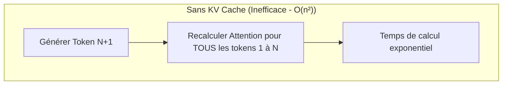
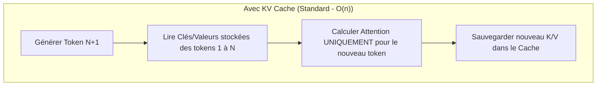

Si le poids d'un modèle (les paramètres) détermine la quantité de VRAM minimale pour démarrer une IA, la **longueur du contexte** (le prompt + l'historique) dicte la quantité de mémoire dynamique consommée pendant l'utilisation. 

À l'usage, un contexte très long (32K, 128K ou plus) peut consommer **plus de VRAM que le modèle lui-même** [^1]. Ce goulot d'étranglement est géré par un mécanisme physique appelé le **KV Cache** (Key-Value Cache) [^1].

---

## 🧠 Le mécanisme physique : Pourquoi le KV Cache existe-t-il ?

Dans l'architecture Transformer, pour générer le token $N+1$, le modèle doit calculer l'attention (les relations) entre ce nouveau token et **tous les tokens précédents ($1$ à $N$)** [^2].

*   **Sans KV Cache :** Pour chaque mot généré, le modèle devrait ré-exécuter l'intégralité des calculs pour tout l'historique depuis le début. La complexité de calcul serait quadratique ($O(n^2)$), rendant l'IA inutilisable sur des prompts longs [^2].
*   **Avec KV Cache :** Le moteur d'inférence calcule les vecteurs **Key (K)** et **Value (V)** de chaque token une seule fois (lors de la phase de [[00-lexique/prefill|Prefill]]) et les stocke en VRAM [^2]. Pendant la phase de [[00-lexique/decoding|Decoding]], le modèle n'a plus qu'à lire ce cache [^2][^3].

---

## 📐 L'Équation Mathématique du KV Cache

Pour calculer l'empreinte mémoire exacte (en octets) du KV Cache, on utilise la formule suivante, adaptée à l'architecture moderne **GQA (Grouped-Query Attention)** [^4][^5] :

$$\text{Taille du KV Cache (octets)} = 2 \times L \times H_{kv} \times D \times S \times B \times B_{pe}$$

Où :
*   **$2$** : Représente les deux tenseurs stockés (Key et Value) [^4].
*   **$L$** : Nombre de couches du Transformer (*Layers*) [^4].
*   **$H_{kv}$** : Nombre de têtes d'attention Key-Value (après application du GQA) [^4].
*   **$D$** : Dimension de chaque tête (*Head Dimension*) [^4].
*   **$S$** : Longueur de la séquence (*Sequence Length*, en tokens) [^4].
*   **$B$** : Taille du lot (*Batch Size*, nombre de requêtes simultanées) [^4].
*   **$B_{pe}$** : Taille d'un élément en mémoire (*Bytes Per Element*, ex: $2$ pour FP16, $1$ pour FP8/INT8, $0.5$ pour INT4) [^4].

### 💡 Focus : L'impact de l'architecture GQA
Dans l'ancienne architecture MHA (Multi-Head Attention), chaque tête de Query avait sa propre tête Key-Value ($H_{kv} = H_{query}$). 
Avec **Grouped-Query Attention (GQA)**, plusieurs têtes de Query partagent la même tête Key/Value (généralement un ratio de 8 pour 1) [^5]. Cela permet de **diviser par 8 la taille du KV Cache** en mémoire sans perte notable d'intelligence [^5].

---

## 📊 Cas Pratiques : Sizing de la VRAM (Llama 3.1 70B)

Prenons le modèle de référence **Llama 3.1 70B** [^4]. Ses caractéristiques physiques sont :
*   Nombre de couches ($L$) = $80$ [^4]
*   Nombre de têtes KV ($H_{kv}$) = $8$ (GQA) [^4]
*   Dimension des têtes ($D$) = $128$ [^4]
*   Précision native ($B_{pe}$) = $2$ octets (BF16) [^4]

Calculons la VRAM nécessaire pour **une seule requête ($B=1$)** à différentes fenêtres de contexte :

| Longueur du Contexte ($S$) | Taille du KV Cache (BF16) | Taille avec Quantification (FP8) [^4] | Taille avec NVFP4 (Blackwell) [^4] |
| :--- | :--- | :--- | :--- |
| **8 192 tokens** | $\sim 2,68 \text{ Go}$ | $\sim 1,34 \text{ Go}$ | $\sim 0,67 \text{ Go}$ |
| **32 768 tokens** (32K) | $\sim 10,73 \text{ Go}$ | $\sim 5,36 \text{ Go}$ | $\sim 2,68 \text{ Go}$ |
| **128 000 tokens** (128K) | $\sim 41,94 \text{ Go}$ | $\sim 20,97 \text{ Go}$ | $\sim 10,48 \text{ Go}$ |
| **300 000 tokens** (300K) | $\sim 98,30 \text{ Go}$ | $\sim 49,15 \text{ Go}$ | $\sim 24,57 \text{ Go}$ |

### ⚠️ Le Piège de l'OOM (Out Of Memory) en contexte long
Si vous faites tourner Llama 3.1 70B quantifié en 4-bit (qui pèse $\sim 40 \text{ Go}$ de poids fixes) sur un Mac Studio 64 Go :
*   À **8K de contexte**, le total (Modèle + Cache) fait $\sim 42,7 \text{ Go}$. Tout fonctionne parfaitement.
*   À **128K de contexte** en BF16, le KV Cache demande $41,9 \text{ Go}$ supplémentaires. Le total requis monte à **$82 \text{ Go}$**. Votre machine de 64 Go s'effondre en erreur *Out Of Memory* ou bascule sur la RAM système lente, détruisant vos performances [^1].

---

## 🛠️ Les Technologies d'Optimisation du Contexte

Pour éviter l'explosion de la VRAM sur site, les ingénieurs système déploient plusieurs optimisations logicielles :

### 1. PagedAttention (vLLM / SGLang)
Dans les moteurs d'inférence classiques, le KV Cache doit être alloué de manière contiguë en VRAM [^6]. Cela crée une énorme fragmentation mémoire et oblige à réserver de l'espace "au cas où" l'utilisateur atteindrait la limite de contexte [^6].
**PagedAttention** résout ce problème en s'inspirant de la mémoire paginée des systèmes d'exploitation [^6]. Le KV Cache est découpé en petites pages non contiguës physiques, éliminant **96 % du gaspillage de VRAM** et permettant de doubler le nombre de requêtes simultanées sur une même machine [^6].

### 2. La Quantification du KV Cache (FP8 / INT8 / Q4)
De la même manière que l'on compresse les poids d'un modèle, on peut compresser son KV Cache [^7].
*   **FP8 / INT8 :** Désormais supportés nativement par des moteurs comme `vLLM` (`kv_cache_dtype="fp8"`) [^8]. Cela divise la taille du cache par 2 avec un impact quasi nul sur la précision [^4].
*   **Q4 / INT4 :** Supporté par `llama.cpp` (formats GGUF). Il divise la taille par 4, mais peut introduire de légères pertes de précision ("perplexity") sur des raisonnements complexes à très long contexte [^9].

### 3. Flash-Decoding (FlashAttention-3)
Sur de très longs contextes, la phase de décodage devient limitée par la vitesse à laquelle on lit le KV Cache en mémoire [^10]. 
**Flash-Decoding** (intégré dans les dernières versions de FlashAttention-3) résout ce goulot d'écriture en parallélisant le calcul de l'attention sur la longueur de la séquence Key-Value, permettant de saturer la bande passante mémoire des cartes graphiques même sur des contextes de plus de 100K tokens [^10].

---

## 📋 Le Conseil de l'Architecte pour OpenHuman

Pour un projet de type assistant personnel comme *OpenHuman*, la gestion du KV cache dicte votre stratégie matérielle :

1.  **Privilégiez le RAG local :** Plutôt que de charger des fichiers entiers de 150 000 mots dans la fenêtre de contexte du LLM (ce qui saturerait votre VRAM dynamique), utilisez un moteur de recherche vectoriel pour n'injecter que les 2 000 mots utiles [^11].
2.  **Activez le FP8 KV Cache :** Si vous utilisez un moteur basé sur vLLM ou LM Deploy, configurez toujours le KV cache en FP8 pour diviser par deux votre consommation dynamique de VRAM [^8].
3.  **Surveillez le ratio Batch/Contexte :** Si votre serveur OpenHuman est partagé par plusieurs collaborateurs en simultané, n'oubliez pas que le KV Cache se multiplie par le nombre d'utilisateurs actifs ($B$).

---

## 📚 Sources et Références

[^1]: Spheron Blog, *KV Cache Optimization: Serve 10x More Users on the Same GPU (2026)*, mars 2026. [https://spheron.network/blog/kv-cache-optimization](https://spheron.network/blog/kv-cache-optimization)
[^2]: Apple Silicon Inference Guide, *LLM Inference Internals: KV Cache, Flash Attention, and Optimizing*, février 2026. [https://github.com/apple-silicon-inference/guide](https://github.com/apple-silicon-inference/guide)
[^3]: NVIDIA Technical Blog, *Mastering LLM Techniques: Inference Optimization*, 2024. [https://developer.nvidia.com/blog/mastering-llm-techniques-inference-optimization/](https://developer.nvidia.com/blog/mastering-llm-techniques-inference-optimization/)
[^4]: Spheron Blog, *GPU Memory Requirements for LLMs: VRAM Calculator*, mai 2026. [https://spheron.network/blog/gpu-memory-vram-calculator](https://spheron.network/blog/gpu-memory-vram-calculator)
[^5]: Medium, *Key-Value (KV) Cache Size Calculations in Grouped Query Attention (GQA)*, juillet 2025. [https://medium.com/@vertexai/kv-cache-calculations-gqa](https://medium.com/@vertexai/kv-cache-calculations-gqa)
[^6]: vLLM Project, *PagedAttention: GPU Memory Management for Large Language Models*, 2024. [https://vllm.ai/paged-attention](https://vllm.ai/paged-attention)
[^7]: DigitalOcean, *How to Choose the Right GPU for vLLM Inference*, janvier 2026. [https://digitalocean.com/resources/vllm-gpu-choice](https://digitalocean.com/resources/vllm-gpu-choice)
[^8]: vLLM Documentation, *Quantized KV Cache (FP8 and INT8 Overview)*, janvier 2026. [https://docs.vllm.ai/quantized-kv-cache](https://docs.vllm.ai/quantized-kv-cache)
[^9]: Kaggle Notebooks, *7th place solution - SGLang, LMDeploy and KV Cache Quantization Trade-offs*, mars 2026. [https://www.kaggle.com/competitions/llm-inference/discussion](https://www.kaggle.com/competitions/llm-inference/discussion)
[^10]: Dao-AILab, *FlashAttention-3: Fast and Accurate Attention with Asynchrony*, juillet 2024. [https://github.com/Dao-AILab/flash-attention](https://github.com/Dao-AILab/flash-attention)
[^11]: OpenHuman Project, *Local-first Memory Tree with SQLite and Vector RAG*, 2025. [https://github.com/tinyhumansai/openhuman](https://github.com/tinyhumansai/openhuman)
