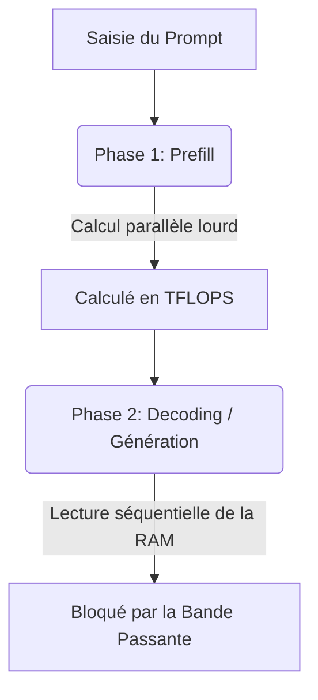

En architecture système appliquée à l'IA, une réalité revient en permanence : en [[00-lexique/inference|inférence LLM]], la limite est souvent la **mémoire** avant le calcul brut[^1].

Ce phénomène est classiquement appelé **"Memory Wall"**. Pendant la génération auto-régressive, le GPU/CPU alterne des phases de calcul très rapides et des phases d'attente de données depuis la mémoire. Le débit final est donc fortement corrélé à la **bande passante mémoire** (Go/s), pas seulement aux TFLOPS[^1].

---

## 🧠 La Physique de l'Inférence : Prefill vs Decoding

Pour comprendre le goulot d'étranglement, il faut séparer deux phases :

### 1. La Phase de "Prefill" (Ingestion du Prompt)
Le modèle traite le prompt d'entrée en parallèle (matrices de grande taille).
*   **Comportement matériel :** meilleure utilisation des unités de calcul.
*   **Facteur dominant :** mix calcul + mémoire, souvent plus favorable au calcul qu'en decoding.

### 2. La Phase de "Decoding" (Génération Mot à Mot)
Le modèle génère un token puis recommence le cycle pour le token suivant. Ce processus est séquentiel.
*   **Comportement matériel :** lecture répétée des poids + gestion du KV cache ; l'intensité arithmétique est plus faible qu'en prefill.
*   **Facteur dominant :** la **bande passante mémoire**, surtout à batch faible[^1].

---

## 📐 L'Équation Mathématique du Débit

Pour dimensionner rapidement une machine, on utilise une borne supérieure :

$$\text{Vitesse Max (tokens/s)} = \frac{\text{Bande Passante Mémoire (Go/s)}}{\text{Taille du Modèle en Mémoire (Go)}}$$

> Cette formule est une **approximation de premier ordre** : elle n'intègre pas tous les effets runtime (kernel, KV cache, scheduler, batch, fragmentation, etc.).

### Cas Pratique : Modèle dense 70B en quantification 4-bit (Q4)
Un modèle dense de 70B quantifié en 4-bit occupe environ **40 Go** en mémoire de poids (ordre de grandeur).

> Note importante : il n'existe pas de "Llama 4 70B" officiel. Llama 4 est publié en variantes MoE (Scout/Maverick). Pour un exemple dense 70B, la famille Llama 3.x est plus adaptée[^2].

1.  **Sur un PC classique (RAM DDR5 Dual Channel) :**
    *   Bande passante réelle : $\sim 100 \text{ Go/s}$
    *   Calcul : $\frac{100 \text{ Go/s}}{40 \text{ Go}} = \mathbf{2,5 \text{ tokens/s}}$ (borne théorique).
2.  **Sur un système AMD Ryzen AI Max PRO 495 (Gorgon Halo) :**
    *   Bande passante réelle : $\sim 273 \text{ Go/s}$
    *   Calcul : $\frac{273 \text{ Go/s}}{40 \text{ Go}} = \mathbf{6,8 \text{ tokens/s}}$ (borne théorique).
3.  **Sur un Mac Studio M4 Max (Mémoire Unifiée haut de gamme) :**
    *   Bande passante réelle : $546 \text{ Go/s}$
    *   Calcul : $\frac{546 \text{ Go/s}}{40 \text{ Go}} = \mathbf{13,6 \text{ tokens/s}}$ (borne théorique).
4.  **Sur une carte Nvidia RTX 5090 (VRAM GDDR7 dédiée - Blackwell) :**
    *   Bande passante réelle : $1\ 792 \text{ Go/s}$
    *   Calcul : $\frac{1792 \text{ Go/s}}{40 \text{ Go}} = \mathbf{44,8 \text{ tokens/s}}$ (borne théorique).

---

## 📊 Le Grand Comparatif des Technologies de Stockage (2026)

Valeurs ci-dessous : ordres de grandeur utiles pour l'architecture (les performances réelles varient selon le stack logiciel et la charge).

| Technologie | Bande passante (ordre de grandeur) | Source | Impact pour l'inférence |
| :-- | :-- | :-- | :-- |
| **Ethernet 10 GbE** | $\sim 1,25 \text{ Go/s}$ | conversion 10 Gbit/s | trop faible pour "étendre" un modèle en ligne sans forte pénalité |
| **PCIe 5.0 x16** | $\sim 64 \text{ Go/s}$ (agrégé) | spécification bus | devient un goulot lors des transferts fréquents CPU↔GPU |
| **RAM DDR5 desktop** | $\sim 80$ à $100 \text{ Go/s}$ | plateformes dual-channel typiques | capacité élevée, débit limité pour grands LLM |
| **Mémoire unifiée AMD Ryzen AI Max PRO 400** | jusqu'à $\sim 273 \text{ Go/s}$ | [^3] | compromis capacité/débit intéressant en x86 |
| **Mémoire unifiée Apple M4 Max / M3 Ultra** | $546$ à $819 \text{ Go/s}$ | [^4] | excellent débit local sans offload PCIe |
| **VRAM RTX 5090 (GDDR7)** | $\sim 1{,}79 \text{ To/s}$ | [^5][^6] | très haut débit pour decoding rapide |

---

## ⚠️ Les Limites du Clustering Réseau

Dès qu'on cumule la mémoire de plusieurs machines, l'interconnexion devient le point de rupture :

1.  **Le câble peut dominer toute la chaîne :** une liaison 10 GbE plafonne autour de 1,25 Go/s, très loin des centaines de Go/s des mémoires locales.
2.  **RDMA est clé en environnement pro :** RoCE/InfiniBand réduit le coût CPU des transferts et améliore la latence inter-nœuds.

> 💡 **Le Conseil de l'Architecte :** 
> Pour le projet *OpenHuman*, l'implémentation de la méthode [[03-stack-logicielle/rag-et-agents-openhuman\|RAG]] est essentielle. En ne transmettant au modèle que les informations nécessaires du contexte, on évite de saturer la bande passante avec des millions de données inutiles.

---

## 📚 Sources et Références

[^1]: Amir Gholami et al., *AI and Memory Wall* (arXiv:2403.14123), 2024. [https://arxiv.org/abs/2403.14123](https://arxiv.org/abs/2403.14123)
[^2]: Meta, *Llama 4 Model Card* (Scout/Maverick, MoE, pas de variante "70B" dense), 2025. [https://raw.githubusercontent.com/meta-llama/llama-models/main/models/llama4/MODEL_CARD.md](https://raw.githubusercontent.com/meta-llama/llama-models/main/models/llama4/MODEL_CARD.md)
[^3]: ServeTheHome, *AMD Ups Ante With 192GB Ryzen AI Max PRO 400 Chips for AI Systems*, 2026. [https://www.servethehome.com/amd-reveals-ryzen-ai-max-pro-400-series-192gb-ram-for-ai-systems/](https://www.servethehome.com/amd-reveals-ryzen-ai-max-pro-400-series-192gb-ram-for-ai-systems/)
[^4]: Apple, *Mac Studio - Technical Specifications*, 2026. [https://www.apple.com/mac-studio/specs/](https://www.apple.com/mac-studio/specs/)
[^5]: NVIDIA, *GeForce RTX 5090 product page* (32 GB GDDR7, bus 512-bit, TGP 575 W). [https://www.nvidia.com/fr-fr/geforce/graphics-cards/50-series/rtx-5090/](https://www.nvidia.com/fr-fr/geforce/graphics-cards/50-series/rtx-5090/)
[^6]: TechPowerUp, *NVIDIA GeForce RTX 5090 Specs* (bandwidth mémoire 1.79 TB/s), 2026. [https://www.techpowerup.com/gpu-specs/geforce-rtx-5090.c4216](https://www.techpowerup.com/gpu-specs/geforce-rtx-5090.c4216)