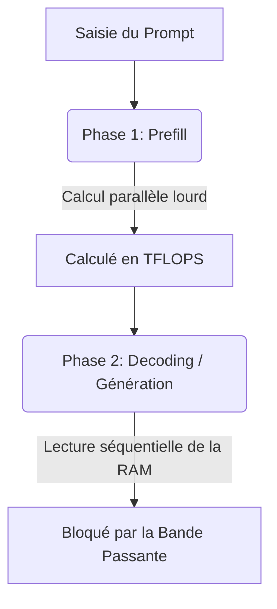

En architecture système appliquée à l'Intelligence Artificielle, il existe une vérité technique souvent ignorée : **le processeur (CPU/GPU) passe l'essentiel de son temps à ne rien faire lors de la génération de texte.** 

Ce phénomène s'appelle le **"Memory Wall"** (le mur de la mémoire). Lors de l'inférence locale de grands modèles de langage (LLM), le facteur limitant n'est pas la puissance de calcul brute (mesurée en TFLOPS), mais la **Bande Passante Mémoire** (Memory Bandwidth), c'est-à-dire la vitesse à laquelle les données sont transférées des puces de stockage vers les unités de calcul.

---

## 🧠 La Physique de l'Inférence : Prefill vs Decoding

Pour comprendre pourquoi la mémoire est le goulot d'étranglement, il faut diviser l'inférence d'un LLM en deux phases physiques distinctes :

### 1. La Phase de "Prefill" (Ingestion du Prompt)
L'IA lit et comprend votre prompt d'entrée. Tous les mots du prompt sont traités **en parallèle, en une seule fois**. 
*   **Comportement matériel :** Les unités de calcul du GPU (Cuda Cores, Tensor Cores) sont saturées. Le GPU calcule à sa puissance maximale. 
*   **Facteur limitant :** Les **TFLOPS** (la puissance de calcul brute).

### 2. La Phase de "Decoding" (Génération Mot à Mot)
C'est la phase d'écriture. L'IA génère le mot $N$, puis réinjecte ce mot pour générer le mot $N+1$. Ce processus est strictement **séquentiel**.
*   **Comportement matériel :** Pour générer un seul token, le GPU doit charger l'intégralité des poids du modèle depuis sa mémoire (VRAM ou RAM) vers ses registres de calcul. Une fois le calcul fait (ce qui prend une fraction de microseconde), le GPU jette tout, attend le token suivant, et recharge à nouveau l'intégralité du modèle.
*   **Facteur limitant :** La **Bande Passante Mémoire**. Le processeur passe 99 % de son temps à attendre que les données arrivent de la mémoire.

---

## 📐 L'Équation Mathématique du Débit

En tant qu'architecte, vous devez être capable de calculer précisément le débit théorique maximum d'une infrastructure pour vos clients. La formule physique est la suivante :

$$\text{Vitesse Max (tokens/s)} = \frac{\text{Bande Passante Mémoire (Go/s)}}{\text{Taille du Modèle en Mémoire (Go)}}$$

### Cas Pratique : Llama 4 - 70B (Quantifié en Q4)
Un modèle de 70 milliards de paramètres quantifié en 4-bit occupe environ **40 Go** d'espace mémoire.

1.  **Sur un PC classique (RAM DDR5 Dual Channel) :**
    *   Bande passante théorique : $100 \text{ Go/s}$
    *   Calcul : $\frac{100 \text{ Go/s}}{40 \text{ Go}} = \mathbf{2,5 \text{ tokens/s}}$ (Vitesse de lecture très lente, pénible à l'usage).
2.  **Sur un Mac Studio M4 Max (Mémoire Unifiée) :**
    *   Bande passante théorique : $400 \text{ Go/s}$
    *   Calcul : $\frac{400 \text{ Go/s}}{40 \text{ Go}} = \mathbf{10 \text{ tokens/s}}$ (Vitesse équivalente à la lecture humaine fluide).
3.  **Sur une carte Nvidia RTX 5090 (VRAM GDDR7 dédiée) :**
    *   Bande passante théorique : $1\ 790 \text{ Go/s}$
    *   Calcul : $\frac{1790 \text{ Go/s}}{40 \text{ Go}} = \mathbf{44,7 \text{ tokens/s}}$ (Génération instantanée et ultra-rapide).

---

## 📊 Le Grand Comparatif des Technologies de Stockage (2026)

Voici la cartographie complète des bandes passantes mémoires, de la RAM de bureau jusqu'aux architectures de supercalculateurs de datacenters :

| Technologie | Vitesse Réelle | Latence Typique | Usage Type | Impact sur l'Inférence |
| :--- | :--- | :--- | :--- | :--- |
| **Câble Ethernet (10 GbE)** | $1,25 \text{ Go/s}$ | $\sim 50 \ \mu\text{s}$ (Élevée) | Cluster réseau amateur / local. | **Inexploitable en direct.** Utilisé uniquement pour du traitement asynchrone (offline). |
| **Câble Thunderbolt 5** | $10 \text{ à } 15 \text{ Go/s}$ | $< 1 \ \mu\text{s}$ (Très faible) | Cluster de Mac/PC via [[03-stack-logicielle/clustering-exo-et-ray\|Exo]]. | **Excellent pour PME.** Permet de lier 4 machines sans effondrer la latence. |
| **Bus PCIe 5.0 (x16)** | $64 \text{ Go/s}$ | $< 1 \ \mu\text{s}$ | Connexion GPU ➔ CPU. | Goulot d'étranglement lors du déchargement (offload) de la RAM vers le GPU. |
| **RAM standard (DDR5)** | $80 \text{ à } 100 \text{ Go/s}$ | $\sim 60 \text{ ns}$ | PC de bureau haut de gamme (i9/Ryzen 9). | Capacité énorme et pas chère, mais vitesse limitée à l'écriture humaine lente. |
| **Mémoire Unifiée (APU)** | $400 \text{ à } 800 \text{ Go/s}$ | $\sim 40 \text{ ns}$ | [[02-materiel/apu-et-memoire-unifiee\|Mac Studio M4 / AMD Strix Halo]]. | **Le compromis parfait.** Vitesse fluide pour un coût matériel divisé par 4. |
| **Fibre Optique (100 GbE RoCE v2)** | $12,5 \text{ Go/s}$ | $\sim 2 \ \mu\text{s}$ | Cluster de serveurs d'entreprise. | Permet d'étendre la VRAM sur des dizaines de serveurs avec synchronisation directe (RDMA). |
| **VRAM Interne (GDDR7 / HBM3)** | $1\ 500 \text{ Go/s}+$ | $\sim 10 \text{ ns}$ (Ultra-faible) | GPU Nvidia RTX 5090 / Nvidia H100. | **Performances maximales.** Vitesse industrielle, indispensable pour le multi-utilisateur. |
| **Interconnexion NVLink 5** | $1\ 800 \text{ Go/s}$ | $< 0,1 \ \mu\text{s}$ (Nulle) | Liaison physique directe entre GPU Nvidia pro. | Fusionne plusieurs GPU en une seule carte virtuelle sans aucune perte de débit. |

---

## ⚠️ Les Limites du Clustering Réseau

Dès que vous interconnectez plusieurs machines pour cumuler de la mémoire (via du clustering), le maillon faible devient la connectique réseau :

1.  **Le goulot d'étranglement du câble :** Si votre modèle est stocké sur deux PC reliés en Ethernet 10 GbE ($1,25 \text{ Go/s}$), la vitesse globale de calcul va être bridée non pas par la vitesse de la RAM ($100 \text{ Go/s}$), mais par le débit du câble Ethernet.
2.  **L'importance du RDMA :** Dans les architectures professionnelles, on utilise le protocole **RoCE** ou **InfiniBand** pour que les cartes graphiques s'échangent les données directement de mémoire à mémoire (RDMA) sans que le processeur (CPU) n'ait à traiter les paquets TCP/IP, ce qui diviserait les performances par 10.

> 💡 **Le Conseil de l'Architecte :** 
> Pour le projet *OpenHuman*, l'implémentation de la méthode [[03-stack-logicielle/rag-et-agents-openhuman\|RAG]] est essentielle. En ne transmettant au modèle que les informations nécessaires du contexte, on évite de saturer la bande passante avec des millions de données inutiles.