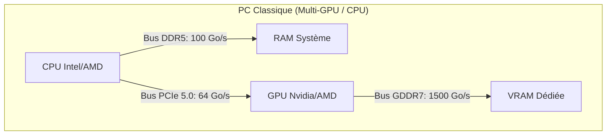
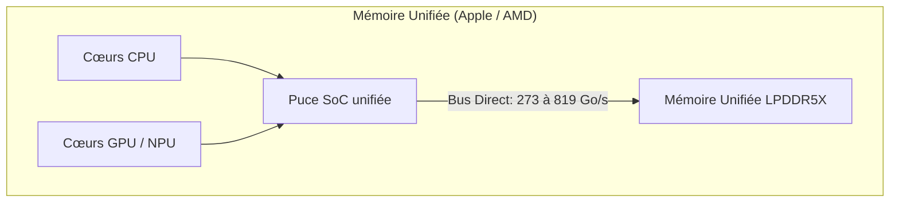

Pour un architecte système IA, comprendre la différence physique entre **RAM classique**, **VRAM dédiée** et **mémoire unifiée** est fondamental. Ce choix influence directement le débit en inférence (tokens/s), les coûts matériels et les limites d'évolutivité[^5].

Voici l'analyse physique, les schémas de routage des données et le guide décisionnel pour vos audits d'entreprise.

---

## 🗺️ Schéma des flux : PC Classique vs Architecture Unifiée

Le goulot d'étranglement physique de l'IA ne réside pas dans la capacité de stockage, mais dans le chemin que doivent parcourir les données pour atteindre les cœurs de calcul (CPU/GPU).

---

## 1. La VRAM Dédiée (Le Standard Nvidia)
La **VRAM (Video RAM)** est placée au plus près du GPU. En 2026, on retrouve surtout de la **GDDR7** sur les cartes grand public (ex: RTX 5090) et de la **HBM** sur des accélérateurs datacenter.

*   **Le routage physique :** Le GPU accède à la VRAM par un bus mémoire très large (jusqu'à 512-bit). La distance physique entre la puce de calcul et la puce mémoire se compte en millimètres.
*   **Pourquoi c'est rapide :** la RTX 5090 atteint ~**1,79 To/s** (1 792 Go/s), ce qui change radicalement le débit en decoding[^1][^2].
*   **La limite physique (Le coût de la capacité) :** Les puces de VRAM coûtent extrêmement cher à produire. Les cartes grand public plafonnent à 24 Go ou 32 Go. Pour obtenir 128 Go de VRAM, vous devez acheter 4 cartes graphiques physiques, ce qui pose des problèmes thermiques et électriques massifs.

---

## 2. La Mémoire Unifiée (L'approche Apple Silicon & AMD APU)
Popularisée par Apple et renforcée côté x86 par AMD Ryzen AI Max PRO 400, la **mémoire unifiée** supprime la séparation classique RAM/VRAM.

*   **Le routage physique :** Le processeur central (CPU), la puce graphique (GPU) et l'accélérateur d'IA (NPU) sont réunis sur la même puce de silicium (SoC). Les barrettes de mémoire (LPDDR5X-8000/8533) sont soudées juste à côté, sur le même composant.
*   **L'élimination de la copie :** Dans un PC classique, pour que la carte graphique traite une donnée stockée dans la RAM, le CPU doit copier la donnée, la faire passer par le bus PCIe (limité à 64 Go/s), puis la ré-écrire dans la VRAM. **En mémoire unifiée, cette étape de copie est éliminée.** Le GPU lit directement dans la mémoire partagée.
*   **La nuance de bande passante (AMD vs Apple) :** 
    *   **Apple Silicon :** M4 Max monte à **546 Go/s** (version 16c CPU / 40c GPU) ; M3 Ultra à **819 Go/s**[^3].
    *   **AMD Ryzen AI Max PRO 400 :** environ **273 Go/s** avec LPDDR5X-8533 et bus 256-bit, avec compatibilité x86 (Windows/Linux)[^4].
*   **La rupture AMD (2026) :** la plateforme PRO 400 monte à **192 Go** de mémoire partagée, avec jusqu'à **160 Go** allouables au GPU selon la configuration OEM[^4].
*   **La limite physique :** La mémoire étant soudée sur le SoC pour garantir ce débit, il est strictement **impossible d'ajouter de la RAM** après l'achat. Vous devez dimensionner la machine pour les 5 prochaines années dès le premier jour.

---

## 3. La RAM Système classique (DDR5)
La mémoire de travail standard d'un PC classique, branchée sur des slots de carte mère (DIMM).

*   **Le routage physique :** Les données doivent traverser la carte mère pour aller de la RAM au processeur via un bus mémoire étroit (généralement Dual-Channel sur les PC de bureau).
*   **Pourquoi c'est plus lent en decoding LLM :** la bande passante est souvent de l'ordre de **80 à 100 Go/s** sur des postes dual-channel ; pour de gros modèles, cela limite le débit token/s.
*   **Le principal avantage :** coût/Go très bas et évolutivité matérielle élevée.

---

## ⚖️ Tableau de Synthèse Comparative pour vos Audits

| Critère d'évaluation | VRAM dédiée (RTX 5090) | Mémoire unifiée Apple | Mémoire unifiée AMD PRO 400 | RAM classique (DDR5) |
| :-- | :-- | :-- | :-- | :-- |
| **Bande passante mémoire** | ~1 792 Go/s[^2] | 546 à 819 Go/s[^3] | ~273 Go/s[^4] | ~80 à 100 Go/s (desktop dual-channel) |
| **Borne théorique 70B Q4 (\~40 Go)** | ~44,8 tok/s | ~13,6 à 20,5 tok/s | ~6,8 tok/s | ~2 à 2,5 tok/s |
| **Capacité machine typique (2026)** | 32 Go par carte grand public[^1] | 64 Go (M4 Max haut de gamme) / 96 Go (M3 Ultra actuel)[^3] | jusqu'à 192 Go[^4] | 64 à 256 Go fréquents, plus possible selon carte mère |
| **Évolutivité matérielle** | élevée (ajout de GPU) | nulle (mémoire soudée) | nulle (mémoire soudée) | élevée (ajout DIMM) |
| **Positionnement** | performance brute / multi-utilisateur | station locale très performante | compromis capacité locale + x86 | entrée de gamme / batch offline |

---

## 📋 Le Guide Décisionnel de l'Architecte

Pour conseiller votre client PME dans le cadre d'un déploiement local (comme votre projet d'agent *OpenHuman*) :

1.  **VRAM dédiée (GPU discret)** : choix prioritaire pour la vitesse brute et les charges concurrentes.
2.  **Mémoire unifiée Apple** : excellent débit local, stack simple à opérer, mais faible évolutivité matérielle.
3.  **Mémoire unifiée AMD PRO 400** : forte capacité mémoire locale en x86, adaptée aux besoins de souveraineté Linux/Windows.
4.  **RAM DDR5 seule** : pertinent surtout pour des traitements différés ou des modèles plus petits.

> 🔗 **Lien connexe :**
> Pour comprendre comment dimensionner la capacité de mémoire nécessaire pour votre modèle sans faire d'erreur "Out Of Memory" (OOM), consultez le chapitre sur la [[01-fondations/quantification-4-bit-8-bit\|Quantification des modèles]].

---

## 📚 Sources et Références

[^1]: NVIDIA, *GeForce RTX 5090 product page* (32 GB GDDR7, bus 512-bit, TGP 575 W). [https://www.nvidia.com/fr-fr/geforce/graphics-cards/50-series/rtx-5090/](https://www.nvidia.com/fr-fr/geforce/graphics-cards/50-series/rtx-5090/)
[^2]: TechPowerUp, *NVIDIA GeForce RTX 5090 Specs* (bandwidth mémoire 1.79 TB/s). [https://www.techpowerup.com/gpu-specs/geforce-rtx-5090.c4216](https://www.techpowerup.com/gpu-specs/geforce-rtx-5090.c4216)
[^3]: Apple, *Mac Studio - Technical Specifications* (M4 Max 546 GB/s, M3 Ultra 819 GB/s, configurations mémoire actuelles). [https://www.apple.com/mac-studio/specs/](https://www.apple.com/mac-studio/specs/)
[^4]: ServeTheHome, *AMD Ups Ante With 192GB Ryzen AI Max PRO 400 Chips for AI Systems* (192 GB, 160 GB allouables GPU, ~273 GB/s), 2026. [https://www.servethehome.com/amd-reveals-ryzen-ai-max-pro-400-series-192gb-ram-for-ai-systems/](https://www.servethehome.com/amd-reveals-ryzen-ai-max-pro-400-series-192gb-ram-for-ai-systems/)
[^5]: Amir Gholami et al., *AI and Memory Wall* (arXiv:2403.14123), 2024. [https://arxiv.org/abs/2403.14123](https://arxiv.org/abs/2403.14123)