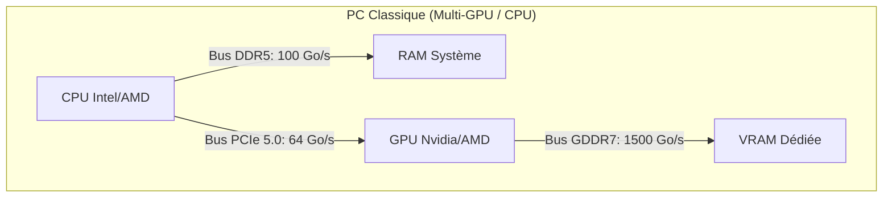
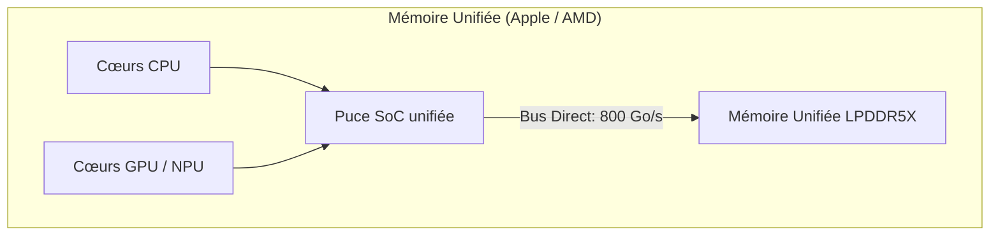

Pour un architecte système IA, comprendre la différence physique entre la RAM classique, la VRAM dédiée et la mémoire unifiée est crucial. Ce choix technique va déterminer non seulement la vitesse de génération du modèle (tokens/s), mais également le coût global de l'infrastructure d'un client.

Voici l'analyse physique, les schémas de routage des données et le guide décisionnel pour vos audits d'entreprise.

---

## 🗺️ Schéma des flux : PC Classique vs Architecture Unifiée

Le goulot d'étranglement physique de l'IA ne réside pas dans la capacité de stockage, mais dans le chemin que doivent parcourir les données pour atteindre les cœurs de calcul (CPU/GPU).

---

## 1. La VRAM Dédiée (Le Standard Nvidia)
La **VRAM (Video RAM)** est soudée directement sur le circuit imprimé de la carte graphique, au plus près du processeur graphique (GPU). En 2026, l'industrie utilise principalement de la mémoire **GDDR7** ou de la mémoire **HBM3** (High Bandwidth Memory) sur les puces professionnelles.

*   **Le routage physique :** Le GPU accède à la VRAM par un bus mémoire très large (jusqu'à 512-bit). La distance physique entre la puce de calcul et la puce mémoire se compte en millimètres.
*   **Pourquoi c'est rapide :** Les bandes passantes dépassent les **1 500 Go/s** (sur une RTX 5090). C'est la seule architecture capable de saturer les cœurs Tensor lors de la phase de *Decoding*.
*   **La limite physique (Le coût de la capacité) :** Les puces de VRAM coûtent extrêmement cher à produire. Les cartes grand public plafonnent à 24 Go ou 32 Go. Pour obtenir 128 Go de VRAM, vous devez acheter 4 cartes graphiques physiques, ce qui pose des problèmes thermiques et électriques massifs.

---

## 2. La Mémoire Unifiée (L'approche Apple Silicon & AMD APU)
Popularisée par Apple avec ses puces "M" (Max/Ultra) et rejointe par AMD avec l'architecture "Ryzen AI Max" (Strix Halo), la **Mémoire Unifiée** supprime la frontière physique entre la RAM de l'ordinateur et la VRAM de la carte graphique.

*   **Le routage physique :** Le processeur central (CPU), la puce graphique (GPU) et l'accélérateur d'IA (NPU) sont réunis sur la même puce de silicium (SoC). Les barrettes de mémoire (LPDDR5X) sont soudées juste à côté, sur le même composant.
*   **L'élimination de la copie :** Dans un PC classique, pour que la carte graphique traite une donnée stockée dans la RAM, le CPU doit copier la donnée, la faire passer par le câble/bus PCIe (limité à 64 Go/s), puis la ré-écrire dans la VRAM. **En mémoire unifiée, cette étape de copie est éliminée.** Le GPU lit directement dans la mémoire de l'ordinateur à une vitesse de **400 à 800 Go/s**.
*   **La limite physique :** La mémoire étant soudée sur le SoC pour garantir ce débit, il est strictement **impossible d'ajouter de la RAM** après l'achat. Vous devez dimensionner la machine pour les 5 prochaines années dès le premier jour.

---

## 3. La RAM Système classique (DDR5)
La mémoire de travail standard d'un PC classique, branchée sur des slots de carte mère (DIMM).

*   **Le routage physique :** Les données doivent traverser la carte mère pour aller de la RAM au processeur via un bus mémoire étroit (généralement Dual-Channel sur les PC de bureau).
*   **Pourquoi c'est lent :** La bande passante est limitée à environ **80 - 100 Go/s**. Même si vous disposez d'un processeur ultra-rapide, il passera 90% de son temps à attendre que les données arrivent de la RAM pour générer le token suivant.
*   **Le seul avantage (Le coût du Giga-Octet) :** C'est une technologie très bon marché. Acheter 192 Go de RAM DDR5 pour un PC de bureau coûte environ 500 €, contre plus de 5 000 € pour la même capacité en mémoire unifiée ou en VRAM dédiée.

---

## ⚖️ Tableau de Synthèse Comparative pour vos Audits

| Critère d'évaluation | VRAM Dédiée (Nvidia) | Mémoire Unifiée (Mac/AMD) | RAM Classique (DDR5) |
| :--- | :--- | :--- | :--- |
| **Bande Passante Réelle** | 🚀 **Fulgurante** (1 500 Go/s+) | ⚡ **Élevée** (400 à 800 Go/s) | 🐌 **Faible** (80 à 100 Go/s) |
| **Vitesse d'Inférence (Modèle 70B)** | 40+ tokens/sec | 15 à 25 tokens/sec | 2 à 3 tokens/sec |
| **Coût pour 128 Go de capacité** | 💸 **Délirant** (~15 000 € en multi-GPU) | ⚖️ **Moyen** (~4 500 € le Mac complet) | 🛒 **Très bas** (~500 € les barrettes) |
| **Consommation / Chaleur** | 🌋 **Trés élevée** (600W à 1500W+) | 🍃 **Trés faible** (80W à 120W) | 🍃 **Négligeable** |
| **Évolutivité** | **Excellente** (on ajoute des cartes) | **Nulle** (soudé sur la puce) | **Excellente** (slots DIMM libres) |

---

## 📋 Le Guide Décisionnel de l'Architecte

Pour conseiller votre client PME dans le cadre d'un déploiement local (comme votre projet d'agent *OpenHuman*) :

1.  **Le choix de la VRAM pure (RTX Nvidia) :** À réserver si le client a des besoins de vitesse absolue en temps réel, ou si plus de 15 personnes doivent utiliser l'IA en même temps. La facture matérielle et électrique sera lourde.
2.  **Le choix de la Mémoire Unifiée (Mac Studio / AMD) :** C'est le choix de la raison technologique en 2026. Vous obtenez un serveur IA très rapide, complètement silencieux, qui consomme autant qu'une ampoule électrique, pour le prix d'un seul GPU Nvidia professionnel.
3.  **Le choix de la RAM classique (DDR5) :** À proposer uniquement si le budget est la contrainte n°1 et que la lenteur de génération n'est pas un problème (ex : traitement de documents par lots durant la nuit en tâche de fond).

> 🔗 **Lien connexe :**
> Pour comprendre comment dimensionner la capacité de mémoire nécessaire pour votre modèle sans faire d'erreur "Out Of Memory" (OOM), consultez le chapitre sur la [[01-fondations/quantification-4-bit-8-bit\|Quantification des modèles]].