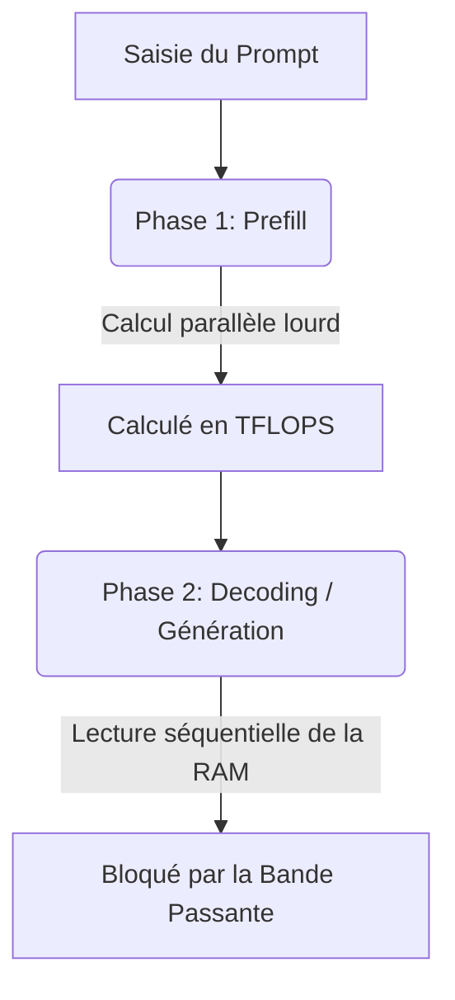

> [!tip] En bref
> La limite de l'inférence locale n'est pas la puissance de calcul, c'est la vitesse de transfert mémoire. Multiplier les TFLOPS ne sert à rien si les données n'arrivent pas assez vite — c'est le "Memory Wall".

> [!info] Prérequis conseillé
> Ce chapitre suppose que vous savez comment un token est généré. Si ce n'est pas le cas, commencez par [[01-fondations/journey-of-a-prompt|🧠 Le Voyage d'un Prompt]].

Vous avez peut-être déjà entendu : *"Pour faire tourner un LLM, il faut un GPU puissant."* C'est vrai, mais incomplet. En pratique, **la carte la plus rapide du marché peut saturer et devenir aussi lente qu'une carte d'entrée de gamme** — si la mémoire ne suit pas.

C'est le paradoxe que ce chapitre va expliquer. Comprendre la bande passante mémoire, c'est comprendre pourquoi votre config génère 4 tokens/s au lieu de 40 — et comment y remédier.

En architecture système appliquée à l'IA, une réalité revient en permanence : en [[00-lexique/inference|inférence LLM]], la limite est souvent la **mémoire** avant le calcul brut[^1].

Ce phénomène est classiquement appelé **"Memory Wall"**. Pendant la génération auto-régressive, le GPU/CPU alterne des phases de calcul très rapides et des phases d'attente de données depuis la mémoire. Le débit final est donc fortement corrélé à la **bande passante mémoire** (Go/s), pas seulement aux TFLOPS[^1].

---

## 🧠 La Physique de l'Inférence : Prefill vs Decoding

Pour comprendre le goulot d'étranglement, il faut séparer deux phases :

### 1. La Phase de "Prefill" (Ingestion du Prompt)
Le modèle traite le prompt d'entrée en parallèle (matrices de grande taille).
*   **Comportement matériel :** meilleure utilisation des unités de calcul.
*   **Facteur dominant :** mix calcul + mémoire, souvent plus favorable au calcul qu'en [[00-lexique/decoding|decoding]].

### 2. La Phase de "Decoding" (Génération Mot à Mot)
Le modèle génère un token puis recommence le cycle pour le token suivant. Ce processus est séquentiel.
*   **Comportement matériel :** lecture répétée des poids + gestion du [[00-lexique/kv-cache|KV Cache]] ; l'intensité arithmétique est plus faible qu'en [[00-lexique/prefill|prefill]].
*   **Facteur dominant :** la **bande passante mémoire**, surtout à batch faible[^1].

---

## 📐 L'Équation Mathématique du Débit

Pour dimensionner rapidement une machine, on utilise une borne supérieure :

$$\text{Vitesse Max (tokens/s)} = \frac{\text{Bande Passante Mémoire (Go/s)}}{\text{Taille du Modèle en Mémoire (Go)}}$$

> [!note] Approximation
> Cette formule est une **approximation de premier ordre** : elle n'intègre pas tous les effets runtime (kernel, KV cache, scheduler, batch, fragmentation, etc.).

### Cas Pratique : Modèle dense 70B en [[00-lexique/quantification-q4|quantification 4-bit (Q4)]]
Un modèle dense de 70B quantifié en 4-bit occupe environ **40 Go** en mémoire de poids (ordre de grandeur).

> [!note] Note importante
> Il n'existe pas de "Llama 4 70B" officiel. Llama 4 est publié en variantes MoE (Scout/Maverick). Pour un exemple dense 70B, la famille Llama 3.x est plus adaptée[^2].

1.  **Sur un PC classique (RAM DDR5 Dual Channel) :**
    *   Bande passante réelle : $\sim 100 \text{ Go/s}$
    *   Calcul : $\frac{100 \text{ Go/s}}{40 \text{ Go}} = \mathbf{2,5 \text{ tokens/s}}$ (borne théorique).
2.  **Sur un système AMD Ryzen AI Max+ PRO 495 (Gorgon Halo, ex. Framework Desktop 192 Go)[^3][^11] :**
    *   Bande passante réelle : $\sim 273 \text{ Go/s}$
    *   Calcul : $\frac{273 \text{ Go/s}}{40 \text{ Go}} = \mathbf{6,8 \text{ tokens/s}}$ (borne théorique).
3.  **Sur un Mac Studio M5 Max (mémoire unifiée haut de gamme) :**
    *   Bande passante : $614 \text{ Go/s}$ (annoncée par Apple en août 2026)[^4]
    *   Calcul : $\frac{614 \text{ Go/s}}{40 \text{ Go}} = \mathbf{15,4 \text{ tokens/s}}$ (borne théorique) ; un M5 Ultra ($1\ 200 \text{ Go/s}$) double cette borne à $\mathbf{30 \text{ tokens/s}}$[^4].
4.  **Sur une carte Nvidia RTX 5090 (VRAM GDDR7 dédiée - Blackwell) :**
    *   Bande passante réelle : $1\ 792 \text{ Go/s}$
    *   Calcul : $\frac{1792 \text{ Go/s}}{40 \text{ Go}} = \mathbf{44,8 \text{ tokens/s}}$ (borne théorique).
    *   *Exemple de bande passante seulement : au T3 2026 la RTX 5090 se négocie ≥ 5 000 $ et est peu disponible — la RTX PRO 6000 Blackwell offre la même bande passante (1 792 Go/s) avec 96 Go [^12].*

---

## 📊 Le Grand Comparatif des Technologies de Stockage

Valeurs ci-dessous : ordres de grandeur utiles pour l'architecture (les performances réelles varient selon le stack logiciel et la charge).

| Technologie | Bande passante (ordre de grandeur) | Source | Impact pour l'inférence |
| :-- | :-- | :-- | :-- |
| **Ethernet 10 GbE** | $\sim 1,25 \text{ Go/s}$ | conversion 10 Gbit/s | trop faible pour "étendre" un modèle en ligne sans forte pénalité |
| **PCIe 5.0 x16** | $\sim 64 \text{ Go/s}$ (par direction) | spécification bus | devient un goulot lors des transferts fréquents CPU↔GPU |
| **RAM DDR5 desktop** | $\sim 80$ à $100 \text{ Go/s}$ | plateformes dual-channel typiques | capacité élevée, débit limité pour grands LLM |
| **Mémoire unifiée AMD Ryzen AI Max PRO 400** | jusqu'à $\sim 273 \text{ Go/s}$ | [^3] | compromis capacité/débit intéressant en x86 |
| **Mémoire unifiée NVIDIA DGX Spark (LPDDR5x)** | $\sim 273 \text{ Go/s}$ | [^7] | même classe que l'APU AMD ; CUDA et FP4 natifs |
| **Mémoire unifiée Apple M5 Max / M5 Ultra** | $614$ à $1\ 200 \text{ Go/s}$ | [^4] | excellent débit local sans offload PCIe |
| **VRAM RTX 5090 (GDDR7)** | $\sim 1{,}79 \text{ To/s}$ | [^5][^6] | très haut débit pour decoding rapide |

Deux remarques datées (T4 2026). Intel prépare un GPU d'inférence « capacité d'abord » (Crescent Island, 160 Go de LPDDR5X, 350 W, attendu en 2027) dont la bande passante n'est pas publiée : la formule ci-dessus dit déjà qu'il sera limité en decode mono-requête et pertinent en batch[^8]. Et la RAM n'est plus l'option bon marché du tableau : la DRAM contractuelle augmente encore de 10–15 % par trimestre au T4 2026 (TrendForce), si bien que l'arbitrage « capacité vs bande passante » se fait désormais aussi en euros par Go[^9].

---

## Les Limites du Clustering Réseau

> [!warning] Point de rupture
> Dès qu'on cumule la mémoire de plusieurs machines, l'interconnexion devient le point de rupture :
>
> 1.  **Le câble peut dominer toute la chaîne :** une liaison 10 GbE plafonne autour de 1,25 Go/s, très loin des centaines de Go/s des mémoires locales.
> 2.  **[[00-lexique/rdma|RDMA]] est clé en environnement pro :** RoCE/InfiniBand réduit le coût CPU des transferts et améliore la latence inter-nœuds. Entre Mac, le RDMA est aussi disponible sur Thunderbolt 5 depuis macOS 26.2 (backend JACCL de MLX)[^10].

> [!tip] Conseil de l'Architecte
> Dans tout déploiement on-premise, la méthode [[03-stack-logicielle/rag-and-agents|RAG]] est une alliée clé de la bande passante. En n'injectant dans le contexte que les passages pertinents (plutôt que des documents entiers), on évite de saturer la mémoire avec des données inutiles et on maintient le [[00-lexique/ttft|TTFT]] sous contrôle.

---

## 📚 Sources et Références

[^1]: Amir Gholami et al., *AI and Memory Wall* (arXiv:2403.14123), 2024. [https://arxiv.org/abs/2403.14123](https://arxiv.org/abs/2403.14123)
[^2]: Meta, *Llama 4 Model Card* (Scout/Maverick, MoE, pas de variante "70B" dense), 2025. [https://raw.githubusercontent.com/meta-llama/llama-models/main/models/llama4/MODEL_CARD.md](https://raw.githubusercontent.com/meta-llama/llama-models/main/models/llama4/MODEL_CARD.md)
[^3]: ServeTheHome, *AMD Ups Ante With 192GB Ryzen AI Max PRO 400 Chips for AI Systems*, 2026. [https://www.servethehome.com/amd-reveals-ryzen-ai-max-pro-400-series-192gb-ram-for-ai-systems/](https://www.servethehome.com/amd-reveals-ryzen-ai-max-pro-400-series-192gb-ram-for-ai-systems/)
[^4]: Apple, *Mac Studio — Technical Specifications* (M5 Max 614 Go/s, M5 Ultra 1,2 To/s ; la page décrit la génération M5 depuis le 2026-08-25, les valeurs M4 Max 546 Go/s / M3 Ultra 819 Go/s restent sur la fiche « Mac Studio (2025) »), relue le 2026-10-09. [https://www.apple.com/mac-studio/specs/](https://www.apple.com/mac-studio/specs/) · Apple Support, *Mac Studio (2025) — Tech Specs*. [https://support.apple.com/en-us/122211](https://support.apple.com/en-us/122211)
[^5]: NVIDIA, *GeForce RTX 5090 product page* (32 GB GDDR7, bus 512-bit, TGP 575 W). [https://www.nvidia.com/fr-fr/geforce/graphics-cards/50-series/rtx-5090/](https://www.nvidia.com/fr-fr/geforce/graphics-cards/50-series/rtx-5090/)
[^6]: TechPowerUp, *NVIDIA GeForce RTX 5090 Specs* (bandwidth mémoire 1.79 TB/s), 2026. [https://www.techpowerup.com/gpu-specs/geforce-rtx-5090.c4216](https://www.techpowerup.com/gpu-specs/geforce-rtx-5090.c4216)
[^7]: NVIDIA, *DGX Spark* — page produit (Grace Blackwell GB10, 128 Go LPDDR5x, ~273 Go/s, FP4 natif), relue le 2026-10-09. [https://www.nvidia.com/en-us/products/workstations/dgx-spark/](https://www.nvidia.com/en-us/products/workstations/dgx-spark/)
[^8]: ServeTheHome, *Intel Crescent Island 160GB to 480GB LPDDR5X AI GPU at Hot Chips 2026* (PCIe 350 W refroidi par air, bande passante non communiquée), 24 août 2026. [https://www.servethehome.com/intel-crescent-island-160gb-to-480gb-lpddr5x-ai-gpu-at-hot-chips-2026/](https://www.servethehome.com/intel-crescent-island-160gb-to-480gb-lpddr5x-ai-gpu-at-hot-chips-2026/)
[^9]: TrendForce, communiqué du 30 septembre 2026 (prix contractuels DRAM en hausse de 10–15 % au T4 2026). [https://www.trendforce.com/presscenter/news/20260930-13258.html](https://www.trendforce.com/presscenter/news/20260930-13258.html)
[^10]: Apple MLX, *Distributed Communication* (« Starting from macOS 26.2, RDMA over thunderbolt is available » ; backend JACCL), consulté le 2026-10-10. [https://ml-explore.github.io/mlx/build/html/usage/distributed.html](https://ml-explore.github.io/mlx/build/html/usage/distributed.html)
[^11]: AMD, *AMD Ryzen AI Max+ PRO 495* — fiche produit (192 Go LPDDR5X-8533, bus 256-bit), consultée le 2026-10-09. [https://www.amd.com/en/products/processors/laptop/ryzen-pro/ai-max-pro-400-series/amd-ryzen-ai-max-plus-pro-495.html](https://www.amd.com/en/products/processors/laptop/ryzen-pro/ai-max-pro-400-series/amd-ryzen-ai-max-plus-pro-495.html) · Framework, *The 192GB Framework Desktop is open for pre-order* (précommandes du 2026-09-30, livraisons novembre 2026), 30 septembre 2026. [https://frame.work/blog/192gb-framework-desktop-open-for-pre-order](https://frame.work/blog/192gb-framework-desktop-open-for-pre-order)
[^12]: Tom's Hardware, *Nvidia's RTX 5090 vanishes from online retail in the US — third-party sellers now demand as much as $9,500* (MSRP 1 999 $), 14 septembre 2026. [https://www.tomshardware.com/pc-components/gpus/nvidias-rtx-5090-vanishes-from-online-retail-in-the-us-third-party-sellers-now-demand-as-much-as-usd9-500-for-nvidias-fastest-gpu](https://www.tomshardware.com/pc-components/gpus/nvidias-rtx-5090-vanishes-from-online-retail-in-the-us-third-party-sellers-now-demand-as-much-as-usd9-500-for-nvidias-fastest-gpu) · NVIDIA, *RTX PRO 6000 Blackwell Workstation Edition* (96 Go GDDR7 ECC, 1 792 Go/s). [https://www.nvidia.com/en-us/products/workstations/professional-desktop-gpus/rtx-pro-6000/](https://www.nvidia.com/en-us/products/workstations/professional-desktop-gpus/rtx-pro-6000/)
