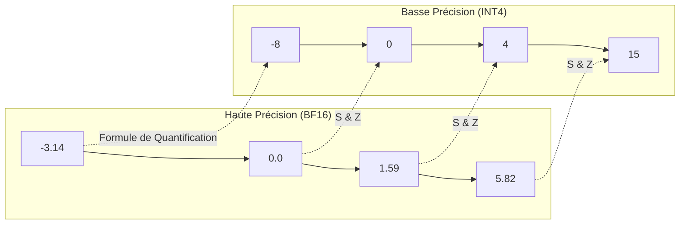

La **quantification** (*quantization*) réduit la précision numérique des **poids** (et parfois des **activations**) d'un réseau de neurones [^1].

En passant de la précision native **FP16/BF16** (2 octets par paramètre) à des formats compressés en **8-bit** (1 octet), **4-bit** (~0,5 octet effectif) ou plus bas, on divise l'empreinte VRAM d'un modèle par 2 à 4, ce qui permet d'exécuter localement des modèles autrement hors de portée matérielle [^1].

> 🔗 **Lien connexe :** la quantification réduit les **poids fixes** ; le [[01-fondations/kv-cache-et-contexte|KV Cache]] reste un second poste VRAM dynamique, lui aussi quantifiable séparément.

---

## 📐 La Physique Mathématique de la Quantification

La méthode la plus courante en post-training est la **quantification affine par blocs** (souvent appelée quantification linéaire uniforme à échelle et zero-point) [^1][^2]. Elle projette un intervalle de valeurs réelles ($x \in [\beta_{min}, \beta_{max}]$) vers un ensemble discret de basse précision ($q$) :

$$q = \text{round}\left(\frac{x}{S}\right) + Z$$

Où :
*   **$S$ (Scale)** : facteur d'échelle réel qui étire ou contracte l'intervalle [^2].
*   **$Z$ (Zero-point)** : entier qui aligne le zéro réel sur une valeur discrète [^2].
*   **$\text{round}$** : arrondi à l'entier le plus proche.

### ⚠️ Le problème des valeurs aberrantes (*Outliers*)
Dans un LLM, certaines activations ou certains poids ont des amplitudes anormalement élevées [^2][^6]. Si l'on quantifie un tenseur entier avec une seule échelle, $S$ doit couvrir ces extrêmes : **la majorité des valeurs normales se retrouvent alors compressées dans quelques bins discrets**, ce qui dégrade fortement la qualité (perplexité, benchmarks downstream) [^2][^6].

Toute la recherche récente en quantification LLM vise à contourner ce problème : protection de sous-ensembles de poids (AWQ), compensation par Hessienne (GPTQ), rotations Hadamard (MR-GPTQ), ou formats FP4 à granularité fine (NVFP4/MXFP4) [^5][^6][^8].

---

## 🗺️ Le Paysage des Formats de Quantification (2026)

Le choix du format dépend de votre **infrastructure cible** (CPU, GPU dédié, mémoire unifiée) et du **moteur d'inférence** (llama.cpp, vLLM, TensorRT-LLM).

### 1. GGUF (llama.cpp) : le standard CPU / mémoire unifiée
Le format **GGUF** (écosystème [llama.cpp](https://github.com/ggml-org/llama.cpp)) cible l'inférence locale, l'offloading partiel vers la RAM et Apple Silicon [^3][^4].

*   **Les K-Quants (superblocks) :** les poids sont découpés en super-blocs de **256 valeurs**, avec des sous-blocs et des échelles multiples [^4]. Les variantes `Q4_K_M`, `Q5_K_M`, etc. utilisent une **précision mixte** : les tenseurs sensibles (souvent les matrices d'attention) restent à plus haute précision que le reste du réseau [^4].
*   **Idéal pour :** Mac Studio, Ryzen x86, inférence CPU-first, déploiements souverains sans stack GPU lourde [^3].

### 2. AWQ vs GPTQ (standard GPU)
Ces formats dominent l'inférence GPU de production (vLLM, TGI, etc.) [^5][^6].

*   **GPTQ** (*Generative Pre-trained Transformer Quantization*) : quantification PTQ *one-shot* qui minimise l'erreur de reconstruction en utilisant la **matrice Hessienne** pour compenser l'arrondi couche par couche [^5].
*   **AWQ** (*Activation-aware Weight Quantization*) : identifie ~**1 %** des poids les plus « saillants » via la magnitude des activations et les **protège en plus haute précision** ; le reste est compressé en 4-bit [^6]. En pratique, AWQ rivalise ou dépasse souvent GPTQ sur les benchmarks de qualité à taille égale [^6].
*   **Idéal pour :** débit GPU maximal sur Nvidia/AMD avec kernels dédiés.

### 3. Microscaling FP4 : MXFP4 et NVFP4
Standardisés par l'**OCP** (Open Compute Project) et accélérés matériellement sur GPU récents (Blackwell, MI300/MI350) [^7][^8] :

*   **Format E2M1 :** nombres flottants 4-bit (1 signe, 2 exposant, 1 mantisse) [^7].
*   **MXFP4 :** échelle de bloc **E8M0** partagée sur **32 valeurs** [^7].
*   **NVFP4 (NVIDIA) :** échelle **E4M3 FP8** sur **16 valeurs**, plus un facteur d'échelle par tenseur [^7][^9].
*   **MR-GPTQ** (ICLR 2026) : variante GPTQ avec **rotations Hadamard** par blocs, adaptée aux contraintes FP4. Elle améliore nettement MXFP4 et atteint une précision proche de NVFP4, avec des accélérations jusqu'à **~4× end-to-end** sur RTX 5090 et **~2,2×** sur B200 vs FP16 — mais le FP4 **n'est pas un upgrade automatique** sur INT4 sans méthode dédiée [^8].

---

## 📊 Arbitrage : Taille, Perplexité et qualité downstream

La **perplexité (PPL)** sur WikiText-2 mesure la capacité prédictive du modèle (plus bas = mieux). Elle est utile pour comparer des quantifications **sur le même modèle et tokenizer**, mais **ne suffit pas** : des écarts faibles en PPL peuvent masquer des régressions sur le raisonnement ou l'instruction-following [^4][^9].

### Benchmarks GGUF — Llama 3.1-8B-Instruct (données unifiées)

*Source : étude llama.cpp sur un même checkpoint, 13 formats GGUF + baseline F16 [^4]. PPL = WikiText-2 ; Avg = moyenne non pondérée de GSM8K, HellaSwag, IFEval, MMLU, TruthfulQA.*

| Format | bpw effectif (≈) | Réduction taille (%) [^4] | PPL WikiText-2 | Avg downstream | Commentaire |
| :--- | :--- | :--- | :--- | :--- | :--- |
| **F16 (référence)** | 16,0 | — | **7,32** | **69,47** | Baseline |
| **Q8_0** | 8,0 | 46,9 | 7,33 | 69,41 | Quasi-identique à F16 |
| **Q6_K** | ~6,1 | 59,0 | 7,35 | 69,23 | Conservateur |
| **Q5_0** | ~5,2 | 65,2 | 7,43 | **69,92** | Meilleur compromis Pareto qualité/taille [^4] |
| **Q5_K_M** | ~5,5 | 64,4 | 7,40 | 69,36 | 5-bit K-quant robuste |
| **Q4_K_S** | ~4,2 | 70,8 | 7,62 | 69,17 | **Default équilibré 4-bit** [^4] |
| **Q4_K_M** | ~4,5 | 69,4 | 7,56 | 69,15 | Standard communautaire |
| **Q3_K_M** | ~3,5 | 75,0 | 7,96 | 68,07 | 3-bit utilisable si contraint |
| **Q3_K_S** | ~3,4 | 77,2 | 8,96 | 65,49 | Compression max, perte visible |
| **Q2_K** | ~2,5 | — | — | — | Voir scoreboard llama.cpp : PPL ~9,75 sur Llama 3 **8B base** [^10] |

> **Ordres de grandeur VRAM (poids seuls, 70B) :** BF16 ~140 Go ; FP8 ~70 Go ; Q4 ~40 Go (calcul : $70 \times 10^9 \times bpw / 8$). Ces chiffres n'incluent pas le KV cache — voir [[01-fondations/kv-cache-et-contexte|chapitre KV Cache]].

### 💡 Le paradoxe de la quantification (règle d'or)
Une erreur classique : préférer un **petit modèle non quantifié** à un **grand modèle quantifié**. Sous contrainte mémoire fixe, **le nombre de paramètres domine souvent le niveau de bits** [^10][^11].

> **Règle d'or :** un grand modèle quantifié (ex. **Llama 3.1 70B en Q4_K_M**, ~40 Go) reste généralement bien plus capable qu'un petit modèle en BF16 (ex. **Llama 3.1 8B**, ~16 Go), même si la compression est agressive [^11].

---

## 📋 Le Conseil de l'Architecte pour OpenHuman

Pour un déploiement souverain d'agents locaux avec *OpenHuman* :

1.  **Standard PME (CPU / Mac / hybride) :** **Q4_K_S ou Q4_K_M en GGUF** via llama.cpp — meilleur compromis taille/qualité/vitesse documenté pour Llama 3.1-8B ; monter en **Q5_0** si la marge qualité prime [^4].
2.  **Inférence GPU partagée (vLLM / TensorRT-LLM) :** **FP8** sur les poids (Hopper/Blackwell/RTX récentes) ou **AWQ INT4** selon le moteur ; le FP8 réduit la VRAM ~×2 avec une dégradation faible si bien calibré, sans être strictement identique au BF16 [^1][^6].
3.  **Éviter Q2 et Q3 agressif en production :** `Q3_K_S` et `Q2_K` dégradent nettement le raisonnement (GSM8K) et la perplexité ; réserver aux contraintes extrêmes de RAM [^4][^10].
4.  **FP4 (NVFP4/MXFP4) :** pertinent sur **Blackwell** ou stacks TensorRT-LLM récentes ; valider sur vos benchmarks métier avant généralisation [^8][^9].

---

## 📚 Sources et Références

[^1]: NVIDIA Technical Blog, *Mastering LLM Techniques: Inference Optimization* (quantification, compromis précision/mémoire), novembre 2023. [https://developer.nvidia.com/blog/mastering-llm-techniques-inference-optimization/](https://developer.nvidia.com/blog/mastering-llm-techniques-inference-optimization/)
[^2]: NVIDIA Technical Blog, *Mastering LLM Techniques: Inference Optimization* (outliers, activation quantization), novembre 2023. [https://developer.nvidia.com/blog/mastering-llm-techniques-inference-optimization/](https://developer.nvidia.com/blog/mastering-llm-techniques-inference-optimization/)
[^3]: ggml-org, *llama.cpp* (moteur GGUF, formats K-quant), 2026. [https://github.com/ggml-org/llama.cpp](https://github.com/ggml-org/llama.cpp)
[^4]: J. Wang et al., *Which Quantization Should I Use? A Unified Evaluation of llama.cpp Quantization on Llama-3.1-8B-Instruct* (arXiv:2601.14277), janvier 2026. [https://arxiv.org/abs/2601.14277](https://arxiv.org/abs/2601.14277)
[^5]: E. Frantar et al., *GPTQ: Accurate Post-Training Quantization for Generative Pre-trained Transformers* (arXiv:2210.17323), 2022. [https://arxiv.org/abs/2210.17323](https://arxiv.org/abs/2210.17323)
[^6]: J. Lin et al., *AWQ: Activation-aware Weight Quantization for LLM Compression and Acceleration* (arXiv:2306.00923), 2023. [https://arxiv.org/abs/2306.00923](https://arxiv.org/abs/2306.00923)
[^7]: J. Chhugani et al., *Unveiling the Potential of Quantization with MXFP4: Strategies for Quantization Error Reduction* (arXiv:2603.08713), 2026. [https://arxiv.org/abs/2603.08713](https://arxiv.org/abs/2603.08713)
[^8]: S. Egiazarian et al., *Bridging the Gap Between Promise and Performance for Microscaling FP4 Quantization* (MR-GPTQ, ICLR 2026), arXiv:2509.23202. [https://arxiv.org/abs/2509.23202](https://arxiv.org/abs/2509.23202)
[^9]: NVIDIA Technical Blog, *Optimizing Inference for Long Context and Large Batch Sizes with NVFP4 KV Cache* (format NVFP4), décembre 2025. [https://developer.nvidia.com/blog/optimizing-inference-for-long-context-and-large-batch-sizes-with-nvfp4-kv-cache/](https://developer.nvidia.com/blog/optimizing-inference-for-long-context-and-large-batch-sizes-with-nvfp4-kv-cache/)
[^10]: ggml-org, *llama.cpp perplexity scoreboard* (WikiText-2, Llama 3 8B, formats K-quant), 2026. [https://github.com/ggml-org/llama.cpp/blob/master/tools/perplexity/README.md](https://github.com/ggml-org/llama.cpp/blob/master/tools/perplexity/README.md)
[^11]: X. Zhang, *A Perplexity Benchmark of llama.cpp* (taille vs perplexité, modèles 7B–30B), septembre 2023. [https://www.xzh.me/2023/09/a-perplexity-benchmark-of-llamacpp.html](https://www.xzh.me/2023/09/a-perplexity-benchmark-of-llamacpp.html)
