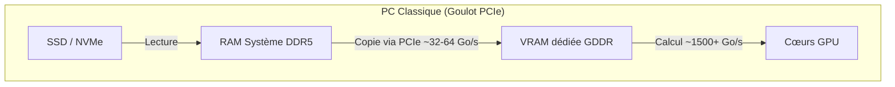
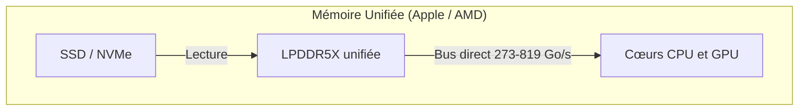

> [!tip] En bref
> Apple Silicon et AMD Gorgon Halo permettent d'allouer 120 à 160 Go de mémoire unifiée à un LLM sur une station de bureau. Apple offre le meilleur débit ; AMD offre Linux natif et Docker. Le bon choix dépend de votre stack, pas seulement de la capacité.

Pour un déploiement souverain d'IA en entreprise, la **mémoire unifiée** est l'une des ruptures matérielles les plus importantes de la décennie.

En supprimant la copie RAM → VRAM via PCIe, les SoC **APU** (CPU + GPU + NPU sur la même puce) accèdent à un pool de **LPDDR5X** partagé — jusqu'à **192 Go** sur les plateformes AMD Ryzen AI Max PRO 400, et jusqu'à **512 Go** sur le Mac Studio M3 Ultra [^1][^2][^4]. C'est l'architecture de référence pour exécuter des modèles **70B+ quantifiés** (ex. Llama 3.1 70B en Q4_K_M, ~40 Go de poids) sur une station de bureau silencieuse, sans serveur GPU datacenter [^3][^9].

> [!note] Lien connexe
> Pour le dimensionnement mémoire (poids + KV cache), voir [[01-fondations/quantization-4bit-8bit|Quantification]] et [[01-fondations/kv-cache-and-context|KV Cache]].

---

## ⚔️ Le Paysage Matériel : Apple Silicon vs AMD Gorgon Halo

Deux écosystèmes dominent la mémoire unifiée hautes performances en 2026 :

### 1. Apple Silicon (Mac Studio 2025)
Apple intègre CPU, GPU et NPU sur un même package, avec des barrettes **LPDDR5X** soudées à proximité immédiate du silicium [^3][^4].

*   **Mac Studio M4 Max** (CTO 16c CPU / 40c GPU) : jusqu'à **128 Go** unifiés, **546 Go/s** de bande passante [^3][^4].
*   **Mac Studio M3 Ultra** (CTO 32c CPU / 80c GPU) : jusqu'à **512 Go** unifiés (192 Go est une config courante pour le local LLM), **819 Go/s** [^4][^5]. Apple n'a pas publié de M4 Ultra en 2025 : l'UltraFusion reste réservé à la génération M3 [^5].
*   **Forces :** bande passante très élevée, écosystèmes **MLX** et **Metal** matures, silence et faible consommation [^3][^10].
*   **Limites :** macOS, mémoire non évolutive (soudée), tarif élevé en configuration 128 Go+ [^4].

### 2. AMD Ryzen AI Max PRO 400 (« Gorgon Halo »)
Refresh professionnel de la plateforme **Strix Halo** (Zen 5 + RDNA 3.5), annoncé mai 2026 pour des systèmes OEM au **T3 2026** [^1][^2].

*   **Architecture :** jusqu'à **16 cœurs Zen 5**, iGPU **Radeon 8065S** (40 CU sur le SKU flagship **Max+ PRO 495**), bus mémoire **256-bit** LPDDR5X-8533 [^1][^2].
*   **Capacité :** jusqu'à **192 Go** unifiés (+50 % vs la série 300 à 128 Go) [^1][^2].
*   **Bande passante :** **~273 Go/s** (contre ~256 Go/s théoriques sur Strix Halo 128 Go — gain ~7 % lié au clock mémoire) [^1][^2].
*   **Allocation GPU :** jusqu'à **160 Go** réservables comme VRAM iGPU, **32 Go** laissés au système [^1][^2].
*   **Forces :** x86 ouvert (Linux / Windows / Docker natif), rapport capacité/prix attractif sur la plateforme **Ryzen AI Halo** (~3 999 $ pour la config 128 Go actuelle) [^7][^8].
*   **Limites :** bande passante ~**2× inférieure** au M4 Max — le décodage des modèles denses 70B reste memory-bound (~5 tok/s mesurés sur Strix Halo 395, profil similaire attendu sur PRO 400) [^2][^6][^9].

---

## 🏎️ Pourquoi l'unifié supprime le « goulot PCIe » ?

Sur un PC avec GPU discret, charger un LLM implique souvent une **copie** des poids de la RAM système vers la VRAM via **PCIe** (typiquement ~32–64 Go/s effectifs en pratique, loin des ~1 500+ Go/s internes au GPU) [^11].





En mémoire unifiée, **CPU et GPU adressent le même pool physique** : pas de duplication des poids ni de transfert PCIe pour les tensors déjà en RAM [^11]. Le compromis : une bande passante globale **partagée** et **inférieure** à une VRAM GDDR7 dédiée, mais une **capacité** bien plus grande par machine [^11].

---

## 🛠️ Guide Pratique : Configurer l'allocation mémoire GPU

Les OS limitent par défaut la part de RAM unifiée utilisable par le GPU — il faut relever ce plafond pour les LLM lourds.

### 1. Côté AMD (Ryzen AI Max 300 / PRO 400)
Sur Strix Halo et Gorgon Halo, l'allocation se fait surtout via **BIOS/firmware OEM** [^1][^2] :

1.  Redémarrer → **BIOS/UEFI**.
2.  Menu *Advanced* → **UMA Frame Buffer Size** (libellé variable selon OEM).
3.  Sur un système **192 Go**, AMD documente jusqu'à **160 Go** pour le GPU et **32 Go** pour l'OS [^1][^2].

> [!warning] Piège : le page cache lors du chargement
> Si le modèle est stocké sur SSD et qu'il fait **140 Go** (ex. Llama 3.1 70B en Q8), l'OS va remplir son **page cache** dans les 32 Go système lors de la lecture du fichier GGUF — avant même que l'inférence ne commence. Résultat : OOM ou swap massif sur les 32 Go restants. Bonne pratique : laisser **au moins 10–15 % de la RAM totale** hors allocation GPU, soit ~20–28 Go libres sur un système 192 Go, pour couvrir OS + page cache + buffers de chargement.

Les systèmes **PRO 400** arrivent en **T3 2026** (HP, Lenovo, ASUS…) ; les guides Strix Halo 395 restent pertinents pour llama.cpp/Vulkan/ROCm en attendant [^6][^8].

### 2. Côté Apple Silicon (macOS)
Par défaut, macOS plafonne la **working set Metal** du GPU à environ **75 %** de la RAM unifiée (via `recommendedMaxWorkingSetSize`) — sur 128 Go, seuls ~96 Go sont exploitables sans tweak [^12][^13].

Pour relever la limite (ex. **~120 Go** sur une machine 128 Go), la commande documentée par la communauté llama.cpp/MLX est :

```bash
# Valeur en MÉGABYTES (ex. 120 Go → 120 × 1024 = 122880)
sudo sysctl iogpu.wired_limit_mb=122880
```

*   Vérifier : `sysctl iogpu.wired_limit_mb` (`0` = politique par défaut).
*   Revenir au défaut : `sudo sysctl iogpu.wired_limit_mb=0` [^12][^13].
*   **Laisser 8–16 Go** au système pour éviter pression mémoire / swap [^12][^13].
*   La modification est **volatile** (perdue au reboot) ; pour la persistance, utiliser un LaunchDaemon ou équivalent — non supporté officiellement par Apple [^12][^13].

> [!warning] Documentation obsolète
> L'ancienne clé `iogpu.wired_mem_limit` (en kilo-octets) et le dépôt `apple-silicon-inference/guide` circulent encore en ligne mais ne sont **pas** la référence fiable actuelle.

---

## 📊 Arbitrage Économique et Performance (2026)

*Comparaison de stations unifiées pour **Llama 3.1 70B Q4_K_M** (~40 Go de poids). Vitesses = **décodage** (génération), ordres de grandeur mesurés ou publiés — varient selon backend (MLX vs llama.cpp), contexte et build.*

| Critère | Mac Studio (M4 Max 128 Go) | Mac Studio (M3 Ultra 192 Go) | AMD Ryzen AI (Halo / PRO 400) |
| :--- | :--- | :--- | :--- |
| **Puce (config LLM)** | M4 Max 16c/40c GPU [^4] | M3 Ultra 32c/80c GPU [^4] | Ryzen AI Max+ PRO 495 [^1][^2] |
| **RAM unifiée max** | 128 Go [^4] | 512 Go (192 Go courant) [^4] | 192 Go [^1][^2] |
| **VRAM GPU max allouable** | ~120 Go (`sysctl`, 128 Go machine) [^12] | ~160–184 Go (selon RAM totale) [^12] | **160 Go** (BIOS max) — en pratique ~130–140 Go pour préserver le page cache OS [^1][^2] |
| **Bande passante** | **546 Go/s** [^3][^4] | **819 Go/s** [^4] | **~273 Go/s** [^1][^2] |
| **Débit 70B Q4 (decode)** | **~10–12 tok/s** (MLX) [^9][^10] | **~12–15 tok/s** (MLX) [^9][^10] | **~4,5–5 tok/s** (Strix Halo 395, profil PRO 400 similaire) [^6][^9] |
| **OS** | macOS | macOS | **Linux / Windows** [^1][^2] |
| **Tarif indicatif** | ~4 500–5 500 € (128 Go, CTO) [^4][^5] | ~5 000–7 500 € (192 Go+, CTO) [^4][^5] | **~3 700 €** (Ryzen AI Halo 128 Go, 3 999 $) [^7][^8] |

> [!note] Lecture des chiffres
> Les vitesses Apple proviennent de benchmarks communautaires **MLX** ; **llama.cpp/Metal** est souvent légèrement plus lent en decode pur, mais plus flexible en long contexte [^9][^10]. La borne théorique memory-bound (~13–21 tok/s Apple vs ~7 tok/s AMD) est détaillée dans [[01-fondations/unified-memory-vs-ram-vs-vram|Mémoire unifiée vs RAM vs VRAM]].

---

## 📋 Le Conseil de l'Architecte

Pour un déploiement souverain on-premise :

1.  **Souveraineté x86 + Docker (AMD Halo / PRO 400) :** si la stack repose sur **Linux, Docker et Python**, la plateforme AMD est la plus rationnelle : 160 Go VRAM allouables, écosystème ouvert, prix inférieur au Mac Studio équivalent en capacité [^1][^2][^7]. Acceptez un débit **~5 tok/s** sur un 70B dense — privilégiez les **MoE** (Qwen3.5-A3B, etc.) pour l'interactivité [^6].
2.  **Vitesse et confort (Mac Studio) :** pour le meilleur ressenti sur un **70B dense** (~12–15 tok/s en MLX sur M3 Ultra), le **Mac Studio M3 Ultra 192 Go+** reste le roi de la bande passante unifiée en 2026 ; le **M4 Max 128 Go** est un excellent compromis si 128 Go suffisent [^4][^9][^10]. Budget macOS et conteneurs à anticiper.
3.  **Dimensionnez dès l'achat :** la mémoire LPDDR5X est **soudée** — impossible d'upgrader après coup. Prévoyez marge pour **poids + KV cache + OS + page cache de chargement** (voir chapitres fondations). Sur un système 192 Go AMD, allouer 160 Go au GPU laisse 32 Go système — suffisant au repos, mais serré lors du premier chargement d'un modèle ≥ 100 Go.

---

## 📚 Sources et Références

[^1]: AMD, *AMD Powers Next-Generation Agent Computers — Ryzen AI Max PRO 400 Series*, mai 2026. [https://www.amd.com/en/blogs/2026/amd-powers-next-generation-agent-computers-with-new-ryzen-ai-hal.html](https://www.amd.com/en/blogs/2026/amd-powers-next-generation-agent-computers-with-new-ryzen-ai-hal.html)
[^2]: ServeTheHome, *AMD Ups Ante With 192GB Ryzen AI Max PRO 400 Chips for AI Systems*, mai 2026. [https://www.servethehome.com/amd-reveals-ryzen-ai-max-pro-400-series-192gb-ram-for-ai-systems/](https://www.servethehome.com/amd-reveals-ryzen-ai-max-pro-400-series-192gb-ram-for-ai-systems/)
[^3]: Apple Newsroom, *Apple introduces M4 Pro and M4 Max*, octobre 2024 (546 Go/s, 128 Go max M4 Max). [https://www.apple.com/newsroom/2024/10/apple-introduces-m4-pro-and-m4-max/](https://www.apple.com/newsroom/2024/10/apple-introduces-m4-pro-and-m4-max/)
[^4]: Apple, *Mac Studio — Technical Specifications* (M4 Max / M3 Ultra, RAM, bande passante), 2025. [https://www.apple.com/mac-studio/specs/](https://www.apple.com/mac-studio/specs/)
[^5]: Apple Support, *Mac Studio (2025) — Tech Specs* (configurations CTO, RAM). [https://support.apple.com/en-us/122211](https://support.apple.com/en-us/122211)
[^6]: ignasivt, *Strix Halo Guide* (benchmarks llama.cpp Llama 3.1 70B Q4 ~4,7–4,9 tok/s), 2026. [https://github.com/ignasivt/strix-halo-guide](https://github.com/ignasivt/strix-halo-guide)
[^7]: TweakTown, *AMD launches Ryzen AI Max PRO 400 — up to 192GB unified memory*, mai 2026. [https://www.tweaktown.com/news/111752/amd-launches-the-ryzen-ai-max-pro-400-series-of-cpus-up-to-16-cores-with-192gb-of-unified-memory/index.html](https://www.tweaktown.com/news/111752/amd-launches-the-ryzen-ai-max-pro-400-series-of-cpus-up-to-16-cores-with-192gb-of-unified-memory/index.html)
[^8]: VideoCardz, *AMD confirms Ryzen AI MAX 400 Gorgon Halo — 192GB / 160GB VRAM*, mai 2026. [https://videocardz.com/newz/amd-confirms-ryzen-ai-max-400-gorgon-halo-will-support-up-to-192gb-memory-and-160gb-vram](https://videocardz.com/newz/amd-confirms-ryzen-ai-max-400-gorgon-halo-will-support-up-to-192gb-memory-and-160gb-vram)
[^9]: CraftRigs, *How to Run Llama 3 70B on a Mac with 128 GB RAM* (vitesses MLX M3 Ultra / M4 Max), 2025. [https://craftrigs.com/guides/run-llama-70b-mac-128gb-ram/](https://craftrigs.com/guides/run-llama-70b-mac-128gb-ram/)
[^10]: llmhardware.io, *Mac Studio M4 Max for LLMs* (Llama 3.3 70B Q4 ~14–20 tok/s MLX), 2025. [https://llmhardware.io/guides/mac-studio-m4-max-llm-guide](https://llmhardware.io/guides/mac-studio-m4-max-llm-guide)
[^11]: NVIDIA Technical Blog, *Mastering LLM Techniques: Inference Optimization* (goulots mémoire, quantification), novembre 2023. [https://developer.nvidia.com/blog/mastering-llm-techniques-inference-optimization/](https://developer.nvidia.com/blog/mastering-llm-techniques-inference-optimization/)
[^12]: ggml-org/llama.cpp, *Issue #16646* (`iogpu.wired_limit_mb`), 2025. [https://github.com/ggml-org/llama.cpp/issues/16646](https://github.com/ggml-org/llama.cpp/issues/16646)
[^13]: ivanopcode, *Override macOS Metal VRAM cap* (`iogpu.wired_limit_mb`, tableaux par RAM), 2025. [https://github.com/ivanopcode/devnote-override-macos-metal-vram-cap](https://github.com/ivanopcode/devnote-override-macos-metal-vram-cap)
