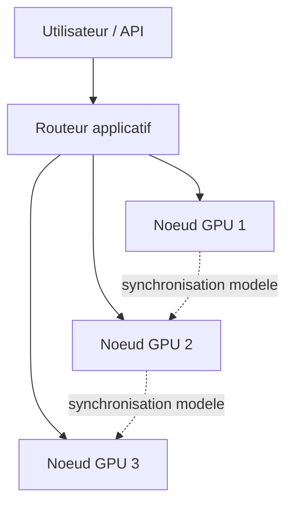
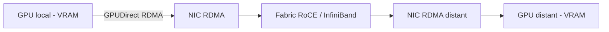

> [!tip] En bref
> Relier plusieurs machines IA en réseau est possible, mais le réseau (10–400 Gb/s) reste dix à cent fois plus lent que la mémoire interne d'un GPU. RoCE, InfiniBand et Thunderbolt ne répondent pas au même problème : choisir le mauvais peut transformer votre cluster en goulot d'étranglement.

Après la [[02-materiel/stations-multi-gpu|station multi-GPU]], la question suivante est naturelle : peut-on relier plusieurs machines pour obtenir un “super ordinateur” IA on-premise ?

Oui, mais le réseau devient vite plus important que le nombre de GPU. Une carte moderne lit sa [[00-lexique/vram|VRAM]] à des centaines ou milliers de Go/s, alors qu'un lien réseau se compte souvent en dizaines ou centaines de Gb/s. Même [[00-lexique/rdma|RDMA]] ne transforme pas un cluster de bureau en système [[00-lexique/nvlink|NVLink]] externe.

> [!note] Lien connexe
> Pour comprendre pourquoi l'interconnexion limite le parallélisme modèle, voir [[02-materiel/stations-multi-gpu|Stations Multi-GPU]] et [[00-lexique/memory-bandwidth|Bande passante mémoire]].

---

## 🎯 Le vrai rôle du réseau

Dans une architecture IA on-premise, le réseau sert surtout à trois choses :

1. **Distribuer des requêtes** entre plusieurs machines.
2. **Synchroniser des GPU** pour du parallélisme multi-nœuds.
3. **Déplacer des données** entre stockage, CPU, GPU et services applicatifs.

Ces usages n'ont pas le même niveau d'exigence. Servir plusieurs utilisateurs avec plusieurs machines indépendantes tolère très bien Ethernet classique. En revanche, découper un même modèle sur plusieurs nœuds demande des échanges fréquents : latence, congestion, débit réel et support RDMA deviennent critiques.

La bonne question n'est donc pas “quel est le débit maximal du câble ?”, mais “quelles données doivent traverser le réseau pendant l'inférence ?”.

---

## 🧱 Ethernet classique, RoCE, InfiniBand : trois niveaux différents

### 1. Ethernet classique

Ethernet standard est parfait pour l'accès utilisateur, l'administration, les API, le stockage léger et les architectures où chaque machine sert une charge indépendante.

Son avantage est évident : coût raisonnable, matériel disponible, compétences réseau courantes. Sa limite est tout aussi claire : le protocole TCP/IP classique passe par plus de couches CPU et n'offre pas les mêmes garanties de latence qu'un fabric RDMA correctement configuré.

### 2. RoCE : RDMA sur Ethernet

[[00-lexique/roce|RoCE]] signifie *RDMA over Converged Ethernet*. Il apporte une partie des bénéfices RDMA sur une infrastructure Ethernet adaptée : les transferts peuvent éviter une partie des copies et du traitement CPU, ce qui aide les communications entre nœuds GPU [^1][^2].

Mais RoCE n'est pas un bouton magique. La documentation NVIDIA indique que RoCE s'appuie sur ECN et PFC pour fonctionner en environnement Ethernet lossless ou semi-lossless, et que la configuration doit être cohérente côté hôtes, switches, priorités et files de trafic [^3]. En pratique, RoCE demande donc :

- des NIC compatibles, souvent NVIDIA ConnectX
- des switches adaptés
- une configuration PFC/ECN comprise et testée
- une surveillance de congestion
- une pile logicielle compatible avec le runtime IA

Sur un réseau mal configuré, RoCE peut être pire qu'Ethernet classique : pauses PFC excessives, congestion invisible, performances instables.

### 3. InfiniBand : fabric dédié HPC/IA

InfiniBand est historiquement le choix des clusters HPC et IA quand la latence et la prédictibilité priment. Il combine réseau, transport RDMA et gestion de fabric dans un écosystème pensé pour les communications intensives.

Pour un particulier ou une petite PME, InfiniBand peut être trop coûteux ou trop spécialisé. Pour un cluster IA sérieux avec parallélisme multi-nœuds, il reste une référence parce qu'il réduit les surprises réseau et s'intègre bien avec les bibliothèques de communication GPU.

---

## 🚀 GPUDirect RDMA : éviter le détour par la RAM

NVIDIA GPUDirect RDMA permet à une carte réseau ou un autre périphérique tiers d'échanger directement avec la mémoire GPU via PCIe, sans recopier systématiquement les données en RAM système [^4]. La documentation NVIDIA précise que la technologie fonctionne avec InfiniBand et RoCE sur matériel compatible [^4].

Ce mécanisme est important pour les moteurs distribués, mais il ne supprime pas les limites physiques :

- le trafic traverse toujours PCIe, la NIC, le switch et les liens réseau
- le gain dépend du moteur d'inférence et des bibliothèques de communication
- la topologie PCIe de la machine reste importante
- la compatibilité driver/kernel peut devenir un sujet d'exploitation

NVIDIA recommande désormais DMA-BUF comme approche moderne pour certains déploiements GPUDirect RDMA dans le GPU Operator, plutôt que le chemin historique `nvidia-peermem` quand les conditions de plateforme sont remplies [^1].

---

## ⚡ Thunderbolt : utile, mais pas un fabric IA

Thunderbolt est séduisant pour l'on-premise : un câble compact, des docks, du stockage rapide, parfois du réseau point-à-point. Mais il faut garder les ordres de grandeur.

Intel décrit Thunderbolt 4 comme un lien à **40 Gb/s** bidirectionnel avec 32 Gb/s de données PCIe minimales [^5]. Thunderbolt 5 monte à **80 Gb/s** bidirectionnels, avec un mode *Bandwidth Boost* pouvant réallouer le lien jusqu'à **120 Gb/s en émission et 40 Gb/s en réception**, principalement pour les usages vidéo [^6].

Même Thunderbolt 5 reste très loin d'un fabric NVLink/NVSwitch de serveur GPU. Il peut être utile pour :

- stockage externe rapide
- station de travail compacte
- dock réseau ou 10/25 GbE
- expérimentation homelab
- liaison simple entre machines dans certains scénarios

Il ne faut pas le vendre comme :

- une extension transparente de VRAM
- un NVLink externe
- une solution robuste pour tensor parallel multi-nœuds
- un réseau datacenter IA

Pour un mini-cluster de bureau, Thunderbolt peut aider à prototyper. Pour de la production multi-GPU distribuée, RoCE ou InfiniBand deviennent beaucoup plus crédibles.

---

## 🧠 Parallélisme IA : quel réseau pour quel usage ?

| Usage | Réseau acceptable | Commentaire |
| :--- | :--- | :--- |
| Plusieurs utilisateurs, modèles répliqués | Ethernet classique | Le load balancer distribue les requêtes, peu de synchronisation GPU |
| RAG + services applicatifs | Ethernet classique ou 10/25 GbE | La latence applicative compte plus que RDMA |
| Stockage partagé performant | 25/100 GbE, parfois RDMA | Dépend fortement du backend stockage |
| Multi-nœuds avec pipeline parallel | RoCE ou InfiniBand recommandé | Les activations traversent le réseau |
| Tensor parallel multi-nœuds | InfiniBand ou RoCE très bien configuré | Communications fréquentes, réseau critique |
| Prototype homelab | Ethernet / Thunderbolt | Utile pour apprendre, pas pour promettre des gains linéaires |

vLLM recommande de raisonner sur la topologie : tensor parallel dans un nœud quand le modèle tient sur les GPU du nœud, puis pipeline parallel entre nœuds quand il faut dépasser cette limite. La documentation mentionne aussi GPUDirect RDMA pour les communications réseau GPU efficaces dans les déploiements compatibles [^7].

---

## 📋 Le Conseil de l'Architecte

Pour un déploiement souverain on-premise :

1. **Commencer par répliquer avant de distribuer.** Deux machines qui servent chacune leur propre modèle sont souvent plus fiables qu'un modèle coupé en deux sur un réseau fragile.
2. **Ne pas confondre débit marketing et débit utile.** Un lien réseau annoncé en Gb/s ne dit rien de la latence, de la congestion, du CPU bypass ou du comportement NCCL.
3. **Réserver RoCE aux environnements maîtrisés.** RoCE est pertinent si vous contrôlez les NIC, switches, QoS, PFC/ECN et monitoring.
4. **Choisir InfiniBand pour le multi-nœuds sérieux.** Si l'objectif est un cluster IA à faible latence, InfiniBand évite beaucoup de bricolage.
5. **Utiliser Thunderbolt comme outil de station, pas comme promesse cluster.** Très pratique pour le stockage et les docks ; trop limité pour remplacer un fabric GPU.

Le réseau IA on-premise n'est donc pas “plus de câbles”. C'est une décision d'architecture : quelle part du modèle, du cache et des requêtes accepte-t-on de faire traverser entre machines ?

---

## 📚 Sources et Références

[^1]: NVIDIA, *GPUDirect RDMA and GPUDirect Storage — GPU Operator* (DMA-BUF, `nvidia-peermem`, configuration GPUDirect RDMA). [https://docs.nvidia.com/datacenter/cloud-native/gpu-operator/26.3/gpu-operator-rdma.html](https://docs.nvidia.com/datacenter/cloud-native/gpu-operator/26.3/gpu-operator-rdma.html)
[^2]: NVIDIA, *RDMA over Converged Ethernet — DOCA SDK* (RDMA, RoCE, faible latence, lossless Ethernet). [https://docs.nvidia.com/doca/sdk/rdma-over-converged-ethernet.pdf](https://docs.nvidia.com/doca/sdk/rdma-over-converged-ethernet.pdf)
[^3]: NVIDIA, *RDMA over Converged Ethernet - RoCE | Cumulus Linux* (PFC, ECN, modes lossy/lossless). [https://docs.nvidia.com/networking-ethernet-software/cumulus-linux/Layer-1-and-Switch-Ports/Quality-of-Service/RDMA-over-Converged-Ethernet-RoCE/](https://docs.nvidia.com/networking-ethernet-software/cumulus-linux/Layer-1-and-Switch-Ports/Quality-of-Service/RDMA-over-Converged-Ethernet-RoCE/)
[^4]: NVIDIA, *GPUDirect RDMA 13.2 documentation* (échanges directs entre GPU et périphériques tiers, support InfiniBand/RoCE). [https://docs.nvidia.com/cuda/gpudirect-rdma/](https://docs.nvidia.com/cuda/gpudirect-rdma/)
[^5]: Intel, *What Is Thunderbolt 4?* (40 Gb/s bidirectionnel, PCIe 32 Gb/s). [https://www.intel.com/content/www/us/en/gaming/resources/upgrade-gaming-accessories-thunderbolt-4.html](https://www.intel.com/content/www/us/en/gaming/resources/upgrade-gaming-accessories-thunderbolt-4.html)
[^6]: Thunderbolt Technology, *Thunderbolt 5 Technology Brief* (80 Gb/s bidirectionnel, 120/40 Gb/s Bandwidth Boost, PCIe 64 Gb/s). [https://www.thunderbolttechnology.net/sites/default/files/Thunderbolt_5_TechBrief_2023_09_12.pdf](https://www.thunderbolttechnology.net/sites/default/files/Thunderbolt_5_TechBrief_2023_09_12.pdf)
[^7]: vLLM, *Parallelism and Scaling* (tensor parallel, pipeline parallel, multi-nœuds, GPUDirect RDMA). [https://docs.vllm.ai/en/stable/serving/parallelism_scaling/](https://docs.vllm.ai/en/stable/serving/parallelism_scaling/)

