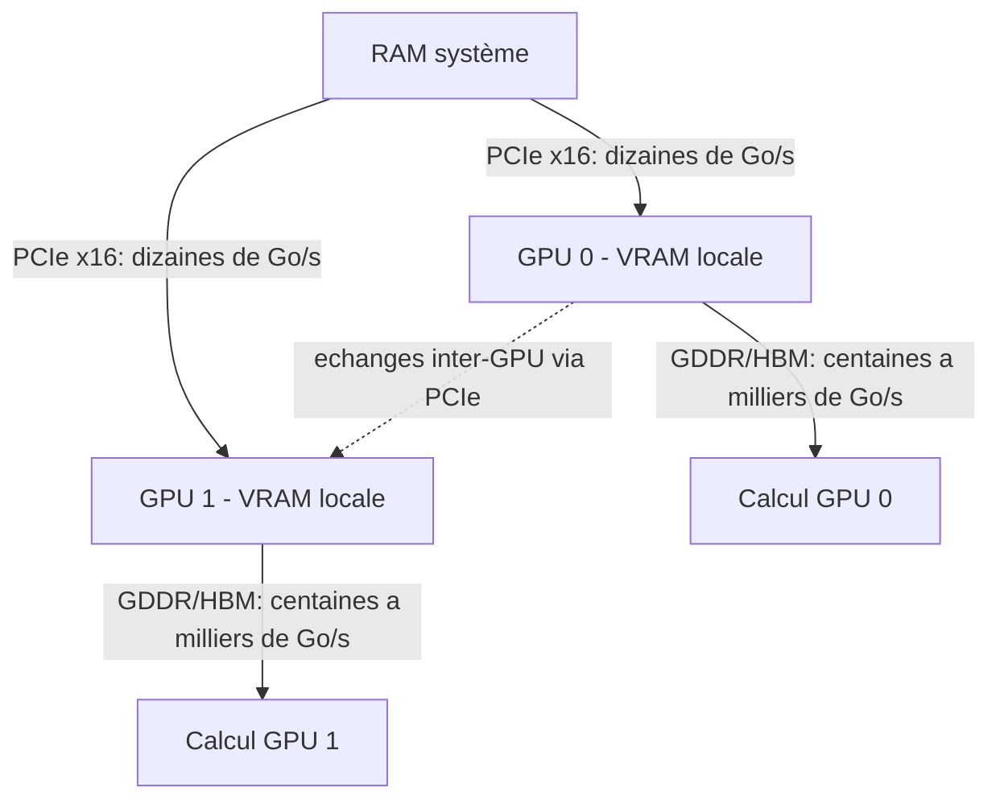
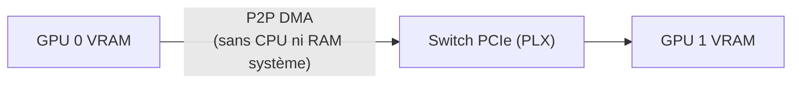

> [!tip] En bref
> Plusieurs GPU multiplient la VRAM disponible, mais c'est l'interconnexion qui décide de l'efficacité. Sans NVLink (réservé aux gammes datacenter), les cartes partagent leurs données via PCIe — utile pour la capacité, pas pour le parallélisme de tenseurs.

Après la [[02-materiel/apu-and-unified-memory|mémoire unifiée]], l'autre grande famille de machines IA on-premise est la **station multi-GPU** : plusieurs cartes NVIDIA dans une même tour, ou plusieurs accélérateurs dans un serveur.

L'idée paraît simple : additionner la [[00-lexique/vram|VRAM]] de plusieurs cartes pour charger des modèles plus gros. En pratique, le **multi-GPU** n'est pas un simple “pool de mémoire”. Il faut choisir un mode de parallélisme, accepter des échanges entre cartes, et comprendre si ces échanges passent par [[00-lexique/pcie|PCIe]], [[00-lexique/nvlink|NVLink]] ou un fabric [[00-lexique/rdma|RDMA]] / [[00-lexique/roce|RoCE]].

> [!note] Lien connexe
> Pour le dimensionnement modèle + cache, voir [[01-fondations/quantization-4bit-8bit|Quantification]] et [[01-fondations/kv-cache-and-context|KV Cache]].

---

## 🎯 Pourquoi du multi-GPU ?

Une station multi-GPU répond à trois besoins différents :

1. **Capacité mémoire :** charger un modèle qui ne tient pas sur une seule carte.
2. **Débit :** servir plus de requêtes en parallèle, souvent en répliquant le modèle.
3. **Latence :** accélérer un gros modèle en répartissant ses calculs sur plusieurs GPU.

Ces trois objectifs ne demandent pas la même architecture. Une machine à deux cartes peut être excellente pour servir deux utilisateurs indépendants, mais décevante pour accélérer un seul modèle si les cartes ne communiquent que par PCIe.

---

## 🧱 Le paysage matériel : workstation vs serveur

### 1. GPU workstation PCIe

Les cartes professionnelles de workstation maximisent la flexibilité : elles entrent dans des stations x86 classiques, utilisent CUDA, et restent compatibles avec les moteurs d'inférence courants.

| Carte | Mémoire | Bande passante mémoire | Interface | Puissance |
| :--- | :--- | :--- | :--- | :--- |
| NVIDIA RTX 6000 Ada | 48 Go GDDR6 ECC | 960 Go/s (datasheet) | PCIe 4.0 x16 | 300 W |
| NVIDIA RTX PRO 6000 Blackwell Workstation | 96 Go GDDR7 ECC | 1 792 Go/s | PCIe 5.0 | 600 W |

La RTX 6000 Ada reste une base workstation solide avec 48 Go de GDDR6 ECC et PCIe Gen 4 x16 [^1]. La RTX PRO 6000 Blackwell double la capacité à 96 Go, passe à la GDDR7 ECC, annonce 1 792 Go/s de bande passante mémoire et le support PCIe Gen 5 [^2].

Ce sont des cartes très intéressantes pour l'on-premise car elles offrent de la **VRAM locale rapide** et un écosystème logiciel mature. Mais dans une station multi-GPU standard, les échanges entre cartes dépendent exclusivement du bus PCIe.

> [!warning] Piège fréquent — NVLink sur workstation
> Les cartes RTX workstation (RTX 6000 Ada, RTX PRO 6000 Blackwell) et grand public (RTX 40xx, RTX 50xx) **ne disposent plus de connecteur NVLink physique** depuis la génération Ada Lovelace. NVIDIA a supprimé les ponts NVLink externes de toutes ses gammes desktop et workstation.
> Il est donc **impossible d'acheter deux RTX PRO 6000 et de les relier via NVLink** : le connecteur n'existe tout simplement pas sur ces cartes [^1][^2].
> NVLink est aujourd'hui **exclusivement réservé aux GPU serveur** en format SXM (A100, H100, H200, B200) et aux systèmes HGX/DGX — une catégorie de machines entièrement différente, qui commence à plus de 100 000 €.

### 2. Serveurs d'inférence SaaS (L40S, A100)

Entre les stations workstation PCIe et les nœuds HGX datacenter, il existe une catégorie souvent ignorée mais centrale pour les déploiements souverains à l'échelle d'une équipe ou d'un SaaS : le **serveur d'inférence rack**, optimisé pour servir 10 à 200 utilisateurs simultanés à un coût par token maîtrisé.

| GPU | VRAM | Bande passante | FP8 natif | Positionnement |
| :-- | :-- | :-- | :-- | :-- |
| **NVIDIA L40S** | 48 Go GDDR6 | 864 Go/s | ✅ Oui (Ada Lovelace) | Inférence SaaS — meilleur coût/token en production |
| **NVIDIA A100 (80 Go)** | 80 Go HBM2e | 2 000 Go/s | ❌ Non (FP16 max) | Legacy solide, disponible chez hébergeurs souverains FR |
| **NVIDIA A100 (40 Go)** | 40 Go HBM2e | 1 555 Go/s | ❌ Non | Compromis capacité/coût pour modèles 13–34B |
| RTX 6000 Ada / RTX 4090 | 48 / 24 Go | 960 / 1 008 Go/s | ⚠️ Partiel | On-prem client air-gapped (matériel fourni par le client) |

#### Le NVIDIA L40S — le "joyau caché" de l'inférence 2026

Le L40S (architecture Ada Lovelace) est souvent sous-estimé car il n'a pas la bande passante HBM d'un H100. Il compense par deux avantages décisifs pour l'inférence de production[^7] :

1.  **Tensor Cores 4ᵉ génération avec FP8 natif :** la quantification FP8 du modèle et du [[00-lexique/kv-cache|KV Cache]] est native, sans contournement logiciel. Sur les architectures Hopper (H100), vLLM doit passer par des émulations FP8 logicielles ; sur Ada, c'est du silicium[^8].
2.  **Meilleur coût/token en inférence :** les benchmarks MLPerf Inference Datacenter 2024 placent le L40S comme le GPU offrant le plus faible coût par token généré pour les modèles de la classe 70B en production — devant l'A100 et à égalité approximative avec l'H100 sur ce ratio spécifique[^8].

Un serveur bare-metal équipé de deux L40S (96 Go de VRAM totale) constitue la topologie de référence pour héberger un modèle 70B en quantification FP8 et servir 20 à 80 utilisateurs simultanés avec un [[00-lexique/ttft|TTFT]] < 2 s.

#### L'A100 — le cheval de trait historique

L'A100 reste le GPU datacenter le plus disponible chez les hébergeurs souverains français (OVHcloud, Scaleway, Outscale). Son immense bande passante HBM2e compense l'absence de FP8 natif pour les modèles en FP16 ou BF16. Il reste pertinent pour :
- Les modèles non encore disponibles en FP8 optimisé.
- Les déploiements chez des hébergeurs certifiés HDS/SecNumCloud où le L40S n'est pas encore proposé.

#### RTX workstation pour l'on-prem client (Tier Air-Gapped)

Lorsqu'un client déploie la stack sur **son propre matériel** (Tier 3 / air-gapped), il n'est pas nécessaire d'imposer des GPU datacenter à 15 000 €. Une station équipée d'une ou deux RTX 6000 Ada (48 Go PCIe) suffit pour servir les requêtes internes d'une équipe de 10 à 30 personnes, à condition que le moteur d'inférence (vLLM ou SGLang) soit correctement configuré.

> [!warning] RTX workstation ≠ garantie SLA
> Sans NVLink ni HBM, les RTX workstation ne peuvent pas rivaliser avec le débit d'un L40S sous charge concurrente. Elles conviennent à un usage on-site modéré, pas à un SaaS multi-tenant avec SLA strict.

---

### 3. Serveurs NVLink / NVSwitch

Les serveurs datacenter NVIDIA changent de catégorie : dans un système HGX/DGX, les GPU peuvent communiquer via **NVLink** et **NVSwitch** plutôt que seulement via PCIe.

NVIDIA décrit les systèmes HGX H100/H200 à huit GPU comme des machines où chaque GPU Hopper peut communiquer à **900 Go/s** avec les autres via NVLink/NVSwitch, avec un fabric non bloquant dans le nœud [^3]. Pour Blackwell, NVIDIA indique que la cinquième génération de NVLink double la vitesse par GPU à **1 800 Go/s** dans les systèmes adaptés [^3].

Ce niveau d'interconnexion n'est pas un détail : il rend le **tensor parallelism** beaucoup plus viable, car les GPU doivent échanger des activations et résultats intermédiaires à chaque génération.

---

## 🛣️ PCIe : le goulot discret

PCIe est le bus généraliste qui relie CPU, GPU, SSD et cartes réseau. PCI-SIG indique que PCIe 5.0 monte à **32 GT/s par lane**, soit le double de PCIe 4.0 [^4].

Pour une carte GPU en **x16**, cela donne un ordre de grandeur théorique d'environ **64 Go/s par direction** en PCIe 5.0, avant de tenir compte des contraintes réelles de plateforme. C'est élevé pour de l'I/O généraliste, mais très faible comparé à la bande passante interne d'une carte GPU moderne : 960 Go/s sur RTX 6000 Ada, 1 792 Go/s sur RTX PRO 6000 Blackwell [^1][^2].

Conséquence : si un moteur d'inférence doit beaucoup synchroniser deux GPU via PCIe, l'accélération attendue peut disparaître. Le multi-GPU PCIe fonctionne mieux quand les communications sont rares, quand les requêtes sont indépendantes, ou quand le moteur sait choisir un parallélisme adapté.

### Les Switches PCIe (Broadcom PLX) — le P2P sans passer par le CPU

Dans une station standard, les échanges GPU↔GPU transitent via le CPU : GPU 0 écrit en RAM système, le CPU relit, et envoie à GPU 1. C'est lent et charge le processeur inutilement.

Les meilleures stations IA (et certains serveurs de workstation denses) utilisent des **puces Switch PCIe** — principalement les séries **Broadcom PLX PEX** — intégrées à la carte mère ou à une carte d'expansion. Ces puces permettent un transfert **Peer-to-Peer (P2P DMA)** direct :

**Avantages concrets :**
- La latence de transfert inter-GPU chute significativement
- Le CPU est libéré pour d'autres tâches pendant la synchronisation
- Le débit reste plafonné à ~64 Go/s (PCIe 5.0 x16) — mais avec une latence bien inférieure au trajet CPU

**Identifier une carte mère avec switch PLX :**
Cherchez dans les specs carte mère les mentions "PCIe switch", "PLX", "PEX switch", ou "NVMe bifurcation with PLX". Les cartes mères HEDT (High-End Desktop) et les plateformes serveur entry-level (AMD EPYC, Intel Xeon) incluent souvent ces puces nativement.

> [!note] Limite du P2P PCIe
> Même avec un switch PLX, la bande passante reste ~64 Go/s — soit 15 à 25 fois moins qu'un fabric NVLink/NVSwitch. Le P2P PCIe est suffisant pour du *pipeline parallelism* à faible fréquence d'échanges, pas pour du *tensor parallelism* intensif qui requiert des échanges à chaque couche.

---

## 🧠 Les modes de parallélisme

### Data Parallel : plusieurs copies du modèle

Le **data parallel** réplique le modèle sur plusieurs GPU. Chaque carte sert des requêtes différentes.

* **Avantage :** très efficace pour augmenter le débit multi-utilisateur si le modèle tient sur une carte.
* **Limite :** la VRAM ne s'additionne pas pour un seul modèle, car chaque GPU garde sa propre copie.

TensorRT-LLM décrit ce mode comme adapté aux grands lots et scénarios de débit élevé [^5].

### Tensor Parallel : un modèle coupé dans chaque couche

Le **tensor parallelism** découpe les poids d'une même couche sur plusieurs GPU. C'est le mode intuitif quand un modèle est trop gros pour une seule carte.

vLLM recommande ce mode quand le modèle ne tient pas sur un GPU mais tient dans un nœud multi-GPU ; on configure par exemple `--tensor-parallel-size 4` pour quatre GPU [^6]. TensorRT-LLM décrit aussi le TP comme un sharding des poids à travers les GPU [^5].

* **Avantage :** peut réduire la pression VRAM par GPU et exploiter plusieurs bandes passantes mémoire.
* **Limite :** demande des communications fréquentes ; NVLink/NVSwitch aide beaucoup, PCIe peut devenir limitant.

### Pipeline Parallel : le modèle coupé par blocs de couches

Le **pipeline parallelism** distribue des groupes de couches sur plusieurs GPU. Les activations passent d'une carte à l'autre.

vLLM recommande de combiner tensor parallel et pipeline parallel quand le modèle dépasse un seul nœud, avec `tensor_parallel_size` pour les GPU par nœud et `pipeline_parallel_size` pour le nombre de nœuds [^6]. TensorRT-LLM liste aussi ce mode comme stratégie centrale [^5].

* **Avantage :** plus tolérant aux interconnexions lentes que le TP pur dans certains cas.
* **Limite :** peut créer des “bulles” où certains GPU attendent, surtout avec de petits lots.

---

## ⚖️ Choisir entre APU, mono-GPU, multi-GPU PCIe et serveur NVLink

| Besoin | Architecture souvent rationnelle | Pourquoi |
| :--- | :--- | :--- |
| LLM 70B quantifié, faible bruit, grande RAM | APU / mémoire unifiée | Simple, grande capacité, pas de copie RAM→VRAM |
| Modèle qui tient en 48–96 Go VRAM | Mono-GPU workstation | Simple, rapide, peu de synchronisation |
| Plusieurs utilisateurs / plusieurs modèles | Multi-GPU en réplication | Chaque GPU sert une charge indépendante |
| SaaS souverain, 10–200 users, coût/token optimisé | Serveur L40S ou A100 | FP8 natif, meilleur TCO inférence, disponible chez hébergeurs FR |
| Modèle trop gros pour une carte, même nœud | Multi-GPU avec TP/PP | Possible si le moteur supporte le sharding |
| Très gros modèles, faible latence, production | Serveur NVLink/NVSwitch | Fabric inter-GPU adapté aux communications fréquentes |

Le piège classique est d'acheter “2 × 48 Go” en pensant obtenir une carte virtuelle de 96 Go. C'est seulement vrai si le moteur sait répartir le modèle et si l'interconnexion ne détruit pas le gain.

---

## 📋 Le Conseil de l'Architecte

Pour un déploiement souverain on-premise :

1. **Commencer par le besoin de service, pas par le nombre de GPU.** Un seul utilisateur sur un gros modèle dense n'a pas les mêmes contraintes qu'un serveur multi-utilisateur.
2. **Privilégier le mono-GPU quand le modèle tient.** Une RTX PRO 6000 Blackwell 96 Go peut être plus simple qu'une station 2 × 48 Go pour un modèle qui tient dans 96 Go [^2].
3. **Utiliser le multi-GPU PCIe pour le débit.** Plusieurs cartes peuvent servir plusieurs répliques ou plusieurs modèles avec peu de communication entre elles.
4. **Pour un SaaS souverain ou un service multi-utilisateurs, évaluer le L40S ou l'A100.** Un serveur bare-metal 2× L40S offre le meilleur TCO inférence pour un modèle 70B en production. L'A100 reste le choix par défaut chez les hébergeurs souverains français déjà certifiés HDS.
5. **Réserver le tensor parallel exigeant aux interconnexions rapides.** vLLM et TensorRT-LLM supportent le TP, mais les docs insistent sur l'importance du réseau/interconnect pour éviter que les communications dominent [^5][^6].
6. **Ne pas confondre station et datacenter.** NVLink/NVSwitch change radicalement le profil, mais il appartient surtout aux plateformes serveur NVIDIA compatibles [^3].

---

## 🔭 Accélérateurs non-NVIDIA : état en 2026

Au-delà de NVIDIA, plusieurs constructeurs positionnent des alternatives pour l'inférence et l'entraînement on-premise. L'état du marché en 2026 reste celui d'un écosystème en formation — intéressant à surveiller, pas encore recommandé pour des déploiements B2B stricts.

### Tenstorrent (Wormhole / Blackhole)

Tenstorrent (fondé par Jim Keller) commercialise les accélérateurs **Wormhole** (N150, N300) et annonce la génération **Blackhole**. L'architecture est software-first, basée sur des cœurs **RISC-V** avec une SRAM locale massive et de la **GDDR6** externe, et une interconnexion **Ethernet** intégrée entre puces [^9].

**Avantages revendiqués :** coût d'achat nettement inférieur à des GPU NVIDIA équivalents en TFLOPS, pile logicielle open-source **TT-Forge** (TT-Metal + compilateur MLIR), interconnexion Ethernet native pour le scale-out sans switch propriétaire.

**Limites réelles en 2026 :**

- **vLLM standard incompatible** : il faut utiliser le fork `tenstorrent/vllm` avec un environnement `tt-metal` compilé manuellement — procédure non triviale, non maintenue par l'équipe vLLM principale. Source communautaire [^9] — voir aussi la note dans [[03-stack-logicielle/inference-engines-vllm-ollama|Moteurs d'Inférence]].
- **Compatibilité modèles partielle** : le compilateur TT-Forge ne supporte pas encore tous les opérateurs des architectures récentes — une compatibilité « 90 % des modèles » est insuffisante pour des déploiements B2B qui doivent garantir le comportement de chaque modèle.
- **Écosystème logiciel jeune** : pas encore de support officiel HuggingFace, LangChain, ni des outils de monitoring courants (Prometheus metrics, OpenTelemetry).

> [!note] Conseil pour 2026–2027
> Tenstorrent est à **surveiller pour 2026–2027**, notamment si TT-Forge atteint une compatibilité vLLM standard et si l'écosystème logiciel mature. À ce stade, **non recommandé pour une PME sans équipe DevOps IA dédiée** : le gain de coût matériel est réel, mais le surcoût d'intégration et de maintenance efface souvent l'économie initiale.

---

## 📚 Sources et Références

[^1]: NVIDIA, *RTX 6000 Ada Generation Graphics Card* (48 Go GDDR6 ECC, PCIe Gen 4 x16, 300 W). [https://www.nvidia.com/en-us/products/workstations/rtx-6000/](https://www.nvidia.com/en-us/products/workstations/rtx-6000/)
[^2]: NVIDIA, *RTX PRO 6000 Blackwell Workstation Edition* (96 Go GDDR7 ECC, 1 792 Go/s, PCIe Gen 5, 600 W). [https://www.nvidia.com/en-us/products/workstations/professional-desktop-gpus/rtx-pro-6000/](https://www.nvidia.com/en-us/products/workstations/professional-desktop-gpus/rtx-pro-6000/)
[^3]: NVIDIA Technical Blog, *NVIDIA NVLink and NVIDIA NVSwitch Supercharge Large Language Model Inference* (NVLink/NVSwitch, 900 Go/s Hopper, 1 800 Go/s Blackwell). [https://developer.nvidia.com/blog/nvidia-nvlink-and-nvidia-nvswitch-supercharge-large-language-model-inference/](https://developer.nvidia.com/blog/nvidia-nvlink-and-nvidia-nvswitch-supercharge-large-language-model-inference/)
[^4]: PCI-SIG, *PCI Express 5.0 FAQ* (32 GT/s par lane, double PCIe 4.0). [https://pcisig.com/faq?field_category_value%5B%5D=pci_express_5.0](https://pcisig.com/faq?field_category_value%5B%5D=pci_express_5.0)
[^5]: NVIDIA TensorRT-LLM, *Parallelism in TensorRT LLM* (TP, PP, DP, EP, CP). [https://nvidia.github.io/TensorRT-LLM/features/parallel-strategy.html](https://nvidia.github.io/TensorRT-LLM/features/parallel-strategy.html)
[^6]: vLLM, *Parallelism and Scaling* (tensor parallel, pipeline parallel, Ray, multiprocessing, GPUDirect RDMA). [https://docs.vllm.ai/en/stable/serving/parallelism_scaling/](https://docs.vllm.ai/en/stable/serving/parallelism_scaling/)
[^7]: NVIDIA, *L40S Product Page* (Ada Lovelace, FP8 Tensor Cores, 48 Go GDDR6 ECC). [https://www.nvidia.com/en-us/data-center/l40s/](https://www.nvidia.com/en-us/data-center/l40s/)
[^8]: MLCommons, *MLPerf Inference Datacenter v4.1 Results* (benchmark inférence datacenter, coût/token). [https://mlcommons.org/benchmarks/inference-datacenter/](https://mlcommons.org/benchmarks/inference-datacenter/)
[^9]: Source communautaire, *Tenstorrent N150 benchmark vs RTX 4090 — LLM inference* (architecture Wormhole, TT-Metal, fork tenstorrent/vllm, compatibilité partielle), 2025. Non publié officiellement par Tenstorrent Inc.

