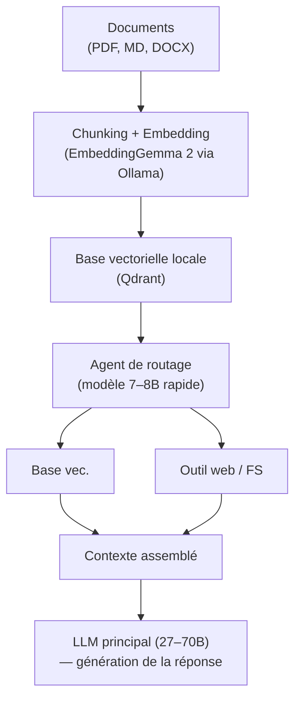

> [!tip] En bref
> Un LLM seul ignore vos documents. Le RAG lui donne accès à votre base documentaire sans réentraînement. Les agents ajoutent la capacité d'agir et de raisonner en boucle. Ensemble, ils forment l'ossature d'un assistant d'entreprise souverain.

Un [[00-lexique/llm|LLM]] "nu" qui sort d'usine est figé dans le temps. Ses poids internes contiennent une vaste culture générale, mais il ignore tout de vos documents d'entreprise, de vos réunions de la veille ou de l'état de votre base de données. Pire : si vous tentez de lui apprendre ces informations via un réentraînement (Fine-Tuning), cela vous coûtera très cher pour un résultat souvent décevant sur la restitution de faits précis.

Pour transformer ce moteur statistique aveugle en un assistant d'entreprise souverain, la solution logicielle standard est le **RAG** (Retrieval-Augmented Generation)[^1]. Et depuis 2025, ce concept a évolué vers des **Workflows Agentiques** autonomes.

---

## 1. Le RAG Standard : La recherche vectorielle

L'approche RAG classique (très populaire entre 2023 et 2024) est une chaîne linéaire :
1.  **Ingestion :** Vos documents (PDF, Word, Code) sont découpés en petits blocs (les *chunks*). Un modèle spécialisé convertit ces blocs en listes de nombres (Embeddings) et les stocke dans une **[[00-lexique/vectordb|Base de Données Vectorielle]]** (comme Qdrant, Milvus ou Chroma).
2.  **Recherche :** Quand l'utilisateur pose une question, le système cherche les blocs les plus mathématiquement proches de la question.
3.  **Génération :** Le système colle ces blocs dans le prompt de l'utilisateur de manière invisible, puis envoie le tout au LLM pour générer la réponse.

### ⚠️ La limite physique (Le mur du KV Cache)
Le RAG standard a un défaut d'architecture en local : il est aveugle. Pour être sûr de ne rien rater, le développeur configure souvent la base pour renvoyer les 20 meilleurs résultats. Le prompt final gonfle démesurément, saturant la [[00-lexique/context-window|Fenêtre de contexte]] du modèle.
Comme nous l'avons vu au chapitre matériel, un contexte géant fait exploser la taille du **[[01-fondations/kv-cache-and-context|KV Cache]]**, détruisant la VRAM de votre serveur et effondrant vos performances en [[00-lexique/inference|inférence]][^2].

---

## 2. L'évolution récente : Agentic RAG et GraphRAG

Pour éviter de saturer la mémoire avec des informations inutiles, le marché a basculé vers le **RAG Agentique** (*Agentic RAG*)[^5][^3]. Au lieu d'être un tuyau passif, le LLM devient le pilote.

### Le framework de l'Agent
Grâce à des bibliothèques comme [[00-lexique/smolagents|SmolAgents]] (Hugging Face) ou [[00-lexique/langgraph|LangGraph]], le développeur donne au LLM des **Outils** ([[00-lexique/appel-outils|Tool Calling / Function Calling]]).
Le déroulé devient dynamique :
1. L'utilisateur pose une question complexe.
2. L'Agent réfléchit : *"Ai-je besoin de chercher dans la base RH ou dans le code source ?"*
3. L'Agent appelle l'outil de recherche, lit un résumé, et décide **lui-même** si l'information est suffisante ou s'il doit faire une nouvelle recherche affine, avant de rédiger sa réponse finale[^4].

Les outils sont de plus en plus exposés via le **Model Context Protocol** (MCP). La révision du 28 juillet 2026 rend le protocole **sans état** (plus de `Mcp-Session-Id` ni de handshake `initialize` ; version et capacités voyagent dans `_meta` à chaque requête), impose `server/discover`, remplace les requêtes initiées par le serveur par des *Multi Round-Trip Requests*, et **déprécie Roots, Sampling, Logging et l'enregistrement dynamique OAuth** (fenêtre de retrait d'au moins douze mois). Un serveur MCP on-prem écrit en 2025 continue de fonctionner, mais ne construisez plus sur ces primitives[^13].

### Le GraphRAG
Popularisé par les recherches de Microsoft, le **[[00-lexique/graphrag|GraphRAG]]** remplace la base vectorielle "bête" par un **Knowledge Graph** (Graphe de connaissances)[^5]. Le système extrait les entités (Personnes, Lieux, Concepts) et leurs relations. Cela permet au LLM de répondre à des questions globales (ex: *"Quels sont les thèmes principaux abordés par l'équipe produit ce mois-ci ?"*) qui faisaient systématiquement échouer le RAG vectoriel classique.

---

## 3. L'approche [[00-lexique/memory-tree|Memory Tree]]

Plutôt que d'utiliser une lourde base vectorielle, une architecture alternative s'appuie sur des **dossiers Markdown hiérarchiques** et une base de métadonnées locale (SQLite). L'idée est de donner à l'agent une vue *résumée* de la connaissance disponible, et de ne charger le détail que si nécessaire. Ce pattern, que ce vault appelle [[00-lexique/memory-tree|Memory Tree]], a été popularisé par les premières versions d'OpenHuman ; au 2026-10-09, le projet a retiré son arbre de mémoire local au profit d'un moteur CortexDB (hébergé ou auto-hébergé)[^6], et il faut donc l'implémenter soi-même ou avec un autre outil.

*   **Hiérarchie :** L'agent ne charge jamais un document entier en mémoire. Il utilise le LLM pour lire le "titre" et un "résumé d'une ligne" de l'arbre des fichiers.
*   **Injection sélective :** S'il juge un fichier pertinent, l'agent appelle une fonction pour "déplier" ce nœud spécifique de l'arbre et lire son contenu exact.
*   **Avantage architectural :** Le contexte reste minuscule (quelques centaines de tokens pour les résumés), ce qui maintient le [[00-lexique/ttft|TTFT]] (Temps avant le premier mot) sous la seconde et préserve les ressources matérielles, même avec un modèle dense lourd.

> [!tip] Pour aller plus loin
> Ce pattern n'est plus implémenté tel quel par OpenHuman (mémoire déportée dans CortexDB depuis 2026 — voir la fiche [[05-agents-et-assistants-on-prem/assistants-personnels/solutions/openhuman|OpenHuman]]). Voir le comparatif [[05-agents-et-assistants-on-prem/assistants-personnels/index|Assistants Personnels On-Premise]] pour les alternatives et leur degré de souveraineté.

---

## 4. Choisir sa base de données vectorielle

Le choix de la base vectorielle dépend du volume de données, du niveau de souveraineté requis et des ressources disponibles.

| Solution | Type | Points forts | Limites | Idéal pour |
| :-- | :-- | :-- | :-- | :-- |
| **Chroma** | In-process (Python) | Zéro configuration, embarqué | Pas adapté à > 1 M chunks | Prototypage, labo dev |
| **Qdrant** | Serveur Docker | Filtrage payload riche, REST/gRPC, scalable | Infra à gérer | PME, production moderée |
| **Milvus** | Serveur distribué | Milliards de vecteurs, haute disponibilité | Complexe à opérer | Datacenter, gros volumes |
| **pgvector** | Extension PostgreSQL | Vecteurs dans la base existante | Performances < bases natives | SI existant sous Postgres |
| **SQLite + sqlite-vec** | Fichier local | Zéro dépendance, souveraineté max | Pas de scalabilité H | Solo, Memory Tree patterns |

État au T4 2026 : Qdrant 1.19 (août 2026) stocke les vecteurs directement en 4-bit (TurboQuant) avec des paliers mémoire `cold` / `cached` / `pinned` par composant ; passez en **1.19.2** (5 octobre 2026), qui corrige des recherches filtrées renvoyant zéro résultat et des écritures déchirées pouvant corrompre le stockage, et avertit au démarrage si aucune clé API n'est configurée ; Milvus 3.0 (GA le 29 juillet 2026) interroge Parquet, Lance et Iceberg en place ; **pgvector 0.8.3 à 0.8.7 corrigent une corruption d'index HNSW au vacuum et des débordements de tampon IVFFlat — mettez à jour toute instance ≤ 0.8.2**[^14]. `sqlite-vss` n'est plus développé ; son auteur renvoie vers `sqlite-vec`[^12].

> [!tip] Démarrage rapide avec Qdrant en local
> ```bash
> # Lancer Qdrant en Docker (données persistantes dans ./qdrant_storage)
> docker run -p 6333:6333 -p 6334:6334 \
>   -v ./qdrant_storage:/qdrant/storage \
>   qdrant/qdrant
>
> # Créer une collection via l'API REST
> curl -X PUT http://localhost:6333/collections/ma-base \
>   -H 'Content-Type: application/json' \
>   -d '{"vectors": {"size": 1024, "distance": "Cosine"}}'
> ```

## 5. RAG multi-locataire : cloisonnement des embeddings

Dans les déploiements **[[00-lexique/multi-tenant|multi-tenant]]** — un serveur d'inférence mutualisé pour plusieurs organisations ou équipes — le RAG introduit un risque de sécurité critique : la fuite de documents d'un locataire vers les résultats de recherche d'un autre.

L'OWASP a formellement classifié ce risque dans son Top 10 LLM sous **LLM08:2025 Vector and Embedding Weaknesses** ; l'édition 2026 (publiée le 3 août 2026) conserve le risque sous l'identifiant **LLM09:2026**[^7]. Une implémentation naïve de base vectorielle sans isolation par tenant peut permettre à une requête du "Client B" de remonter des embeddings appartenant au "Client A".

### Pattern 1 — Row-Level Security avec pgvector

Si votre infrastructure repose déjà sur **PostgreSQL**, l'extension `pgvector` permet de stocker les embeddings dans la même base. Le cloisonnement s'appuie sur le mécanisme natif de **Row-Level Security (RLS)** du moteur[^8] :

```sql
-- Activer RLS sur la table des embeddings
ALTER TABLE documents ENABLE ROW LEVEL SECURITY;

-- Politique : chaque tenant ne voit que ses propres lignes
CREATE POLICY tenant_isolation ON documents
  USING (tenant_id = current_setting('app.current_tenant')::uuid);

-- À l'exécution : positionner le tenant avant chaque recherche
SET app.current_tenant = '{{tenant_uuid}}';
SELECT content, embedding <=> query_embedding AS distance
FROM documents ORDER BY distance LIMIT 5;
```

**Avantage :** le moteur PostgreSQL applique le filtre tenant au plus bas niveau — une requête mal formée au niveau applicatif ne peut pas contourner la politique. Le cloisonnement est **mathématiquement garanti par la base**, pas par la logique applicatif.

**Limite :** les performances de `pgvector` restent inférieures à celles d'une base vectorielle native pour des volumes supérieurs à ~1 M embeddings.

### Pattern 2 — Payload-based partitioning avec Qdrant

Qdrant recommande nativement une architecture de collection unique exploitant le **Payload-based Partitioning**[^9]. Chaque embedding est indexé avec un payload `tenant_id` (index payload déclaré `is_tenant=True` pour que les données d'un même tenant soient stockées de façon contiguë), et la recherche (`query_points`, qui remplace l'ancien `client.search`) est scopée à un tenant par filtre :

```python
from qdrant_client import QdrantClient
from qdrant_client.models import Filter, FieldCondition, MatchValue

client = QdrantClient(url="http://localhost:6333")

# Index payload tenant_id créé au préalable avec is_tenant=True (Qdrant ≥ 1.11)
# Recherche scopée : seuls les vecteurs du tenant courant sont comparés
results = client.query_points(
    collection_name="documents",
    query=query_embedding,
    query_filter=Filter(
        must=[FieldCondition(
            key="tenant_id",
            match=MatchValue(value=current_tenant_id)
        )]
    ),
    limit=5
)
```

**Avantage :** une seule collection, pas de multiplications de collections par tenant (ce qui ferait s'effondrer le cluster à grande échelle). Le filtre payload est appliqué avant le calcul de similarité vectorielle.

> [!warning] Isolation applicative ≠ isolation mathématique
> Ne jamais se reposer uniquement sur un filtre applicatif Python/Node pour le cloisonnement multi-tenant. Si le filtre est omis par erreur (bug, refactoring), les données d'un tenant fuient. Le RLS PostgreSQL et le payload Qdrant garantissent l'isolation au niveau moteur, indépendamment du code applicatif.

---

## 6. FinOps : routage CPU/GPU et pré-filtrage RAG

L'inférence GPU coûte cher. Une architecture bien conçue réserve le GPU à la seule tâche où il est irremplaçable — la **génération de texte** — et délègue les tâches auxiliaires au CPU.

### Routage CPU/GPU

| Tâche | Moteur recommandé | Matériel |
| :-- | :-- | :-- |
| Génération de texte (LLM) | vLLM, SGLang | GPU (VRAM exclusive) |
| Génération d'embeddings | `embeddinggemma-2` (270M–740M) via Ollama ; `nemotron-3-embed` 1B/8B si GPU disponible[^11] | **CPU** (EmbeddingGemma 2) / GPU (Nemotron 8B) |
| Transcription vocale (STT) | `faster-whisper` (CTranslate2)[^10] ; en temps réel : Voxtral Mini 4B Realtime (GPU ≥ 16 Go)[^18] | **CPU** (Voxtral : GPU) |
| Re-ranking, scoring | CrossEncoder léger | **CPU** |

`faster-whisper` (implémentation Whisper de SYSTRAN sur le moteur CTranslate2) peut transcrire en temps réel des audio courts directement sur CPU, sans utiliser un seul octet de VRAM[^10]. Les modèles d'embedding comme EmbeddingGemma 2 (270M–740M) sont suffisamment petits pour s'exécuter efficacement en batch asynchrone sur CPU.

**Bénéfice :** 100 % de la VRAM du GPU reste disponible pour la génération. Sur un serveur 2× L40S (96 Go), ce routage libère la VRAM que Whisper et le modèle d'embedding auraient occupée (plusieurs Go), ce qui se traduit directement en KV Cache disponible, donc en utilisateurs simultanés — le gain réel dépend de votre charge et se mesure (voir [[06-mise-en-oeuvre/evaluate-local-model|Évaluer un modèle local]]).

### Pré-filtrage RAG : le levier FinOps le plus puissant

L'erreur classique est d'envoyer au LLM l'intégralité des documents récupérés par la base vectorielle. Les API cloud facturent au token ; les modèles locaux saturent leur fenêtre de contexte.

Le principe : **c'est le microservice Python qui exécute la recherche sémantique, pas le LLM.** Le LLM ne reçoit que les K meilleurs résultats, tronqués à quelques centaines de tokens chacun :

```python
# Le Python sélectionne le Top-K avant d'appeler le LLM
top_chunks = vector_db.search(query_embedding, limit=3)

# Le LLM ne reçoit que le contexte pertinent — jamais la base entière
context = "\n\n".join([chunk.text for chunk in top_chunks])
response = llm.generate(prompt=f"Contexte :\n{context}\n\nQuestion : {user_query}")
```

Sur un cas d'usage de type "copilot documentaire", passer de 20 résultats (pratique courante) à 3 résultats filtrés réduit les tokens envoyés au LLM d'un facteur 5 à 10, sans dégradation perceptible de la qualité si la recherche sémantique est bien calibrée.

> [!tip] Voir aussi
> Pour la stratégie FinOps côté matériel (L40S vs A100, TCO par token), voir [[04-blueprints/tco-comparison|💰 Comparaison TCO]] et [[02-materiel/stations-multi-gpu|🧩 Stations Multi-GPU]].

---

## 7. Architecture de référence — Stack RAG souveraine


```mermaid
flowchart TD
    A["Documents\n(PDF, MD, DOCX)"] --> B["Chunking + Embedding\n(EmbeddingGemma 2 via Ollama)"]
    B --> C["Base vectorielle locale\n(Qdrant)"]
    C --> D["Agent de routage\n(modèle 7–8B rapide)"]
    D --> E["Base vec."]
    D --> F["Outil web / FS"]
    E --> G["Contexte assemblé"]
    F --> G
    G --> H["LLM principal (27–70B)\n— génération de la réponse"]
```

**Modèles d'embedding locaux recommandés :**

```bash
# Via Ollama (EmbeddingGemma 2, Google, octobre 2026, Apache 2.0 — contexte 8k, dimensions 768 tronquables à 512/256/128)
ollama pull embeddinggemma-2:270m   # texte seul, ~378 Mo
ollama pull embeddinggemma-2        # 740M multimodal (texte + image), ~1,3 Go
# nomic-embed-text et mxbai-embed-large restent valables pour les index existants
# (ne jamais mélanger deux modèles d'embedding dans une même collection)

# Test rapide — endpoint /api/embed (champ "input", chaîne ou tableau pour le batch) ;
# l'ancien /api/embeddings (champ "prompt") n'est plus documenté[^17]
curl http://localhost:11434/api/embed \
  -d '{"model": "embeddinggemma-2:270m", "input": "La bande passante mémoire limite l'\''inférence."}'
```

---

## 📋 Le Conseil de l'Architecte

Pour construire une stack logicielle d'entreprise souveraine au T4 2026 :

1.  **Dédiez un petit modèle au routage :** N'utilisez pas votre gros modèle de synthèse (27–70B) pour choisir quel outil appeler. Utilisez un modèle ultra-rapide (ex. Granite 4.2 8B, Apache 2.0, ou Qwen3.8 en mode non-thinking) configuré pour l'[[00-lexique/appel-outils|appel d'outils]][^16]. Il appellera la base de données.
2.  **Gardez les gros modèles pour la synthèse :** Une fois les bons blocs de texte récupérés par le petit agent, envoyez le tout au modèle lourd (le "cerveau") pour rédiger la réponse finale.
3.  **Évitez les dépendances Cloud :** Si vous utilisez LangChain ou LlamaIndex, auditez la télémétrie. En on-premise pur, des frameworks minimalistes comme [[00-lexique/smolagents|SmolAgents]] (Apache 2.0 ; rythme de release ralenti depuis mi-2026 — dernière version 1.26.0 en mai 2026 —, à vérifier avant un nouveau projet[^15]) garantissent que vos prompts ne fuiteront pas vers une API externe pendant l'orchestration[^4].
4.  **Isolez les embeddings par tenant dès le premier jour.** Un RAG [[00-lexique/multi-tenant|multi-tenant]] sans isolation (RLS pgvector ou payload Qdrant) est une faille de sécurité garantie. Ajouter ce cloisonnement après coup sur une base de production est coûteux.
5.  **Routez les tâches auxiliaires sur CPU.** Embeddings et transcription Whisper ne consomment pas de VRAM si on utilise `faster-whisper` et EmbeddingGemma 2 (270M) sur CPU. La VRAM libérée multiplie la capacité d'accueil en inférence concurrente.

---

## 📚 Sources et Références

[^1]: P. Lewis et al., *Retrieval-Augmented Generation for Knowledge-Intensive NLP Tasks* (arXiv:2005.11401 ; définition d'origine du RAG), 2020. [https://arxiv.org/abs/2005.11401](https://arxiv.org/abs/2005.11401)
[^2]: NVIDIA Technical Blog, *Mastering LLM Techniques: Inference Optimization* (Impact du contexte long sur le KV Cache), Novembre 2023. [https://developer.nvidia.com/blog/mastering-llm-techniques-inference-optimization/](https://developer.nvidia.com/blog/mastering-llm-techniques-inference-optimization/)
[^3]: LangChain, *LangGraph* (dépôt et documentation : orchestration de graphes d'agents, RAG auto-correctif ; releases 1.2.x), consulté le 2026-10-10. [https://github.com/langchain-ai/langgraph](https://github.com/langchain-ai/langgraph)
[^4]: Hugging Face, *Agentic RAG with SmolAgents* (RAG orchestration via Hugging Face light framework), 2025. [https://huggingface.co/docs/smolagents/main/examples/rag](https://huggingface.co/docs/smolagents/main/examples/rag)
[^5]: Neo4j Developer Blog, *What is agentic RAG? A developer's guide* (GraphRAG, ReAct, multi-agent RAG patterns), Mai 2026. [https://neo4j.com/blog/agentic-ai/what-is-agentic-rag/](https://neo4j.com/blog/agentic-ai/what-is-agentic-rag/)
[^6]: OpenHuman, *How memory works* (« The current memory has no memory tree … or Obsidian vault » ; moteurs TinyHumans Hosted / CortexDB), docs lues le 2026-10-09. Le *pattern* Memory Tree reste applicable dans une implémentation 100 % on-premise indépendante du projet. [https://tinyhumans.gitbook.io/openhuman/features/memory](https://tinyhumans.gitbook.io/openhuman/features/memory)
[^7]: OWASP GenAI Security Project, *LLM08:2025 Vector and Embedding Weaknesses*. [https://genai.owasp.org/llm-top-10/](https://genai.owasp.org/llm-top-10/) ; OWASP GenAI Security Project, *OWASP Top 10 for LLM Applications 2026* (LLM09:2026 Vector and Embedding Weaknesses), 2026-08-03. [https://genai.owasp.org/resource/owasp-genai-llm-top-10-2026/](https://genai.owasp.org/resource/owasp-genai-llm-top-10-2026/)
[^8]: Crunchy Data, *Row-Level Security for tenants in Postgres / pgvector*. [https://www.crunchydata.com/blog/row-level-security-for-tenants-in-postgres](https://www.crunchydata.com/blog/row-level-security-for-tenants-in-postgres)
[^9]: Qdrant, *Multitenancy* (payload partitioning, index payload `is_tenant`, tiered multitenancy v1.16+). [https://qdrant.tech/documentation/manage-data/multitenancy/](https://qdrant.tech/documentation/manage-data/multitenancy/)
[^10]: SYSTRAN, *faster-whisper — High-throughput Whisper inference on CPU and GPU (CTranslate2)*. [https://github.com/SYSTRAN/faster-whisper](https://github.com/SYSTRAN/faster-whisper)
[^11]: Google, *EmbeddingGemma 2* (740M dont 270M texte, 768 dimensions MRL → 128, contexte 8k, texte + image + audio + vidéo + code, Apache 2.0), 2026-10-06. [https://blog.google/innovation-and-ai/technology/developers-tools/embeddinggemma-2/](https://blog.google/innovation-and-ai/technology/developers-tools/embeddinggemma-2/) ; Ollama, *embeddinggemma-2* (tags `270m` 378 Mo, `latest` 1,3 Go), consulté le 2026-10-10. [https://ollama.com/library/embeddinggemma-2](https://ollama.com/library/embeddinggemma-2) ; NVIDIA, *Nemotron-3-Embed-8B-BF16* (4096 dimensions, 32k tokens, RTEB 78,46 NDCG@10, OpenMDW 1.1 ; variantes 1B BF16 / 1B NVFP4), 2026-07-16. [https://huggingface.co/nvidia/Nemotron-3-Embed-8B-BF16](https://huggingface.co/nvidia/Nemotron-3-Embed-8B-BF16)
[^12]: A. Garcia, *sqlite-vss* (README : « sqlite-vss is not in active development », effort reporté sur sqlite-vec), consulté le 2026-10-10. [https://github.com/asg017/sqlite-vss](https://github.com/asg017/sqlite-vss)
[^13]: Model Context Protocol, *Key Changes — 2026-07-28* (suppression de `Mcp-Session-Id` et du handshake `initialize`, `server/discover`, Multi Round-Trip Requests, dépréciation de Roots / Sampling / Logging et du Dynamic Client Registration, fenêtre de dépréciation de douze mois minimum). [https://modelcontextprotocol.io/specification/2026-07-28/changelog](https://modelcontextprotocol.io/specification/2026-07-28/changelog)
[^14]: Qdrant, *Releases* (v1.19.0, 5 août 2026 : TurboQuant 4-bit en stockage primaire, paliers `cold` / `cached` / `pinned` ; v1.19.2 le 5 octobre 2026 : recherches filtrées à zéro résultat #10903, écritures déchirées Gridstore #10837, avertissement sans clé API #10852). [https://github.com/qdrant/qdrant/releases](https://github.com/qdrant/qdrant/releases) · [https://github.com/qdrant/qdrant/releases/tag/v1.19.2](https://github.com/qdrant/qdrant/releases/tag/v1.19.2) ; Milvus, *Releases* (v3.0.0 GA le 2026-07-29, External Collection Parquet / Lance / Iceberg ; v3.0.2 le 2026-09-20). [https://github.com/milvus-io/milvus/releases](https://github.com/milvus-io/milvus/releases) ; pgvector, *CHANGELOG* (0.8.3 du 2026-06-17 : « Fixed possible index corruption with HNSW vacuuming » ; 0.8.6 et 0.8.7 du 2026-10-01 : « Fixed buffer overflow with IVFFlat index build »). [https://github.com/pgvector/pgvector/blob/master/CHANGELOG.md](https://github.com/pgvector/pgvector/blob/master/CHANGELOG.md)
[^15]: Hugging Face, *smolagents — Releases* (dernière version v1.26.0 du 2026-05-29 ; commits de maintenance seulement depuis), consulté le 2026-10-10. [https://github.com/huggingface/smolagents/releases](https://github.com/huggingface/smolagents/releases)
[^16]: IBM, *Granite 4.2 8B* (Apache 2.0, tool calling au format OpenAI, modes thinking / low-effort), 2026-08-25. [https://huggingface.co/ibm-granite/granite-4.2-8b](https://huggingface.co/ibm-granite/granite-4.2-8b) ; Qwen, *Qwen3.8-27B* (mode thinking activable ou non), août 2026. [https://huggingface.co/Qwen/Qwen3.8-27B](https://huggingface.co/Qwen/Qwen3.8-27B)
[^17]: Ollama, *API — Generate embeddings* (`POST /api/embed`, champ `input` chaîne ou tableau, options `truncate` / `dimensions` ; aucun endpoint `/api/embeddings` documenté), consulté le 2026-10-10. [https://docs.ollama.com/api/embed](https://docs.ollama.com/api/embed)
[^18]: Mistral AI, *Voxtral Mini 4B Realtime 2602* (transcription temps réel en streaming, 13 langues, BF16, un GPU ≥ 16 Go ; Apache 2.0), Hugging Face, février 2026. [https://huggingface.co/mistralai/Voxtral-Mini-4B-Realtime-2602](https://huggingface.co/mistralai/Voxtral-Mini-4B-Realtime-2602)
