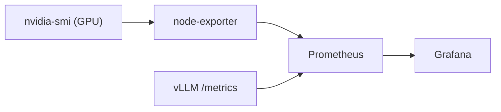

Votre client est un grand compte, un hébergeur cloud souverain ou une institution publique. Le cahier des charges est implacable : il faut héberger un modèle de la classe 70B ou un géant de 400B+, et surtout, pouvoir **servir des dizaines, voire des centaines d'utilisateurs en même temps** avec un temps de réponse instantané.

Le [[04-blueprints/scenario-b-sme-appliance|Scénario B]] (l'Appliance) s'étoufferait sous la charge concurrente, et le [[04-blueprints/scenario-c-desktop-cluster|Scénario C]] (Cluster Exo) a un TTFT beaucoup trop lent. Pour la production massive, il n'y a pas de secret : il faut basculer sur l'architecture standard des Datacenters IA.

---

## 🏗️ L'Architecture Matérielle

Ici, l'unité de base n'est plus la carte graphique, mais le **Nœud Serveur** (Node) et le **Réseau Fabric**.

*   **Le Nœud (Scale-Up) :** Un serveur format rack (ex: architecture NVIDIA HGX) contenant **8 GPU** de classe Datacenter (NVIDIA H200 ou B200). Contrairement à un PC classique, ces 8 puces ne communiquent pas via PCIe, mais via un **[[00-lexique/nvlink|NVLink]]** et un **[[00-lexique/nvswitch|NVSwitch]]**. Ce bus permet aux puces de s'échanger des données à **1 800 Go/s** (sur Blackwell)[^1].
*   **Le Réseau (Scale-Out) :** Pour relier plusieurs nœuds entre eux, on utilise des cartes réseau à très haut débit (400 Gbps ou 800 Gbps) compatibles **[[00-lexique/rdma|RDMA]]**. Le standard est **InfiniBand** ou **[[00-lexique/roce|RoCEv2]]** (RDMA over Converged Ethernet)[^2].
*   **Le Stockage :** Un stockage flash NVMe distribué accessible en *GPUDirect Storage*, pour charger les To de poids du modèle en quelques secondes au démarrage.

**Budget estimé (2026) :** De 300 000 € à plus d'1 million d'euros par nœud, hors coûts d'infrastructure réseau, d'énergie et de refroidissement.

---

## ⚙️ La Stack Logicielle et le Mécanisme

Cette débauche de matériel exige des moteurs d'inférence capables de l'exploiter à la milliseconde près : **[[00-lexique/pagedattention|vLLM]]** ou le SDK officiel **[[00-lexique/tensorrt-llm|TensorRT-LLM]]** derrière un serveur Triton. L'orchestration multi-nœuds est gérée par **[[00-lexique/ray|Ray]]**.

### La Magie du Tensor Parallelism
Sur le Cluster Mac (Scénario C), nous avions vu le *Pipeline Parallelism* (découpage couche par couche), qui augmente la latence. 
Dans un nœud HGX, l'incroyable vitesse du NVLink permet d'utiliser le **[[00-lexique/tensor-parallelism|Tensor Parallelism]]** (TP). Une seule et même opération mathématique (une matrice) est découpée et calculée *en même temps* par les 8 GPU.
*   **Résultat :** Les 8 cartes agissent comme un seul GPU géant. La latence de génération s'effondre, et les [[00-lexique/tokens-per-second|tokens/s]] explosent, même sur un modèle massif.

### Formats Extrêmes (FP4)
Si vous déployez des puces NVIDIA Blackwell (B200), le logiciel utilisera nativement la quantification **FP4** ou **FP8**. Cela permet de faire tenir des modèles gigantesques dans un seul nœud de 8 GPU, évitant ainsi de devoir traverser le réseau RoCE pour chaque calcul[^3].

---

## Le Piège de l'Ingénierie Réseau (Le drame RoCE)

> [!warning] RoCE n'est pas plug-and-play
> Beaucoup d'entreprises achètent les serveurs GPU, puis branchent le tout sur leur réseau Ethernet classique en espérant que le RDMA fonctionne tout seul.
> C'est le plus grand piège de ce blueprint : **RoCE n'est pas plug-and-play**. Il nécessite un réseau dit "Lossless" (sans perte). Si vos switchs réseau ne sont pas rigoureusement configurés avec des protocoles stricts de contrôle de congestion ([[00-lexique/pfc|PFC]], [[00-lexique/ecn|ECN]]), les paquets de données liés à l'IA vont saturer les câbles, provoquant des retransmissions. 
> **Une latence réseau qui passe de 2 microsecondes à 5 millisecondes suffit à diviser par dix la vitesse de votre cluster IA**[^2].

---

## 📋 Le Verdict de l'Architecte

### ✅ Quand utiliser ce Blueprint ?
*   **La production à l'échelle :** C'est la seule architecture viable pour servir de véritables applications SaaS souveraines (comme un ChatGPT d'entreprise interne pour 1 000 salariés).
*   **Le besoin de garanties (SLA) :** Quand le [[00-lexique/ttft|TTFT]] doit toujours rester inférieur à 500 ms, quel que soit le nombre d'utilisateurs connectés.

### ❌ Quand fuir ce Blueprint ?
*   **Si vous n'avez pas d'ingénieur réseau dédié.** L'exploitation d'un fabric RoCE/InfiniBand et d'un cluster Ray demande des compétences d'administration très pointues, souvent issues du monde du Calcul Haute Performance (HPC).
*   **Contraintes de datacenter :** Ces machines sont des radiateurs géants. Une baie classique ne peut souvent pas refroidir un tel nœud sans un aménagement lourd (Direct Liquid Cooling).

---

## 📊 Monitoring recommandé

Le scénario D est le seul blueprint qui justifie un monitoring outillé en production. Les éléments minimaux :

**GPU et VRAM (par nœud) :**

```bash
# Surveillance en temps réel de tous les GPU
watch -n 1 nvidia-smi

# Format CSV pour export Prometheus
nvidia-smi --query-gpu=timestamp,name,utilization.gpu,utilization.memory,\
memory.used,memory.free,temperature.gpu,power.draw \
--format=csv -l 5
```

**vLLM — métriques Prometheus natives :**

vLLM expose un endpoint `/metrics` compatible Prometheus. Métriques clés :

| Métrique vLLM | Description |
| :-- | :-- |
| `vllm:prompt_tokens_total` | Tokens de prompt traités |
| `vllm:generation_tokens_total` | Tokens générés |
| `vllm:request_success_total` | Requêtes terminées |
| `vllm:avg_generation_throughput_toks_per_s` | Débit moyen en génération |
| `vllm:gpu_cache_usage_perc` | Taux d'occupation du KV Cache |
| `vllm:num_requests_running` | Requêtes en cours (continuous batching) |

```bash
# Vérifier l'endpoint métriques
curl http://localhost:8000/metrics | grep vllm
```

**Stack recommandée :**



Les dashboards Grafana pour vLLM sont disponibles sur [grafana.com/grafana/dashboards](https://grafana.com/grafana/dashboards) (chercher "vLLM").

**Réseau (RoCE/InfiniBand) :**

```bash
# Compteurs RDMA (erreurs, retransmissions)
rdma statistic show

# Perte de paquets sur interface RoCE
ethtool -S <interface> | grep -E "rx_discards|tx_discards"
```

> [!warning] Surveiller la congestion RoCE
> Une augmentation des retransmissions RDMA est le premier signal d'une mauvaise configuration PFC/ECN. À surveiller activement — une dégradation réseau non détectée peut diviser par dix le débit du cluster sans erreur visible applicative.

### Storage Wall — temps de boot SSD→VRAM (impact sur le MTTR)

Le "Memory Wall" couvre les performances en régime permanent. Le "Storage Wall" couvre les **redémarrages** : chaque restart vLLM impose de recharger les poids du modèle depuis le SSD vers la VRAM.

| Modèle | Taille BF16 | SSD PCIe 3.0 (3 Go/s) | SSD NVMe PCIe 5.0 (10 Go/s) | GPUDirect Storage |
| :-- | :-- | :-- | :-- | :-- |
| 70B | ~140 Go | **~47 secondes** | ~14 secondes | ~8 secondes |
| 405B | ~810 Go | **~4,5 minutes** | ~81 secondes | ~45 secondes |

Pour un SLA datacenter avec objectif de MTTR (Mean Time To Recovery) sous 2 minutes, un 405B en BF16 sur SSD PCIe 3.0 est **incompatible avec cet objectif**. Solutions :

- **NVMe PCIe 5.0 en RAID 0** : doublement du débit séquentiel (~20 Go/s réels), MTTR < 45 secondes sur un 405B
- **GPUDirect Storage** (NVIDIA Magnum IO) : transfert direct SSD→VRAM sans copie CPU, réduit la charge système et améliore le débit[^4]
- **Modèle quantifié** : un 405B en Q4 (~230 Go) réduit le temps de chargement de ~65% vs BF16

> [!note] Lien avec les SLAs d'entreprise
> Pour les déploiements critiques (IA en production dans des workflows métier), le temps de rechargement doit être documenté dans les accords de niveau de service. Prévoyez un processus de redémarrage planifié (rolling restart avec double instance) pour les mises à jour sans downtime.

---

## 🛡️ Haute Disponibilité et Reprise (DRP)

Le Blueprint D est le seul scénario pour lequel un PRA formel est justifié économiquement. Un downtime de 2 heures sur un nœud HGX en production représente un coût opérationnel et réputationnel significatif.

### Stratégies HA par composant

| Composant | Stratégie HA | Notes |
| :-- | :-- | :-- |
| **vLLM** | Double instance avec load balancer (Nginx / HAProxy) | Rolling restart pour les mises à jour sans downtime |
| **Qdrant cluster** | Mode distribué (3 nœuds minimum) avec réplication | Qdrant supporte nativement le sharding et la réplication |
| **PostgreSQL / SQLite** | Streaming replication (Postgres) ou WAL archiving | SQLite insuffisant en production D — migrer vers Postgres |
| **Stockage modèles** | NVMe RAID 0 + snapshot quotidien vers NAS ou S3 souverain | GPUDirect Storage nécessite un chemin dédié, à exclure du RAID logiciel |
| **Réseau RoCE** | Redondance de switch (dual-spine) + monitoring PFC/ECN actif | Une perte de paquet non contrôlée s'effondre silencieusement |

### Objectifs RTO / RPO

| Incident | RTO cible | RPO cible | Action |
| :-- | :-- | :-- | :-- |
| Crash process vLLM | < 2 min | 0 (sans perte de données) | Redémarrage automatique (systemd / Docker restart policy) |
| Panne GPU unique (8 GPU) | < 5 min | 0 | Tensor Parallelism réduit à 7 GPU le temps du remplacement |
| Panne nœud complet | < 30 min | < 15 min | Bascule sur nœud de secours pré-configuré |
| Corruption base vectorielle | < 1 h | < 1 h | Restauration depuis snapshot Qdrant le plus récent |
| Sinistre salle (incendie, inondation) | < 4 h | < 24 h | Réplication hors-site (datacenter secondaire ou cloud souverain) |

### Sauvegarde quotidienne minimale

```bash
# Snapshot Qdrant (toutes les collections)
curl -X POST http://localhost:6333/snapshots

# Export Postgres (historiques, métadonnées agents)
pg_dump -Fc ia_on_prem_db > /backup/$(date +%F)_pg.dump

# Copie hors-site (exemple rsync vers NAS secondaire)
rsync -az /backup/ nas-secondary:/ia-on-prem-backup/
```

> [!note] Le temps de rechargement des poids conditionne votre RTO
> Voir la section **Storage Wall** ci-dessus : un modèle 405B en BF16 sur SSD PCIe 3.0 prend ~4,5 minutes à recharger. Dimensionner votre RTO en tenant compte de ce délai incompressible.

---

## 📚 Sources et Références

[^1]: NVIDIA Technical Blog, *NVIDIA NVLink and NVIDIA NVSwitch Supercharge Large Language Model Inference* (Architecture HGX, Blackwell NVLink 1.8 TB/s), 2024-2026. [https://developer.nvidia.com/blog/nvidia-nvlink-and-nvidia-nvswitch-supercharge-large-language-model-inference/](https://developer.nvidia.com/blog/nvidia-nvlink-and-nvidia-nvswitch-supercharge-large-language-model-inference/)
[^2]: NVIDIA, *RDMA over Converged Ethernet - RoCE | Cumulus Linux* (Importance critique du PFC/ECN pour éviter l'effondrement des performances LLM), 2026. [https://docs.nvidia.com/networking-ethernet-software/cumulus-linux/Layer-1-and-Switch-Ports/Quality-of-Service/RDMA-over-Converged-Ethernet-RoCE/](https://docs.nvidia.com/networking-ethernet-software/cumulus-linux/Layer-1-and-Switch-Ports/Quality-of-Service/RDMA-over-Converged-Ethernet-RoCE/)
[^3]: NVIDIA Technical Blog, *Optimizing Inference for Long Context and Large Batch Sizes with NVFP4 KV Cache* (Blackwell, TensorRT-LLM natif), Décembre 2025. [https://developer.nvidia.com/blog/optimizing-inference-for-long-context-and-large-batch-sizes-with-nvfp4-kv-cache/](https://developer.nvidia.com/blog/optimizing-inference-for-long-context-and-large-batch-sizes-with-nvfp4-kv-cache/)
[^4]: NVIDIA, *GPUDirect Storage Overview* (transfert direct NVMe→VRAM, sans copie CPU, Magnum IO). [https://developer.nvidia.com/gpudirect-storage](https://developer.nvidia.com/gpudirect-storage)