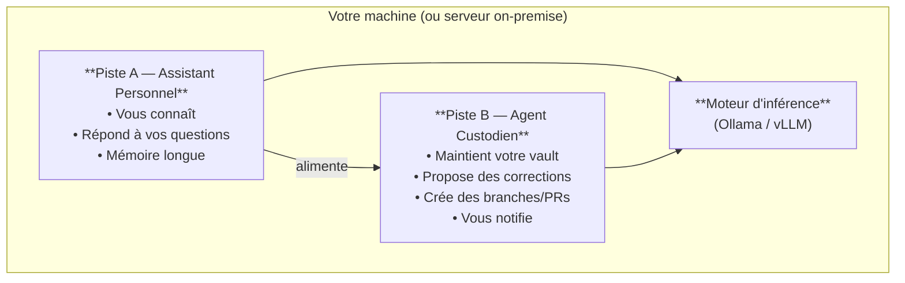

Toutes les applications IA locales ne font pas la même chose. Avant de choisir un outil, il est utile de comprendre dans quelle **catégorie architecturale** il s'inscrit — et ce que cette catégorie implique en termes de matériel, de complexité et de souveraineté.

---

## 🗂️ Taxonomie : trois grandes familles

### 1. L'Assistant Personnel ("l'IA qui vous connaît")

**Définition :** Un assistant personnel est un système interactif. Vous lui posez des questions, il répond en s'appuyant sur sa mémoire (vos documents, vos notes, l'historique de vos conversations).

**Caractéristiques :**
- Interaction principale : dialogue texte en temps réel
- Mémoire : persistante, centrée sur *votre* contexte (notes, fichiers, conversations passées)
- Déclencheur : l'humain pose une question
- Autonomie : basse — il répond, il ne *fait* pas

**Exemples :** Open WebUI, Jan.ai, Khoj, AnythingLLM, OpenHuman

**Analogie :** un collègue très bien informé sur vos dossiers, disponible 24h/24, mais qui attend qu'on lui parle.

---

### 2. L'Agent Custodien ("l'IA qui agit pour vous")

**Définition :** Un agent custodien exécute des tâches de manière autonome sur déclencheur. Il ne répond pas à des questions — il *agit* : lit des fichiers, détecte des problèmes, génère des propositions, crée des branches Git, attend la validation humaine.

**Caractéristiques :**
- Interaction principale : déclenchement planifié ou événementiel, puis rapport
- Mémoire : contexte de tâche (le vault, le repo, les logs d'erreurs)
- Déclencheur : cron, webhook, événement Git, commande CLI
- Autonomie : haute en lecture/analyse, **toujours human-in-the-loop pour les actions irréversibles**

**Exemples :** Aider, OpenHands, un pipeline Cursor CLI + script systemd

**Analogie :** un assistant de recherche junior qui travaille pendant la nuit, dépose ses propositions sur votre bureau le matin, et ne signe rien sans votre accord.

---

### 3. L'Hybride ("l'IA qui vous connaît et agit pour vous")

**Définition :** La combinaison des deux. L'assistant mémorise votre contexte *et* peut déclencher des actions — recherche web, mise à jour de fichiers, envoi de notifications — avec ou sans validation selon le niveau de risque de l'action.

**Caractéristiques :**
- Peut répondre ET agir
- Nécessite une gestion fine des permissions et des niveaux d'autonomie
- Complexité plus élevée, risque de "side effects" non voulus si mal configuré

**Exemples :** Khoj (mode agent activé), Open WebUI avec tools, OpenHands en mode interactif

**Avertissement :** la complexité de l'hybride est réelle. Une implémentation mal pensée peut donner à l'IA la capacité de modifier des fichiers, envoyer des emails ou passer des commandes sans garde-fous suffisants. Préférez une architecture explicite (assistant ou custodien) pour commencer.

---

## 📊 Tableau comparatif des trois patterns

| Critère | Assistant Personnel | Agent Custodien | Hybride |
| :-- | :-- | :-- | :-- |
| **Mode d'interaction** | Dialogue temps réel | Batch / événementiel | Les deux |
| **Déclencheur** | Humain | Cron / webhook | Humain ou automatique |
| **Autonomie d'action** | Basse (réponses) | Haute (tâches) | Variable |
| **Mémoire requise** | Longue, personnelle | Courte, contexte de tâche | Les deux |
| **Modèle LLM** | Gros (qualité réponse) | Petit OK (routage) + gros (synthèse) | Les deux |
| **VRAM minimale** | 8–24 Go (modèle 7–14B) | 8 Go (modèle 7B suffit souvent) | 24+ Go |
| **Complexité d'installation** | Faible à moyenne | Moyenne à haute | Haute |
| **Risque de side effects** | Faible | Moyen (si mauvais guardrails) | Élevé sans guardrails |
| **Souveraineté** | Variable selon outil | Maîtrisable si stack open | Maîtrisable si bien architecturé |

---

## 🔗 Relation entre les deux pistes

Les deux pistes de cette section ne sont pas concurrentes — elles sont **complémentaires** et peuvent cohabiter dans la même infrastructure.

**Comment ils s'alimentent mutuellement :**
- L'agent custodien maintient le vault à jour → l'assistant personnel a une base de connaissances fraîche à interroger.
- L'assistant personnel identifie les zones floues dans vos notes → l'agent custodien peut être déclenché pour les enrichir.
- Les deux partagent le même moteur d'inférence → un seul serveur Ollama ou vLLM suffit pour les deux pistes.

---

## 🧭 Quelle architecture pour quel besoin ?

| Votre situation | Architecture recommandée |
| :-- | :-- |
| Vous voulez un ChatGPT qui connaît vos documents | Assistant Personnel → [[05-agents-et-assistants-on-prem/assistants-personnels/index\|Piste A]] |
| Vous voulez automatiser la maintenance de votre vault | Agent Custodien → [[05-agents-et-assistants-on-prem/agents-custodiens/index\|Piste B]] |
| Vous débutez, budget matériel < 3 500 € | [[04-blueprints/scenario-a-dev-lab\|Blueprint A]] + un assistant simple (Jan.ai ou Open WebUI) |
| PME, 5–20 utilisateurs simultanés | [[04-blueprints/scenario-b-sme-appliance\|Blueprint B]] + Open WebUI ou AnythingLLM |
| Vous voulez les deux (connaît + agit) | Commencer par Piste A, ajouter Piste B après validation |
| Production, multi-sites, SLA strict | [[04-blueprints/scenario-d-datacenter\|Blueprint D]] + architecture hybride maîtrisée |

---

## 📐 Dimensionnement matériel

Les deux pistes partagent le même moteur d'inférence, mais n'ont pas les mêmes exigences.

| Piste | Modèle LLM type | VRAM minimale | Commentaire |
| :-- | :-- | :-- | :-- |
| Assistant Personnel (qualité dialogue) | 14B–70B | 16–48 Go | La qualité des réponses compte — éviter les < 7B |
| Agent Custodien (routage + synthèse) | 7B pour le routage, 14–32B pour la synthèse | 8–24 Go | Le routage n'a pas besoin d'un gros modèle |
| Hybride | 14B–70B | 24–48 Go | Compromis entre les deux |

Pour le sizing détaillé, voir les [[04-blueprints/scenario-a-dev-lab|Blueprints A–D]].

---

## 💻 Démarrer avec du code (ressources externes)

Ce guide couvre la théorie des architectures. Pour passer à la pratique, voici les points d'entrée recommandés selon chaque piste :

### Piste A — Assistant Personnel

| Outil | Point de départ |
| :-- | :-- |
| **Open WebUI** | [Documentation officielle](https://docs.openwebui.com/) — installation Docker en 5 minutes, connexion à Ollama |
| **AnythingLLM** | [GitHub AnythingLLM](https://github.com/Mintplex-Labs/anything-llm) — RAG local complet, interface multi-modèles |
| **Khoj** | [Khoj self-hosted guide](https://docs.khoj.dev/clients/desktop/) — mémoire personnelle + accès fichiers locaux |

### Piste B — Agent Custodien

| Outil | Point de départ |
| :-- | :-- |
| **Aider** | [Aider quickstart](https://aider.chat/docs/usage/tutorials.html) — agent de code local, compatible Ollama |
| **OpenHands** | [OpenHands Docker setup](https://github.com/OpenHands/OpenHands) — agent d'exécution de tâches autonomes |
| **LiteLLM + Ollama** | [LiteLLM proxy quickstart](https://docs.litellm.ai/docs/proxy/quick_start) — routage unifié vers un modèle local |
| **SmolAgents** | [SmolAgents cookbook](https://huggingface.co/docs/smolagents/tutorials/building_good_agents) — framework agent minimaliste, HuggingFace |
| **LangGraph** | [LangGraph "local agent" tutorial](https://langchain-ai.github.io/langgraph/tutorials/introduction/) — orchestration d'agents avec graphes d'état |

> [!note] Pas de code inline dans ce vault
> Ce guide est une référence d'architecture, pas un tutoriel pas-à-pas. Les snippets de code ont une durée de vie courte (APIs et versions évoluent) — les liens ci-dessus pointent vers les sources maintenues. Un dépôt compagnon `ia-on-prem-starter-kit` est prévu pour héberger des exemples de code versionés séparément.

---

## 🔗 Voir aussi

- [[05-agents-et-assistants-on-prem/fondations-communes/sovereignty-and-privacy|🔒 Souveraineté & Confidentialité]] — la grille d'évaluation des outils
- [[05-agents-et-assistants-on-prem/assistants-personnels/index|🧑‍💼 Assistants Personnels On-Premise]]
- [[05-agents-et-assistants-on-prem/agents-custodiens/index|🤖 Agents Custodiens On-Premise]]
- [[00-lexique/autonomous-agent|Agent autonome]] · [[00-lexique/rag|RAG]]
