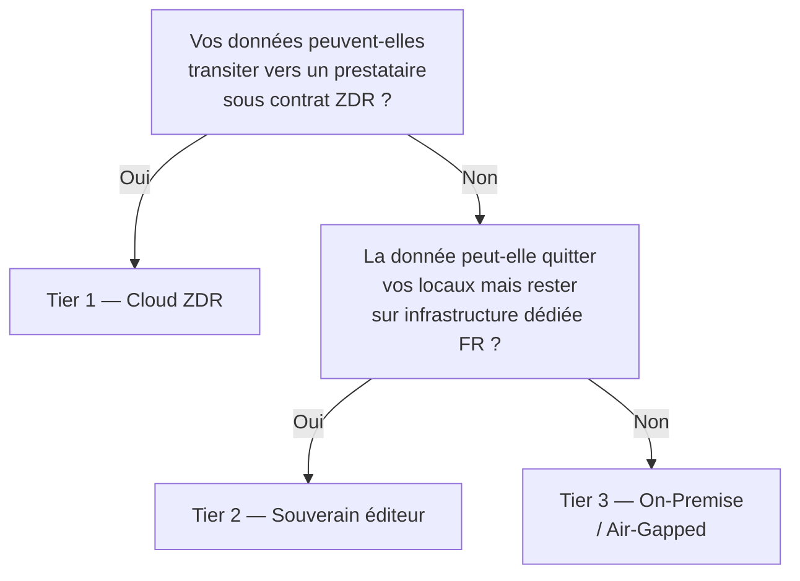

Avant de choisir un assistant personnel ou un agent custodien, une question mérite une réponse honnête :

> [!warning] Question d'audit
> Ce logiciel fait-il vraiment tourner le modèle sur ma machine, ou envoie-t-il mes données quelque part sans que je m'en aperçoive ?

La réponse n'est pas toujours dans la page marketing. Elle est dans le code, le README et le trafic réseau.

---

## 🧪 La grille d'évaluation : 6 critères

Pour chaque outil présenté dans cette section, le même protocole d'évaluation est appliqué.

### Critère 1 — Localisation des données

> *Où finissent vos fichiers, conversations et documents indexés ?*

| Niveau | Description |
| :-- | :-- |
| ✅ Local strict | Tout reste sur votre machine. Aucun fichier ne quitte le système. |
| ⚠️ Configurable | Local par défaut, mais sync cloud possible si activée explicitement. |
| ❌ Cloud par défaut | Les données sont envoyées sur les serveurs du prestataire, même sans configuration. |

**Comment vérifier :** cherchez dans `.env.example` les variables `SYNC_URL`, `CLOUD_STORAGE`, `UPLOAD_ENDPOINT`. Un `grep -r "fetch\|axios\|upload" src/` révèle les appels réseau sortants.

---

### Critère 2 — Routage du modèle

> *L'inférence se fait-elle sur votre GPU/CPU, ou via une API cloud ?*

| Niveau | Description |
| :-- | :-- |
| ✅ Local strict | Ollama, llama.cpp, vLLM — le LLM tourne sur votre machine. |
| ⚠️ Configurable | Supporte Ollama mais propose aussi OpenAI par défaut à l'installation. |
| ❌ Cloud par défaut | L'application utilise l'API OpenAI, Anthropic ou autre sans alternative locale évidente. |

**Comment vérifier :** regardez le fichier de configuration par défaut. Est-ce que `OPENAI_API_KEY` est dans les variables *recommandées* dès le tutoriel d'installation ? Si oui, le chemin cloud est le chemin de moindre résistance.

---

### Critère 3 — Mémoire persistante

> *L'outil garde-t-il un contexte entre les sessions ? Si oui, où est-il stocké ?*

| Niveau | Description |
| :-- | :-- |
| ✅ Local strict | SQLite local, fichiers Markdown sur disque, base vectorielle locale (Chroma, Qdrant self-hosted). |
| ⚠️ Configurable | Base distante possible mais non obligatoire. |
| ❌ Cloud par défaut | L'historique et les embeddings sont stockés dans un service cloud du prestataire. |

---

### Critère 4 — Télémétrie

> *Le logiciel envoie-t-il des métriques, logs ou traces de prompts à ses développeurs ?*

| Niveau | Description |
| :-- | :-- |
| ✅ Absente | Aucune télémétrie confirmée dans le code source ou explicitement désactivable à `false` par défaut. |
| ⚠️ Opt-out | Télémétrie active par défaut, désactivable en configuration. |
| ❌ Non désactivable | Télémétrie intégrée sans option de désactivation documentée. |

**Comment vérifier :** cherchez `posthog`, `segment`, `mixpanel`, `sentry`, `amplitude` dans `package.json` ou `requirements.txt`. Ces bibliothèques sont les vecteurs classiques de télémétrie dans les projets open-source.

---

### Critère 5 — Mode offline

> *L'outil fonctionne-t-il sans aucune connexion Internet après installation ?*

| Niveau | Description |
| :-- | :-- |
| ✅ Oui | Zéro appel réseau en fonctionnement normal une fois les modèles téléchargés. |
| ⚠️ Partiel | Fonctionne offline pour l'essentiel, mais certaines fonctionnalités (mises à jour, web search) nécessitent Internet. |
| ❌ Non | Une connexion Internet est requise même pour les conversations de base. |

---

### Critère 6 — Verdict souveraineté

Synthèse des 5 critères précédents :

| Verdict | Signification |
| :-- | :-- |
| ✅ Souverain natif | Les 5 critères sont au niveau ✅ sans configuration particulière. |
| ⚠️ Configurable | Peut être rendu souverain en modifiant la configuration, mais ce n'est pas le comportement par défaut. Un utilisateur non technique utilisera l'outil en mode cloud sans le savoir. |
| ❌ Incompatible on-prem strict | Ne peut pas être rendu souverain. Incompatible avec les contraintes RGPD, HDS ou secret professionnel. |

---

## Le piège "UI locale, cerveau cloud"

> [!warning] UI locale, cerveau cloud
> C'est le pattern le plus dangereux — et le plus fréquent.
>
> L'interface est installée sur votre machine. Le README dit "privacy-first". Et pourtant, chaque conversation est envoyée à `api.openai.com` (ou `api.anthropic.com`, ou les serveurs du prestataire) car le modèle qui répond n'est pas local.

**Exemples typiques :**
- Une application Electron qui "supporte" Ollama, mais dont le fichier de configuration par défaut pointe vers `gpt-4o`.
- Un assistant qui stocke vos fichiers localement mais envoie vos prompts à un modèle distant pour les encoder en embeddings.
- Un agent qui s'exécute sur votre machine mais qui utilise le service de web search du prestataire pour chaque requête.

**Le test en 60 secondes :** lancez l'application normalement et surveillez le trafic réseau avec un proxy (Proxyman, Charles, ou simplement `sudo tcpdump -i any host api.openai.com`). Si vous voyez des requêtes vers des services cloud pendant une conversation "locale", vous avez votre réponse.

---

## ⚖️ Contexte réglementaire

### RGPD (Règlement Général sur la Protection des Données)

Le RGPD impose que les données personnelles des résidents européens soient traitées avec leur consentement explicite et protégées. Envoyer des conversations contenant des données personnelles vers un service cloud hors UE (article 46) sans garanties appropriées constitue une violation potentielle — même si le prestataire est "de bonne foi".

L'IA on-premise est l'une des rares architectures qui permet de traiter des données personnelles dans un LLM **sans les exporter hors du périmètre de contrôle de l'organisation**.

### AI Act (Règlement européen sur l'IA, applicable depuis 2025–2026)

L'AI Act distingue les systèmes à risque limité (assistants généraux) des systèmes à haut risque (employés dans la santé, la justice, l'éducation, les RH...). Pour les usages à haut risque, la traçabilité, l'auditabilité et le contrôle humain sont obligatoires — des exigences difficiles à satisfaire avec un modèle cloud "boîte noire".

### EU AI Act — Obligations de transparence (Article 50)

À compter d'août 2026, l'article 50 du Règlement (UE) 2024/1689 (EU AI Act) impose des obligations de transparence aux déployeurs de systèmes d'IA qui interagissent avec des humains[^3][^4] :

1. **Étiquetage du contenu généré par IA** : tout texte, image ou audio généré ou significativement modifié par un système d'IA et présenté à un humain doit être clairement identifié comme tel. Cela couvre les suggestions de contenu, les traductions automatiques, les résultats d'auto-classification et les formulaires pré-remplis.

2. **Information sur l'interaction IA** : les systèmes qui interagissent avec les utilisateurs par texte ou voix (chatbots, assistants) doivent informer l'utilisateur qu'il interagit avec une IA, sauf si le contexte rend cette information évidente.

3. **Médias synthétiques** : les deepfakes et contenus audio/vidéo générés par IA doivent porter un marquage explicite, lisible par machine et par l'humain.

**Implication pratique pour les déploiements [[00-lexique/on-premise|on-premise]]** : toute interface affichant des suggestions générées par LLM (résumés, classifications, traductions, champs pré-remplis) doit inclure un indicateur visible. Le pattern « suggéré par l'IA » constitue l'implémentation minimale conforme. Les actions d'écriture automatisées doivent rester soumises à une validation [[00-lexique/human-in-the-loop|human-in-the-loop]] tant que la confiance n'atteint pas le seuil défini.

**Sanction en cas de non-conformité** : amendes pouvant atteindre 15 millions d'euros ou 3 % du chiffre d'affaires annuel mondial (article 99).

### Secteurs spécifiques

| Secteur | Contrainte | Implication |
| :-- | :-- | :-- |
| Santé | HDS (Hébergement Données de Santé) | L'hébergeur doit être certifié HDS. Les clouds non certifiés sont exclus. |
| Juridique | Secret professionnel | Les échanges avocat-client ne peuvent transiter par des tiers. |
| Défense / Admin | Secret défense, IGI 1300 | Réseaux isolés obligatoires pour certains niveaux. |
| Finance | DSP2, NIS2 | Exigences de localisation et d'auditabilité des systèmes critiques. |

---

## ✅ Checklist pratique : auditer un nouvel outil en 15 minutes

Avant d'intégrer un outil dans votre stack on-premise :

- [ ] **README :** le mot "local" est-il accompagné d'un modèle local (Ollama, llama.cpp) ou d'une clé API ?
- [ ] **`.env.example` :** quelles variables sont pré-remplies ? `OPENAI_API_KEY=""` présent = chemin cloud facilité.
- [ ] **`package.json` / `requirements.txt` :** présence de `posthog`, `segment`, `sentry`, `openai`, `anthropic` ?
- [ ] **Trafic réseau (5 min) :** tcpdump ou proxy pendant une conversation normale — des appels sortants ?
- [ ] **Dernière release :** le projet est-il maintenu ? Une version vieille de 18+ mois est un risque de sécurité.
- [ ] **Issues GitHub :** chercher "privacy", "telemetry", "cloud" dans les issues fermées — les problèmes déjà signalés et résolus (ou ignorés) sont révélateurs.
- [ ] **Mode offline :** coupez Internet et testez. Tout s'arrête = dépendance cloud non documentée.

---

## 🏗️ Les trois niveaux de déploiement souverain (Privacy Tiers)

Le vault défend l'IA on-premise, mais toutes les organisations n'ont pas le même niveau de contrainte. Avant d'investir dans une infrastructure dédiée, il est utile de positionner votre cas d'usage sur une échelle de trois niveaux.

### Tier 1 — Cloud LLM avec Zero Data Retention

**Pour qui :** organisations sans contrainte légale stricte de localisation ; PME, startups, équipes produit.

L'API d'un fournisseur cloud (Mistral, OpenAI, Anthropic) est utilisée sous contrat **[[00-lexique/zero-data-retention|Zero Data Retention (ZDR)]]** : les requêtes et réponses sont traitées en mémoire uniquement, jamais écrites sur disque ni utilisées pour l'entraînement.

**Ce que ZDR garantit :** pas de persistance de vos données chez le prestataire.  
**Ce que ZDR ne garantit pas :** vos données transitent quand même sur les serveurs du prestataire. Pour les organisations soumises à des contraintes strictes (HDS, secret professionnel, IGI 1300), ce transit suffit à exclure le Tier 1.

**Modèles recommandés :** Mistral Large, Llama 3 via API hébergée européenne — contrats Enterprise avec DPA RGPD explicite.

---

### Tier 2 — SaaS Souverain (hébergement éditeur sur infrastructure certifiée)

**Pour qui :** acteurs B2B adressant le secteur public, la santé, les collectivités, les grands comptes français.

Le prestataire IA n'est plus un cloud américain mais l'**éditeur lui-même**, hébergeant les GPU sur une infrastructure certifiée **SecNumCloud** et/ou **HDS** en France (OVHcloud, Scaleway, Outscale).

| Aspect | Tier 1 | Tier 2 |
| :-- | :-- | :-- |
| Données transitent chez un tiers | Oui (prestataire LLM) | Oui (éditeur, sous-traitant RGPD) |
| Infrastructure en France | ❌ Variable | ✅ Oui (SecNumCloud / HDS) |
| Modèles open-weights | ❌ Propriétaires | ✅ Mistral, Llama, etc. |
| Applicable aux marchés publics | ❌ Souvent non | ✅ Oui si qualification adéquate |
| Coût infrastructure | 0 € (usage/token) | Partagé (abonnement) |

Les modèles open-weights européens (`Mistral-Nemo-12B`, `Llama-3-70B` quantifié) servis sur GPU dédié atteignent des performances suffisantes pour 95 % des cas d'usage B2B (RAG, classification, traduction) tout en restant dans le périmètre juridique français[^5].

---

### Tier 3 — On-Premise / Air-Gapped (déploiement chez le client)

**Pour qui :** secteur Défense, R&D sensible, réseaux coupés d'Internet, données ultra-confidentielles.

Le modèle et toute la stack d'inférence tournent **chez le client final**, sur son propre matériel, sans aucun appel réseau sortant. C'est le cœur de ce vault : les [[04-blueprints/scenario-a-dev-lab|Blueprints A à D]] décrivent les architectures matérielles correspondantes.

**Contrainte principale :** le client doit fournir ou financer le matériel GPU. L'éditeur livre la stack sous forme de conteneurs (Docker/Kubernetes) avec configuration prête à l'emploi.

---

> [!tip] Quel tier choisir ?
> Commencez par identifier votre contrainte la plus forte : légale (HDS, IGI 1300), commerciale (appels d'offres publics), ou technique (réseau isolé). Cette contrainte dicte le tier minimum. Le coût et la complexité opérationnelle font le reste.

---

## 🔗 Voir aussi

- [[05-agents-et-assistants-on-prem/fondations-communes/possible-architectures|🏗️ Architectures Possibles]] — taxonomie et comparatif des patterns
- [[05-agents-et-assistants-on-prem/assistants-personnels/index|🧑‍💼 Assistants Personnels]] — fiches solution avec verdict souveraineté
- [[05-agents-et-assistants-on-prem/agents-custodiens/index|🤖 Agents Custodiens]] — fiches solution avec verdict souveraineté
- [[00-lexique/on-premise|On-Premise (IA)]] — définition et motivations
- [[00-lexique/rag|RAG]] — architecture mémoire courante dans les assistants locaux

[^3]: Règlement (UE) 2024/1689 — Artificial Intelligence Act. [https://eur-lex.europa.eu/eli/reg/2024/1689/oj](https://eur-lex.europa.eu/eli/reg/2024/1689/oj)
[^4]: EU AI Act Service Desk, *Article 50 — Transparency obligations*. [https://ai-act-service-desk.ec.europa.eu/en/ai-act/article-50](https://ai-act-service-desk.ec.europa.eu/en/ai-act/article-50)
[^5]: NVIDIA Developer Blog, *NVIDIA-Accelerated Mistral 3 Open Models Deliver Efficiency and Accuracy at Any Scale* (Mistral-Nemo-Minitron 8B, performance B2B). [https://developer.nvidia.com/blog/nvidia-accelerated-mistral-3-open-models-deliver-efficiency-accuracy-at-any-scale/](https://developer.nvidia.com/blog/nvidia-accelerated-mistral-3-open-models-deliver-efficiency-accuracy-at-any-scale/)
