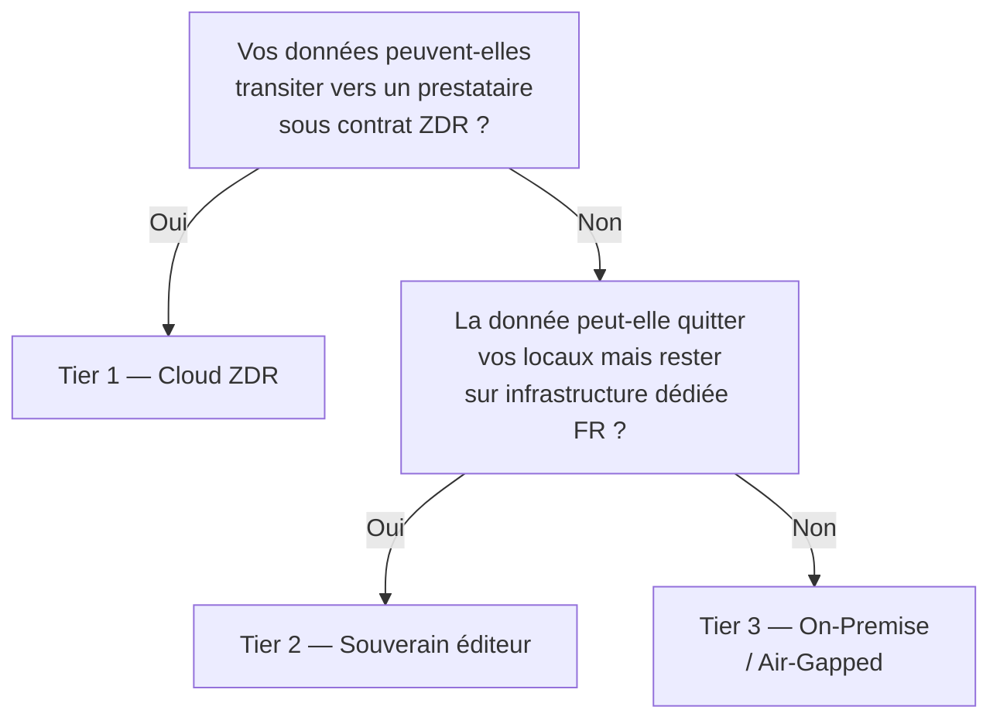

Avant de choisir un assistant personnel ou un agent custodien, une question mérite une réponse honnête :

> [!warning] Question d'audit
> Ce logiciel fait-il vraiment tourner le modèle sur ma machine, ou envoie-t-il mes données quelque part sans que je m'en aperçoive ?

La réponse n'est pas toujours dans la page marketing. Elle est dans le code, le README et le trafic réseau.

---

## 🧪 La grille d'évaluation : 6 critères

Pour chaque outil présenté dans cette section, le même protocole d'évaluation est appliqué.

### Critère 1 — Localisation des données

> *Où finissent vos fichiers, conversations et documents indexés ?*

| Niveau | Description |
| :-- | :-- |
| ✅ Local strict | Tout reste sur votre machine. Aucun fichier ne quitte le système. |
| ⚠️ Configurable | Local par défaut, mais sync cloud possible si activée explicitement. |
| ❌ Cloud par défaut | Les données sont envoyées sur les serveurs du prestataire, même sans configuration. |

**Comment vérifier :** cherchez dans `.env.example` les variables `SYNC_URL`, `CLOUD_STORAGE`, `UPLOAD_ENDPOINT`. Un `grep -r "fetch\|axios\|upload" src/` révèle les appels réseau sortants.

---

### Critère 2 — Routage du modèle

> *L'inférence se fait-elle sur votre GPU/CPU, ou via une API cloud ?*

| Niveau | Description |
| :-- | :-- |
| ✅ Local strict | Ollama, llama.cpp, vLLM — le LLM tourne sur votre machine. |
| ⚠️ Configurable | Supporte Ollama mais propose aussi OpenAI par défaut à l'installation. |
| ❌ Cloud par défaut | L'application utilise l'API OpenAI, Anthropic ou autre sans alternative locale évidente. |

**Comment vérifier :** regardez le fichier de configuration par défaut. Est-ce que `OPENAI_API_KEY` est dans les variables *recommandées* dès le tutoriel d'installation ? Si oui, le chemin cloud est le chemin de moindre résistance.

---

### Critère 3 — Mémoire persistante

> *L'outil garde-t-il un contexte entre les sessions ? Si oui, où est-il stocké ?*

| Niveau | Description |
| :-- | :-- |
| ✅ Local strict | SQLite local, fichiers Markdown sur disque, base vectorielle locale (Chroma, Qdrant self-hosted). |
| ⚠️ Configurable | Base distante possible mais non obligatoire. |
| ❌ Cloud par défaut | L'historique et les embeddings sont stockés dans un service cloud du prestataire. |

---

### Critère 4 — Télémétrie

> *Le logiciel envoie-t-il des métriques, logs ou traces de prompts à ses développeurs ?*

| Niveau | Description |
| :-- | :-- |
| ✅ Absente | Aucune télémétrie confirmée dans le code source ou explicitement désactivable à `false` par défaut. |
| ⚠️ Opt-out | Télémétrie active par défaut, désactivable en configuration. |
| ❌ Non désactivable | Télémétrie intégrée sans option de désactivation documentée. |

**Comment vérifier :** cherchez `posthog`, `segment`, `mixpanel`, `sentry`, `amplitude` dans `package.json` ou `requirements.txt`. Ces bibliothèques sont les vecteurs classiques de télémétrie dans les projets open-source.

---

### Critère 5 — Mode offline

> *L'outil fonctionne-t-il sans aucune connexion Internet après installation ?*

| Niveau | Description |
| :-- | :-- |
| ✅ Oui | Zéro appel réseau en fonctionnement normal une fois les modèles téléchargés. |
| ⚠️ Partiel | Fonctionne offline pour l'essentiel, mais certaines fonctionnalités (mises à jour, web search) nécessitent Internet. |
| ❌ Non | Une connexion Internet est requise même pour les conversations de base. |

---

### Critère 6 — Verdict souveraineté

Synthèse des 5 critères précédents :

| Verdict | Signification |
| :-- | :-- |
| ✅ Souverain natif | Les 5 critères sont au niveau ✅ sans configuration particulière. |
| ⚠️ Configurable | Peut être rendu souverain en modifiant la configuration, mais ce n'est pas le comportement par défaut. Un utilisateur non technique utilisera l'outil en mode cloud sans le savoir. |
| ❌ Incompatible on-prem strict | Ne peut pas être rendu souverain. Incompatible avec les contraintes RGPD, HDS ou secret professionnel. |

---

## Le piège "UI locale, cerveau cloud"

> [!warning] UI locale, cerveau cloud
> C'est le pattern le plus dangereux — et le plus fréquent.
>
> L'interface est installée sur votre machine. Le README dit "privacy-first". Et pourtant, chaque conversation est envoyée à `api.openai.com` (ou `api.anthropic.com`, ou les serveurs du prestataire) car le modèle qui répond n'est pas local.

**Exemples typiques :**
- Une application Electron qui "supporte" Ollama, mais dont le fichier de configuration par défaut pointe vers `gpt-4o`.
- Un assistant qui stocke vos fichiers localement mais envoie vos prompts à un modèle distant pour les encoder en embeddings.
- Un agent qui s'exécute sur votre machine mais qui utilise le service de web search du prestataire pour chaque requête.

**Le test en 60 secondes :** lancez l'application normalement et surveillez le trafic réseau avec un proxy (Proxyman, Charles, ou simplement `sudo tcpdump -i any host api.openai.com`). Si vous voyez des requêtes vers des services cloud pendant une conversation "locale", vous avez votre réponse.

---

## ⚖️ Contexte réglementaire

### RGPD (Règlement Général sur la Protection des Données)

Le RGPD impose que les données personnelles des résidents européens soient traitées avec leur consentement explicite et protégées. Envoyer des conversations contenant des données personnelles vers un service cloud hors UE (article 46) sans garanties appropriées constitue une violation potentielle — même si le prestataire est "de bonne foi".

L'IA on-premise est l'une des rares architectures qui permet de traiter des données personnelles dans un LLM **sans les exporter hors du périmètre de contrôle de l'organisation**.

La CNIL et le Conseil de l'IA et du Numérique (CIANUM) ont publié le 20 juillet 2026 une note exploratoire sur l'IA agentique : changement d'échelle des flux de données personnelles entre services connectés, profils hyper-personnalisés construits par la mémoire persistante, responsabilité diluée entre acteurs, surface d'attaque étendue à chaque service connecté. Le RGPD et l'AI Act s'appliquent, mais leur mise en œuvre doit s'adapter — un argument de plus pour un agent dont la mémoire reste sur votre infrastructure[^11].

### AI Act (Règlement (UE) 2024/1689, applicable par étapes depuis le 2 février 2025)

L'AI Act distingue les systèmes à risque limité (assistants généraux) des systèmes à haut risque (employés dans la santé, la justice, l'éducation, les RH...). Pour ces derniers, la traçabilité, l'auditabilité et le contrôle humain deviendront obligatoires à partir du **2 décembre 2027** (annexe III) et du **2 août 2028** (annexe I), échéances fixées par le règlement (UE) 2026/1744 dit « Digital Omnibus on AI », qui a remplacé l'échéance initiale d'août 2026[^6]. Ce sont des exigences difficiles à satisfaire avec un modèle cloud "boîte noire" — autant les anticiper dans l'architecture.

### EU AI Act — Obligations de transparence (Article 50)

Depuis le 2 août 2026, l'article 50 du Règlement (UE) 2024/1689 (EU AI Act) impose des obligations de transparence aux fournisseurs et déployeurs de systèmes d'IA qui interagissent avec des humains[^3][^4] ; les systèmes d'IA générative déjà sur le marché à cette date disposent jusqu'au 2 décembre 2026 pour le marquage lisible par machine de l'art. 50(2)[^6] :

1. **Marquage et étiquetage du contenu généré** : le *fournisseur* d'un système générateur de texte, image, audio ou vidéo doit marquer ses sorties de façon lisible par machine (art. 50(2)) ; le *déployeur* doit étiqueter les deepfakes et les textes générés publiés pour informer le public sur des sujets d'intérêt général sans revue humaine (art. 50(4)). Les lignes directrices de la Commission du 20 juillet 2026 excluent du marquage le code source et les chaînes courtes, et renvoient au code de bonne pratique du 10 juin 2026 comme moyen reconnu de conformité[^4][^7].

2. **Information sur l'interaction IA** : les systèmes qui interagissent avec les utilisateurs par texte ou voix (chatbots, assistants) doivent informer l'utilisateur qu'il interagit avec une IA, sauf si le contexte rend cette information évidente.

3. **Médias synthétiques** : les deepfakes et contenus audio/vidéo générés par IA doivent porter un marquage explicite, lisible par machine et par l'humain.

**Implication pratique pour les déploiements [[00-lexique/on-premise|on-premise]]** : toute interface conversationnelle doit annoncer qu'il s'agit d'une IA dès la première interaction ; pour les suggestions générées par LLM (résumés, classifications, traductions, champs pré-remplis), l'indicateur « suggéré par l'IA » n'est pas toujours une obligation légale, mais c'est la bonne pratique qui prépare l'audit et qui évite la publication par inadvertance d'un texte non revu. Les actions d'écriture automatisées doivent rester soumises à une validation [[00-lexique/human-in-the-loop|human-in-the-loop]] tant que la confiance n'atteint pas le seuil défini.

**Sanction en cas de non-conformité** : amendes pouvant atteindre 15 millions d'euros ou, pour une entreprise, 3 % du chiffre d'affaires annuel mondial, le montant le plus élevé étant retenu (article 99, § 4)[^17].

### Secteurs spécifiques

| Secteur | Contrainte | Implication |
| :-- | :-- | :-- |
| Santé | HDS (Hébergement Données de Santé) | L'hébergeur doit être certifié HDS. Les clouds non certifiés sont exclus. |
| Juridique | Secret professionnel | Les échanges avocat-client ne peuvent transiter par des tiers. |
| Défense / Admin | Secret défense, IGI 1300 | Réseaux isolés obligatoires pour certains niveaux. |
| Finance | DSP2 ; NIS2 (non transposée en France au T4 2026 — la Commission a saisi la CJUE le 8 juillet 2026[^8]) | Exigences de localisation et d'auditabilité des systèmes critiques ; anticiper NIS2 sans attendre la loi de transposition. |

---

## ✅ Checklist pratique : auditer un nouvel outil en 15 minutes

Avant d'intégrer un outil dans votre stack on-premise :

- [ ] **README :** le mot "local" est-il accompagné d'un modèle local (Ollama, llama.cpp) ou d'une clé API ?
- [ ] **`.env.example` :** quelles variables sont pré-remplies ? `OPENAI_API_KEY=""` présent = chemin cloud facilité.
- [ ] **`package.json` / `requirements.txt` :** présence de `posthog`, `segment`, `sentry`, `openai`, `anthropic` ?
- [ ] **Trafic réseau (5 min) :** tcpdump ou proxy pendant une conversation normale — des appels sortants ?
- [ ] **Dernière release :** le projet est-il maintenu ? Une version vieille de 18+ mois est un risque de sécurité.
- [ ] **Issues GitHub :** chercher "privacy", "telemetry", "cloud" dans les issues fermées — les problèmes déjà signalés et résolus (ou ignorés) sont révélateurs.
- [ ] **Mode offline :** coupez Internet et testez. Tout s'arrête = dépendance cloud non documentée.

---

## 🏗️ Les trois niveaux de déploiement souverain (Privacy Tiers)

Le vault défend l'IA on-premise, mais toutes les organisations n'ont pas le même niveau de contrainte. Avant d'investir dans une infrastructure dédiée, il est utile de positionner votre cas d'usage sur une échelle de trois niveaux.

```mermaid
flowchart TD
    A[Vos données peuvent-elles\ntransiter vers un prestataire\nsous contrat ZDR ?] -- Oui --> B[Tier 1 — Cloud ZDR]
    A -- Non --> C[La donnée peut-elle quitter\nvos locaux mais rester\nsur infrastructure dédiée FR ?]
    C -- Oui --> D[Tier 2 — Souverain éditeur]
    C -- Non --> E[Tier 3 — On-Premise\n/ Air-Gapped]
```

### Tier 1 — Cloud LLM avec Zero Data Retention

**Pour qui :** organisations sans contrainte légale stricte de localisation ; PME, startups, équipes produit.

L'API d'un fournisseur cloud (Mistral, OpenAI, Anthropic) est utilisée sous clause **[[00-lexique/zero-data-retention|Zero Data Retention (ZDR)]]** : les requêtes et réponses ne sont ni conservées après la réponse ni utilisées pour l'entraînement. Au T4 2026, la clause se négocie modèle par modèle et endpoint par endpoint : Anthropic exige 30 jours de rétention pour ses modèles de frontière (Fable 5 / 5.1, Mythos) depuis juin 2026 ; OpenAI accorde ZDR sur approbation et conserve par défaut 30 jours de journaux de surveillance ; Mistral exclut ses modèles Labs/Preview de toute clause ZDR[^10].

**Ce que ZDR garantit :** pas de persistance de vos données chez le prestataire, pour les modèles et endpoints explicitement couverts par votre contrat — vérifiez la liste à chaque nouveau modèle.  
**Ce que ZDR ne garantit pas :** vos données transitent quand même sur les serveurs du prestataire. Pour les organisations soumises à des contraintes strictes (HDS, secret professionnel, IGI 1300), ce transit suffit à exclure le Tier 1.

**Modèles recommandés :** Mistral Large, Llama 3 via API hébergée européenne — contrats Enterprise avec DPA RGPD explicite.

**Et les API des éditeurs chinois ?** Elles exposent les mêmes interfaces OpenAI-compatibles, parfois à des tarifs très bas : au 2026-10-10, DeepSeek V4.1 Flash est facturé 0,30 $ / 1,20 $ par million de tokens (entrée / sortie) en heures pleines, moitié prix en heures creuses[^12]. Mais « chinois » ne veut pas dire « bon marché » en général : Kimi K3 est à 3 $ / 15 $ et GLM-5.3 à 1,40 $ / 4,40 $, soit le niveau des modèles propriétaires occidentaux[^13][^14]. Ces services sont opérés depuis la Chine (DeepSeek indique stocker les données personnelles en République populaire de Chine), pays sans décision d'adéquation de la Commission européenne : les données sortent de l'UE comme des États-Unis, et tout envoi de données personnelles relève des articles 44 à 49 du RGPD (garanties appropriées, analyse d'impact de transfert), avec en pratique les mêmes exclusions sectorielles que le reste du Tier 1[^15]. L'alternative existe : ces modèles sont publiés à poids ouverts (DeepSeek V4.1 Flash sous licence MIT ; Kimi K3 et GLM-5.3 sous licences propres, à vérifier avant usage commercial), donc exécutables chez soi en Tier 3 quand le matériel suit — ce sont des MoE de plusieurs centaines de milliards de paramètres, voir les [[04-blueprints/scenario-c-desktop-cluster|Blueprints C]] et [[04-blueprints/scenario-d-datacenter|D]][^16].

---

### Tier 2 — SaaS Souverain (hébergement éditeur sur infrastructure certifiée)

**Pour qui :** acteurs B2B adressant le secteur public, la santé, les collectivités, les grands comptes français.

Le prestataire IA n'est plus un cloud américain mais l'**éditeur lui-même**, hébergeant les GPU sur une infrastructure qualifiée **SecNumCloud** et/ou certifiée **HDS** en France — au T4 2026, OVHcloud et Outscale pour SecNumCloud (vérifiez l'offre exacte sur le catalogue ANSSI : la qualification porte sur un service, pas sur un fournisseur) ; Scaleway est certifié HDS et en cours de qualification SecNumCloud[^9].

| Aspect | Tier 1 | Tier 2 |
| :-- | :-- | :-- |
| Données transitent chez un tiers | Oui (prestataire LLM) | Oui (éditeur, sous-traitant RGPD) |
| Infrastructure en France | ❌ Variable | ✅ Oui (SecNumCloud / HDS) |
| Modèles open-weights | ❌ Propriétaires | ✅ Mistral, Llama, etc. |
| Applicable aux marchés publics | ❌ Souvent non | ✅ Oui si qualification adéquate |
| Coût infrastructure | 0 € (usage/token) | Partagé (abonnement) |

Depuis l'arrêté du 12 août 2026 (JORF du 14 août), pris pour le décret n° 2026-272 du 14 avril 2026 en application de l'article 31 de la loi SREN, la version 3.2 du référentiel SecNumCloud est le référentiel officiel : les administrations de l'État, leurs opérateurs et les GIP doivent héberger leurs données « d'une sensibilité particulière » sur un cloud qualifié par l'ANSSI (ou certifié au niveau européen ou national équivalent). Pour un éditeur visant le secteur public, le Tier 2 n'est plus un avantage commercial mais une condition d'accès[^9].

Les modèles open-weights européens (famille Mistral 3 de Mistral AI, Kolibri d'Aleph Alpha) servis sur GPU dédié couvrent l'essentiel des cas d'usage B2B courants (RAG, classification, traduction) tout en restant dans le périmètre juridique français ; mesurez-le sur votre corpus avant de vous engager (voir [[06-mise-en-oeuvre/evaluate-local-model|Évaluer un modèle local]])[^5]. Depuis le 3 octobre 2026, **Kolibri 1** d'Aleph Alpha (Allemagne, Apache 2.0, ~78 Go en FP8) s'ajoute à cette offre européenne à poids ouverts ; il ne vise toutefois que l'allemand et l'anglais, ce qui le réserve aux corpus anglophones ou bilingues dans une PME française[^18].

---

### Tier 3 — On-Premise / Air-Gapped (déploiement chez le client)

**Pour qui :** secteur Défense, R&D sensible, réseaux coupés d'Internet, données ultra-confidentielles.

Le modèle et toute la stack d'inférence tournent **chez le client final**, sur son propre matériel, sans aucun appel réseau sortant. C'est le cœur de ce vault : les [[04-blueprints/scenario-a-dev-lab|Blueprints A à D]] décrivent les architectures matérielles correspondantes.

**Contrainte principale :** le client doit fournir ou financer le matériel GPU. L'éditeur livre la stack sous forme de conteneurs (Docker/Kubernetes) avec configuration prête à l'emploi.

---

> [!tip] Quel tier choisir ?
> Commencez par identifier votre contrainte la plus forte : légale (HDS, IGI 1300), commerciale (appels d'offres publics), ou technique (réseau isolé). Cette contrainte dicte le tier minimum. Le coût et la complexité opérationnelle font le reste.

---

## 🔗 Voir aussi

- [[05-agents-et-assistants-on-prem/fondations-communes/possible-architectures|🏗️ Architectures Possibles]] — taxonomie et comparatif des patterns
- [[05-agents-et-assistants-on-prem/assistants-personnels/index|🧑‍💼 Assistants Personnels]] — fiches solution avec verdict souveraineté
- [[05-agents-et-assistants-on-prem/agents-custodiens/index|🤖 Agents Custodiens]] — fiches solution avec verdict souveraineté
- [[00-lexique/on-premise|On-Premise (IA)]] — définition et motivations
- [[00-lexique/rag|RAG]] — architecture mémoire courante dans les assistants locaux

[^3]: Règlement (UE) 2024/1689 — Artificial Intelligence Act. [https://eur-lex.europa.eu/eli/reg/2024/1689/oj](https://eur-lex.europa.eu/eli/reg/2024/1689/oj)
[^4]: EU AI Act Service Desk, *Article 50 — Transparency obligations*. [https://ai-act-service-desk.ec.europa.eu/en/ai-act/article-50](https://ai-act-service-desk.ec.europa.eu/en/ai-act/article-50)
[^5]: NVIDIA Developer Blog, *NVIDIA-Accelerated Mistral 3 Open Models Deliver Efficiency and Accuracy at Any Scale* (Mistral-Nemo-Minitron 8B, performance B2B). [https://developer.nvidia.com/blog/nvidia-accelerated-mistral-3-open-models-deliver-efficiency-accuracy-at-any-scale/](https://developer.nvidia.com/blog/nvidia-accelerated-mistral-3-open-models-deliver-efficiency-accuracy-at-any-scale/)
[^6]: Règlement (UE) 2026/1744 « Digital Omnibus on AI » (JO du 2026-07-24, en vigueur le 2026-07-27 ; art. 113 c : haut risque annexe III au 2027-12-02, annexe I au 2028-08-02 ; art. 111(4) : délai au 2026-12-02 pour le marquage art. 50(2) des systèmes déjà sur le marché), lu le 2026-10-09. [https://eur-lex.europa.eu/eli/reg/2026/1744/oj](https://eur-lex.europa.eu/eli/reg/2026/1744/oj)
[^7]: Commission européenne, *Guidelines on transparency obligations for providers and deployers of certain AI systems* (annonce du 2026-07-20) et *Code of practice on AI-generated content* (2026-06-10). [https://digital-strategy.ec.europa.eu/en/news/commission-publishes-guidelines-transparency-obligations-providers-and-deployers-certain-ai-systems](https://digital-strategy.ec.europa.eu/en/news/commission-publishes-guidelines-transparency-obligations-providers-and-deployers-certain-ai-systems) · [https://digital-strategy.ec.europa.eu/en/policies/code-practice-ai-generated-content](https://digital-strategy.ec.europa.eu/en/policies/code-practice-ai-generated-content)
[^8]: Commission européenne, *Commission refers Ireland, Spain, France and the Netherlands to the Court of Justice for failing to transpose rules* (NIS2, saisine du 2026-07-08). [https://digital-strategy.ec.europa.eu/en/news/commission-refers-ireland-spain-france-and-netherlands-court-justice-failing-transpose-rules](https://digital-strategy.ec.europa.eu/en/news/commission-refers-ireland-spain-france-and-netherlands-court-justice-failing-transpose-rules)
[^9]: Scaleway, *SecNumCloud* (« undergoing SecNumCloud (ANSSI) qualification … not yet granted », certifié HDS), page vendeur lue le 2026-10-09 ; arrêté du 12 août 2026 approuvant le référentiel SecNumCloud 3.2 (JORF du 2026-08-14, NOR PRMD2617964A) ; ANSSI, *Cloud* (catalogue des prestataires qualifiés). [https://www.scaleway.com/en/security-and-compliance/secnumcloud/](https://www.scaleway.com/en/security-and-compliance/secnumcloud/) · [https://www.legifrance.gouv.fr/jorf/id/JORFTEXT000054678082](https://www.legifrance.gouv.fr/jorf/id/JORFTEXT000054678082) · [https://cyber.gouv.fr/enjeux-technologiques/cloud/](https://cyber.gouv.fr/enjeux-technologiques/cloud/)
[^10]: Anthropic, *Covered Models* (Fable 5 / 5.1, Mythos 5 / 5.1 : rétention d'au moins 30 jours, ZDR indisponible ; 2026-06-09 et 2026-08-31), lu le 2026-10-10 ; OpenAI, *Your data* (ZDR sur approbation, journaux de surveillance 30 jours par défaut), lu le 2026-10-09 ; Mistral AI, *Commercial Terms of Service* (en vigueur 2026-09-25, modèles Labs/Preview exclus de ZDR). [https://support.claude.com/en/articles/15425695-covered-models](https://support.claude.com/en/articles/15425695-covered-models) · [https://developers.openai.com/api/docs/guides/your-data](https://developers.openai.com/api/docs/guides/your-data) · [https://legal.mistral.ai/terms/commercial-terms-of-service](https://legal.mistral.ai/terms/commercial-terms-of-service)
[^11]: CNIL et CIANUM, *IA agentique : note exploratoire* (2026-07-20). [https://www.cnil.fr/fr/ia-agentique-cnil-cianum-note](https://www.cnil.fr/fr/ia-agentique-cnil-cianum-note)
[^12]: DeepSeek, *Models & Pricing* (deepseek-flash = DeepSeek-V4.1-Flash : 0,30 $ entrée hors cache / 1,20 $ sortie par million de tokens en heures pleines, 0,15 $ / 0,60 $ en heures creuses ; heures pleines 01:00–04:00 et 06:00–10:00 UTC en semaine), relevé le 2026-10-10. [https://api-docs.deepseek.com/quick_start/pricing](https://api-docs.deepseek.com/quick_start/pricing)
[^13]: Moonshot AI, *Kimi API pricing — chat* (kimi-k3 : 3,00 $ entrée / 15,00 $ sortie par million de tokens, 0,30 $ en cache hit ; l'URL platform.moonshot.ai redirige vers platform.kimi.ai), relevé le 2026-10-10. [https://platform.kimi.ai/docs/pricing/chat](https://platform.kimi.ai/docs/pricing/chat)
[^14]: Z.ai, *Pricing* (GLM-5.3 : 1,40 $ entrée / 4,40 $ sortie par million de tokens ; GLM-5.3-Flash : 0,15 $ / 0,50 $), relevé le 2026-10-10. [https://docs.z.ai/guides/overview/pricing](https://docs.z.ai/guides/overview/pricing)
[^15]: DeepSeek, *Privacy Policy* (« store your Personal Data in People's Republic of China », mise à jour du 2026-02-10) ; Commission européenne, *Adequacy decisions* (liste des pays reconnus : la Chine n'y figure pas), lus le 2026-10-10. [https://cdn.deepseek.com/policies/en-US/deepseek-privacy-policy.html](https://cdn.deepseek.com/policies/en-US/deepseek-privacy-policy.html) · [https://commission.europa.eu/law/law-topic/data-protection/international-dimension-data-protection/adequacy-decisions_en](https://commission.europa.eu/law/law-topic/data-protection/international-dimension-data-protection/adequacy-decisions_en)
[^16]: Hugging Face, fiches modèles *deepseek-ai/DeepSeek-V4.1-Flash* (licence MIT, 763 B paramètres en safetensors), *moonshotai/Kimi-K3* (licence « Kimi K3 », 2,8 T paramètres dont 104 B actifs) et *zai-org/GLM-5.3* (licence « glm-5.3 », 753 B paramètres), lues le 2026-10-10. [https://huggingface.co/deepseek-ai/DeepSeek-V4.1-Flash](https://huggingface.co/deepseek-ai/DeepSeek-V4.1-Flash) · [https://huggingface.co/moonshotai/Kimi-K3](https://huggingface.co/moonshotai/Kimi-K3) · [https://huggingface.co/zai-org/GLM-5.3](https://huggingface.co/zai-org/GLM-5.3)
[^17]: EU AI Act Service Desk, *Article 99 — Penalties* (§ 4 (g) : non-respect de l'art. 50, « whichever is higher »), lu le 2026-10-09. [https://ai-act-service-desk.ec.europa.eu/en/ai-act/article-99](https://ai-act-service-desk.ec.europa.eu/en/ai-act/article-99)
[^18]: Aleph Alpha, *Kolibri-1* (MoE 78B, 3,46B actifs, Apache 2.0, allemand et anglais, poids FP8 ≈ 78 Go, signataire du code de bonne pratique GPAI de l'UE), 2026-10-03. [https://huggingface.co/Aleph-Alpha/Kolibri-1](https://huggingface.co/Aleph-Alpha/Kolibri-1)
