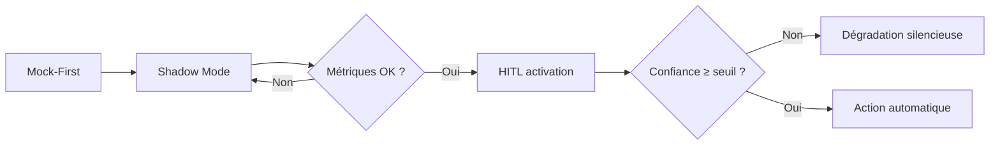

Choisir un modèle local ne consiste pas à prendre le premier nom en haut d'un leaderboard. Un modèle peut être excellent en mathématiques, médiocre en français métier, rapide mais halluciné, ou très bon en RAG mais dangereux pour modifier un dépôt.

> [!warning] Règle de base
> N'évaluez jamais un modèle "en général". Évaluez-le sur **votre tâche**, **vos documents**, **votre matériel** et **vos seuils d'acceptation**.

---

## Les trois niveaux d'évaluation

### 1. Les benchmarks publics

Les benchmarks publics donnent une première orientation, mais leur valeur prédictive pour un usage en entreprise est **sévèrement limitée en 2026**.

> [!warning] Le problème de la contamination
> Les grands benchmarks statiques — MMLU, HumanEval, MATH — sont aujourd'hui considérés comme **saturés et potentiellement contaminés** : leurs données de test ont, pour partie, fuité dans les corpus d'entraînement des modèles récents. Comparer Qwen 2.5 et Llama 3.x sur MMLU ne dit presque rien sur leur comportement réel dans votre contexte métier. Un modèle peut atteindre 90 % sur MMLU et produire des hallucinations dangereuses sur vos documents internes.

Les benchmarks restent utiles pour **trier grossièrement** les familles de modèles, ou pour vérifier des capacités très ciblées (raisonnement formel, code syntaxiquement correct). Pour cela, préférez les tests à **domaine spécifique** et les évaluations sur données réelles (SWE-bench pour le code, par exemple, car il mesure sur de vraies issues GitHub, pas sur des exercices mémorisables).

| Famille | Exemples | Utilité réelle | Limites |
| :-- | :-- | :-- | :-- |
| Connaissances générales | MMLU, MMLU-Pro, GPQA | tri grossier entre familles | saturé, contaminé, ne prédit pas le métier |
| Calcul / raisonnement | GSM8K, MATH | vérifier la logique formelle | peu représentatif des tâches prose |
| Instruction following | IFEval, MT-Bench | qualité conversationnelle | résultats variables selon langue |
| Factualité | TruthfulQA, FActScore, HaluEval | résistance aux fausses croyances | mesure la factualité générale, pas votre domaine |
| Code | HumanEval, MBPP, SWE-bench | capacités de génération/édition | SWE-bench est le plus représentatif pour les agents |
| Évaluation holistique | HELM | profil multi-métriques | utile en complément, pas en remplacement du test métier |

HELM rappelle qu'un modèle n'est pas seulement "bon" ou "mauvais" : il a un profil — exactitude, robustesse, calibration, biais, toxicité, efficacité[^1]. Mais même un profil HELM favorable ne garantit rien sur vos données.

> [!note] Ce que dit vraiment un leaderboard
> Il dit comment le modèle s'en sort sur des questions choisies par ses auteurs, dans une langue souvent anglophone, avec un format de réponse normalisé. Il ne dit rien sur vos documents internes, votre langue cible, vos exigences de citation, votre format de sortie ni votre budget VRAM.
>
> **La seule évaluation valable pour un déploiement PME/entreprise est un golden dataset constitué sur vos propres cas d'usage.**

### 2. Votre banc d'essai métier

La vraie comparaison commence avec un **golden dataset** : un petit jeu de questions représentatives, validé par un humain compétent.

Un bon jeu de test contient :

- 20 à 50 questions simples, où la réponse attendue est claire ;
- 20 à 50 questions difficiles, ambiguës ou pièges ;
- 10 à 20 cas "ne pas répondre" : absence d'information, demande hors périmètre, conflit entre sources ;
- quelques questions longues qui testent la fenêtre de contexte et le [[00-lexique/kv-cache|KV Cache]] ;
- des formats de sortie obligatoires : JSON, tableau, résumé court, citation de source.

Pour chaque question, stockez :

| Champ | Exemple |
| :-- | :-- |
| `question` | "Quelle est la procédure de validation d'une PR agent ?" |
| `source_attendue` | chemin du document ou extrait de référence |
| `réponse_attendue` | réponse courte ou critères de correction |
| `risque` | faible, moyen, critique |
| `type` | RAG, raisonnement, synthèse, extraction, refus |

### 3. La validation humaine

Les scores automatiques accélèrent le tri, mais la décision finale doit rester humaine pour les usages critiques.

> [!tip] Bon protocole
> Faites noter les réponses en aveugle : le relecteur ne sait pas quel modèle a répondu. Sinon, la marque du modèle influence vite le jugement.

---

## Quels KPI mesurer ?

### Qualité de réponse

| KPI | Question |
| :-- | :-- |
| Exactitude | La réponse est-elle correcte ? |
| Complétude | Couvre-t-elle les éléments essentiels ? |
| Cohérence | Se contredit-elle entre deux paragraphes ou deux tours ? |
| Respect de consigne | Suit-elle le format demandé ? |
| Refus approprié | Sait-elle dire "je ne sais pas" quand la source manque ? |

### Hallucinations et factualité

TruthfulQA teste la capacité d'un modèle à éviter des réponses fausses mais plausibles, souvent apprises en imitant des textes humains[^2]. FActScore va plus loin sur les textes longs : il découpe la réponse en faits atomiques et vérifie quelle proportion est supportée par une source fiable[^3].

Pour un guide interne, le KPI le plus utile est souvent :

$$\text{Taux d'hallucination critique} = \frac{\text{réponses fausses dangereuses}}{\text{réponses totales}}$$

Une hallucination critique n'est pas juste une erreur : c'est une réponse qui pourrait déclencher une mauvaise décision métier.

### RAG

Pour une architecture [[00-lexique/rag|RAG]], il faut séparer le problème en deux :

| Composant | KPI |
| :-- | :-- |
| Retrieval | context precision, context recall, taux de source correcte en top-k |
| Génération | faithfulness, answer relevancy, citation correcte |

RAGAS propose justement d'évaluer la fidélité de la réponse au contexte, la pertinence de la réponse et la qualité du contexte récupéré, sans toujours exiger une réponse humaine de référence[^4].

### Code et agents

Pour un agent custodien ou un outil comme Aider, les benchmarks de complétion ne suffisent pas. Il faut tester l'édition réelle :

- le patch compile-t-il ?
- les tests passent-ils ?
- le diff est-il minimal ?
- le modèle respecte-t-il les fichiers autorisés ?
- casse-t-il le Markdown, les frontmatter YAML ou les wikilinks ?
- boucle-t-il sur la même correction ?

SWE-bench mesure cette capacité à partir de vrais issues GitHub : le modèle doit produire un patch et les tests du dépôt servent d'arbitre[^5]. C'est beaucoup plus proche d'un agent de maintenance qu'un simple benchmark de génération de fonction.

### Performance locale

Même si ce chapitre parle surtout de qualité, il faut toujours mesurer :

- [[00-lexique/ttft|TTFT]] ;
- [[00-lexique/tokens-per-second|tokens/s]] ;
- VRAM utilisée au repos et sous charge ;
- consommation du [[00-lexique/kv-cache|KV Cache]] ;
- débit avec 1, 5, 20 utilisateurs simultanés ;
- stabilité après 1 heure de charge.

---

## Utiliser une IA comme juge ?

Oui, mais avec prudence.

Le modèle juge (*LLM-as-a-judge*) est utile pour pré-trier beaucoup de réponses ouvertes. Les travaux autour de MT-Bench et Chatbot Arena montrent qu'un juge fort peut approcher l'accord humain sur des préférences conversationnelles, mais avec des biais documentés : position de la réponse, verbosité, préférence pour sa propre famille de modèles[^6].

> [!warning] Ne pas déléguer le verdict final
> Un LLM juge peut aider à scorer, expliquer, trier et détecter des incohérences. Il ne remplace pas une validation humaine sur les cas critiques.

Bonnes pratiques :

1. Utiliser une grille explicite : exactitude, source, format, concision, risque.
2. Demander une justification courte, pas seulement une note.
3. Comparer en double aveugle : modèle A/B anonymisés.
4. Inverser l'ordre des réponses pour détecter le biais de position.
5. Ne pas utiliser le même modèle comme candidat et comme juge.
6. Faire relire manuellement un échantillon de décisions.

---

## Protocole concret en 7 étapes

### Étape 1 — Définir la tâche

Exemples :

- assistant RAG pour documents RH ;
- agent custodien qui corrige un vault Markdown ;
- résumé juridique ;
- extraction JSON de factures ;
- support interne niveau 1.

### Étape 2 — Définir les seuils d'acceptation

Exemple pour un assistant documentaire :

| KPI | Seuil |
| :-- | :-- |
| Réponse avec source correcte | ≥ 95 % sur questions simples |
| Hallucination critique | 0 tolérée |
| Refus correct quand source absente | ≥ 90 % |
| TTFT | < 2 s |
| Débit | ≥ 10 tokens/s par utilisateur interactif |

### Étape 3 — Construire le golden dataset

Commencez petit. Un fichier CSV ou JSONL suffit :

```json
{"id":"rag-001","question":"Quel scénario convient à 10 utilisateurs sur un modèle 70B ?","expected_source":"04-blueprints/scenario-b-sme-appliance.md","risk":"medium","type":"rag"}
```

### Étape 4 — Figier les paramètres

Pour comparer correctement :

- même prompt système ;
- même température ;
- même taille de contexte ;
- même quantification ;
- même moteur d'inférence ;
- même matériel ;
- même version du modèle.

### Étape 5 — Exécuter plusieurs runs

Un seul passage ne suffit pas. Les LLMs sont non déterministes dès que la température dépasse zéro.

Pour les tâches critiques, lancez au moins 3 runs et notez :

- score moyen ;
- pire réponse ;
- variabilité entre runs ;
- erreurs récurrentes.

### Étape 6 — Analyser les erreurs

Classez chaque erreur :

| Catégorie | Exemple |
| :-- | :-- |
| Retrieval raté | Le bon document n'est pas récupéré |
| Hallucination | Le modèle invente une politique inexistante |
| Mauvais format | JSON invalide, tableau cassé |
| Surconfiance | Répond alors que la source manque |
| Raisonnement faux | Bonne source, mauvaise conclusion |
| Régression | Ancien modèle répondait correctement, nouveau échoue |

### Étape 7 — Décider

Le meilleur modèle est rarement le plus gros. Le bon modèle est celui qui passe les seuils, tient dans votre [[00-lexique/vram|VRAM]], respecte la confidentialité et reste opérable.

> [!tip] Décision pratique
> Gardez un petit modèle rapide pour les tâches simples, un modèle plus fort pour les décisions ou l'édition, et un protocole de régression pour ne pas perdre en qualité lors des mises à jour.

---

## Matrice de décision

| Besoin | Métrique prioritaire | Benchmark public utile | Test local indispensable |
| :-- | :-- | :-- | :-- |
| Chat général | préférence humaine, instruction following | MT-Bench, Chatbot Arena, IFEval | conversations métier anonymisées |
| RAG documentaire | faithfulness, context recall | RAGAS | questions sourcées sur vos documents |
| Agent code | patch correct, tests passés | SWE-bench | PRs simulées sur votre dépôt |
| Résumé juridique / médical | factualité, omissions critiques | FActScore, TruthfulQA | revue humaine experte |
| Déploiement PME | TTFT, tokens/s, stabilité | benchmarks moteur | charge concurrente sur matériel cible |

---

## Voir aussi

- [[01-fondations/quantization-4bit-8bit|Quantification 4-bit & 8-bit]]
- [[03-stack-logicielle/rag-and-agents|RAG & Agents]]
- [[05-agents-et-assistants-on-prem/agents-custodiens/solutions/aider|Aider]]
- [[00-lexique/benchmark-llm|Benchmark LLM]]
- [[00-lexique/llm-as-a-judge|LLM-as-a-judge]]
- [[00-lexique/ragas|RAGAS]]

## Stratégie de déploiement progressif

Au-delà de l'évaluation hors production, une mise en service progressive réduit le risque d'exposer des utilisateurs à un modèle non maîtrisé. Trois phases séquentielles constituent le pattern recommandé.

### Phase 1 — Mock-First

Avant de connecter un LLM réel, toute l'infrastructure asynchrone (API, file d'attente, workers, réactions frontend) est validée avec des réponses mock déterministes. Cette phase vérifie que le système gère correctement la latence et que l'interface se dégrade proprement — sans introduire la non-déterminisme d'un vrai modèle.

### Phase 2 — Shadow Mode

Le LLM réel est connecté au trafic de production, mais ses sorties sont **uniquement journalisées** — jamais affichées aux utilisateurs. Cette phase mesure :

- le taux d'erreurs de formatage JSON (le modèle respecte-t-il fiablement le schéma de sortie ?) ;
- la latence p95 sous charge réelle ;
- la pertinence RAG (les documents récupérés sont-ils utiles pour la requête ?).

Durée typique : 1 à 2 semaines sur trafic réel avant de passer à la phase suivante.

### Phase 3 — Human-in-the-Loop activation

Les résultats IA deviennent visibles pour les utilisateurs. Toute action d'écriture (auto-classification, pré-remplissage, modification de contenu) exige une confirmation humaine explicite avant exécution. C'est la dernière barrière de sécurité avant l'automatisation complète.



## Sources

[^1]: Stanford CRFM, *Holistic Evaluation of Language Models (HELM)*. [https://crfm.stanford.edu/helm/](https://crfm.stanford.edu/helm/)
[^2]: Lin, Hilton, Evans, *TruthfulQA: Measuring How Models Mimic Human Falsehoods*, 2021. [https://arxiv.org/abs/2109.07958](https://arxiv.org/abs/2109.07958)
[^3]: Min et al., *FActScore: Fine-grained Atomic Evaluation of Factual Precision in Long Form Text Generation*, EMNLP 2023. [https://aclanthology.org/2023.emnlp-main.741/](https://aclanthology.org/2023.emnlp-main.741/)
[^4]: Es et al., *RAGAS: Automated Evaluation of Retrieval Augmented Generation*, EACL 2024. [https://aclanthology.org/2024.eacl-demo.16/](https://aclanthology.org/2024.eacl-demo.16/)
[^5]: Jimenez et al., *SWE-bench: Can Language Models Resolve Real-World GitHub Issues?*, ICLR 2024. [https://www.swebench.com/original.html](https://www.swebench.com/original.html)
[^6]: Zheng et al., *Judging LLM-as-a-Judge with MT-Bench and Chatbot Arena*, NeurIPS 2023. [https://arxiv.org/abs/2306.05685](https://arxiv.org/abs/2306.05685)
