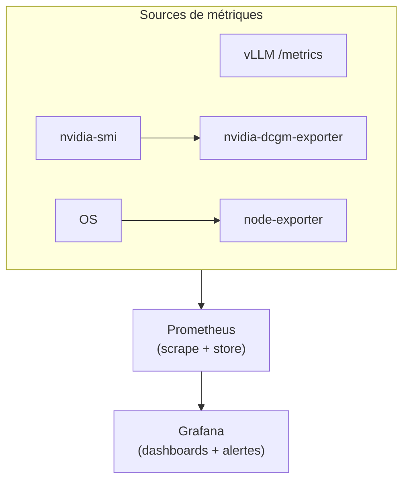

> [!tip] En bref
> Sans monitoring, une dégradation de débit ou un OOM GPU passe inaperçu jusqu'à ce qu'un utilisateur se plaigne. Ce guide installe une stack Prometheus + Grafana en 15 minutes, couvre les métriques clés de vLLM et du GPU, et fournit les alertes minimales pour une production sereine.

---

## Architecture de monitoring



---

## 1. Stack Docker Compose complète

```yaml
# docker-compose.monitoring.yml
services:

  prometheus:
    image: prom/prometheus:latest
    container_name: prometheus
    volumes:
      - ./prometheus.yml:/etc/prometheus/prometheus.yml:ro
      - prometheus_data:/prometheus
    command:
      - '--config.file=/etc/prometheus/prometheus.yml'
      - '--storage.tsdb.retention.time=30d'
    ports:
      - "9090:9090"
    restart: unless-stopped

  grafana:
    image: grafana/grafana-oss:latest
    container_name: grafana
    volumes:
      - grafana_data:/var/lib/grafana
    environment:
      - GF_SECURITY_ADMIN_PASSWORD=changeme
      - GF_USERS_ALLOW_SIGN_UP=false
    ports:
      - "3000:3000"
    restart: unless-stopped
    depends_on:
      - prometheus

  nvidia-dcgm-exporter:
    image: nvcr.io/nvidia/k8s/dcgm-exporter:latest
    container_name: dcgm-exporter
    runtime: nvidia
    environment:
      - NVIDIA_VISIBLE_DEVICES=all
    ports:
      - "9400:9400"
    restart: unless-stopped
    cap_add:
      - SYS_ADMIN

  node-exporter:
    image: prom/node-exporter:latest
    container_name: node-exporter
    volumes:
      - /proc:/host/proc:ro
      - /sys:/host/sys:ro
      - /:/rootfs:ro
    command:
      - '--path.procfs=/host/proc'
      - '--path.sysfs=/host/sys'
    ports:
      - "9100:9100"
    restart: unless-stopped

volumes:
  prometheus_data:
  grafana_data:
```

```bash
docker compose -f docker-compose.monitoring.yml up -d
```

---

## 2. Configuration Prometheus

```yaml
# prometheus.yml
global:
  scrape_interval: 15s
  evaluation_interval: 15s

scrape_configs:

  - job_name: 'vllm'
    static_configs:
      - targets: ['host.docker.internal:8000']  # adapter si vLLM sur autre machine
    metrics_path: '/metrics'

  - job_name: 'nvidia-gpu'
    static_configs:
      - targets: ['dcgm-exporter:9400']

  - job_name: 'node'
    static_configs:
      - targets: ['node-exporter:9100']

  # Si Ollama : pas de /metrics natif — scraper les métriques du reverse proxy placé devant
  # Ollama (Caddy : endpoint admin :2019/metrics ; Nginx : nginx-prometheus-exporter)
  - job_name: 'ollama-proxy'
    static_configs:
      - targets: ['host.docker.internal:2019']  # endpoint /metrics du reverse proxy
```

> [!note] Ollama vs vLLM
> vLLM expose nativement un endpoint `/metrics` compatible Prometheus[^1]. Ollama n'expose pas de `/metrics` Prometheus documenté au T4 2026[^10] : instrumentez au niveau du reverse proxy (Caddy expose nativement des métriques Prometheus sur son endpoint admin `:2019/metrics` ; Nginx via `nginx-prometheus-exporter`) ou exploitez les champs `eval_count`, `eval_duration` et `prompt_eval_duration` des réponses `/api/generate` et `/api/chat` (section 7). Les exporters communautaires cités dans les anciennes versions de ce guide ne sont plus disponibles (dépôts supprimés au 2026-10-09).

---

## 3. Métriques vLLM — les essentielles

vLLM expose ses métriques sur `GET /metrics`[^1]. Voici celles à surveiller en priorité :

### Débit et files d'attente

| Métrique | Description | Seuil d'alerte |
| :-- | :-- | :-- |
| `vllm:num_requests_running` | Requêtes en cours de traitement | > 80% de `--max-num-seqs` |
| `vllm:num_requests_waiting` | Requêtes en file d'attente | > 0 pendant > 30 s |
| `rate(vllm:generation_tokens_total[1m])` | Débit de génération en tokens/s (dérivé du compteur ; la jauge V0 `avg_generation_throughput_toks_per_s` a disparu)[^1] | < seuil défini par usage |
| `vllm:prompt_tokens_total` | Tokens de prompt traités (cumulé) | — (trend) |
| `vllm:generation_tokens_total` | Tokens générés (cumulé) | — (trend) |

### KV Cache

| Métrique | Description | Seuil d'alerte |
| :-- | :-- | :-- |
| `vllm:kv_cache_usage_perc` | Fraction du KV Cache occupée (1 = 100 %) | > 0.90 |
| `vllm:num_preemptions_total` | Requêtes préemptées (KV Cache plein) | > 0 régulier |

> [!note] Métrique renommée
> `vllm:gpu_cache_usage_perc` et `vllm:cpu_cache_usage_perc` (moteur V0) ont disparu de la référence : la jauge courante est `vllm:kv_cache_usage_perc`. Les métriques dépréciées sont masquées une version après et supprimées deux versions après (`--show-hidden-metrics-for-version=X.Y` pour les réafficher temporairement)[^1].

> [!warning] Préemptions
> Quand le KV Cache est plein, le moteur V1 ne swappe plus vers la RAM : il **préempte** des requêtes et recalcule leur préfixe. Un `vllm:num_preemptions_total` qui croît régulièrement signifie que la VRAM est insuffisante pour la charge : réduire `--max-model-len` ou `--max-num-seqs`[^2], ou ajouter un déport CPU explicite (`--kv-transfer-config '{"kv_connector":"OffloadingConnector",…}'`, métriques `vllm:simple_kv_offload_*`)[^1][^8].

### Latences

| Métrique | Description |
| :-- | :-- |
| `vllm:time_to_first_token_seconds` | Distribution TTFT par requête |
| `vllm:inter_token_latency_seconds` | Latence entre deux tokens générés (histogramme)[^1] |
| `vllm:request_time_per_output_token_seconds` | Temps moyen par token de sortie, par requête (remplace `vllm:time_per_output_token_seconds`)[^1] |
| `vllm:e2e_request_latency_seconds` | Latence end-to-end |

---

## 4. Métriques GPU (DCGM Exporter)

NVIDIA DCGM Exporter expose des métriques GPU détaillées[^3] :

| Métrique DCGM | Description | Seuil d'alerte |
| :-- | :-- | :-- |
| `DCGM_FI_DEV_GPU_UTIL` | Utilisation GPU (%) | < 10% pendant > 5 min (gaspillage) |
| `DCGM_FI_DEV_MEM_COPY_UTIL` | Utilisation bus mémoire (%) | > 90% soutenu |
| `DCGM_FI_DEV_FB_USED` | VRAM utilisée (MiB) | > 95% de la VRAM totale |
| `DCGM_FI_DEV_GPU_TEMP` | Température GPU (°C) | > 83°C (throttling probable) |
| `DCGM_FI_DEV_POWER_USAGE` | Consommation (W) | > TDP déclaré |
| `DCGM_FI_DEV_NVLINK_BANDWIDTH_TOTAL` | Débit NVLink (Go/s) | — (trend sur clusters) |

### Requête Prometheus — VRAM utilisée par GPU

```text
DCGM_FI_DEV_FB_USED{gpu=~".*"}
```

---

## 5. Dashboards Grafana recommandés

### Import depuis Grafana.com

1. Ouvrir Grafana → **Dashboards → Import**
2. Entrer l'ID du dashboard :

| Dashboard | ID Grafana | Usage |
| :-- | :-- | :-- |
| NVIDIA DCGM Exporter | **12239** | GPU utilization, mémoire, température[^4] |
| Node Exporter Full | **1860** | CPU, RAM, réseau, disque hôte[^5] |

> [!note] Dashboard vLLM
> Il n'existe pas de dashboard officiel vLLM sur Grafana.com en 2026. Construisez-le manuellement à partir des métriques de la section 3, ou cherchez sur grafana.com les dashboards communautaires "vLLM" (résultats variables).

### Panels essentiels à construire manuellement

**Panel "Débit tokens/s" :**
```text
rate(vllm:generation_tokens_total[1m])
```

**Panel "KV Cache %" :**
```text
vllm:kv_cache_usage_perc * 100
```

**Panel "File d'attente" :**
```text
vllm:num_requests_waiting
```

**Panel "TTFT P95" (95e percentile) :**
```text
histogram_quantile(0.95, rate(vllm:time_to_first_token_seconds_bucket[5m]))
```

---

## 6. Alertes Prometheus

```yaml
# alerts.yml — à référencer dans prometheus.yml sous rule_files:
groups:
  - name: inference-alerts
    rules:

      - alert: VLLMKVCacheHigh
        expr: vllm:kv_cache_usage_perc > 0.90
        for: 2m
        labels:
          severity: warning
        annotations:
          summary: "KV Cache vLLM > 90%"
          description: "Le KV Cache est à {{ $value | humanizePercentage }}. Risque de préemption."

      - alert: VLLMRequestQueueBacklog
        expr: vllm:num_requests_waiting > 0
        for: 1m
        labels:
          severity: warning
        annotations:
          summary: "File d'attente vLLM non vide"
          description: "{{ $value }} requêtes en attente depuis plus d'1 minute."

      - alert: GPUTemperatureHigh
        expr: DCGM_FI_DEV_GPU_TEMP > 83
        for: 5m
        labels:
          severity: critical
        annotations:
          summary: "GPU {{ $labels.gpu }} en surchauffe"
          description: "Température GPU à {{ $value }}°C — throttling probable."

      - alert: VRAMAlmostFull
        expr: (DCGM_FI_DEV_FB_USED / DCGM_FI_DEV_FB_TOTAL) > 0.95
        for: 2m
        labels:
          severity: critical
        annotations:
          summary: "VRAM GPU {{ $labels.gpu }} critique"
          description: "{{ $value | humanizePercentage }} de VRAM utilisée."
```

Pour activer les alertes dans Prometheus :

```yaml
# prometheus.yml — ajouter
rule_files:
  - "alerts.yml"

alerting:
  alertmanagers:
    - static_configs:
        - targets: ['alertmanager:9093']  # si Alertmanager déployé
```

---

## 7. Monitoring Ollama (sans Prometheus natif)

Si vous utilisez Ollama, quelques commandes de monitoring immédiat[^9] :

```bash
# Modèles chargés et VRAM occupée
ollama ps

# Logs en temps réel (incluent les durées de génération) — pas de sous-commande `ollama logs`
# Linux (systemd)
journalctl -u ollama --no-pager --follow --pager-end
# macOS : cat ~/.ollama/logs/server.log — Docker : docker logs <conteneur>

# Métriques dans la réponse API (durées en nanosecondes)
curl -s http://localhost:11434/api/generate \
  -d '{"model":"llama3.2","prompt":"test","stream":false}' \
  | python3 -c "
import sys, json
r = json.load(sys.stdin)
print(f'TTFT: {r[\"prompt_eval_duration\"]/1e9:.2f}s')
print(f'Génération: {r[\"eval_duration\"]/1e9:.2f}s')
print(f'Débit: {r[\"eval_count\"]/(r[\"eval_duration\"]/1e9):.1f} tok/s')
"
```

---

## 8. Traces vs. Métriques — OpenTelemetry pour les stacks agentiques

Prometheus et Grafana répondent à la question *"Le serveur va-t-il bien ?"*. Ils ne répondent pas à *"Pourquoi cette requête a-t-elle pris 30 secondes ?"*.

### Le problème agentique

Dans un pipeline RAG ou multi-agents, une requête traverse plusieurs services avant de produire une réponse. Si un utilisateur se plaint d'une latence de 30s, Grafana vous dira que le GPU était à 70% d'utilisation — ce qui ne suffit pas à diagnostiquer la cause. Ce qu'il faut, c'est la **trace** de la requête complète :

```
Requête utilisateur (30s total)
├── VectorDB Qdrant     — 4s  (recherche sémantique)
├── Agent routing       — 2s  (choix de l'outil)
├── SearXNG web search  — 20s (timeout réseau ⚠️)
└── LLM generation      — 4s  (200 tokens @ 50 tok/s)
```

Sans traces, l'ingénieur cherche dans les logs de chaque service séparément. Avec des traces OpenTelemetry, la requête complète est visualisée en un seul waterfall dans un outil dédié.

### OpenTelemetry (OTEL) — intégration native vLLM et LiteLLM

LiteLLM et vLLM supportent OpenTelemetry nativement[^11] :

```bash
# vLLM — activer OTEL (exporte vers un collector local)
vllm serve meta-llama/Llama-3.1-70B-Instruct \
  --otlp-traces-endpoint http://localhost:4317

# LiteLLM — litellm_config.yaml
litellm_settings:
  callbacks: ["otel"]
# et dans l'environnement du proxy LiteLLM :
# OTEL_EXPORTER=otlp_grpc
# OTEL_ENDPOINT=http://localhost:4317   # OTLP gRPC
```

### Stack d'observabilité LLM recommandée

Pour une infrastructure on-premise souveraine, deux options :

| Outil | Type | Points forts | Déploiement |
| :-- | :-- | :-- | :-- |
| **Langfuse** (self-hosted, v4) | Traces + éval LLM | Interface dédiée LLM, coûts par token, évaluation qualité | Docker Compose officiel (usage local et tests) ; Helm en production[^6] |
| **Jaeger** | Traces distribuées | Standard CNCF, léger, intégré Kubernetes | Docker `jaegertracing/all-in-one` |
| **Arize Phoenix** | Traces + debug agent | Spécialisé agents/RAG, gratuit ; licence Elastic 2.0 (*source-available*, non OSI, interdit de le proposer en service managé) | `pip install arize-phoenix`[^7][^12] |

**Stack minimale recommandée pour un agent custodien :**

```yaml
# docker-compose.yml — ajouter au stack existant
# Langfuse (v4) n'est plus un conteneur unique : il faut PostgreSQL, ClickHouse,
# Redis/Valkey et un stockage S3 (MinIO en local). Partez du docker-compose.yml
# officiel du dépôt Langfuse (positionné « usage local et tests ») ; pour la
# production, le chart Helm. Voir la note [^6].
#   git clone https://github.com/langfuse/langfuse && cd langfuse && docker compose up -d

otel-collector:
  image: otel/opentelemetry-collector-contrib:latest
  volumes:
    - ./otel-config.yaml:/etc/otel-config.yaml
  command: ["--config=/etc/otel-config.yaml"]
  ports:
    - "4317:4317"   # OTLP gRPC
    - "4318:4318"   # OTLP HTTP
```

> [!note] Métriques ≠ Traces : les deux sont complémentaires
> - **Prometheus/Grafana** → alerting automatique, dashboards de santé, SLOs
> - **OTEL/Langfuse** → débogage par requête, analyse des patterns de latence, évaluation qualité des réponses agentiques
>
> En production d'agents, les deux sont nécessaires. Les métriques détectent qu'il y a un problème, les traces expliquent pourquoi.

---

## Sauvegarde de l'état applicatif (DRP)

Le monitoring détecte les pannes — mais sans sauvegarde, le redémarrage après incident peut prendre des heures ou perdre des données. Voici les états à protéger dans une stack d'inférence locale.

### Ce qu'il faut sauvegarder

| Composant | Données critiques | Méthode recommandée |
| :-- | :-- | :-- |
| **Qdrant** (base vectorielle) | Collections + snapshots d'index | `POST /collections/{name}/snapshots` → snapshot local ; copier vers stockage externe |
| **Milvus** (base vectorielle) | Collections, segments, métadonnées | Milvus Backup CLI (`milvus-backup create`) vers S3 local ou NAS |
| **SQLite** (Memory Tree, historiques) | Fichier `.db` | `cp` avec rotation quotidienne ou `sqlite3 .backup` en chaud |
| **Configuration vLLM / Ollama** | `config.yaml`, scripts de démarrage | Versionné dans Git — déjà couvert |
| **Modèles et adaptateurs** | Poids GGUF, LoRA fine-tunés | Poids de base = immuables (retélécharger) ; adaptateurs fine-tunés = sauvegarder sur NAS |

### Fréquences suggérées

```
Qdrant snapshot        → quotidien (cron 02:00), conservation 7 jours
Milvus backup          → quotidien (cron 03:00), conservation 7 jours
SQLite Memory Tree     → toutes les heures (si écriture fréquente), sinon quotidien
Adaptateurs LoRA       → à chaque fin d'entraînement
```

### Exemple de snapshot Qdrant (curl)

```bash
# Créer un snapshot
curl -X POST http://localhost:6333/collections/my_collection/snapshots

# Lister les snapshots disponibles
curl http://localhost:6333/collections/my_collection/snapshots

# Copier vers stockage externe (exemple NAS monté)
cp /qdrant/snapshots/my_collection/*.snapshot /mnt/backup/qdrant/
```

### Procédure de reprise (RTO indicatif)

1. **Redémarrer le conteneur** vLLM ou Ollama → rechargement des poids depuis SSD (~15–120 s selon modèle)
2. **Restaurer Qdrant** depuis le dernier snapshot → `PUT /collections/{name}/snapshots/recover`
3. **Restaurer SQLite** → copier le fichier `.db` de sauvegarde à la place du fichier corrompu
4. **Vérifier** l'endpoint de santé (`/health` ou `/v1/models`)

> [!note] RTO / RPO indicatifs par blueprint
>
> | Blueprint | RTO cible | RPO cible | Stratégie |
> | :-- | :-- | :-- | :-- |
> | A — Labo Dev | < 30 min | 24 h | Sauvegarde quotidienne suffisante |
> | B — Appliance PME | < 15 min | 1 h | Snapshots horaires + machine de spare |
> | D — Datacenter | < 2 min | < 15 min | Double instance + rolling restart (voir Scénario D) |

---

## Voir aussi

- [[06-mise-en-oeuvre/configure-vllm-multi-gpu|⚙️ Configurer vLLM multi-GPU]] — endpoint `/metrics` et paramètres
- [[04-blueprints/scenario-c-desktop-cluster|🖥️ Scénario C]] — monitoring Exo/Thunderbolt
- [[04-blueprints/scenario-d-datacenter|🏭 Scénario D]] — monitoring datacenter RoCE

---

## Sources et Références

[^1]: vLLM Project, *Metrics* (endpoint `/metrics`, liste complète des métriques Prometheus exposées — `vllm:kv_cache_usage_perc`, `vllm:num_preemptions`, `vllm:simple_kv_offload_*` — politique de dépréciation des métriques), consulté le 2026-10-09. [https://docs.vllm.ai/en/stable/usage/metrics/](https://docs.vllm.ai/en/stable/usage/metrics/)
[^2]: vLLM Project, *Engine Arguments* (`--gpu-memory-utilization`, `--max-model-len`, `--max-num-seqs`), consulté le 2026-10-09. [https://docs.vllm.ai/en/stable/configuration/engine_args/](https://docs.vllm.ai/en/stable/configuration/engine_args/)
[^3]: NVIDIA, *DCGM Exporter — Metrics Reference* (liste des métriques DCGM_FI_DEV_*, GPU utilization, memory, température, NVLink). [https://github.com/NVIDIA/dcgm-exporter](https://github.com/NVIDIA/dcgm-exporter)
[^4]: Grafana Labs, *NVIDIA DCGM Exporter Dashboard* (ID 12239, GPU metrics visualization). [https://grafana.com/grafana/dashboards/12239](https://grafana.com/grafana/dashboards/12239)
[^5]: Grafana Labs, *Node Exporter Full Dashboard* (ID 1860, system metrics — CPU, memory, disk, network). [https://grafana.com/grafana/dashboards/1860](https://grafana.com/grafana/dashboards/1860)
[^6]: Langfuse, *Self-Hosting* (v4 : PostgreSQL + ClickHouse + Redis/Valkey + stockage S3 ; Docker Compose pour l'usage local, Helm pour la production), consulté le 2026-10-09. [https://langfuse.com/self-hosting](https://langfuse.com/self-hosting)
[^7]: Arize AI, *Arize Phoenix — LLM Observability* (traces agentiques, RAG debugging, OTEL-compatible), consulté le 2026-10-09. [https://arize.com/docs/phoenix](https://arize.com/docs/phoenix)
[^8]: vLLM Project, *Disaggregated Prefill and Decode* (`--kv-transfer-config`, `OffloadingConnector` pour le déport CPU du KV Cache), consulté le 2026-10-09. [https://docs.vllm.ai/en/stable/features/disagg_prefill/](https://docs.vllm.ai/en/stable/features/disagg_prefill/)
[^9]: Ollama, *Troubleshooting* (emplacement des logs : `journalctl -u ollama`, `~/.ollama/logs/server.log`, `docker logs`), consulté le 2026-10-09 · dépôt `ollama/ollama`, `cmd/cmd.go` (liste des sous-commandes, sans `logs`). [https://docs.ollama.com/troubleshooting](https://docs.ollama.com/troubleshooting) · [https://github.com/ollama/ollama](https://github.com/ollama/ollama)
[^10]: Ollama, *API Reference* (endpoints `/api/generate`, `/api/chat` et champs `eval_count` / `eval_duration` / `prompt_eval_duration` ; aucun endpoint `/metrics`), consulté le 2026-10-09. [https://docs.ollama.com/api](https://docs.ollama.com/api)
[^11]: LiteLLM, *OpenTelemetry Integration* (`litellm_settings.callbacks: ["otel"]`, variables `OTEL_EXPORTER` / `OTEL_ENDPOINT`), consulté le 2026-10-09 · vLLM Project, *CLI Reference — `vllm serve`* (`--otlp-traces-endpoint`), consulté le 2026-10-09. [https://docs.litellm.ai/docs/observability/opentelemetry_integration](https://docs.litellm.ai/docs/observability/opentelemetry_integration) · [https://docs.vllm.ai/en/stable/cli/serve/](https://docs.vllm.ai/en/stable/cli/serve/)
[^12]: Arize AI, dépôt `Arize-ai/phoenix`, fichier `LICENSE` (Elastic License 2.0) et *Release arize-phoenix-v20.0.0*, 2026-08-11. [https://github.com/Arize-ai/phoenix/blob/main/LICENSE](https://github.com/Arize-ai/phoenix/blob/main/LICENSE) · [https://github.com/Arize-ai/phoenix/releases/tag/arize-phoenix-v20.0.0](https://github.com/Arize-ai/phoenix/releases/tag/arize-phoenix-v20.0.0)
