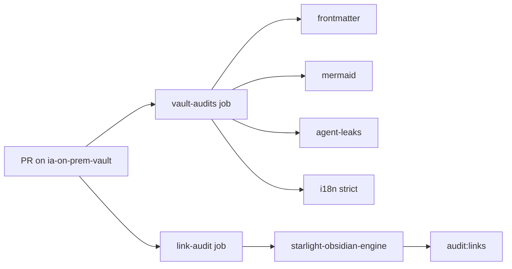

# Quality Checks — IA On-Premise Vault

This document describes the **deterministic** quality checks that run on every PR. They validate structure, links, and build safety **without launching an LLM agent**.

For editorial verification (sources, factual accuracy, translation quality), use the agent skills documented under `.agents/skills/` — especially `vault-verify-content`.

---

## Architecture



| Layer | Runs where | Needs agent? |
| :-- | :-- | :-- |
| Vault audits | `ia-on-prem-vault` CI + `npm test` | No |
| Link audit | Engine checkout in CI + `npm run audit:links` | No |
| Build smoke (engine) | `starlight-obsidian-engine` CI | No |
| Factual verification | `vault-verify-content` skill (on demand) | Yes |

---

## Quick start (local)

From the vault root:

```bash
npm test                  # full vault audit suite (CI gate)
npm run audit:frontmatter # title, description, last_modified
npm run audit:mermaid     # lightweight Mermaid syntax checks
npm run audit:agent-leaks # agent-only headings in FR notes
npm run audit:i18n:strict # FR/EN parity via last_modified
npm run audit:ascii       # ASCII diagram warnings (non-blocking)
npm run audit:ascii:strict
npm run audit:links       # delegates to engine (requires ENGINE_PATH)
```

`npm run audit:links` reads `ENGINE_PATH` from `.env` (see `.env.example`) and runs the engine link audit against this vault.

---

## CI workflow

File: `.github/workflows/ci.yml`

### Job 1 — `vault-audits`

Runs `npm test` on every push/PR to `main`. No npm dependencies required in the vault repo (plain Node.js scripts).

### Job 2 — `link-audit`

Checks out `starlight-obsidian-engine` alongside the vault, installs engine dependencies, then runs:

```bash
VAULT_PATH=<vault-checkout> FORCE_VAULT_PATH=1 npm run audit:links
```

Unresolved wiki-links are suppressed when listed in `.agents/vault-maintenance/link-audit-allowlist.md`.

---

## Audit reference

### `audit:frontmatter`

**Scope:** all published `.md` notes (FR + `en/`).

**Required fields:**

| Field | Rule |
| :-- | :-- |
| `title` | present, non-empty |
| `description` | present, non-empty |
| `last_modified` | `YYYY-MM-DD` |

See also [frontmatter-schema.md](./frontmatter-schema.md).

**Exit code:** `1` on any violation.

---

### `audit:mermaid`

**Scope:** all published `.md` notes.

Extracts every ` ```mermaid ` block and validates:

- non-empty body
- recognized diagram type on the first non-comment line
- balanced `[]`, `()`, `{}`

This is a **syntax smoke check**, not a visual render test. Full Mermaid rendering is covered indirectly when the engine builds the site.

**Exit code:** `1` on any invalid block.

---

### `audit:agent-leaks`

**Scope:** FR published notes only.

Fails if any of these headings appear in prose (outside fenced code):

- `Lexique - actions`
- `Nouvelles fiches à créer` / `Nouvelles fiches a creer`
- `Fiches à vérifier` / `Fiches a verifier`

**Exit code:** `1` on detection.

---

### `audit:i18n` / `audit:i18n:strict`

**Scope:** FR tree (excludes `en/` walk root).

| Mode | Threshold | Exit `1` when |
| :-- | :-- | :-- |
| `audit:i18n` | 7 days stale | missing EN mirror |
| `audit:i18n:strict` | 0 days | missing EN **or** FR `last_modified` > EN |

Included in `npm test` via strict mode.

---

### `audit:ascii` / `audit:ascii:strict`

**Scope:** all published `.md` notes.

Detects box-drawing characters (`┌`, `│`, `└`, etc.) outside fenced code blocks. Intentional ASCII (OTEL traces, Tailscale mini-diagram) is listed in `.agents/vault-maintenance/ascii-diagram-allowlist.md`.

| Mode | Behaviour |
| :-- | :-- |
| `audit:ascii` | warn-only, exit `0` |
| `audit:ascii:strict` | exit `1` on non-allowlisted findings |

Not part of `npm test` by default (legacy ASCII still present on a few pages).

---

### `audit:links` (engine)

Delegated to `starlight-obsidian-engine`. Validates Obsidian wiki-links and internal Markdown links resolve to published pages.

Allowlist: `.agents/vault-maintenance/link-audit-allowlist.md`.

---

## What stays agent-driven

These checks are **not** in CI because they require judgment, not binary rules:

| Task | Skill |
| :-- | :-- |
| Factual accuracy vs sources | `vault-verify-content` |
| Outdated hardware/benchmark refresh | `vault-refresh-outdated-content` |
| EN translation quality | `vault-translate-content` |
| Maintenance backlog report | `vault-maintenance-report` |

CI answers: *"Will this change break the site or editorial structure?"*  
Agents answer: *"Is this content still accurate and well written?"*

---

## Adding a new check

1. Create `scripts/audit-<name>.mjs` using helpers from `scripts/lib/vault-walk.mjs`.
2. Add an npm script in `package.json`.
3. If it should block PRs, append it to `scripts/run-audits.mjs`.
4. Document it in this file.
5. If the check needs suppressions, add an allowlist under `.agents/vault-maintenance/`.

---

## Implementation history

| Date | Change |
| :-- | :-- |
| 2026-06-10 | Initial vault CI: frontmatter, Mermaid, agent-leaks, i18n strict, link audit workflow |
