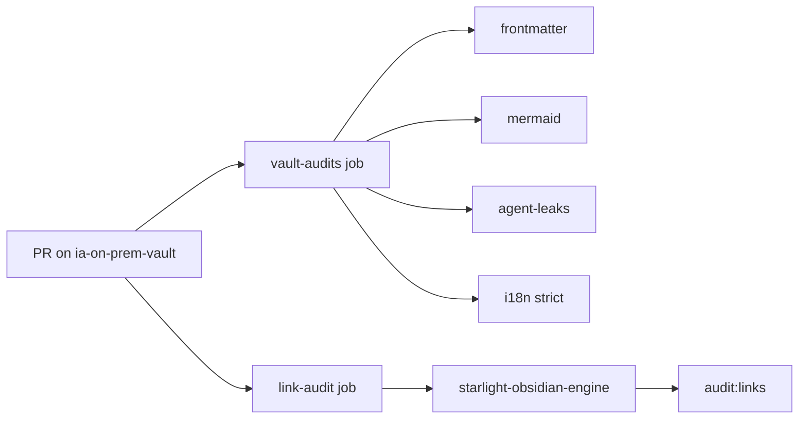

# Quality Checks — IA On-Premise Vault

This document describes the **deterministic** quality checks that run on every PR. They validate structure, links, and build safety **without launching an LLM agent**.

For editorial verification (sources, factual accuracy, translation quality), use the agent skills documented under `.agents/skills/` — especially `vault-verify-content`.

---

## Architecture


```mermaid
flowchart LR
  PR[PR on ia-on-prem-vault] --> VA[vault-audits job]
  PR --> LA[link-audit job]
  VA --> T1[frontmatter]
  VA --> T2[mermaid]
  VA --> T3[agent-leaks]
  VA --> T4[i18n strict]
  LA --> ENG[starlight-obsidian-engine]
  ENG --> LINKS[audit:links]
```

| Layer | Runs where | Needs agent? |
| :-- | :-- | :-- |
| Vault audits | `ia-on-prem-vault` CI + `npm test` | No |
| Link audit | Engine checkout in CI + `npm run audit:links` | No |
| Build smoke (engine) | `starlight-obsidian-engine` CI | No |
| Factual verification | `vault-verify-content` skill (on demand) | Yes |

---

## Quick start (local)

From the vault root:

```bash
npm test                  # full vault audit suite (CI gate)
npm run audit:frontmatter # title, description, last_modified
npm run audit:mermaid     # lightweight Mermaid syntax checks
npm run audit:agent-leaks # agent-only headings in FR notes
npm run audit:i18n:strict # FR/EN parity via last_modified
npm run audit:ascii       # ASCII diagram warnings (non-blocking)
npm run audit:ascii:strict
npm run audit:links       # delegates to engine (requires ENGINE_PATH)
```

`npm run audit:links` reads `ENGINE_PATH` from `.env` (see `.env.example`) and runs the engine link audit against this vault.

---

## CI workflow

File: `.github/workflows/ci.yml`

### Job 1 — `vault-audits`

Runs `npm test` on every push/PR to `main`. No npm dependencies required in the vault repo (plain Node.js scripts).

### Job 2 — `link-audit`

Checks out `starlight-obsidian-engine` alongside the vault, installs engine dependencies, then runs:

```bash
VAULT_PATH=<vault-checkout> FORCE_VAULT_PATH=1 npm run audit:links
```

Unresolved wiki-links are suppressed when listed in `.agents/vault-maintenance/link-audit-allowlist.md`.

### Branch protection (`main`)

Since 2026-10-09 a GitHub ruleset named **Protection de main** enforces, with no bypass actor:

| Rule | Effect |
| :-- | :-- |
| deletion | `main` cannot be deleted |
| non_fast_forward | no force-push to `main` |
| pull_request | every change reaches `main` through a PR (0 approvals required, squash or merge) |
| required_status_checks | `Vault quality checks` and `Internal link audit (engine)` must pass on the PR head |

`audit:sources` is deliberately **not** a required check: it depends on third-party hosts and must stay warn-only.

---

## Audit reference

### `audit:frontmatter`

**Scope:** all published `.md` notes (FR + `en/`).

**Required fields:**

| Field | Rule |
| :-- | :-- |
| `title` | present, non-empty |
| `description` | present, non-empty |
| `last_modified` | `YYYY-MM-DD` |

See also [frontmatter-schema.md](./frontmatter-schema.md).

**Exit code:** `1` on any violation.

---

### `audit:mermaid`

**Scope:** all published `.md` notes.

Extracts every ` ```mermaid ` block and validates:

- non-empty body
- recognized diagram type on the first non-comment line
- balanced `[]`, `()`, `{}`

This is a **syntax smoke check**, not a visual render test. Full Mermaid rendering is covered indirectly when the engine builds the site.

**Exit code:** `1` on any invalid block.

---

### `audit:agent-leaks`

**Scope:** FR published notes only.

Fails if any of these headings appear in prose (outside fenced code):

- `Lexique - actions`
- `Nouvelles fiches à créer` / `Nouvelles fiches a creer`
- `Fiches à vérifier` / `Fiches a verifier`

**Exit code:** `1` on detection.

---

### `audit:i18n` / `audit:i18n:strict`

**Scope:** FR tree (excludes `en/` walk root).

| Mode | Threshold | Exit `1` when |
| :-- | :-- | :-- |
| `audit:i18n` | 7 days stale | missing EN mirror |
| `audit:i18n:strict` | 0 days | missing EN **or** FR `last_modified` > EN |

Included in `npm test` via strict mode.

---

### `audit:ascii` / `audit:ascii:strict`

**Scope:** all published `.md` notes.

Detects box-drawing characters (`┌`, `│`, `└`, etc.) outside fenced code blocks. Intentional ASCII (OTEL traces, Tailscale mini-diagram) is listed in `.agents/vault-maintenance/ascii-diagram-allowlist.md`.

| Mode | Behaviour |
| :-- | :-- |
| `audit:ascii` | warn-only, exit `0` |
| `audit:ascii:strict` | exit `1` on non-allowlisted findings |

Not part of `npm test` by default (legacy ASCII still present on a few pages).

---

### `audit:sources` / `audit:sources:offline` / `audit:sources:report`

**Scope:** FR published notes by default (`--locale=all` adds `en/`). Fenced and inline code are ignored, so `localhost` examples never count as sources.

Extracts every external URL, deduplicates it, records the citing pages, classifies the host by evidence tier from `.agents/vault-maintenance/source-tiers.md`, and (unless `--no-fetch`) probes it over HTTP (HEAD, then GET).

| Status | Meaning |
| :-- | :-- |
| `ok` | 2xx at the cited URL |
| `redirected` | 2xx after a redirect to a different URL (check the target still says the same thing) |
| `blocked` | 401 / 403 / 429 — bot protection, not proof of a dead link; verify manually |
| `dead` | other 4xx |
| `server-error`, `network-error`, `timeout` | unreachable during the run |

| Mode | Behaviour |
| :-- | :-- |
| `audit:sources` | probe, Markdown report on stdout, exit `0` |
| `audit:sources:offline` | inventory + tiers only, no network |
| `audit:sources:report` | probe, write `.agents/vault-maintenance/reports/sources-latest.md` + `.json` |
| `--strict` | exit `1` when any URL is dead / erroring |

Not part of `npm test` (network-dependent). Intended for the refresh workflow (`vault-refresh-outdated-content`, phase 0) and for a scheduled weekly CI job in warn-only mode.

---

### `audit:freshness` / `audit:freshness:due` / `audit:freshness:strict`

**Scope:** FR published notes (EN mirrors follow their FR page), excluding `00-index.md`, the glossary hub and the generated lexicon index.

Assigns each page a volatility class — from its `freshness:` frontmatter field when present (`volatile`, `evolving` or `stable`), otherwise from the folder rules in `.agents/vault-maintenance/freshness-watchlist.md` — and compares `last_verified` + cadence (90 / 180 / 365 days) with today (or `--as-of=YYYY-MM-DD`).

| Status | Meaning |
| :-- | :-- |
| `never-verified` | no valid `last_verified` |
| `overdue` | due date passed |
| `due-soon` | due within 30 days |
| `ok` | up to date |

Each row also shows the June 2026 baseline flag (bulk-stamped dates, see `frontmatter-schema.md`) and, from the watchlist, the number of open claims (not `current`) and of claims flagged "à revérifier". Two extra sections list the individual watchlist claims whose **Recheck by** date has passed or falls within 14 days.

| Mode | Behaviour |
| :-- | :-- |
| `audit:freshness` | full Markdown report, exit `0` |
| `audit:freshness:due` | only never-verified / overdue / due-soon pages |
| `audit:freshness:strict` | exit `1` when a page is overdue or never verified |
| `--json=path` | also write a JSON report |

Not part of `npm test`: the result depends on the calendar, not on the PR. It runs weekly in `.github/workflows/freshness.yml` (warn-only, with `audit:sources`) and is phase 0 of `vault-refresh-outdated-content`.

---

### `watch:feeds`

**Scope:** the sources of `.agents/vault-maintenance/feeds.json` — GitHub releases, tags and security advisories of the tools the vault covers, Hugging Face model listings of the main open-weight publishers, vendor and regulator RSS feeds, and the Vision IA YouTube channel as tier C signal.

Lists every item published in the last N days (default 8, `--days`, `--since`, `--only=<domains>`, `--json`). Stateless and deterministic: no LLM. `GITHUB_TOKEN` / `GH_TOKEN` is needed for advisories.

**Pre-triage** (rules only, `--no-triage` to disable) marks each item `keep` or `drop` with a reason, so the agent reads about 30 items instead of 140:

| Rule | Drops |
| :-- | :-- |
| Releases | pre-releases (rc, beta, dev, nightly, proto-…); releases below the feed's `minLevel` (default `minor`, so patch releases go; `major` for chatty projects); `collapse` feeds (build per commit). A release whose notes mention a security fix is kept anyway |
| Advisories | low severity; advisories whose vulnerable range excludes, or whose lowest patched version is at or below, the floor in `.agents/vault-maintenance/version-floors.json` |
| Hugging Face | quant-suffixed repos (GGUF, AWQ, FP8, MLX…), third-party quantizations, adapters; third-party fine-tunes and merges in discovery |
| Seen | any URL already listed in `watch-seen.md` |
| Keywords | `keywords` match at the start of a word (`IA` no longer matches `Debian`); `exclude` is a regex on the title |

Kept items split into **core** (need a primary-source check) and **leads** (discovery and tier C signals, skimmed only). High / Critical advisories not covered by a floor are flagged `urgent`. The JSON caches release notes and advisory texts (`notes`, 4 000 characters max) for kept items, so the agent does not refetch them.

`.github/workflows/watch.yml` runs every Monday at 06:30 UTC (warn-only). On even ISO weeks it opens a GitHub issue labelled `veille` over a 15-day window; on odd weeks it opens one only when an advisory is `urgent` (labels `veille`, `urgent`). A manual run always opens an issue. The run artifact `weekly-watch` holds `watch.md` and `watch.json`. The `vault-watch` skill turns the issue into verified events, an impact map and a PR.

Keep `version-floors.json` in step with the "Planchers de version" callout of `06-mise-en-oeuvre/local-inference-security.md`: when a floor moves, update both in the same PR.

---

### `audit:links` (engine)

Delegated to `starlight-obsidian-engine`. Validates Obsidian wiki-links and internal Markdown links resolve to published pages.

Allowlist: `.agents/vault-maintenance/link-audit-allowlist.md`.

---

## What stays agent-driven

These checks are **not** in CI because they require judgment, not binary rules:

| Task | Skill |
| :-- | :-- |
| Factual accuracy vs sources | `vault-verify-content` |
| Outdated hardware/benchmark refresh | `vault-refresh-outdated-content` |
| EN translation quality | `vault-translate-content` |
| Maintenance backlog report | `vault-maintenance-report` |

CI answers: *"Will this change break the site or editorial structure?"*  
Agents answer: *"Is this content still accurate and well written?"*

---

## Adding a new check

1. Create `scripts/audit-<name>.mjs` using helpers from `scripts/lib/vault-walk.mjs`.
2. Add an npm script in `package.json`.
3. If it should block PRs, append it to `scripts/run-audits.mjs`.
4. Document it in this file.
5. If the check needs suppressions, add an allowlist under `.agents/vault-maintenance/`.

---

## Implementation history

| Date | Change |
| :-- | :-- |
| 2026-06-10 | Initial vault CI: frontmatter, Mermaid, agent-leaks, i18n strict, link audit workflow |
| 2026-10-09 | `audit:sources` (URL inventory, HTTP probe, evidence tiers) for the refresh workflow; not in `npm test` |
| 2026-10-10 | `audit:freshness` (volatility classes, due pages, baseline flag, watchlist counters) and the weekly warn-only `freshness.yml` workflow |
| 2026-10-10 | Claim-level **Recheck by** column in the watchlist; `watch:feeds` and the weekly `watch.yml` workflow opening a `veille` issue; `vault-watch` skill |
| 2026-10-10 | Watch cost cut: deterministic pre-triage and `version-floors.json` in `watch:feeds`, cached release notes in the JSON, biweekly issue with an `urgent` label in between, one-page agent brief for `vault-watch` |
