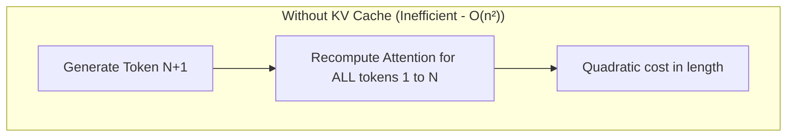
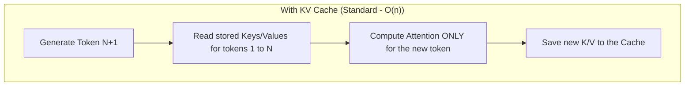

> [!tip] In brief
> Model weights occupy fixed VRAM. But the longer your conversation, the larger the KV Cache grows—and it can consume as much VRAM as the model itself. This chapter explains that mechanism and how to control it.

If a model's weights (its parameters) determine the minimum VRAM needed to start an AI, **context length** (the prompt + history) dictates how much dynamic memory is consumed during use.

In practice, a very long context (32K, 128K, or more) can consume **more [[00-lexique/vram|VRAM]] than the model itself** [^1]. That bottleneck is managed by a physical mechanism called the **KV Cache** (Key-Value Cache) [^1].

---

## 🧠 The physical mechanism: Why the KV Cache exists

In the Transformer architecture, to generate token $N+1$, the model must compute attention (relationships) between that new token and **all previous tokens ($1$ to $N$)** [^2].

*   **Without KV Cache:** For each generated word, the model would have to re-run all computations for the entire history from the start. Computational complexity would be quadratic ($O(n^2)$), making the AI unusable on long prompts [^2].
*   **With KV Cache:** The inference engine computes the **Key (K)** and **Value (V)** vectors for each token once (during the [[00-lexique/prefill|Prefill]] phase) and stores them in VRAM [^2]. During [[00-lexique/decoding|Decoding]], the model only reads this cache instead of recomputing history [^2].

---

## 📐 The mathematical equation of the KV Cache

To compute the exact memory footprint (in bytes) of the KV Cache, use the following formula, adapted to the modern **GQA (Grouped-Query Attention)** architecture [^3][^4]:

$$\text{KV Cache size (bytes)} = 2 \times L \times H_{kv} \times D \times S \times B \times B_{pe}$$

Where:
*   **$2$** : Represents the two stored tensors (Key and Value) [^3].
*   **$L$** : Number of Transformer layers (*Layers*) [^3].
*   **$H_{kv}$** : Number of Key-Value attention heads (after GQA) [^3].
*   **$D$** : Dimension of each head (*Head Dimension*) [^3].
*   **$S$** : Sequence length (*Sequence Length*, in tokens) [^3].
*   **$B$** : Batch size (*Batch Size*, number of concurrent requests) [^3].
*   **$B_{pe}$** : Size of one element in memory (*Bytes Per Element*, e.g. $2$ for FP16/BF16, $1$ for FP8/INT8; NVFP4 targets ~$0{,}5$ bytes with slight scaling overhead) [^3][^12].

> [!note] GB vs GiB
> The tables below express sizes in **decimal gigabytes (GB, $10^9$ bytes)**, as most technical sheets in this project do. Operating systems and tools (`nvidia-smi`, Activity Monitor) often display **gibibytes (GiB, $2^{30}$ bytes)** under the label "GB" or "Go". At 128K tokens BF16, $41{,}94 \text{ GB}$ ≈ **$39{,}06 \text{ GiB}$** — a gap of about 7% to factor into your VRAM safety margin.

### 💡 Focus: The impact of GQA architecture
In the older MHA (Multi-Head Attention) architecture, each Query head had its own Key-Value head ($H_{kv} = H_{query}$).
With **Grouped-Query Attention (GQA)**, several Query heads share the same Key/Value head (on Llama 3.1 70B: $64$ Query heads for $8$ KV heads, an 8:1 ratio) [^5]. This **divides KV Cache size by 8 in memory**, with generally small quality loss—close to MHA on common benchmarks, though not zero [^5].

---

## 📊 Practical cases: VRAM sizing (Llama 3.1 70B)

Take the reference model **Llama 3.1 70B** [^4]. Its physical characteristics are:
*   Number of layers ($L$) = $80$ [^4]
*   Number of KV heads ($H_{kv}$) = $8$ (GQA) [^4]
*   Head dimension ($D$) = $128$ [^4]
*   Native precision ($B_{pe}$) = $2$ bytes (BF16) [^4]
*   Native context window = **128K tokens** [^4]

Let's calculate the VRAM required for **a single request ($B=1$)** at different context windows:

| Context length ($S$) | KV Cache size (BF16) | Size with quantization (FP8) [^8] | Size with NVFP4 (Blackwell) [^12] |
| :--- | :--- | :--- | :--- |
| **8,192 tokens** | $\sim 2.68 \text{ GB}$ | $\sim 1.34 \text{ GB}$ | $\sim 0.67 \text{ GB}$ |
| **32,768 tokens** (32K) | $\sim 10.73 \text{ GB}$ | $\sim 5.36 \text{ GB}$ | $\sim 2.68 \text{ GB}$ |
| **128,000 tokens** (128K, native max) | $\sim 41.94 \text{ GB}$ | $\sim 20.97 \text{ GB}$ | $\sim 10.48 \text{ GB}$ |
| **300,000 tokens** (extrapolation) | $\sim 98.30 \text{ GB}$ | $\sim 49.15 \text{ GB}$ | $\sim 24.57 \text{ GB}$ |

> [!note] 300K extrapolation
> The **300K** row is a **mathematical extrapolation** (RoPE scaling or context extended by the engine), not the model's native window. BF16 figures at 128K align with public estimates from Meta and Hugging Face (~39–42 GB) [^6].

### The long-context OOM (Out Of Memory) trap

> [!warning] OOM trap
> If you run Llama 3.1 70B quantized to 4-bit (which weighs $\sim 40 \text{ GB}$ in fixed weights) on a 64 GB Mac Studio:
>
> *   At **8K context**, the total (Model + Cache) is $\sim 42.7 \text{ GB}$. Everything runs fine.
> *   At **128K context** in BF16, the KV Cache needs an additional $41.9 \text{ GB}$. Total required climbs to **$82 \text{ GB}$**. Your 64 GB machine hits *Out Of Memory* or falls back to slow system RAM, destroying performance [^1].

---

## 🛠️ Context optimization technologies

To avoid VRAM explosion on-premises, systems engineers deploy several software optimizations:

### 1. PagedAttention (vLLM / SGLang)
In classic inference engines, the KV Cache is often **pre-allocated contiguously** in VRAM [^7]. That creates fragmentation and waste: naive implementations typically use only **20 to 38%** of GPU memory reserved for the KV cache [^7].
**[[00-lexique/pagedattention|PagedAttention]]** draws on operating-system **paged memory** [^7]. The KV Cache is split into fixed blocks, allocated on demand and mapped via a page table. Memory utilization rises to **~96%**, and throughput typically increases by **2 to 4×** at equivalent latency (more depending on workload) [^7].

### 2. KV Cache quantization (FP8 / INT8 / Q4)
Just as model weights can be compressed, the KV Cache can be compressed too [^1].
*   **FP8 / INT8 :** Natively supported by `vLLM` (`kv_cache_dtype="fp8"`) and other production engines [^8]. This halves cache size; precision stays close to BF16 if scales are **calibrated** (dataset or `llm-compressor`), with possible gaps on some hybrid-attention models or high `head_dim` [^8][^13].
*   **Q4 / INT8 on K and V :** `llama.cpp` exposes `--cache-type-k` and `--cache-type-v` (e.g. `q8_0` / `q4_0`) [^9]. Aggressive compression can degrade perplexity on long reasoning, especially if keys (K) are over-quantized [^9].

### 3. Flash-Decoding (FlashAttention-2/3)
On very long contexts, the decoding phase becomes limited by [[00-lexique/memory-bandwidth|memory bandwidth]]: with a batch of 1, classic FlashAttention under-utilizes the GPU [^10].
**Flash-Decoding** (Together AI, 2023) adds a parallelism dimension over **Key-Value sequence length**: K/V blocks are read and processed in parallel, then recombined [^10]. This technique is carried into **FlashAttention-3** (split-KV, GQA parallelization) for Hopper GPUs and beyond [^11].

---

## 📋 The architect's advice

For any on-premise assistant deployment, KV cache management dictates your hardware strategy:

1.  **Inject context, don't drown the model:** Rather than loading entire 150,000-word files into the LLM window (which would saturate dynamic VRAM), retrieve only relevant passages—via a structured **Memory Tree** (Markdown chunks + hierarchical summaries)[^14], vector RAG, or both combined.
2.  **Enable FP8 KV Cache:** If you use a vLLM- or LMDeploy-based engine, configure the KV cache in FP8 to halve dynamic VRAM consumption, calibrating scales when possible [^8].
3.  **Watch the batch/context ratio:** On a server shared by several collaborators at once, the KV Cache multiplies by the number of active users ($B$)—size VRAM accordingly.

---

## 📚 Sources and references

[^1]: NVIDIA Technical Blog, *Mastering LLM Techniques: Inference Optimization*, novembre 2023. [https://developer.nvidia.com/blog/mastering-llm-techniques-inference-optimization/](https://developer.nvidia.com/blog/mastering-llm-techniques-inference-optimization/)
[^2]: NVIDIA Technical Blog, *Mastering LLM Techniques: Inference Optimization* (prefill, decode, mécanisme KV cache), novembre 2023. [https://developer.nvidia.com/blog/mastering-llm-techniques-inference-optimization/](https://developer.nvidia.com/blog/mastering-llm-techniques-inference-optimization/)
[^3]: VMware Cloud Foundation Blog, *LLM Inference Sizing and Performance Guidance* (formule KV cache GQA), septembre 2024. [https://blogs.vmware.com/cloud-foundation/2024/09/25/llm-inference-sizing-and-performance-guidance/](https://blogs.vmware.com/cloud-foundation/2024/09/25/llm-inference-sizing-and-performance-guidance/)
[^4]: Meta, *Llama 3.1 Model Card* (architecture, GQA, contexte 128K), juillet 2024. [https://github.com/meta-llama/llama-models/blob/main/models/llama3_1/MODEL_CARD.md](https://github.com/meta-llama/llama-models/blob/main/models/llama3_1/MODEL_CARD.md)
[^5]: Joshua Ainslie et al., *GQA: Training Generalized Multi-Query Transformer Models from Multi-Head Checkpoints* (arXiv:2305.13245), 2023. [https://arxiv.org/html/2305.13245](https://arxiv.org/html/2305.13245)
[^6]: Hugging Face Blog, *Llama 3.1* (tableau empreinte KV cache FP16 par taille de modèle), juillet 2024. [https://github.com/huggingface/blog/blob/main/llama31.md](https://github.com/huggingface/blog/blob/main/llama31.md)
[^7]: Woosuk Kwon et al., *Efficient Memory Management for Large Language Model Serving with PagedAttention* (SOSP 2023). [https://dl.acm.org/doi/10.1145/3600006.3613165](https://dl.acm.org/doi/10.1145/3600006.3613165)
[^8]: vLLM Documentation, *Quantized KV Cache* (FP8, calibration), 2026. [https://docs.vllm.ai/en/latest/features/quantization/quantized_kvcache.html](https://docs.vllm.ai/en/latest/features/quantization/quantized_kvcache.html)
[^9]: llama.cpp, *Server README* (`--cache-type-k`, `--cache-type-v`), 2026. [https://github.com/ggml-org/llama.cpp/blob/master/tools/server/README.md](https://github.com/ggml-org/llama.cpp/blob/master/tools/server/README.md)
[^10]: Together AI, *Flash-Decoding for long-context inference*, octobre 2023. [https://www.together.ai/blog/flash-decoding-for-long-context-inference](https://www.together.ai/blog/flash-decoding-for-long-context-inference)
[^11]: Dao-AILab, *FA3 kvcache + split kv + gqa parallelization* (PR #1236), septembre 2024. [https://github.com/Dao-AILab/flash-attention/pull/1236](https://github.com/Dao-AILab/flash-attention/pull/1236)
[^12]: NVIDIA Technical Blog, *Optimizing Inference for Long Context and Large Batch Sizes with NVFP4 KV Cache*, décembre 2025. [https://developer.nvidia.com/blog/optimizing-inference-for-long-context-and-large-batch-sizes-with-nvfp4-kv-cache/](https://developer.nvidia.com/blog/optimizing-inference-for-long-context-and-large-batch-sizes-with-nvfp4-kv-cache/)
[^13]: vLLM Blog, *The State of FP8 KV-Cache and Attention Quantization in vLLM*, avril 2026. [https://vllm.ai/blog/2026-04-22-fp8-kvcache](https://vllm.ai/blog/2026-04-22-fp8-kvcache)
[^14]: OpenHuman, *Memory Trees* (GitBook — pipeline local SQLite + Markdown, injection sélective), 2025. [https://tinyhumans.gitbook.io/openhuman/features/memory-tree](https://tinyhumans.gitbook.io/openhuman/features/memory-tree)
