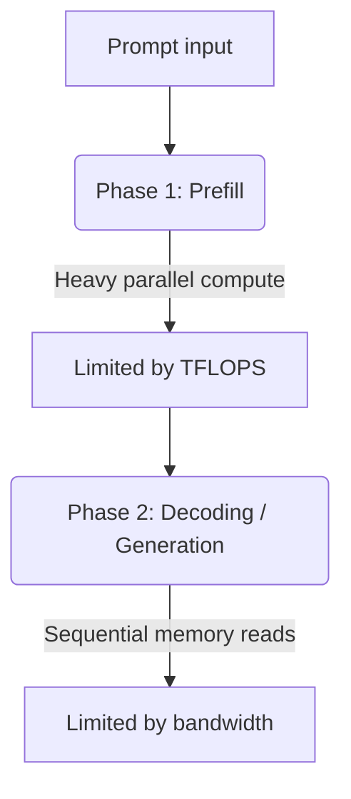

> [!tip] In brief
> The limit of local inference is not compute power — it's memory transfer speed. Adding TFLOPS does nothing if data cannot arrive fast enough — that's the "Memory Wall".

> [!info] Recommended prerequisite
> This chapter assumes you know how a token is generated. If not, start with [[01-fondations/journey-of-a-prompt|🧠 The Journey of a Prompt]].

You may have heard: *"To run an LLM, you need a powerful GPU."* That's true, but incomplete. In practice, **the fastest card on the market can saturate and become as slow as an entry-level card** — if memory cannot keep up.

That's the paradox this chapter explains. Understanding memory bandwidth means understanding why your setup generates 4 tokens/s instead of 40 — and how to fix it.

In system architecture applied to AI, one reality keeps coming back: for [[00-lexique/inference|LLM inference]], the limit is often **memory** before raw compute[^1].

This phenomenon is classically called the **"Memory Wall"**. During autoregressive generation, the GPU/CPU alternates very fast compute phases and phases waiting for data from memory. Final throughput is therefore strongly correlated with **memory bandwidth** (GB/s), not just TFLOPS[^1].

---

## 🧠 Inference physics: Prefill vs Decoding

To understand the bottleneck, separate two phases:

### 1. The "Prefill" phase (Context ingestion)
The model processes the input prompt in parallel (large matrices).
*   **Hardware behavior:** better use of compute units.
*   **Dominant factor:** compute + memory mix, often more favorable to compute than [[00-lexique/decoding|decoding]].

### 2. The "Decoding" phase (Word-by-word generation)
The model generates one token, then repeats for the next. This process is sequential.
*   **Hardware behavior:** repeated reads of weights + [[00-lexique/kv-cache|KV Cache]] management; arithmetic intensity is lower than in [[00-lexique/prefill|prefill]].
*   **Dominant factor:** **memory bandwidth**, especially at low batch size[^1].

---

## 📐 The throughput equation

For quick sizing, use an upper bound:

$$\text{Max speed (tokens/s)} = \frac{\text{Memory bandwidth (GB/s)}}{\text{Model size in memory (GB)}}$$

> [!note] Approximation
> This formula is a **first-order approximation**: it does not include all runtime effects (kernels, KV cache, scheduler, batch, fragmentation, etc.).

### Practical case: Dense 70B model in [[00-lexique/quantification-q4|4-bit quantization (Q4)]]
A dense 70B model quantized to 4-bit uses about **40 GB** of weight memory (order of magnitude).

> [!note] Important note
> There is no official "Llama 4 70B". Llama 4 is published as MoE variants (Scout/Maverick). For a dense 70B example, the Llama 3.x family is more appropriate[^2].

1.  **On a classic PC (DDR5 dual channel):**
    *   Real bandwidth: $\sim 100 \text{ GB/s}$
    *   Calculation: $\frac{100 \text{ GB/s}}{40 \text{ GB}} = \mathbf{2.5 \text{ tokens/s}}$ (theoretical bound).
2.  **On AMD Ryzen AI Max PRO 495 (Strix Halo):**
    *   Real bandwidth: $\sim 273 \text{ GB/s}$
    *   Calculation: $\frac{273 \text{ GB/s}}{40 \text{ GB}} = \mathbf{6.8 \text{ tokens/s}}$ (theoretical bound).
3.  **On Mac Studio M4 Max (high-end unified memory):**
    *   Real bandwidth: $546 \text{ GB/s}$
    *   Calculation: $\frac{546 \text{ GB/s}}{40 \text{ GB}} = \mathbf{13.6 \text{ tokens/s}}$ (theoretical bound).
4.  **On Nvidia RTX 5090 (dedicated GDDR7 VRAM — Blackwell):**
    *   Real bandwidth: $1{,}792 \text{ GB/s}$
    *   Calculation: $\frac{1792 \text{ GB/s}}{40 \text{ GB}} = \mathbf{44.8 \text{ tokens/s}}$ (theoretical bound).

---

## 📊 Storage technology comparison (2026)

Values below are order-of-magnitude guides for architecture (real performance varies by software stack and workload).

| Technology | Bandwidth (order of magnitude) | Source | Impact on inference |
| :-- | :-- | :-- | :-- |
| **10 GbE Ethernet** | $\sim 1.25 \text{ GB/s}$ | 10 Gbit/s conversion | too low to "extend" a model online without heavy penalty |
| **PCIe 5.0 x16** | $\sim 64 \text{ GB/s}$ (aggregate) | bus spec | becomes a bottleneck for frequent CPU↔GPU transfers |
| **DDR5 desktop RAM** | $\sim 80$ to $100 \text{ GB/s}$ | typical dual-channel platforms | high capacity, limited throughput for large LLMs |
| **AMD Ryzen AI Max PRO 400 unified memory** | up to $\sim 273 \text{ GB/s}$ | [^3] | interesting capacity/bandwidth trade-off on x86 |
| **Apple M4 Max / M3 Ultra unified memory** | $546$ to $819 \text{ GB/s}$ | [^4] | excellent local throughput without PCIe offload |
| **RTX 5090 VRAM (GDDR7)** | $\sim 1.79 \text{ TB/s}$ | [^5][^6] | very high throughput for fast decoding |

---

## Network clustering limits

> [!warning] Breaking point
> As soon as you aggregate memory across machines, the interconnect becomes the breaking point:
>
> 1.  **The cable can dominate the chain:** a 10 GbE link caps around 1.25 GB/s, far below hundreds of GB/s of local memory.
> 2.  **[[00-lexique/rdma|RDMA]] is key in pro environments:** RoCE/InfiniBand reduces CPU cost of transfers and improves inter-node latency.

> [!tip] Architect's advice
> In any on-premise deployment, [[03-stack-logicielle/rag-and-agents|RAG]] is a key ally for bandwidth. By injecting only relevant passages (rather than whole documents), you avoid saturating memory with useless data and keep [[00-lexique/ttft|TTFT]] under control.

---

## 📚 Sources and references

[^1]: Amir Gholami et al., *AI and Memory Wall* (arXiv:2403.14123), 2024. [https://arxiv.org/abs/2403.14123](https://arxiv.org/abs/2403.14123)
[^2]: Meta, *Llama 4 Model Card* (Scout/Maverick, MoE, no dense "70B" variant), 2025. [https://raw.githubusercontent.com/meta-llama/llama-models/main/models/llama4/MODEL_CARD.md](https://raw.githubusercontent.com/meta-llama/llama-models/main/models/llama4/MODEL_CARD.md)
[^3]: ServeTheHome, *AMD Ups Ante With 192GB Ryzen AI Max PRO 400 Chips for AI Systems*, 2026. [https://www.servethehome.com/amd-reveals-ryzen-ai-max-pro-400-series-192gb-ram-for-ai-systems/](https://www.servethehome.com/amd-reveals-ryzen-ai-max-pro-400-series-192gb-ram-for-ai-systems/)
[^4]: Apple, *Mac Studio - Technical Specifications*, 2026. [https://www.apple.com/mac-studio/specs/](https://www.apple.com/mac-studio/specs/)
[^5]: NVIDIA, *GeForce RTX 5090 product page* (32 GB GDDR7, 512-bit bus, TGP 575 W). [https://www.nvidia.com/fr-fr/geforce/graphics-cards/50-series/rtx-5090/](https://www.nvidia.com/fr-fr/geforce/graphics-cards/50-series/rtx-5090/)
[^6]: TechPowerUp, *NVIDIA GeForce RTX 5090 Specs* (memory bandwidth 1.79 TB/s), 2026. [https://www.techpowerup.com/gpu-specs/geforce-rtx-5090.c4216](https://www.techpowerup.com/gpu-specs/geforce-rtx-5090.c4216)
