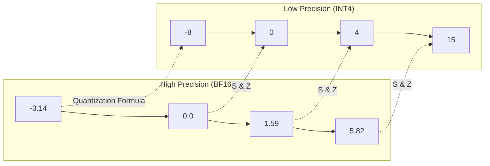

> [!tip] In brief
> Quantization lets you run a 70B model in ~40 GB instead of ~140 GB, accepting a slight quality loss. It's the number one lever for fitting a large model to your hardware without spending €300,000.

**Quantization** reduces the numerical precision of network **weights** (and sometimes **activations**) [^1].

By moving from native **FP16/BF16** precision (2 bytes per parameter) to compressed **8-bit** (1 byte), **4-bit** (~0.5 effective byte), or lower formats, you divide a model's [[00-lexique/vram|VRAM]] footprint by 2 to 4, enabling local execution of models that would otherwise be beyond your hardware [^1].

> [!note] Related topic
> Quantization reduces **fixed weights**; the [[01-fondations/kv-cache-and-context|KV Cache]] remains a separate dynamic VRAM cost, which can also be quantized independently.

---

## 📐 The Mathematical Physics of Quantization

The most common post-training approach is **affine block-wise quantization** (often called uniform linear quantization with scale and zero-point) [^1][^2]. It maps a range of real values ($x \in [\beta_{min}, \beta_{max}]$) to a low-precision discrete set ($q$):

$$q = \text{round}\left(\frac{x}{S}\right) + Z$$

Where:
*   **$S$ (Scale)**: real scaling factor that stretches or compresses the interval [^2].
*   **$Z$ (Zero-point)**: integer that aligns the real zero to a discrete value [^2].
*   **$\text{round}$**: round to nearest integer.

### ⚠️ The outlier problem
In an LLM, some activations or weights have abnormally high magnitudes [^2][^6]. If you quantize an entire tensor with a single scale, $S$ must cover those extremes: **most normal values then end up compressed into a few discrete bins**, which strongly degrades quality (perplexity, downstream benchmarks) [^2][^6].

Recent LLM quantization research aims to work around this: protecting subsets of weights (AWQ), Hessian-based compensation (GPTQ), Hadamard rotations (MR-GPTQ), or fine-grained FP4 formats (NVFP4/MXFP4) [^5][^6][^8].

---

## 🗺️ The Quantization Format Landscape (2026)

Format choice depends on your **target infrastructure** (CPU, dedicated GPU, unified memory) and **inference engine** (llama.cpp, vLLM, TensorRT-LLM).

### 1. GGUF (llama.cpp): the CPU / unified memory standard
The **[[00-lexique/gguf|GGUF]]** format ([llama.cpp](https://github.com/ggml-org/llama.cpp) ecosystem) targets local inference, partial [[00-lexique/offloading|offloading]] to RAM, and Apple Silicon [^3][^4].

*   **K-Quants (superblocks):** weights are split into **256-value** super-blocks, with sub-blocks and multiple scales [^4]. Variants such as `Q4_K_M`, `Q5_K_M`, etc. use **mixed precision**: sensitive tensors (often attention matrices) stay at higher precision than the rest of the network [^4].
*   **Ideal for:** Mac Studio, x86 Ryzen, CPU-first inference, sovereign deployments without a heavy GPU stack [^3].

### 2. AWQ vs GPTQ (GPU standard)
These formats dominate production GPU inference (vLLM, TGI, etc.) [^5][^6].

*   **GPTQ** (*Generative Pre-trained Transformer Quantization*): one-shot PTQ that minimizes reconstruction error using the **Hessian matrix** to compensate rounding layer by layer [^5].
*   **AWQ** (*Activation-aware Weight Quantization*): identifies roughly **1%** of the most "salient" weights via activation magnitude and **protects them at higher precision**; the rest is compressed to 4-bit [^6]. In practice, AWQ often matches or beats GPTQ on quality benchmarks at equal size [^6].
*   **Ideal for:** maximum GPU throughput on Nvidia/AMD with dedicated kernels.

### 3. Microscaling FP4: MXFP4 and NVFP4
Standardized by the **OCP** (Open Compute Project) and hardware-accelerated on recent GPUs (Blackwell, MI300/MI350) [^7][^8]:

*   **E2M1 format:** 4-bit floating-point numbers (1 sign, 2 exponent, 1 mantissa) [^7].
*   **MXFP4:** **E8M0** block scale shared across **32 values** [^7].
*   **NVFP4 (NVIDIA):** **E4M3 FP8** scale over **16 values**, plus a per-tensor scale factor [^7][^9].
*   **MR-GPTQ** (ICLR 2026): GPTQ variant with per-block **Hadamard rotations**, adapted to FP4 constraints. It substantially improves MXFP4 and approaches NVFP4 accuracy, with up to **~4× end-to-end** speedups on RTX 5090 and **~2.2×** on B200 vs FP16 — but FP4 is **not an automatic upgrade** over INT4 without a dedicated method [^8].

---

## 📊 Trade-off: Size, Perplexity, and downstream quality

**Perplexity (PPL)** on WikiText-2 measures predictive capability (lower is better). It is useful for comparing quantizations **on the same model and tokenizer**, but **is not sufficient**: small PPL gaps can hide regressions in reasoning or instruction-following [^4][^9].

### GGUF benchmarks — Llama 3.1-8B-Instruct (unified data)

*Source: llama.cpp study on a single checkpoint, 13 GGUF formats + F16 baseline [^4]. PPL = WikiText-2; Avg = unweighted mean of GSM8K, HellaSwag, IFEval, MMLU, TruthfulQA.*

| Format | Effective bpw (≈) | Size reduction (%) [^4] | PPL WikiText-2 | Avg downstream | Comment |
| :--- | :--- | :--- | :--- | :--- | :--- |
| **F16 (reference)** | 16.0 | — | **7.32** | **69.47** | Baseline |
| **Q8_0** | 8.0 | 46.9 | 7.33 | 69.41 | Nearly identical to F16 |
| **Q6_K** | ~6.1 | 59.0 | 7.35 | 69.23 | Conservative |
| **Q5_0** | ~5.2 | 65.2 | 7.43 | **69.92** | Best Pareto size/quality compromise [^4] |
| **Q5_K_M** | ~5.5 | 64.4 | 7.40 | 69.36 | Robust 5-bit K-quant |
| **Q4_K_S** | ~4.2 | 70.8 | 7.62 | 69.17 | **Balanced 4-bit default** [^4] |
| **Q4_K_M** | ~4.5 | 69.4 | 7.56 | 69.15 | Common community standard |
| **Q3_K_M** | ~3.5 | 75.0 | 7.96 | 68.07 | Usable 3-bit if constrained |
| **Q3_K_S** | ~3.4 | 77.2 | 8.96 | 65.49 | Maximum compression, visible loss |
| **Q2_K** | ~2.5 | — | — | — | See llama.cpp scoreboard: PPL ~9.75 on Llama 3 **8B base** [^10] |

> [!note] VRAM ballpark figures
> BF16 ~140 GB; FP8 ~70 GB; Q4 ~40 GB (calculation: $70 \times 10^9 \times bpw / 8$). These figures exclude KV cache — see [[01-fondations/kv-cache-and-context|KV Cache chapter]].

### 💡 The quantization paradox (golden rule)
A classic mistake: preferring a **small unquantized model** over a **large quantized model**. Under fixed memory constraints, **parameter count often dominates bit width** [^10][^11].

> [!tip] Golden rule
> A large quantized model (e.g. **Llama 3.1 70B in Q4_K_M**, ~40 GB) is generally far more capable than a small BF16 model (e.g. **Llama 3.1 8B**, ~16 GB), even with aggressive compression [^11].

---

## 📋 The Architect's Advice

For sovereign on-premise local agent deployments:

1.  **SMB standard (CPU / Mac / hybrid):** **Q4_K_S or Q4_K_M in GGUF** via llama.cpp — best documented size/quality/speed compromise for Llama 3.1-8B; step up to **Q5_0** if quality margin matters more [^4].
2.  **Shared GPU inference (vLLM / TensorRT-LLM):** **FP8** on weights (Hopper/Blackwell/recent RTX) or **AWQ INT4** depending on the engine; FP8 cuts VRAM ~×2 with low degradation when well calibrated, without being strictly identical to BF16 [^1][^6].
3.  **Avoid Q2 and aggressive Q3 in production:** `Q3_K_S` and `Q2_K` noticeably degrade reasoning (GSM8K) and perplexity; reserve for extreme RAM constraints [^4][^10].
4.  **FP4 (NVFP4/MXFP4):** relevant on **Blackwell** or recent TensorRT-LLM stacks; validate on your business benchmarks before rolling out broadly [^8][^9].

---

## 📚 Sources and References

[^1]: NVIDIA Technical Blog, *Mastering LLM Techniques: Inference Optimization* (quantification, compromis précision/mémoire), novembre 2023. [https://developer.nvidia.com/blog/mastering-llm-techniques-inference-optimization/](https://developer.nvidia.com/blog/mastering-llm-techniques-inference-optimization/)
[^2]: NVIDIA Technical Blog, *Mastering LLM Techniques: Inference Optimization* (outliers, activation quantization), novembre 2023. [https://developer.nvidia.com/blog/mastering-llm-techniques-inference-optimization/](https://developer.nvidia.com/blog/mastering-llm-techniques-inference-optimization/)
[^3]: ggml-org, *llama.cpp* (moteur GGUF, formats K-quant), 2026. [https://github.com/ggml-org/llama.cpp](https://github.com/ggml-org/llama.cpp)
[^4]: J. Wang et al., *Which Quantization Should I Use? A Unified Evaluation of llama.cpp Quantization on Llama-3.1-8B-Instruct* (arXiv:2601.14277), janvier 2026. [https://arxiv.org/abs/2601.14277](https://arxiv.org/abs/2601.14277)
[^5]: E. Frantar et al., *GPTQ: Accurate Post-Training Quantization for Generative Pre-trained Transformers* (arXiv:2210.17323), 2022. [https://arxiv.org/abs/2210.17323](https://arxiv.org/abs/2210.17323)
[^6]: J. Lin et al., *AWQ: Activation-aware Weight Quantization for LLM Compression and Acceleration* (arXiv:2306.00923), 2023. [https://arxiv.org/abs/2306.00923](https://arxiv.org/abs/2306.00923)
[^7]: J. Chhugani et al., *Unveiling the Potential of Quantization with MXFP4: Strategies for Quantization Error Reduction* (arXiv:2603.08713), 2026. [https://arxiv.org/abs/2603.08713](https://arxiv.org/abs/2603.08713)
[^8]: S. Egiazarian et al., *Bridging the Gap Between Promise and Performance for Microscaling FP4 Quantization* (MR-GPTQ, ICLR 2026), arXiv:2509.23202. [https://arxiv.org/abs/2509.23202](https://arxiv.org/abs/2509.23202)
[^9]: NVIDIA Technical Blog, *Optimizing Inference for Long Context and Large Batch Sizes with NVFP4 KV Cache* (format NVFP4), décembre 2025. [https://developer.nvidia.com/blog/optimizing-inference-for-long-context-and-large-batch-sizes-with-nvfp4-kv-cache/](https://developer.nvidia.com/blog/optimizing-inference-for-long-context-and-large-batch-sizes-with-nvfp4-kv-cache/)
[^10]: ggml-org, *llama.cpp perplexity scoreboard* (WikiText-2, Llama 3 8B, formats K-quant), 2026. [https://github.com/ggml-org/llama.cpp/blob/master/tools/perplexity/README.md](https://github.com/ggml-org/llama.cpp/blob/master/tools/perplexity/README.md)
[^11]: X. Zhang, *A Perplexity Benchmark of llama.cpp* (taille vs perplexité, modèles 7B–30B), septembre 2023. [https://www.xzh.me/2023/09/a-perplexity-benchmark-of-llamacpp.html](https://www.xzh.me/2023/09/a-perplexity-benchmark-of-llamacpp.html)
