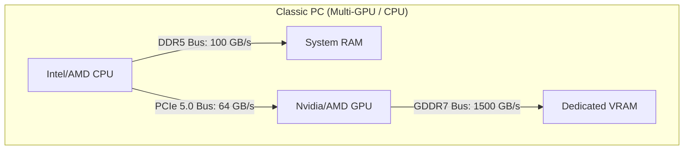
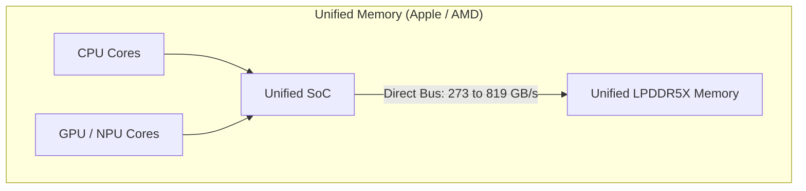

> [!tip] In brief
> Unified memory (Apple Silicon, AMD APU) removes the PCIe bottleneck and lets you run 70B+ models on a quiet workstation. In exchange, bandwidth remains lower than dedicated GDDR VRAM. The right choice depends on your constraint: capacity or throughput.

For an AI systems architect, understanding the physical difference between **conventional RAM**, **dedicated VRAM**, and **unified memory** is fundamental. This choice directly affects inference throughput ([[00-lexique/tokens-per-second|tokens/s]]), hardware costs, and scalability limits[^5].

Here is the physical analysis, data-routing diagrams, and decision guide for your enterprise audits.

---

## 🗺️ Data-flow diagram: classic PC vs unified architecture

The physical bottleneck of AI is not storage capacity, but the path data must travel to reach the compute cores (CPU/GPU).

---

## 1. Dedicated VRAM (The Nvidia standard)
**[[00-lexique/vram|VRAM]] (Video RAM)** sits as close as possible to the GPU. In 2026, consumer cards mainly use **GDDR7** (e.g. RTX 5090), while datacenter accelerators use **[[00-lexique/hbm|HBM]]**.

*   **Physical routing:** The GPU accesses VRAM over a very wide memory bus (up to 512-bit). The physical distance between the compute die and the memory die is measured in millimeters.
*   **Why it is fast:** the RTX 5090 reaches ~**1.79 TB/s** (1,792 GB/s), which radically changes [[00-lexique/decoding|decoding]] throughput[^1][^2].
*   **The physical limit (the cost of capacity):** VRAM chips are extremely expensive to manufacture. Consumer cards cap out at 24 GB or 32 GB. To get 128 GB of VRAM, you must buy four physical graphics cards, which creates massive thermal and electrical challenges.

---

## 2. Unified memory (The Apple Silicon & AMD APU approach)
Popularized by Apple and reinforced on x86 by AMD Ryzen AI Max PRO 400, **unified memory** removes the classic RAM/VRAM split.

*   **Physical routing:** The central processor (CPU), graphics unit (GPU), and AI accelerator ([[00-lexique/npu|NPU]]) are integrated on the same silicon die (SoC). Memory modules (LPDDR5X-8000/8533) are soldered right next to it, on the same package.
*   **Eliminating the copy:** On a classic PC, for the GPU to process data stored in RAM, the CPU must copy the data, send it over the PCIe bus (limited to 64 GB/s), then write it back into VRAM. **With unified memory, this copy step is eliminated.** The GPU reads directly from shared memory.
*   **Bandwidth nuance (AMD vs Apple):** 
    *   **Apple Silicon:** M4 Max reaches **546 GB/s** (16-core CPU / 40-core GPU variant); M3 Ultra at **819 GB/s**[^3].
    *   **AMD Ryzen AI Max PRO 400:** roughly **273 GB/s** with LPDDR5X-8533 and a 256-bit bus, with x86 compatibility (Windows/Linux)[^4].
*   **The AMD breakthrough (2026):** the PRO 400 platform scales to **192 GB** of shared memory, with up to **160 GB** allocatable to the GPU depending on OEM configuration[^4].
*   **The physical limit:** Because memory is soldered onto the SoC to guarantee this throughput, it is strictly **impossible to add RAM** after purchase. You must size the machine for the next five years on day one.

---

## 3. Classic system RAM (DDR5)
Standard working memory on a conventional PC, installed in motherboard slots (DIMM).

*   **Physical routing:** Data must cross the motherboard to travel from RAM to the processor over a narrow memory bus (typically dual-channel on desktop PCs).
*   **Why it is slower for LLM decoding:** bandwidth is often on the order of **80 to 100 GB/s** on dual-channel desktops; for large models, this caps token/s throughput.
*   **The main advantage:** very low cost per GB and high hardware expandability.

---

## ⚖️ Comparative summary table for your audits

| Evaluation criterion | Dedicated VRAM (RTX 5090) | Apple unified memory | AMD PRO 400 unified memory | Classic RAM (DDR5) |
| :-- | :-- | :-- | :-- | :-- |
| **Memory bandwidth** | ~1,792 GB/s[^2] | 546 to 819 GB/s[^3] | ~273 GB/s[^4] | ~80 to 100 GB/s (desktop dual-channel) |
| **Theoretical ceiling 70B Q4 (~40 GB)** | ~44.8 tok/s | ~13.6 to 20.5 tok/s | ~6.8 tok/s | ~2 to 2.5 tok/s |
| **Typical machine capacity (2026)** | 32 GB per consumer card[^1] | 64 GB (high-end M4 Max) / 96 GB (current M3 Ultra)[^3] | up to 192 GB[^4] | 64 to 256 GB common, more possible depending on motherboard |
| **Hardware expandability** | high (add GPUs) | none (soldered memory) | none (soldered memory) | high (add DIMMs) |
| **Positioning** | raw performance / multi-user | high-performance local workstation | local capacity + x86 compromise | entry-level / offline batch |

---

## 📋 The architect's decision guide

To advise your SMB client on a local deployment:

1.  **Dedicated VRAM (discrete GPU):** top choice for raw speed and concurrent workloads.
2.  **Apple unified memory:** excellent local throughput, simple stack to operate, but low hardware expandability.
3.  **AMD PRO 400 unified memory:** strong local memory capacity on x86, suited to Linux/Windows sovereignty requirements.
4.  **DDR5 RAM alone:** relevant mainly for deferred processing or smaller models.

> [!note] Related link
> To understand how to size the memory capacity your model needs without hitting "Out Of Memory" (OOM) errors, see the chapter on [[01-fondations/quantization-4bit-8bit|Model Quantization]].

---

## 📚 Sources and references

[^1]: NVIDIA, *GeForce RTX 5090 product page* (32 GB GDDR7, bus 512-bit, TGP 575 W). [https://www.nvidia.com/fr-fr/geforce/graphics-cards/50-series/rtx-5090/](https://www.nvidia.com/fr-fr/geforce/graphics-cards/50-series/rtx-5090/)
[^2]: TechPowerUp, *NVIDIA GeForce RTX 5090 Specs* (bandwidth mémoire 1.79 TB/s). [https://www.techpowerup.com/gpu-specs/geforce-rtx-5090.c4216](https://www.techpowerup.com/gpu-specs/geforce-rtx-5090.c4216)
[^3]: Apple, *Mac Studio - Technical Specifications* (M4 Max 546 GB/s, M3 Ultra 819 GB/s, configurations mémoire actuelles). [https://www.apple.com/mac-studio/specs/](https://www.apple.com/mac-studio/specs/)
[^4]: ServeTheHome, *AMD Ups Ante With 192GB Ryzen AI Max PRO 400 Chips for AI Systems* (192 GB, 160 GB allouables GPU, ~273 GB/s), 2026. [https://www.servethehome.com/amd-reveals-ryzen-ai-max-pro-400-series-192gb-ram-for-ai-systems/](https://www.servethehome.com/amd-reveals-ryzen-ai-max-pro-400-series-192gb-ram-for-ai-systems/)
[^5]: Amir Gholami et al., *AI and Memory Wall* (arXiv:2403.14123), 2024. [https://arxiv.org/abs/2403.14123](https://arxiv.org/abs/2403.14123)
