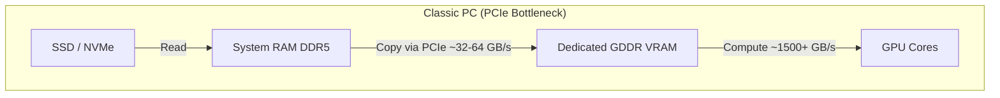
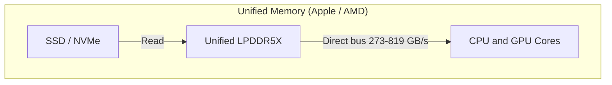

> [!tip] In brief
> Apple Silicon and AMD Gorgon Halo let you allocate 120 to 160 GB of unified memory to an LLM on a desktop workstation. Apple delivers the best throughput; AMD offers native Linux and Docker. The right choice depends on your stack, not capacity alone.

For sovereign enterprise AI deployment, **unified memory** is one of the most important hardware shifts of the decade.

By eliminating the RAM → VRAM copy over PCIe, **APU** SoCs (CPU + GPU + NPU on the same die) access a shared **LPDDR5X** pool — up to **192 GB** on AMD Ryzen AI Max PRO 400 platforms, and up to **512 GB** on Mac Studio M3 Ultra [^1][^2][^4]. This is the reference architecture for running **70B+ quantized** models (e.g. Llama 3.1 70B in Q4_K_M, ~40 GB of weights) on a quiet desktop workstation without a datacenter GPU server [^3][^9].

> [!note] Related link
> For memory sizing (weights + KV cache), see [[01-fondations/quantization-4bit-8bit|Quantization]] and [[01-fondations/kv-cache-and-context|KV Cache]].

---

## ⚔️ The Hardware Landscape: Apple Silicon vs AMD Gorgon Halo

Two ecosystems dominate high-performance unified memory in 2026:

### 1. Apple Silicon (Mac Studio 2025)
Apple integrates CPU, GPU, and NPU on a single package, with **LPDDR5X** modules soldered immediately next to the silicon [^3][^4].

*   **Mac Studio M4 Max** (CTO 16c CPU / 40c GPU): up to **128 GB** unified, **546 GB/s** bandwidth [^3][^4].
*   **Mac Studio M3 Ultra** (CTO 32c CPU / 80c GPU): up to **512 GB** unified (192 GB is a common local LLM configuration), **819 GB/s** [^4][^5]. Apple did not release an M4 Ultra in 2025: UltraFusion remains on the M3 generation [^5].
*   **Strengths:** very high bandwidth, mature **MLX** and **Metal** ecosystems, silence and low power draw [^3][^10].
*   **Limits:** macOS, non-upgradable soldered memory, high price at 128 GB+ configurations [^4].

### 2. AMD Ryzen AI Max PRO 400 (“Gorgon Halo”)
Professional refresh of the **Strix Halo** platform (Zen 5 + RDNA 3.5), announced May 2026 for OEM systems in **Q3 2026** [^1][^2].

*   **Architecture:** up to **16 Zen 5 cores**, **Radeon 8065S** iGPU (40 CUs on flagship SKU **Max+ PRO 495**), **256-bit** LPDDR5X-8533 memory bus [^1][^2].
*   **Capacity:** up to **192 GB** unified (+50% vs the 300 series at 128 GB) [^1][^2].
*   **Bandwidth:** **~273 GB/s** (vs ~256 GB/s theoretical on Strix Halo 128 GB — ~7% gain from memory clock) [^1][^2].
*   **GPU allocation:** up to **160 GB** reservable as iGPU VRAM, **32 GB** left for the system [^1][^2].
*   **Strengths:** open x86 (native Linux / Windows / Docker), attractive capacity/price on the **Ryzen AI Halo** platform (~$3,999 for the current 128 GB configuration) [^7][^8].
*   **Limits:** bandwidth roughly **2× lower** than M4 Max — decoding dense 70B models stays memory-bound (~5 tok/s measured on Strix Halo 395, similar profile expected on PRO 400) [^2][^6][^9].

---

## 🏎️ Why Unified Memory Removes the “PCIe Bottleneck”

On a PC with a discrete GPU, loading an LLM often involves **copying** weights from system RAM to VRAM over **PCIe** (typically ~32–64 GB/s effective in practice, far below the GPU’s internal ~1,500+ GB/s) [^11].





With unified memory, **CPU and GPU address the same physical pool**: no weight duplication and no PCIe transfer for tensors already in RAM [^11]. The trade-off: **shared** global bandwidth **lower** than dedicated GDDR7 VRAM, but **much larger capacity** per machine [^11].

---

## 🛠️ Practical Guide: Configuring GPU Memory Allocation

Operating systems cap the share of unified RAM usable by the GPU by default — you must raise this ceiling for heavy LLMs.

### 1. AMD Side (Ryzen AI Max 300 / PRO 400)
On Strix Halo and Gorgon Halo, allocation is mainly via **OEM BIOS/firmware** [^1][^2]:

1.  Reboot → **BIOS/UEFI**.
2.  *Advanced* menu → **UMA Frame Buffer Size** (label varies by OEM).
3.  On a **192 GB** system, AMD documents up to **160 GB** for the GPU and **32 GB** for the OS [^1][^2].

> [!warning] Pitfall: page cache during load
> If the model lives on SSD and weighs **140 GB** (e.g. Llama 3.1 70B in Q8), the OS will fill its **page cache** in the 32 GB system partition while reading the GGUF file — before inference even starts. Result: OOM or heavy swap on the remaining 32 GB. Best practice: leave **at least 10–15% of total RAM** outside GPU allocation, i.e. ~20–28 GB free on a 192 GB system, to cover OS + page cache + load buffers.

**PRO 400** systems arrive in **Q3 2026** (HP, Lenovo, ASUS, etc.); Strix Halo 395 guides remain relevant for llama.cpp/Vulkan/ROCm in the meantime [^6][^8].

### 2. Apple Silicon Side (macOS)
By default, macOS caps the GPU **Metal working set** at about **75%** of unified RAM (via `recommendedMaxWorkingSetSize`) — on 128 GB, only ~96 GB is usable without tweaks [^12][^13].

To raise the limit (e.g. **~120 GB** on a 128 GB machine), the community-documented llama.cpp/MLX command is:

```bash
# Value in MEGABYTES (e.g. 120 GB → 120 × 1024 = 122880)
sudo sysctl iogpu.wired_limit_mb=122880
```

*   Verify: `sysctl iogpu.wired_limit_mb` (`0` = default policy).
*   Revert to default: `sudo sysctl iogpu.wired_limit_mb=0` [^12][^13].
*   **Leave 8–16 GB** for the system to avoid memory pressure / swap [^12][^13].
*   The change is **volatile** (lost on reboot); for persistence, use a LaunchDaemon or equivalent — not officially supported by Apple [^12][^13].

> [!warning] Obsolete documentation
> The legacy key `iogpu.wired_mem_limit` (in kilobytes) and the `apple-silicon-inference/guide` repository still circulate online but are **not** the reliable current reference.

---

## 📊 Economic and Performance Trade-offs (2026)

*Comparison of unified workstations for **Llama 3.1 70B Q4_K_M** (~40 GB of weights). Speeds = **decode** (generation), order-of-magnitude measured or published — vary by backend (MLX vs llama.cpp), context, and build.*

| Criterion | Mac Studio (M4 Max 128 GB) | Mac Studio (M3 Ultra 192 GB) | AMD Ryzen AI (Halo / PRO 400) |
| :--- | :--- | :--- | :--- |
| **Chip (LLM config)** | M4 Max 16c/40c GPU [^4] | M3 Ultra 32c/80c GPU [^4] | Ryzen AI Max+ PRO 495 [^1][^2] |
| **Max unified RAM** | 128 GB [^4] | 512 GB (192 GB common) [^4] | 192 GB [^1][^2] |
| **Max allocatable GPU VRAM** | ~120 GB (`sysctl`, 128 GB machine) [^12] | ~160–184 GB (depends on total RAM) [^12] | **160 GB** (BIOS max) — in practice ~130–140 GB to preserve OS page cache [^1][^2] |
| **Bandwidth** | **546 GB/s** [^3][^4] | **819 GB/s** [^4] | **~273 GB/s** [^1][^2] |
| **70B Q4 throughput (decode)** | **~10–12 tok/s** (MLX) [^9][^10] | **~12–15 tok/s** (MLX) [^9][^10] | **~4.5–5 tok/s** (Strix Halo 395, similar PRO 400 profile) [^6][^9] |
| **OS** | macOS | macOS | **Linux / Windows** [^1][^2] |
| **Indicative price** | ~€4,500–5,500 (128 GB, CTO) [^4][^5] | ~€5,000–7,500 (192 GB+, CTO) [^4][^5] | **~€3,700** (Ryzen AI Halo 128 GB, $3,999) [^7][^8] |

> [!note] Reading the numbers
> Apple speeds come from community **MLX** benchmarks; **llama.cpp/Metal** is often slightly slower on pure decode but more flexible at long context [^9][^10]. The theoretical memory-bound ceiling (~13–21 tok/s Apple vs ~7 tok/s AMD) is detailed in [[01-fondations/unified-memory-vs-ram-vs-vram|Unified memory vs RAM vs VRAM]].

---

## 📋 Architect’s Takeaway

For sovereign on-premise deployment:

1.  **x86 sovereignty + Docker (AMD Halo / PRO 400):** if your stack relies on **Linux, Docker, and Python**, the AMD platform is the most rational: 160 GB allocatable VRAM, open ecosystem, lower price than an equivalent-capacity Mac Studio [^1][^2][^7]. Accept **~5 tok/s** on a dense 70B — favor **MoE** models (Qwen3.5-A3B, etc.) for interactivity [^6].
2.  **Speed and comfort (Mac Studio):** for the best feel on a **dense 70B** (~12–15 tok/s in MLX on M3 Ultra), the **Mac Studio M3 Ultra 192 GB+** remains the unified-bandwidth king in 2026; the **M4 Max 128 GB** is an excellent compromise if 128 GB is enough [^4][^9][^10]. Budget for macOS and containers.
3.  **Size at purchase time:** LPDDR5X is **soldered** — no post-purchase upgrade. Plan margin for **weights + KV cache + OS + load page cache** (see foundation chapters). On a 192 GB AMD system, allocating 160 GB to the GPU leaves 32 GB for the system — fine at idle, but tight on first load of a model ≥ 100 GB.

---

## 📚 Sources and References

[^1]: AMD, *AMD Powers Next-Generation Agent Computers — Ryzen AI Max PRO 400 Series*, May 2026. [https://www.amd.com/en/blogs/2026/amd-powers-next-generation-agent-computers-with-new-ryzen-ai-hal.html](https://www.amd.com/en/blogs/2026/amd-powers-next-generation-agent-computers-with-new-ryzen-ai-hal.html)
[^2]: ServeTheHome, *AMD Ups Ante With 192GB Ryzen AI Max PRO 400 Chips for AI Systems*, May 2026. [https://www.servethehome.com/amd-reveals-ryzen-ai-max-pro-400-series-192gb-ram-for-ai-systems/](https://www.servethehome.com/amd-reveals-ryzen-ai-max-pro-400-series-192gb-ram-for-ai-systems/)
[^3]: Apple Newsroom, *Apple introduces M4 Pro and M4 Max*, October 2024 (546 GB/s, 128 GB max M4 Max). [https://www.apple.com/newsroom/2024/10/apple-introduces-m4-pro-and-m4-max/](https://www.apple.com/newsroom/2024/10/apple-introduces-m4-pro-and-m4-max/)
[^4]: Apple, *Mac Studio — Technical Specifications* (M4 Max / M3 Ultra, RAM, bandwidth), 2025. [https://www.apple.com/mac-studio/specs/](https://www.apple.com/mac-studio/specs/)
[^5]: Apple Support, *Mac Studio (2025) — Tech Specs* (CTO configurations, RAM). [https://support.apple.com/en-us/122211](https://support.apple.com/en-us/122211)
[^6]: ignasivt, *Strix Halo Guide* (llama.cpp benchmarks Llama 3.1 70B Q4 ~4.7–4.9 tok/s), 2026. [https://github.com/ignasivt/strix-halo-guide](https://github.com/ignasivt/strix-halo-guide)
[^7]: TweakTown, *AMD launches Ryzen AI Max PRO 400 — up to 192GB unified memory*, May 2026. [https://www.tweaktown.com/news/111752/amd-launches-the-ryzen-ai-max-pro-400-series-of-cpus-up-to-16-cores-with-192gb-of-unified-memory/index.html](https://www.tweaktown.com/news/111752/amd-launches-the-ryzen-ai-max-pro-400-series-of-cpus-up-to-16-cores-with-192gb-of-unified-memory/index.html)
[^8]: VideoCardz, *AMD confirms Ryzen AI MAX 400 Gorgon Halo — 192GB / 160GB VRAM*, May 2026. [https://videocardz.com/newz/amd-confirms-ryzen-ai-max-400-gorgon-halo-will-support-up-to-192gb-memory-and-160gb-vram](https://videocardz.com/newz/amd-confirms-ryzen-ai-max-400-gorgon-halo-will-support-up-to-192gb-memory-and-160gb-vram)
[^9]: CraftRigs, *How to Run Llama 3 70B on a Mac with 128 GB RAM* (MLX speeds M3 Ultra / M4 Max), 2025. [https://craftrigs.com/guides/run-llama-70b-mac-128gb-ram/](https://craftrigs.com/guides/run-llama-70b-mac-128gb-ram/)
[^10]: llmhardware.io, *Mac Studio M4 Max for LLMs* (Llama 3.3 70B Q4 ~14–20 tok/s MLX), 2025. [https://llmhardware.io/guides/mac-studio-m4-max-llm-guide](https://llmhardware.io/guides/mac-studio-m4-max-llm-guide)
[^11]: NVIDIA Technical Blog, *Mastering LLM Techniques: Inference Optimization* (memory bottlenecks, quantization), November 2023. [https://developer.nvidia.com/blog/mastering-llm-techniques-inference-optimization/](https://developer.nvidia.com/blog/mastering-llm-techniques-inference-optimization/)
[^12]: ggml-org/llama.cpp, *Issue #16646* (`iogpu.wired_limit_mb`), 2025. [https://github.com/ggml-org/llama.cpp/issues/16646](https://github.com/ggml-org/llama.cpp/issues/16646)
[^13]: ivanopcode, *Override macOS Metal VRAM cap* (`iogpu.wired_limit_mb`, tables by RAM), 2025. [https://github.com/ivanopcode/devnote-override-macos-metal-vram-cap](https://github.com/ivanopcode/devnote-override-macos-metal-vram-cap)
