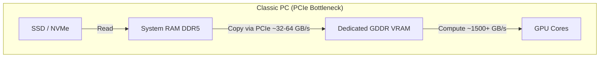
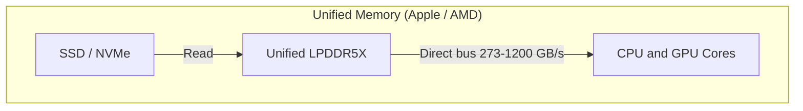

> [!tip] In brief
> Apple Silicon, AMD Gorgon Halo, and NVIDIA DGX Spark all offer 128 GB+ unified memory on a desktop workstation. Apple leads on bandwidth; AMD offers native Linux and Docker; NVIDIA DGX Spark brings native FP4, CUDA, and ConnectX-7 200 Gbps scale-out (up to 4 nodes). The right choice depends on your stack, not capacity alone.

For sovereign enterprise AI deployment, **unified memory** is one of the most important hardware shifts of the decade.

By eliminating the RAM → VRAM copy over PCIe, **APU** SoCs (CPU + GPU + NPU on the same die) access a shared **LPDDR5X** pool — up to **192 GB** on AMD Ryzen AI Max PRO 400 platforms, and up to **512 GB** on the Mac Studio M5 Ultra (1.2 TB/s, 512 GB configuration shipping late October 2026) [^1][^2][^4][^17]. This is the reference architecture for running **70B+ quantized** models (e.g. Llama 3.1 70B in Q4_K_M, ~40 GB of weights) on a quiet desktop workstation without a datacenter GPU server [^3][^4].

> [!note] Related link
> For memory sizing (weights + KV cache), see [[01-fondations/quantization-4bit-8bit|Quantization]] and [[01-fondations/kv-cache-and-context|KV Cache]].

---

## ⚔️ The Hardware Landscape: Apple Silicon, AMD Gorgon Halo, and NVIDIA DGX Spark

Three ecosystems share the high-performance unified memory market as of Q4 2026:

### 1. Apple Silicon (Mac Studio M5, August 2026)
Apple integrates CPU, GPU, and NPU on a single package, with **LPDDR5X** modules soldered immediately next to the silicon [^3][^4]. The Mac Studio M5 (announced 2026-08-25) replaces the 2025 M4 Max / M3 Ultra generation [^17].

*   **Mac Studio M5 Max** (18c CPU / 40c GPU): up to **128 GB** unified, **614 GB/s** bandwidth (460 GB/s with the 32-core GPU), from US$2,499 [^4][^17].
*   **Mac Studio M5 Ultra** (up to 36c CPU / 80c GPU): **96, 256, or 512 GB** unified, **1.2 TB/s**, from US$5,499; the 512 GB version ships late October 2026 [^4][^17]. (Apple skipped the M4 Ultra generation: the M5 Ultra directly succeeds the 2025 M3 Ultra [^5].)
*   **Strengths:** very high bandwidth, mature **MLX** and **Metal** ecosystems, silence and low power draw [^3][^17].
*   **Limits:** macOS, non-upgradable soldered memory, high price at 128 GB+ configurations [^4].

### 2. AMD Ryzen AI Max PRO 400 (“Gorgon Halo”)
Professional refresh of the **Strix Halo** platform (Zen 5 + RDNA 3.5), announced in May 2026; as of Q4 2026 the flagship Max+ PRO 495 is listed by AMD and shipping in the 192 GB Framework Desktop (pre-orders opened 2026-09-30, deliveries from November 2026) [^1][^2][^18].

*   **Architecture:** up to **16 Zen 5 cores**, **Radeon 8065S** iGPU (40 CUs on flagship SKU **Max+ PRO 495**), **256-bit** LPDDR5X-8533 memory bus [^1][^2].
*   **Capacity:** up to **192 GB** unified (+50% vs the 300 series at 128 GB) [^1][^2].
*   **Bandwidth:** **~273 GB/s** (vs ~256 GB/s theoretical on Strix Halo 128 GB — ~7% gain from memory clock) [^1][^2].
*   **GPU allocation:** up to **160 GB** reservable as iGPU VRAM, **32 GB** left for the system [^1][^2].
*   **Strengths:** open x86 (native Linux / Windows / Docker), capacity/price ratio still attractive but deteriorating fast: the 128 GB **Ryzen AI Halo** development platform sold for US$3,999 (July 2026) and the 128 GB Framework Desktop is listed at €3,889 incl. VAT and out of stock as of 2026-10-09, versus $1,999 at launch — the LPDDR5X price surge is hitting every capacity tier [^18][^20][^25].
*   **Limits:** bandwidth roughly **2.2× lower** than the M5 Max (614 GB/s) and ~4.4× lower than the M5 Ultra (1.2 TB/s) — decoding dense 70B models stays memory-bound (~5 tok/s measured on Strix Halo 395, similar profile expected on PRO 400) [^2][^4][^6].

### 3. NVIDIA Grace Blackwell (DGX Spark)

Announced in 2025 and available from 2026, the **DGX Spark** (formerly Project Digits) is NVIDIA's first product combining an ARM SoC and a Blackwell GPU in a desktop form factor [^14].

*   **Architecture:** **Grace Blackwell** SoC — 20-core ARM CPU (Grace) + Blackwell GPU, co-developed with MediaTek, TSMC 3nm process [^14].
*   **Unified LPDDR5x memory:** **128 GB** on DGX Spark (≈ $6,950 as of 2026-10-02, versus $3,999 at the October 2025 launch); a **64 GB** variant (same GB10, models up to ~100B parameters according to NVIDIA, ~200B with two units linked over QSFP) from $4,999, sold exclusively by OEMs (Acer, ASUS, Dell, Gigabyte, HP, MSI) starting 2026-10-23 [^14][^16][^28]. DGX Station scales to **748 GB** for models > 400B [^14].
*   **Bandwidth:** ~273 GB/s (LPDDR5x) — close to AMD Gorgon Halo [^14].
*   **Power draw:** 240 W power supply, GB10 TDP ~140 W (DGX Spark) — versus > 1,000 W for a dual discrete-GPU workstation [^14].
*   **Native FP4 (Blackwell):** unlike the Ada Lovelace architecture (RTX 4090 — emulated FP4), Blackwell implements FP4 in silicon — without software overhead [^15].
*   **ConnectX-7 200 Gbps scale-out:** two QSFP ports link up to **four** DGX Spark units (512 GB aggregated, models up to ~700B according to NVIDIA) without an external switch [^14].
*   **NVIDIA Sync software:** full CUDA environment pre-installed to reduce startup friction.

Since 7 October 2026, NVIDIA and Microsoft are marketing the **RTX Spark**, distinct from the DGX Spark: Blackwell RTX GPU with up to 6,144 cores, Grace CPU with up to 20 cores, up to **128 GB** of unified memory and a theoretical 1 PFLOPS FP4, running **Windows** with full CUDA, from Acer, ASUS, Dell, Gigabyte, HP, Lenovo, Microsoft and MSI; laptops ship from 16 October 2026, compact form factors in November [^26]. On the desktop side, the **Surface RTX Spark Dev Box** (128 GB) is available for pre-order at $5,999 on Microsoft.com, in the United States only, with deliveries in November 2026; Microsoft specifies that the 1 PFLOPS FP4 assumes sparsity and that the GPU addresses only part of the 128 GB, and no memory bandwidth is published as of 2026-10-10 [^27].

> [!tip] DGX Spark positioning
> DGX Spark shines on **capacity** (128 GB LPDDR5x accessible to CUDA without friction) and **native FP4** — useful for loading 70B+ models and training with LoRA without precision compromises. However, for pure inference on models ≤ 34B, a discrete-GPU workstation (RTX 5090 32 GB or RTX PRO 6000 96 GB) remains significantly faster thanks to its dedicated very-high-bandwidth GDDR7 — but as of Q4 2026 an RTX 5090 trades at ≥ $5,000 and an RTX PRO 6000 at ~$16,000, which erases the price gap with unified-memory workstations [^21][^22]. DGX Spark is the right choice when **memory capacity and CUDA simplicity** take priority over raw throughput.

---

## 🏎️ Why Unified Memory Removes the “PCIe Bottleneck”

On a PC with a discrete GPU, loading an LLM often involves **copying** weights from system RAM to VRAM over **PCIe** (typically ~32–64 GB/s effective in practice, far below the GPU’s internal ~1,500+ GB/s) [^11].


```mermaid
graph TD
    subgraph "Classic PC (PCIe Bottleneck)"
        A[SSD / NVMe] -->|Read| B[System RAM DDR5]
        B -->|Copy via PCIe ~32-64 GB/s| C[Dedicated GDDR VRAM]
        C -->|Compute ~1500+ GB/s| D[GPU Cores]
    end
```


```mermaid
graph TD
    subgraph "Unified Memory (Apple / AMD)"
        E[SSD / NVMe] -->|Read| F[Unified LPDDR5X]
        F -->|Direct bus 273-1200 GB/s| G[CPU and GPU Cores]
    end
```

With unified memory, **CPU and GPU address the same physical pool**: no weight duplication and no PCIe transfer for tensors already in RAM [^11]. The trade-off: **shared** global bandwidth **lower** than dedicated GDDR7 VRAM, but **much larger capacity** per machine [^11].

---

## 🛠️ Practical Guide: Configuring GPU Memory Allocation

Operating systems cap the share of unified RAM usable by the GPU by default — you must raise this ceiling for heavy LLMs.

### 1. AMD Side (Ryzen AI Max 300 / PRO 400)
On Strix Halo and Gorgon Halo, allocation is mainly via **OEM BIOS/firmware** [^1][^2]:

1.  Reboot → **BIOS/UEFI**.
2.  *Advanced* menu → **UMA Frame Buffer Size** (label varies by OEM).
3.  On a **192 GB** system, AMD documents up to **160 GB** for the GPU and **32 GB** for the OS [^1][^2].

> [!warning] Pitfall: page cache during load
> If the model lives on SSD and weighs **140 GB** (e.g. Llama 3.1 70B in Q8), the OS will fill its **page cache** in the 32 GB system partition while reading the GGUF file — before inference even starts. Result: OOM or heavy swap on the remaining 32 GB. Best practice: leave **at least 10–15% of total RAM** outside GPU allocation, i.e. ~20–28 GB free on a 192 GB system, to cover OS + page cache + load buffers.

The first **PRO 400** systems have been on pre-order since Q4 2026 (192 GB Framework Desktop; HP, Lenovo and ASUS announced); Strix Halo 395 guides remain the practical reference for llama.cpp/Vulkan/ROCm, and SGLang has published a ROCm image for `gfx1151` (Strix Halo) since v0.5.20 [^6][^18][^19].

### 2. Apple Silicon Side (macOS)
By default, macOS caps the GPU **Metal working set** at about **75%** of unified RAM (via `recommendedMaxWorkingSetSize`) — on 128 GB, only ~96 GB is usable without tweaks [^12][^13].

To raise the limit (e.g. **~120 GB** on a 128 GB machine), the community-documented llama.cpp/MLX command is:

```bash
# Value in MEGABYTES (e.g. 120 GB → 120 × 1024 = 122880)
sudo sysctl iogpu.wired_limit_mb=122880
```

*   Verify: `sysctl iogpu.wired_limit_mb` (`0` = default policy).
*   Revert to default: `sudo sysctl iogpu.wired_limit_mb=0` [^12][^13].
*   **Leave 8–16 GB** for the system to avoid memory pressure / swap [^12][^13].
*   The change is **volatile** (lost on reboot); for persistence, use a LaunchDaemon or equivalent — not officially supported by Apple [^12][^13].

> [!warning] Obsolete documentation
> The legacy key `iogpu.wired_mem_limit` (in kilobytes) and the `apple-silicon-inference/guide` repository still circulate online but are **not** the reliable current reference.

---

## 📊 Economic and Performance Trade-offs

*Comparison of unified workstations for **Llama 3.1 70B Q4_K_M** (~40 GB of weights). Speeds = **decode** (generation), order-of-magnitude measured or published — vary by backend (MLX vs llama.cpp), context, and build.*

| Criterion | Mac Studio (M5 Max 128 GB) | Mac Studio (M5 Ultra 256–512 GB) | AMD Ryzen AI (Halo / PRO 400) | **NVIDIA DGX Spark (64 / 128 GB)** |
| :--- | :--- | :--- | :--- | :--- |
| **Chip (LLM config)** | M5 Max 18c/40c GPU [^4] | M5 Ultra 36c/80c GPU [^4] | Ryzen AI Max+ PRO 495 [^1][^2] | Grace Blackwell SoC (GB10) [^14] |
| **Max unified RAM** | 128 GB [^4] | 512 GB (96 / 256 / 512 GB tiers) [^4][^17] | 192 GB [^1][^2] | **64 or 128 GB LPDDR5x** [^14][^16] |
| **Max allocatable GPU VRAM** | ~120 GB (`sysctl`, 128 GB machine) [^12] | ~75% by default; up to RAM − 8–16 GB via `sysctl` (~240 GB on 256 GB, ~496 GB on 512 GB) [^12][^13] | **160 GB** (BIOS max) — in practice ~130–140 GB [^1][^2] | ~64 / ~128 GB (direct CUDA access) [^14] |
| **Bandwidth** | **614 GB/s** (460 GB/s with the 32-core GPU) [^4][^17] | **1.2 TB/s** [^4][^17] | **~273 GB/s** [^1][^2] | **~273 GB/s** [^14] |
| **70B Q4 throughput (decode)** | **≤ ~15 tok/s** (ceiling 614 GB/s ÷ 40 GB; M5 Max MLX measurements not published) [^4] | **≤ ~30 tok/s** (ceiling 1.2 TB/s ÷ 40 GB; M5 Ultra MLX measurements not published) [^4] | **~4.5–5 tok/s** (Strix Halo 395) [^6] | *not officially published* [^14] |
| **Native FP4** | ❌ | ❌ | ❌ | ✅ Blackwell [^15] |
| **Scale-out** | ✅ Thunderbolt 5 RDMA (macOS 26.2+, up to 4 Mac Studios) [^17] | ✅ Thunderbolt 5 RDMA (macOS 26.2+, up to 4 Mac Studios) [^17] | ❌ | ✅ ConnectX-7 200 Gbps, up to 4 nodes [^14] |
| **OS** | macOS | macOS | **Linux / Windows** [^1][^2] | Linux (CUDA) [^14] |
| **Indicative price** | from US$2,499 (48 GB base); 128 GB config: CTO price to be checked [^17] | from US$5,499 (96 GB); 256 / 512 GB: CTO price to be checked [^17] | **~€3,900** (128 GB, out of stock as of 2026-10) · **~$6,800–7,450** (192 GB, pre-order, shipping Nov. 2026) [^18][^20][^23] | **≈ $6,950** (128 GB, as of 2026-10-02) · $4,999 (64 GB, OEM, from 2026-10-23) [^14][^16] |

> [!note] Reading the numbers
> Apple throughputs are **theoretical memory-bound ceilings** (bandwidth ÷ model weight), not measurements: as of 2026-10-09, no MLX benchmark of the M5 Max / M5 Ultra with a published methodology was available, and **llama.cpp/Metal** is generally a bit slower than MLX on pure decode. NVIDIA DGX Spark inference figures are not officially published — community source claims are not reproduced here. NVIDIA does, however, publish a capacity table (1 × 128 GB ≈ 200B parameters, 2 × ≈ 400B, 4 × ≈ 700B) with no associated throughput [^14]. The method for computing the memory-bound ceiling is detailed in [[01-fondations/unified-memory-vs-ram-vs-vram|Unified memory vs RAM vs VRAM]].

> [!warning] Memory prices rising (Q4 2026)
> Contract DRAM prices are still climbing 10–15% per quarter in Q4 2026 (TrendForce, September 30, 2026) and Framework warns that "memory pricing for all capacities will continue to increase over the next six months" [^18][^24]. The prices in this table must therefore be re-checked at every purchase; soldered memory now comes at a premium.

---

## 📋 Architect’s Takeaway

For sovereign on-premise deployment:

1.  **x86 sovereignty + Docker (AMD Halo / PRO 400):** if your stack relies on **Linux, Docker, and Python**, the AMD platform is the most rational: 160 GB allocatable VRAM, open ecosystem, lower price than an equivalent-capacity Mac Studio [^1][^2][^7]. Accept **~5 tok/s** on a dense 70B — favor **MoE** models (Qwen3.5-A3B, etc.) for interactivity [^6].
2.  **Speed and comfort (Mac Studio):** for the best feel on a **dense 70B** (memory-bound ceiling ~30 tok/s on M5 Ultra, measurements not published), the **Mac Studio M5 Ultra 256–512 GB** (1.2 TB/s) remains the unified-bandwidth reference as of Q4 2026; the **M5 Max 128 GB** (614 GB/s) is an excellent compromise if 128 GB is enough [^4][^17]. Budget for macOS and containers.
3.  **CUDA + FP4 + scale-out (NVIDIA DGX Spark):** if your team is already in the NVIDIA ecosystem (CUDA, TensorRT, vLLM), DGX Spark offers 128 GB LPDDR5x natively accessible via CUDA, native Blackwell FP4, and the ability to interconnect up to four enclosures via ConnectX-7 200 Gbps without reconfiguring infrastructure [^14]. It is not the best choice for pure inference on models ≤ 34B: a discrete-GPU workstation (RTX 5090, RTX PRO 6000) remains faster for that use case — at a price now comparable or higher as of Q4 2026 (see the "DGX Spark positioning" callout) [^21][^22].
4.  **Size at purchase time:** LPDDR5X is **soldered** — no post-purchase upgrade. Plan margin for **weights + KV cache + OS + load page cache** (see foundation chapters). On a 192 GB AMD system, allocating 160 GB to the GPU leaves 32 GB for the system — sufficient at idle, but tight on first load of a model ≥ 100 GB.

---

## 📚 Sources and References

[^1]: AMD, *AMD Ryzen AI Max+ PRO 495* — product sheet (16 Zen 5 cores, Radeon 8065S 40 CU, 192 GB LPDDR5X-8533, 256-bit bus, cTDP 45–120 W), accessed 2026-10-09 · AMD, *AAI 2026: AMD Delivers Full-Stack Compute for the Agentic AI Era* (Halo PRO 400 platforms "later this year"), 2026-07-23. [https://www.amd.com/en/products/processors/laptop/ryzen-pro/ai-max-pro-400-series/amd-ryzen-ai-max-plus-pro-495.html](https://www.amd.com/en/products/processors/laptop/ryzen-pro/ai-max-pro-400-series/amd-ryzen-ai-max-plus-pro-495.html) · [https://ir.amd.com/news-events/press-releases/detail/1294/aai-2026-amd-delivers-full-stack-compute-for-the-agentic-ai-era](https://ir.amd.com/news-events/press-releases/detail/1294/aai-2026-amd-delivers-full-stack-compute-for-the-agentic-ai-era)
[^2]: ServeTheHome, *AMD Ups Ante With 192GB Ryzen AI Max PRO 400 Chips for AI Systems*, May 2026. [https://www.servethehome.com/amd-reveals-ryzen-ai-max-pro-400-series-192gb-ram-for-ai-systems/](https://www.servethehome.com/amd-reveals-ryzen-ai-max-pro-400-series-192gb-ram-for-ai-systems/)
[^3]: Apple Newsroom, *Apple introduces M4 Pro and M4 Max*, October 2024 (546 GB/s, 128 GB max M4 Max). [https://www.apple.com/newsroom/2024/10/apple-introduces-m4-pro-and-m4-max/](https://www.apple.com/newsroom/2024/10/apple-introduces-m4-pro-and-m4-max/)
[^4]: Apple, *Mac Studio — Technical Specifications* (M5 Max 614 GB/s / M5 Ultra 1.2 TB/s, 96 / 256 / 512 GB RAM tiers), re-read on 2026-10-09. [https://www.apple.com/mac-studio/specs/](https://www.apple.com/mac-studio/specs/)
[^5]: Apple Support, *Mac Studio (2025) — Tech Specs* (CTO configurations, RAM). [https://support.apple.com/en-us/122211](https://support.apple.com/en-us/122211)
[^6]: ignasivt, *Strix Halo Guide* (llama.cpp benchmarks Llama 3.1 70B Q4 ~4.7–4.9 tok/s), 2026. [https://github.com/ignasivt/strix-halo-guide](https://github.com/ignasivt/strix-halo-guide)
[^7]: TweakTown, *AMD launches Ryzen AI Max PRO 400 — up to 192GB unified memory*, May 2026. [https://www.tweaktown.com/news/111752/amd-launches-the-ryzen-ai-max-pro-400-series-of-cpus-up-to-16-cores-with-192gb-of-unified-memory/index.html](https://www.tweaktown.com/news/111752/amd-launches-the-ryzen-ai-max-pro-400-series-of-cpus-up-to-16-cores-with-192gb-of-unified-memory/index.html)
[^11]: NVIDIA Technical Blog, *Mastering LLM Techniques: Inference Optimization* (memory bottlenecks, quantization), November 2023. [https://developer.nvidia.com/blog/mastering-llm-techniques-inference-optimization/](https://developer.nvidia.com/blog/mastering-llm-techniques-inference-optimization/)
[^12]: ggml-org/llama.cpp, *Issue #16646* (`iogpu.wired_limit_mb`), 2025. [https://github.com/ggml-org/llama.cpp/issues/16646](https://github.com/ggml-org/llama.cpp/issues/16646)
[^13]: ivanopcode, *Override macOS Metal VRAM cap* (`iogpu.wired_limit_mb`, tables by RAM), 2025. [https://github.com/ivanopcode/devnote-override-macos-metal-vram-cap](https://github.com/ivanopcode/devnote-override-macos-metal-vram-cap)
[^14]: NVIDIA, *DGX Spark* — official product page (Grace Blackwell SoC GB10, 128 GB LPDDR5x, ~273 GB/s, ConnectX-7 200 Gbps and cluster of up to 4 systems, 64 GB variant "Coming Soon" from OEMs, "RTX Spark" pre-order link), re-read on 2026-10-09. [https://www.nvidia.com/en-us/products/workstations/dgx-spark/](https://www.nvidia.com/en-us/products/workstations/dgx-spark/)
[^15]: NVIDIA, *NVIDIA Blackwell Architecture Technical Brief* (native FP4 Tensor Cores vs emulated FP4 Ada Lovelace). [https://resources.nvidia.com/en-us-blackwell-architecture](https://resources.nvidia.com/en-us-blackwell-architecture)
[^16]: ServeTheHome, *NVIDIA DGX Spark 64GB Launched and Big 128GB GB10 Price Increases* (128 GB ≈ $6,950, 64 GB $4,999 OEM from 2026-10-23), October 2, 2026. [https://www.servethehome.com/nvidia-dgx-spark-64gb-launched-and-big-128gb-gb10-price-increases/](https://www.servethehome.com/nvidia-dgx-spark-64gb-launched-and-big-128gb-gb10-price-increases/)
[^17]: Apple Newsroom, *Apple introduces new Mac Studio with M5 Max and M5 Ultra* (M5 Max 614 GB/s, M5 Ultra 1.2 TB/s, 96 / 256 / 512 GB, US starting prices, 512 GB shipping late October 2026, Thunderbolt 5 + RDMA clustering under macOS 26.2 up to 4 Mac Studios), August 25, 2026. [https://www.apple.com/newsroom/2026/08/apple-introduces-new-mac-studio-with-m5-max-and-m5-ultra/](https://www.apple.com/newsroom/2026/08/apple-introduces-new-mac-studio-with-m5-max-and-m5-ultra/)
[^18]: Framework, *The 192GB Framework Desktop is open for pre-order* (Ryzen AI Max+ PRO 495, 192 GB, pre-orders from 2026-09-30, deliveries November 2026, warning about rising memory prices), September 30, 2026. [https://frame.work/blog/192gb-framework-desktop-open-for-pre-order](https://frame.work/blog/192gb-framework-desktop-open-for-pre-order)
[^19]: SGLang Project, *Release v0.5.20* (ROCm image for `gfx1151` Strix Halo; CUDA 13 required on the NVIDIA side), September 18, 2026. [https://github.com/sgl-project/sglang/releases/tag/v0.5.20](https://github.com/sgl-project/sglang/releases/tag/v0.5.20)
[^20]: Framework, *Framework Desktop (AMD Ryzen AI Max 300)* — product page (128 GB: €3,889 incl. VAT, "Out of stock"), accessed 2026-10-09. [https://frame.work/products/desktop-diy-amd-aimax300](https://frame.work/products/desktop-diy-amd-aimax300)
[^21]: Tom's Hardware, *Nvidia's RTX 5090 vanishes from online retail in the US — third-party sellers now demand as much as $9,500*, September 14, 2026. [https://www.tomshardware.com/pc-components/gpus/nvidias-rtx-5090-vanishes-from-online-retail-in-the-us-third-party-sellers-now-demand-as-much-as-usd9-500-for-nvidias-fastest-gpu](https://www.tomshardware.com/pc-components/gpus/nvidias-rtx-5090-vanishes-from-online-retail-in-the-us-third-party-sellers-now-demand-as-much-as-usd9-500-for-nvidias-fastest-gpu)
[^22]: Tom's Hardware, *Nvidia doubles RTX PRO 6000 Blackwell's MSRP to a staggering $16,000*, August 2026. [https://www.tomshardware.com/pc-components/gpus/nvidia-doubles-rtx-pro-6000-blackwells-msrp-to-a-staggering-usd16-000-96gb-card-started-pre-orders-below-usd8-000-last-year](https://www.tomshardware.com/pc-components/gpus/nvidia-doubles-rtx-pro-6000-blackwells-msrp-to-a-staggering-usd16-000-96gb-card-started-pre-orders-below-usd8-000-last-year)
[^23]: Phoronix, *Framework Desktop With AMD Ryzen AI Max+ PRO 495 "Gorgon Halo" Now Available For Pre-Order* (192 GB: $6,799 DIY / $7,449 assembled), September 30, 2026. [https://www.phoronix.com/news/Framework-Desktop-Gorgon-Halo](https://www.phoronix.com/news/Framework-Desktop-Gorgon-Halo)
[^24]: TrendForce, press release of September 30, 2026 (contract DRAM prices up 10–15% in Q4 2026). [https://www.trendforce.com/presscenter/news/20260930-13258.html](https://www.trendforce.com/presscenter/news/20260930-13258.html)
[^25]: Tom's Hardware, *AMD challenges Nvidia's DGX Spark with $3,999 Ryzen AI Halo* (Ryzen AI Max+ 395 development platform, 128 GB, Micro Center, available July 10, 2026), July 2026. [https://www.tomshardware.com/desktops/mini-pcs/amd-challenges-nvidias-dgx-spark-with-usd3-999-ryzen-ai-halo-with-windows-11-support-strix-halo-desktop-undercuts-nvidia-by-usd700-packs-128gb-of-unified-memory](https://www.tomshardware.com/desktops/mini-pcs/amd-challenges-nvidias-dgx-spark-with-usd3-999-ryzen-ai-halo-with-windows-11-support-strix-halo-desktop-undercuts-nvidia-by-usd700-packs-128gb-of-unified-memory)
[^26]: NVIDIA Blog, *NVIDIA, Microsoft Kick Off a New Beginning for Windows PCs With RTX Spark and AI Agents* (Blackwell RTX GPU with up to 6,144 cores, Grace CPU with up to 20 cores, up to 128 GB of unified memory, 1 PFLOPS FP4; Acer, ASUS, Dell, HP, Lenovo, Microsoft, MSI, Gigabyte; laptops available for pre-order on 7 October and available on 16 October, compact form factors in November), 7 October 2026. [https://blogs.nvidia.com/blog/local-ai-rtx-spark-microsoft-windows-event/](https://blogs.nvidia.com/blog/local-ai-rtx-spark-microsoft-windows-event/)
[^27]: Microsoft Devices Blog, *Pre-order our most powerful Surface devices ever* (Surface RTX Spark Dev Box: 128 GB of unified memory, $5,999 suggested price, pre-order on Microsoft.com in the United States only, deliveries from November; theoretical 1 PFLOPS FP4 with sparsity; GPU-addressable memory lower than the total), 7 October 2026. [https://blogs.windows.com/devices/2026/10/07/pre-order-our-most-powerful-surface-devices-ever/](https://blogs.windows.com/devices/2026/10/07/pre-order-our-most-powerful-surface-devices-ever/)
[^28]: NVIDIA Blog, *NVIDIA DGX Spark 64GB Gives Developers More Ways to Build and Scale Local AI* (same GB10, from $4,999, models up to 100B parameters, OEMs Acer, ASUS, Dell, Gigabyte, HP, MSI from Friday 23 October; two units linked over QSFP = 128 GB, models up to 200B), 2 October 2026. [https://blogs.nvidia.com/blog/local-ai-dgx-spark-64gb-sync/](https://blogs.nvidia.com/blog/local-ai-dgx-spark-64gb-sync/)
