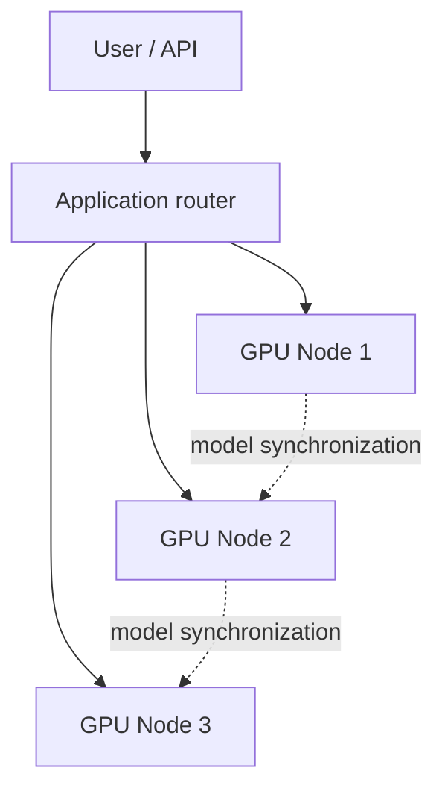

> [!tip] In brief
> Linking several AI machines over a network is possible, but the network (10–400 Gb/s) stays ten to a hundred times slower than a GPU’s internal memory. RoCE, InfiniBand, and Thunderbolt address different problems — picking the wrong one can turn your cluster into a bottleneck.

After the [[02-materiel/stations-multi-gpu|multi-GPU workstation]], the natural next question is: can several machines be linked into an on-premise AI “supercomputer”?

Yes, but the network quickly matters more than GPU count. A modern card reads its [[00-lexique/vram|VRAM]] at hundreds or thousands of GB/s, while a network link is often counted in tens or hundreds of Gb/s. Even [[00-lexique/rdma|RDMA]] does not turn a desktop cluster into external [[00-lexique/nvlink|NVLink]].

> [!note] Related link
> To understand why interconnect limits model parallelism, see [[02-materiel/stations-multi-gpu|Multi-GPU Workstations]] and [[00-lexique/memory-bandwidth|Memory bandwidth]].

---

## 🎯 The Real Role of the Network

In an on-premise AI architecture, the network mainly serves three purposes:

1. **Distribute requests** across several machines.
2. **Synchronize GPUs** for multi-node parallelism.
3. **Move data** between storage, CPU, GPU, and application services.

These uses do not have the same requirements. Serving several users with independent machines tolerates classic Ethernet well. Splitting the same model across nodes requires frequent exchanges: latency, congestion, real throughput, and RDMA support become critical.

The right question is therefore not “what is the cable’s maximum bitrate?” but “what data must cross the network during inference?”.

---

## 🧱 Classic Ethernet, RoCE, InfiniBand: Three Different Levels

### 1. Classic Ethernet

Standard Ethernet is ideal for user access, administration, APIs, light storage, and architectures where each machine serves independent load.

Its advantage is obvious: reasonable cost, available hardware, common network skills. Its limit is equally clear: classic TCP/IP goes through more CPU layers and does not offer the same latency guarantees as a properly configured RDMA fabric.

### 2. RoCE: RDMA over Ethernet

[[00-lexique/roce|RoCE]] means *RDMA over Converged Ethernet*. It brings part of RDMA’s benefits on a suitable Ethernet infrastructure: transfers can avoid some copies and CPU handling, which helps GPU node communication [^1][^2].

But RoCE is not magic. NVIDIA documentation states that RoCE relies on ECN and PFC in lossless or semi-lossless Ethernet environments, and that configuration must be consistent on hosts, switches, priorities, and traffic queues [^3]. In practice, RoCE therefore requires:

- compatible NICs, often NVIDIA ConnectX
- suitable switches
- understood and tested PFC/ECN configuration
- congestion monitoring
- a software stack compatible with the AI runtime

On a poorly configured network, RoCE can be worse than classic Ethernet: excessive PFC pauses, invisible congestion, unstable performance.

### 3. InfiniBand: Dedicated HPC/AI Fabric

InfiniBand is historically the choice for HPC and AI clusters when latency and predictability matter. It combines network, RDMA transport, and fabric management in an ecosystem built for intensive communication.

For an individual or small business, InfiniBand can be too costly or too specialized. For a serious AI cluster with multi-node parallelism, it remains a reference because it reduces network surprises and integrates well with GPU communication libraries.

---

## 🚀 GPUDirect RDMA: Avoiding the RAM Detour

NVIDIA GPUDirect RDMA lets a network card or other third-party device exchange directly with GPU memory over PCIe, without systematically copying data to system RAM [^4]. NVIDIA documentation states the technology works with InfiniBand and RoCE on compatible hardware [^4].

This mechanism matters for distributed engines, but it does not remove physical limits:

- traffic still crosses PCIe, the NIC, the switch, and network links
- gain depends on the inference engine and communication libraries
- machine PCIe topology still matters
- driver/kernel compatibility can become an operations topic

NVIDIA now recommends DMA-BUF as a modern approach for some GPUDirect RDMA deployments in GPU Operator, rather than the historical `nvidia-peermem` path when platform conditions allow [^1].

---

## ⚡ Thunderbolt: Useful, but Not an AI Fabric

Thunderbolt is attractive for on-premise: a compact cable, docks, fast storage, sometimes point-to-point networking. Keep the orders of magnitude in mind.

Intel describes Thunderbolt 4 as a **40 Gb/s** bidirectional link with at least **32 Gb/s** of PCIe data bandwidth [^5]. Thunderbolt 5 rises to **80 Gb/s** bidirectional, with a *Bandwidth Boost* mode that can reallocate the link up to **120 Gb/s transmit and 40 Gb/s receive**, mainly for video use cases [^6].

Even Thunderbolt 5 remains far from a server GPU NVLink/NVSwitch fabric. It can help for:

- fast external storage
- compact workstations
- network dock or 10/25 GbE
- homelab experimentation
- simple machine-to-machine links in some scenarios

Do not position it as:

- transparent VRAM extension
- external NVLink
- a robust solution for multi-node tensor parallel
- a datacenter AI network

For a small desktop cluster, Thunderbolt can help prototyping. For distributed multi-GPU production, RoCE or InfiniBand are far more credible.

---

## 🧠 AI Parallelism: Which Network for Which Use?

| Use case | Acceptable network | Comment |
| :--- | :--- | :--- |
| Several users, replicated models | Classic Ethernet | Load balancer distributes requests, little GPU synchronization |
| RAG + application services | Classic Ethernet or 10/25 GbE | Application latency matters more than RDMA |
| Performant shared storage | 25/100 GbE, sometimes RDMA | Depends heavily on storage backend |
| Multi-node pipeline parallel | RoCE or InfiniBand recommended | Activations cross the network |
| Multi-node tensor parallel | InfiniBand or very well configured RoCE | Frequent communication, network critical |
| Homelab prototype | Ethernet / Thunderbolt | Good for learning, not for linear speedup promises |

vLLM recommends reasoning about topology: tensor parallel within a node when the model fits on the node’s GPUs, then pipeline parallel across nodes when you must exceed that limit. The documentation also mentions GPUDirect RDMA for efficient GPU network communication in compatible deployments [^7].

---

## 📋 Architect’s Takeaway

For sovereign on-premise deployment:

1. **Replicate before you distribute.** Two machines each serving their own model are often more reliable than one model split across a fragile network.
2. **Do not confuse marketed bitrate with useful bitrate.** A link advertised in Gb/s says nothing about latency, congestion, CPU bypass, or NCCL behavior.
3. **Reserve RoCE for controlled environments.** RoCE is relevant if you control NICs, switches, QoS, PFC/ECN, and monitoring.
4. **Choose InfiniBand for serious multi-node.** If the goal is a low-latency AI cluster, InfiniBand avoids a lot of ad-hoc work.
5. **Use Thunderbolt as a workstation tool, not a cluster promise.** Very practical for storage and docks; too limited to replace a GPU fabric.

On-premise AI networking is therefore not “more cables”. It is an architecture decision: how much of the model, cache, and requests are we willing to move between machines?

---

## 📚 Sources and References

[^1]: NVIDIA, *GPUDirect RDMA and GPUDirect Storage — GPU Operator* (DMA-BUF, `nvidia-peermem`, GPUDirect RDMA configuration). [https://docs.nvidia.com/datacenter/cloud-native/gpu-operator/26.3/gpu-operator-rdma.html](https://docs.nvidia.com/datacenter/cloud-native/gpu-operator/26.3/gpu-operator-rdma.html)
[^2]: NVIDIA, *RDMA over Converged Ethernet — DOCA SDK* (RDMA, RoCE, low latency, lossless Ethernet). [https://docs.nvidia.com/doca/sdk/rdma-over-converged-ethernet.pdf](https://docs.nvidia.com/doca/sdk/rdma-over-converged-ethernet.pdf)
[^3]: NVIDIA, *RDMA over Converged Ethernet - RoCE | Cumulus Linux* (PFC, ECN, lossy/lossless modes). [https://docs.nvidia.com/networking-ethernet-software/cumulus-linux/Layer-1-and-Switch-Ports/Quality-of-Service/RDMA-over-Converged-Ethernet-RoCE/](https://docs.nvidia.com/networking-ethernet-software/cumulus-linux/Layer-1-and-Switch-Ports/Quality-of-Service/RDMA-over-Converged-Ethernet-RoCE/)
[^4]: NVIDIA, *GPUDirect RDMA 13.2 documentation* (direct exchange between GPU and third-party devices, InfiniBand/RoCE support). [https://docs.nvidia.com/cuda/gpudirect-rdma/](https://docs.nvidia.com/cuda/gpudirect-rdma/)
[^5]: Intel, *What Is Thunderbolt 4?* (40 Gb/s bidirectional, 32 Gb/s PCIe). [https://www.intel.com/content/www/us/en/gaming/resources/upgrade-gaming-accessories-thunderbolt-4.html](https://www.intel.com/content/www/us/en/gaming/resources/upgrade-gaming-accessories-thunderbolt-4.html)
[^6]: Thunderbolt Technology, *Thunderbolt 5 Technology Brief* (80 Gb/s bidirectional, 120/40 Gb/s Bandwidth Boost, 64 Gb/s PCIe). [https://www.thunderbolttechnology.net/sites/default/files/Thunderbolt_5_TechBrief_2023_09_12.pdf](https://www.thunderbolttechnology.net/sites/default/files/Thunderbolt_5_TechBrief_2023_09_12.pdf)
[^7]: vLLM, *Parallelism and Scaling* (tensor parallel, pipeline parallel, multi-node, GPUDirect RDMA). [https://docs.vllm.ai/en/stable/serving/parallelism_scaling/](https://docs.vllm.ai/en/stable/serving/parallelism_scaling/)
