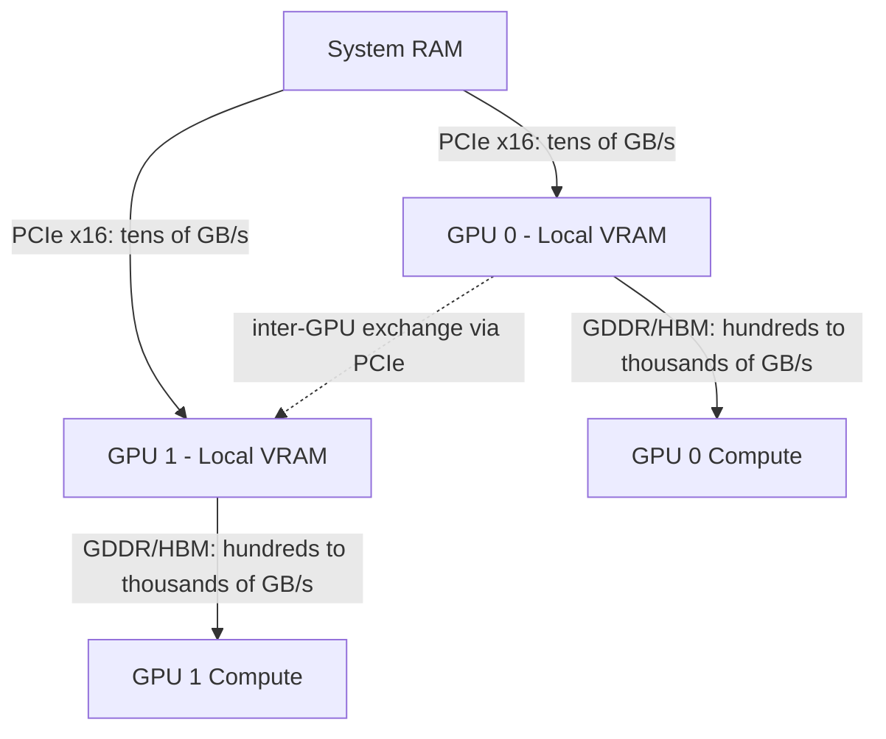
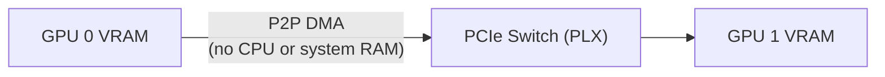

> [!tip] In brief
> Multiple GPUs multiply available VRAM, but interconnect decides efficiency. Without NVLink (reserved for datacenter lines), cards share data over PCIe — useful for capacity, not for tensor parallelism.

After [[02-materiel/apu-and-unified-memory|unified memory]], the other major family of on-premise AI machines is the **multi-GPU workstation**: several NVIDIA cards in one tower, or several accelerators in a server.

The idea looks simple: add the [[00-lexique/vram|VRAM]] of several cards to load larger models. In practice, **multi-GPU** is not a simple “memory pool”. You must choose a parallelism mode, accept inter-card traffic, and understand whether that traffic goes over [[00-lexique/pcie|PCIe]], [[00-lexique/nvlink|NVLink]], or an [[00-lexique/rdma|RDMA]] / [[00-lexique/roce|RoCE]] fabric.

> [!note] Related link
> For model + cache sizing, see [[01-fondations/quantization-4bit-8bit|Quantization]] and [[01-fondations/kv-cache-and-context|KV Cache]].

---

## 🎯 Why Multi-GPU?

A multi-GPU workstation addresses three different needs:

1. **Memory capacity:** load a model that does not fit on a single card.
2. **Throughput:** serve more requests in parallel, often by replicating the model.
3. **Latency:** speed up a large model by spreading its compute across several GPUs.

These three goals do not require the same architecture. A two-card machine can excel at serving two independent users but disappoint at accelerating a single model if the cards communicate only over PCIe.

---

## 🧱 The Hardware Landscape: Workstation vs Server

### 1. PCIe Workstation GPUs

Professional workstation cards maximize flexibility: they fit standard x86 towers, use CUDA, and stay compatible with common inference engines.

| Card | Memory | Memory Bandwidth | Interface | Power |
| :--- | :--- | :--- | :--- | :--- |
| NVIDIA RTX 6000 Ada | 48 GB GDDR6 ECC | 960 GB/s (datasheet) | PCIe 4.0 x16 | 300 W |
| NVIDIA RTX PRO 6000 Blackwell Workstation | 96 GB GDDR7 ECC | 1,792 GB/s | PCIe 5.0 | 600 W |

The RTX 6000 Ada remains a solid workstation base with 48 GB GDDR6 ECC and PCIe Gen 4 x16 [^1]. The RTX PRO 6000 Blackwell doubles capacity to 96 GB, moves to GDDR7 ECC, advertises 1,792 GB/s memory bandwidth, and PCIe Gen 5 support [^2].

These cards are very attractive for on-premise because they offer **fast local VRAM** and a mature software ecosystem. But in a standard multi-GPU workstation, inter-card traffic depends entirely on the PCIe bus.

> [!warning] Common pitfall — NVLink on workstations
> RTX workstation cards (RTX 6000 Ada, RTX PRO 6000 Blackwell) and consumer lines (RTX 40xx, RTX 50xx) **no longer have a physical NVLink connector** since the Ada Lovelace generation. NVIDIA removed external NVLink bridges from all desktop and workstation lines.
> It is therefore **impossible to buy two RTX PRO 6000 cards and link them via NVLink**: the connector simply does not exist on these cards [^1][^2].
> NVLink today is **exclusively for server GPUs** in SXM form factor (A100, H100, H200, B200) and HGX/DGX systems — a different machine category starting above €100,000.

### 2. SaaS Inference Servers (L40S, A100)

Between PCIe workstation towers and HGX datacenter nodes, there is a category often overlooked but central for sovereign deployments at team or SaaS scale: the **rack inference server**, optimized to serve 10 to 200 simultaneous users at a controlled cost per token.

| GPU | VRAM | Bandwidth | Native FP8 | Positioning |
| :-- | :-- | :-- | :-- | :-- |
| **NVIDIA L40S** | 48 GB GDDR6 | 864 GB/s | ✅ Yes (Ada Lovelace) | SaaS inference — best cost/token in production |
| **NVIDIA A100 (80 GB)** | 80 GB HBM2e | 2,000 GB/s | ❌ No (FP16 max) | Solid legacy, available from sovereign FR hosts |
| **NVIDIA A100 (40 GB)** | 40 GB HBM2e | 1,555 GB/s | ❌ No | Capacity/cost compromise for 13–34B models |
| RTX 6000 Ada / RTX 4090 | 48 / 24 GB | 960 / 1,008 GB/s | ⚠️ Partial | On-prem client air-gapped (client-supplied hardware) |

#### The NVIDIA L40S — the "hidden gem" of 2026 inference

The L40S (Ada Lovelace architecture) is often underestimated because it lacks HBM bandwidth like an H100. It compensates with two decisive advantages for production inference[^7]:

1.  **4th-generation Tensor Cores with native FP8:** FP8 quantization of the model and [[00-lexique/kv-cache|KV Cache]] is native, without software workarounds. On Hopper architectures (H100), vLLM must use software FP8 emulation; on Ada, it is silicon[^8].
2.  **Best cost/token in inference:** MLPerf Inference Datacenter 2024 benchmarks rank the L40S as the GPU with the lowest cost per generated token for 70B-class models in production — ahead of the A100 and roughly on par with the H100 on that specific ratio[^8].

A bare-metal server with two L40S cards (96 GB total VRAM) is the reference topology for hosting a 70B model in FP8 quantization and serving 20 to 80 simultaneous users with [[00-lexique/ttft|TTFT]] < 2 s.

#### The A100 — the historical workhorse

The A100 remains the most available datacenter GPU from French sovereign hosts (OVHcloud, Scaleway, Outscale). Its immense HBM2e bandwidth compensates for the lack of native FP8 for FP16 or BF16 models. It remains relevant for:
- Models not yet available with optimized FP8.
- Deployments at HDS/SecNumCloud-certified hosts where the L40S is not yet offered.

#### RTX Workstation for On-Prem Client (Tier Air-Gapped)

When a client deploys the stack on **its own hardware** (Tier 3 / air-gapped), there is no need to impose €15,000 datacenter GPUs. A workstation with one or two RTX 6000 Ada cards (48 GB PCIe) is enough to serve internal requests for a team of 10 to 30 people, provided the inference engine (vLLM or SGLang) is configured correctly.

> [!warning] RTX workstation ≠ SLA guarantee
> Without NVLink or HBM, RTX workstation cards cannot match L40S throughput under concurrent load. They suit moderate on-site use, not multi-tenant SaaS with strict SLAs.

---

### 3. NVLink / NVSwitch Servers

NVIDIA datacenter servers change category: in an HGX/DGX system, GPUs can communicate via **NVLink** and **NVSwitch** rather than PCIe alone.

NVIDIA describes eight-GPU HGX H100/H200 systems as machines where each Hopper GPU can communicate at **900 GB/s** with the others via NVLink/NVSwitch, with a non-blocking fabric within the node [^3]. For Blackwell, NVIDIA states that fifth-generation NVLink doubles per-GPU speed to **1,800 GB/s** in supported systems [^3].

This level of interconnect is not a detail: it makes **tensor parallelism** much more viable, because GPUs must exchange activations and intermediate results on every generation step.

---

## 🛣️ PCIe: The Discrete Bottleneck

PCIe is the general-purpose bus linking CPU, GPU, SSD, and network cards. PCI-SIG states that PCIe 5.0 reaches **32 GT/s per lane**, double PCIe 4.0 [^4].

For a GPU in **x16**, that gives a theoretical order of magnitude of about **64 GB/s per direction** on PCIe 5.0, before real platform constraints. That is high for general I/O but very low compared to internal bandwidth on a modern GPU: 960 GB/s on RTX 6000 Ada, 1,792 GB/s on RTX PRO 6000 Blackwell [^1][^2].

Consequence: if an inference engine must synchronize two GPUs heavily over PCIe, expected speedup can vanish. PCIe multi-GPU works better when communication is rare, requests are independent, or the engine picks a suitable parallelism mode.

### PCIe Switches (Broadcom PLX) — P2P Without the CPU

In a standard workstation, GPU↔GPU traffic goes through the CPU: GPU 0 writes to system RAM, the CPU reads, and sends to GPU 1. That is slow and loads the processor unnecessarily.

The best AI workstations (and some dense workstation servers) use **PCIe switch chips** — mainly **Broadcom PLX PEX** series — on the motherboard or an expansion card. These enable direct **Peer-to-Peer (P2P DMA)** transfer:

**Concrete benefits:**
- Inter-GPU transfer latency drops significantly
- The CPU is free for other work during synchronization
- Throughput remains capped at ~64 GB/s (PCIe 5.0 x16) — but with much lower latency than the CPU path

**Identifying a motherboard with PLX switch:**
Look in motherboard specs for “PCIe switch”, “PLX”, “PEX switch”, or “NVMe bifurcation with PLX”. HEDT (High-End Desktop) boards and entry-level server platforms (AMD EPYC, Intel Xeon) often include these natively.

> [!note] P2P PCIe limits
> Even with a PLX switch, bandwidth stays ~64 GB/s — 15 to 25 times less than an NVLink/NVSwitch fabric. P2P PCIe is enough for *pipeline parallelism* with low exchange frequency, not for intensive *tensor parallelism* that requires per-layer traffic.

---

## 🧠 Parallelism Modes

### Data Parallel: Multiple Model Copies

**Data parallel** replicates the model on several GPUs. Each card serves different requests.

* **Advantage:** very efficient for multi-user throughput when the model fits on one card.
* **Limit:** VRAM does not add up for a single model, because each GPU keeps its own copy.

TensorRT-LLM describes this mode as suited to large batches and high-throughput scenarios [^5].

### Tensor Parallel: One Model Split Per Layer

**Tensor parallelism** shards weights of the same layer across several GPUs. It is the intuitive mode when a model is too large for one card.

vLLM recommends this mode when the model does not fit on one GPU but fits in a multi-GPU node; configure e.g. `--tensor-parallel-size 4` for four GPUs [^6]. TensorRT-LLM also describes TP as weight sharding across GPUs [^5].

* **Advantage:** can reduce per-GPU VRAM pressure and use several memory bandwidths.
* **Limit:** requires frequent communication; NVLink/NVSwitch helps a lot; PCIe can become limiting.

### Pipeline Parallel: Model Split by Layer Blocks

**Pipeline parallelism** distributes groups of layers across GPUs. Activations pass from one card to the next.

vLLM recommends combining tensor and pipeline parallel when the model exceeds a single node, with `tensor_parallel_size` for GPUs per node and `pipeline_parallel_size` for node count [^6]. TensorRT-LLM lists this mode as a core strategy too [^5].

* **Advantage:** more tolerant of slow interconnects than pure TP in some cases.
* **Limit:** can create “bubbles” where some GPUs wait, especially with small batches.

---

## ⚖️ Choosing Among APU, Single GPU, PCIe Multi-GPU, and NVLink Server

| Need | Often rational architecture | Why |
| :--- | :--- | :--- |
| Quantized 70B LLM, low noise, large RAM | APU / unified memory | Simple, high capacity, no RAM→VRAM copy |
| Model fits in 48–96 GB VRAM | Single workstation GPU | Simple, fast, little synchronization |
| Several users / several models | Multi-GPU replication | Each GPU serves independent load |
| Sovereign SaaS, 10–200 users, optimized cost/token | L40S or A100 server | Native FP8, best inference TCO, available from FR hosts |
| Model too large for one card, same node | Multi-GPU with TP/PP | Possible if the engine supports sharding |
| Very large models, low latency, production | NVLink/NVSwitch server | Inter-GPU fabric suited to frequent communication |

The classic trap is buying “2 × 48 GB” expecting a virtual 96 GB card. That only holds if the engine can shard the model and interconnect does not erase the gain.

---

## 📋 Architect’s Takeaway

For sovereign on-premise deployment:

1. **Start from service needs, not GPU count.** A single user on a dense large model has different constraints than a multi-user server.
2. **Prefer single GPU when the model fits.** One RTX PRO 6000 Blackwell 96 GB can be simpler than a 2 × 48 GB station for a model that fits in 96 GB [^2].
3. **Use PCIe multi-GPU for throughput.** Several cards can serve multiple replicas or models with little inter-card communication.
4. **For sovereign SaaS or multi-user service, evaluate L40S or A100.** A bare-metal 2× L40S server offers the best inference TCO for a 70B model in production. The A100 remains the default choice at French sovereign hosts already certified HDS.
5. **Reserve demanding tensor parallel for fast interconnect.** vLLM and TensorRT-LLM support TP, but docs stress network/interconnect to avoid communication dominating [^5][^6].
6. **Do not confuse workstation and datacenter.** NVLink/NVSwitch radically changes the profile but belongs mainly to compatible NVIDIA server platforms [^3].

---

## 🔭 Non-NVIDIA accelerators: status in 2026

Beyond NVIDIA, several vendors position alternatives for on-premise inference and training. Market status in 2026 remains that of a forming ecosystem — interesting to watch, not yet recommended for strict B2B deployments.

### Tenstorrent (Wormhole / Blackhole)

Tenstorrent (founded by Jim Keller) sells **Wormhole** accelerators (N150, N300) and announces the **Blackhole** generation. The architecture is software-first, based on **RISC-V** cores with massive local SRAM and external **GDDR6**, and integrated **Ethernet** interconnection between chips [^9].

**Claimed advantages:** purchase cost significantly lower than equivalent NVIDIA GPUs in TFLOPS, open-source **TT-Forge** software stack (TT-Metal + MLIR compiler), native Ethernet interconnection for scale-out without proprietary switch.

**Real limits in 2026:**

- **Standard vLLM incompatible:** you must use the `tenstorrent/vllm` fork with a manually compiled `tt-metal` environment — a non-trivial procedure, not maintained by the main vLLM team. Community source [^9] — see also the note in [[03-stack-logicielle/inference-engines-vllm-ollama|Inference Engines]].
- **Partial model compatibility:** the TT-Forge compiler does not yet support all operators in recent architectures — "90% model compatibility" is insufficient for B2B deployments that must guarantee every model's behavior.
- **Young software ecosystem:** no official HuggingFace, LangChain, or common monitoring tool support yet (Prometheus metrics, OpenTelemetry).

> [!note] Advice for 2026–2027
> Tenstorrent is **worth watching for 2026–2027**, especially if TT-Forge achieves standard vLLM compatibility and the software ecosystem matures. At this stage, **not recommended for an SMB without a dedicated AI DevOps team**: the hardware cost savings are real, but integration and maintenance overhead often erases the initial savings.

---

## 📚 Sources and References

[^1]: NVIDIA, *RTX 6000 Ada Generation Graphics Card* (48 GB GDDR6 ECC, PCIe Gen 4 x16, 300 W). [https://www.nvidia.com/en-us/products/workstations/rtx-6000/](https://www.nvidia.com/en-us/products/workstations/rtx-6000/)
[^2]: NVIDIA, *RTX PRO 6000 Blackwell Workstation Edition* (96 GB GDDR7 ECC, 1,792 GB/s, PCIe Gen 5, 600 W). [https://www.nvidia.com/en-us/products/workstations/professional-desktop-gpus/rtx-pro-6000/](https://www.nvidia.com/en-us/products/workstations/professional-desktop-gpus/rtx-pro-6000/)
[^3]: NVIDIA Technical Blog, *NVIDIA NVLink and NVIDIA NVSwitch Supercharge Large Language Model Inference* (NVLink/NVSwitch, 900 GB/s Hopper, 1,800 GB/s Blackwell). [https://developer.nvidia.com/blog/nvidia-nvlink-and-nvidia-nvswitch-supercharge-large-language-model-inference/](https://developer.nvidia.com/blog/nvidia-nvlink-and-nvidia-nvswitch-supercharge-large-language-model-inference/)
[^4]: PCI-SIG, *PCI Express 5.0 FAQ* (32 GT/s per lane, double PCIe 4.0). [https://pcisig.com/faq?field_category_value%5B%5D=pci_express_5.0](https://pcisig.com/faq?field_category_value%5B%5D=pci_express_5.0)
[^5]: NVIDIA TensorRT-LLM, *Parallelism in TensorRT LLM* (TP, PP, DP, EP, CP). [https://nvidia.github.io/TensorRT-LLM/features/parallel-strategy.html](https://nvidia.github.io/TensorRT-LLM/features/parallel-strategy.html)
[^6]: vLLM, *Parallelism and Scaling* (tensor parallel, pipeline parallel, Ray, multiprocessing, GPUDirect RDMA). [https://docs.vllm.ai/en/stable/serving/parallelism_scaling/](https://docs.vllm.ai/en/stable/serving/parallelism_scaling/)
[^7]: NVIDIA, *L40S Product Page* (Ada Lovelace, FP8 Tensor Cores, 48 GB GDDR6 ECC). [https://www.nvidia.com/en-us/data-center/l40s/](https://www.nvidia.com/en-us/data-center/l40s/)
[^8]: MLCommons, *MLPerf Inference Datacenter v4.1 Results* (datacenter inference benchmark, cost/token). [https://mlcommons.org/benchmarks/inference-datacenter/](https://mlcommons.org/benchmarks/inference-datacenter/)
[^9]: Tenstorrent, *vLLM integration with TT-Metal* (Wormhole architecture, fork tenstorrent/vllm, partial standard vLLM compatibility), 2025. [https://github.com/tenstorrent/tt-metal/blob/main/tech_reports/LLMs/vLLM_integration.md](https://github.com/tenstorrent/tt-metal/blob/main/tech_reports/LLMs/vLLM_integration.md)
