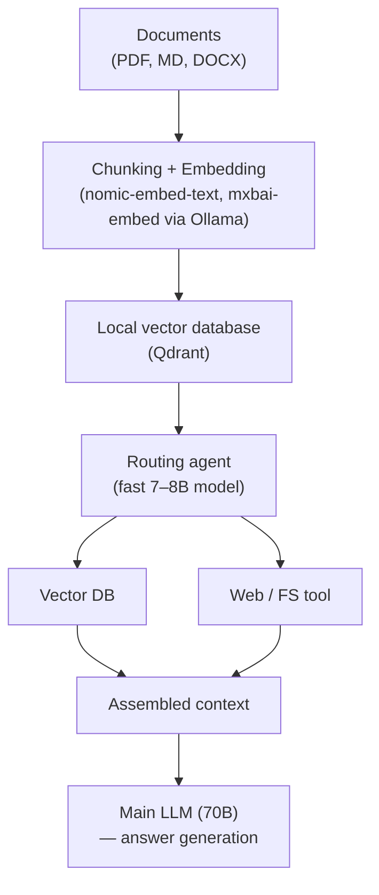

> [!tip] In brief
> A standalone LLM does not know your documents. RAG gives it access to your document base without retraining. Agents add the ability to act and reason in a loop. Together they form the backbone of a sovereign enterprise assistant.

A "bare" [[00-lexique/llm|LLM]] fresh from the factory is frozen in time. Its internal weights hold broad general knowledge, but it knows nothing about your company documents, yesterday's meetings, or the state of your database. Worse: if you try to teach it that information via retraining (fine-tuning), it is very expensive for often disappointing results on precise fact retrieval.

To turn this blind statistical engine into a sovereign enterprise assistant, the standard software solution is **RAG** (Retrieval-Augmented Generation)[^1]. And since 2025, this concept has evolved toward autonomous **Agentic Workflows**.

---

## 1. Standard RAG: Vector search

Classic RAG (very popular between 2023 and 2024) is a linear chain:
1.  **Ingestion:** Your documents (PDF, Word, code) are split into small blocks (*chunks*). A specialized model converts these blocks into number lists (embeddings) and stores them in a **[[00-lexique/vectordb|Vector Database]]** (such as Qdrant, Milvus, or Chroma).
2.  **Search:** When the user asks a question, the system finds the blocks mathematically closest to the question.
3.  **Generation:** The system pastes these blocks into the user's prompt invisibly, then sends everything to the LLM to generate the answer.

### ⚠️ The physical limit (The KV Cache wall)
Standard RAG has an architectural flaw on-premise: it is blind. To avoid missing anything, developers often configure the database to return the top 20 results. The final prompt swells enormously, saturating the model's [[00-lexique/context-window|context window]].
As we saw in the hardware chapter, a huge context explodes the **[[01-fondations/kv-cache-and-context|KV Cache]]** size, destroying your server VRAM and collapsing [[00-lexique/inference|inference]] performance[^2].

---

## 2. The 2026 evolution: Agentic RAG and GraphRAG

To avoid saturating memory with useless information, the market has shifted to **Agentic RAG**[^1][^3]. Instead of being a passive pipe, the LLM becomes the driver.

### The agent framework
With libraries like [[00-lexique/smolagents|SmolAgents]] (Hugging Face) or [[00-lexique/langgraph|LangGraph]], developers give the LLM **Tools** ([[00-lexique/appel-outils|Tool Calling / Function Calling]]).
The flow becomes dynamic:
1. The user asks a complex question.
2. The agent reasons: *"Do I need to search the HR database or the source code?"*
3. The agent calls the search tool, reads a summary, and **decides itself** whether the information is sufficient or whether it needs a finer search before writing the final answer[^4].

### GraphRAG
Popularized by Microsoft research, **[[00-lexique/graphrag|GraphRAG]]** replaces the "dumb" vector database with a **Knowledge Graph**[^5]. The system extracts entities (people, places, concepts) and their relationships. This lets the LLM answer global questions (e.g. *"What are the main themes discussed by the product team this month?"*) that systematically failed classic vector RAG.

---

## 3. The [[00-lexique/memory-tree|Memory Tree]] approach

Rather than using a heavy vector database, an alternative architecture relies on **hierarchical Markdown folders** and a local SQLite metadata store[^6]. The idea is to give the agent a *summarized* view of available knowledge, and load detail only when needed. This pattern is detailed in the [[00-lexique/memory-tree|Memory Tree]] entry.

*   **Hierarchy:** The agent never loads a full document into memory. It uses the LLM to read the "title" and a "one-line summary" of the file tree.
*   **Selective injection:** If it judges a file relevant, the agent calls a function to "unfold" that specific tree node and read its exact content.
*   **Architectural advantage:** Context stays tiny (a few hundred tokens for summaries), keeping [[00-lexique/ttft|TTFT]] (time to first token) under one second and preserving hardware resources, even with a heavy dense model.

> [!tip] Go further
> This approach is implemented by several local personal assistants — with varying degrees of sovereignty depending on the project. See the comparison [[05-agents-et-assistants-on-prem/assistants-personnels/index|On-Premise Personal Assistants]] and the [[05-agents-et-assistants-on-prem/assistants-personnels/solutions/openhuman|OpenHuman]] entry for a documented Memory Tree example.

---

## 4. Choosing your vector database

Vector database choice depends on data volume, required sovereignty level, and available resources.

| Solution | Type | Strengths | Limits | Best for |
| :-- | :-- | :-- | :-- | :-- |
| **Chroma** | In-process (Python) | Zero configuration, embedded | Not suited to > 1M chunks | Prototyping, dev lab |
| **Qdrant** | Docker server | Rich payload filtering, REST/gRPC, scalable | Infra to operate | SMB, modern production |
| **Milvus** | Distributed server | Billions of vectors, high availability | Complex to operate | Datacenter, large volumes |
| **pgvector** | PostgreSQL extension | Vectors in existing database | Performance < native vector DBs | Existing Postgres stack |
| **SQLite + vss** | Local file | Zero dependencies, max sovereignty | No H-scale scalability | Solo, Memory Tree patterns |

> [!tip] Quick start with Qdrant locally
> ```bash
> # Run Qdrant in Docker (persistent data in ./qdrant_storage)
> docker run -p 6333:6333 -p 6334:6334 \
>   -v ./qdrant_storage:/qdrant/storage \
>   qdrant/qdrant
>
> # Create a collection via the REST API
> curl -X PUT http://localhost:6333/collections/ma-base \
>   -H 'Content-Type: application/json' \
>   -d '{"vectors": {"size": 1024, "distance": "Cosine"}}'
> ```

## 5. Multi-tenant RAG: embedding isolation

In **[[00-lexique/multi-tenant|multi-tenant]]** deployments — a shared inference server for multiple organizations or teams — RAG introduces a critical security risk: documents from one tenant leaking into another tenant's search results.

OWASP formally classified this risk in its Top 10 LLM 2025 under **LLM08: Vector and Embedding Weaknesses**[^7]. A naive vector database implementation without per-tenant isolation can allow a query from "Client B" to surface embeddings belonging to "Client A".

### Pattern 1 — Row-Level Security with pgvector

If your infrastructure already relies on **PostgreSQL**, the `pgvector` extension lets you store embeddings in the same database. Isolation relies on the engine's native **Row-Level Security (RLS)** mechanism[^8]:

```sql
-- Enable RLS on the embeddings table
ALTER TABLE documents ENABLE ROW LEVEL SECURITY;

-- Policy: each tenant sees only its own rows
CREATE POLICY tenant_isolation ON documents
  USING (tenant_id = current_setting('app.current_tenant')::uuid);

-- At runtime: set the tenant before each search
SET app.current_tenant = '{{tenant_uuid}}';
SELECT content, embedding <=> query_embedding AS distance
FROM documents ORDER BY distance LIMIT 5;
```

**Advantage:** the PostgreSQL engine applies the tenant filter at the lowest level — a malformed application-level query cannot bypass the policy. Isolation is **mathematically guaranteed by the database**, not by application logic.

**Limit:** `pgvector` performance remains below that of a native vector database for volumes above ~1M embeddings.

### Pattern 2 — Payload-based partitioning with Qdrant

Qdrant natively recommends a single-collection architecture using **Payload-based Partitioning**[^9]. Each embedding is indexed with a `tenant_id` payload, and vector access keys are scoped to a tenant at search time:

```python
from qdrant_client import QdrantClient
from qdrant_client.models import Filter, FieldCondition, MatchValue

client = QdrantClient(url="http://localhost:6333")

# Scoped search: only vectors from the current tenant are compared
results = client.search(
    collection_name="documents",
    query_vector=query_embedding,
    query_filter=Filter(
        must=[FieldCondition(
            key="tenant_id",
            match=MatchValue(value=current_tenant_id)
        )]
    ),
    limit=5
)
```

**Advantage:** a single collection, no multiplication of collections per tenant (which would collapse the cluster at scale). The payload filter is applied before vector similarity computation.

> [!warning] Application-level isolation ≠ mathematical isolation
> Never rely solely on a Python/Node application filter for multi-tenant isolation. If the filter is omitted by mistake (bug, refactoring), one tenant's data leaks. PostgreSQL RLS and Qdrant payload filtering guarantee isolation at the engine level, independent of application code.

---

## 6. FinOps: CPU/GPU routing and RAG pre-filtering

GPU inference is expensive. A well-designed architecture reserves the GPU for the one task where it is irreplaceable — **text generation** — and delegates auxiliary tasks to the CPU.

### CPU/GPU routing

| Task | Recommended engine | Hardware |
| :-- | :-- | :-- |
| Text generation (LLM) | vLLM, SGLang | GPU (exclusive VRAM) |
| Embedding generation | `nomic-embed-text`, `mxbai-embed` via Ollama | **CPU** |
| Speech transcription (STT) | `faster-whisper` (CTranslate2)[^10] | **CPU** |
| Re-ranking, scoring | Lightweight CrossEncoder | **CPU** |

`faster-whisper` (SYSTRAN's Whisper implementation on the CTranslate2 engine) can transcribe short audio in real time directly on CPU, without using a single byte of VRAM[^10]. Embedding models like `nomic-embed-text` are small enough to run efficiently in asynchronous batches on CPU.

**Benefit:** 100% of GPU VRAM remains available for generation. On a 2× L40S server (96 GB), this routing can double or triple the number of concurrent users served compared to a configuration where embeddings and Whisper share VRAM.

### RAG pre-filtering: the most powerful FinOps lever

The classic mistake is sending the LLM the entirety of documents retrieved by the vector database. Cloud APIs bill per token; local models saturate their context window.

The principle: **the Python microservice runs semantic search, not the LLM.** The LLM receives only the top K results, truncated to a few hundred tokens each:

```python
# Python selects the Top-K before calling the LLM
top_chunks = vector_db.search(query_embedding, limit=3)

# The LLM receives only relevant context — never the entire database
context = "\n\n".join([chunk.text for chunk in top_chunks])
response = llm.generate(prompt=f"Context:\n{context}\n\nQuestion: {user_query}")
```

On a document-copilot use case, going from 20 results (common practice) to 3 filtered results reduces tokens sent to the LLM by a factor of 5 to 10, with no perceptible quality degradation if semantic search is well calibrated.

> [!tip] See also
> For FinOps strategy on the hardware side (L40S vs A100, TCO per token), see [[04-blueprints/tco-comparison|💰 TCO Comparison]] and [[02-materiel/stations-multi-gpu|🧩 Multi-GPU Workstations]].

---

## 7. Reference architecture — Sovereign RAG stack



**Recommended local embedding models:**

```bash
# Via Ollama
ollama pull nomic-embed-text   # 137M parameters, 768 dim, very fast
ollama pull mxbai-embed-large  # 335M parameters, 1024 dim, better quality

# Quick test
curl http://localhost:11434/api/embeddings \
  -d '{"model": "nomic-embed-text", "prompt": "Memory bandwidth limits inference."}'
```

---

## 📋 The Architect's Advice

To build a sovereign enterprise software stack in 2026:

1.  **Dedicate a small model to routing:** Do not use your large 70B model to choose which tool to call. Use an ultra-fast model (e.g. Qwen 2.5 7B or Llama 3 8B) configured for [[00-lexique/appel-outils|tool calling]]. It will call the database.
2.  **Keep large models for synthesis:** Once the small agent has retrieved the right text blocks, send everything to the heavy model (the "brain") to write the final answer.
3.  **Avoid cloud dependencies:** If you use LangChain or LlamaIndex, audit telemetry. In pure on-premise setups, minimal frameworks like [[00-lexique/smolagents|SmolAgents]] ensure your prompts will not leak to an external API during orchestration[^4].
4.  **Isolate embeddings per tenant from day one.** A [[00-lexique/multi-tenant|multi-tenant]] RAG without isolation (pgvector RLS or Qdrant payload) is a guaranteed security flaw. Adding this isolation after the fact on a production database is costly.
5.  **Route auxiliary tasks to CPU.** Embeddings and Whisper transcription consume no VRAM when using `faster-whisper` and `nomic-embed-text` on CPU. Freed VRAM multiplies concurrent inference capacity.

---

## 📚 Sources and References

[^1]: Lyzr Blog, *What is Agentic RAG? Everything You Need to Know in 2026* (Evolution from static pipelines to intelligent adaptation), January 2026. [https://www.lyzr.ai/blog/agentic-rag/](https://www.lyzr.ai/blog/agentic-rag/)
[^2]: NVIDIA Technical Blog, *Mastering LLM Techniques: Inference Optimization* (Impact of long context on KV Cache), November 2023. [https://developer.nvidia.com/blog/mastering-llm-techniques-inference-optimization/](https://developer.nvidia.com/blog/mastering-llm-techniques-inference-optimization/)
[^3]: Vinod Rane (Medium), *Next-Generation Agentic RAG with LangGraph (2026 Edition)* (Graph orchestration, self-correcting RAG), March 2026. [https://medium.com/@vinodkrane/next-generation-agentic-rag-with-langgraph-2026-edition-d1c4c068d2b8](https://medium.com/@vinodkrane/next-generation-agentic-rag-with-langgraph-2026-edition-d1c4c068d2b8)
[^4]: Hugging Face, *Agentic RAG with SmolAgents* (RAG orchestration via Hugging Face light framework), 2025. [https://huggingface.co/docs/smolagents/main/examples/rag](https://huggingface.co/docs/smolagents/main/examples/rag)
[^5]: Neo4j Developer Blog, *What is agentic RAG? A developer's guide* (GraphRAG, ReAct, multi-agent RAG patterns), May 2026. [https://neo4j.com/blog/agentic-ai/what-is-agentic-rag/](https://neo4j.com/blog/agentic-ai/what-is-agentic-rag/)
[^6]: OpenHuman, *Memory Trees* (GitBook — local SQLite + Markdown pipeline, selective injection for VRAM savings), 2025. Note: OpenHuman uses a cloud backend by default for model routing. The Memory Tree *pattern* remains applicable in a 100% on-premise implementation independent of the project. [https://tinyhumans.gitbook.io/openhuman/features/memory-tree](https://tinyhumans.gitbook.io/openhuman/features/memory-tree)
[^7]: OWASP GenAI Security Project, *LLM08:2025 Vector and Embedding Weaknesses*. [https://genai.owasp.org/llm-top-10/](https://genai.owasp.org/llm-top-10/)
[^8]: Crunchy Data, *Row-Level Security for tenants in Postgres / pgvector*. [https://www.crunchydata.com/blog/row-level-security-for-tenants-in-postgres](https://www.crunchydata.com/blog/row-level-security-for-tenants-in-postgres)
[^9]: Qdrant, *Multitenancy — Payload-based Partitioning*. [https://qdrant.tech/documentation/guides/multiple-partitions/](https://qdrant.tech/documentation/guides/multiple-partitions/)
[^10]: SYSTRAN, *faster-whisper — High-throughput Whisper inference on CPU and GPU (CTranslate2)*. [https://github.com/SYSTRAN/faster-whisper](https://github.com/SYSTRAN/faster-whisper)
