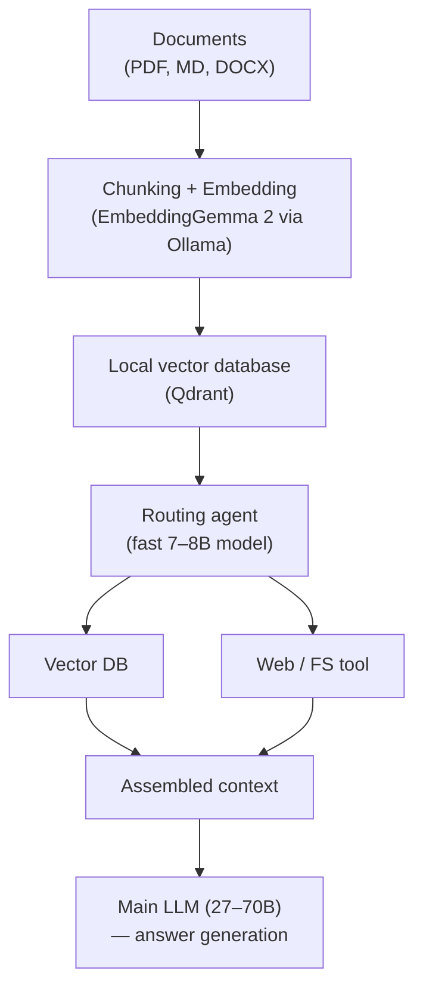

> [!tip] In brief
> A standalone LLM does not know your documents. RAG gives it access to your document base without retraining. Agents add the ability to act and reason in a loop. Together they form the backbone of a sovereign enterprise assistant.

A "bare" [[00-lexique/llm|LLM]] fresh from the factory is frozen in time. Its internal weights hold broad general knowledge, but it knows nothing about your company documents, yesterday's meetings, or the state of your database. Worse: if you try to teach it that information via retraining (fine-tuning), it is very expensive for often disappointing results on precise fact retrieval.

To turn this blind statistical engine into a sovereign enterprise assistant, the standard software solution is **RAG** (Retrieval-Augmented Generation)[^1]. And since 2025, this concept has evolved toward autonomous **Agentic Workflows**.

---

## 1. Standard RAG: Vector search

Classic RAG (very popular between 2023 and 2024) is a linear chain:
1.  **Ingestion:** Your documents (PDF, Word, code) are split into small blocks (*chunks*). A specialized model converts these blocks into number lists (embeddings) and stores them in a **[[00-lexique/vectordb|Vector Database]]** (such as Qdrant, Milvus, or Chroma).
2.  **Search:** When the user asks a question, the system finds the blocks mathematically closest to the question.
3.  **Generation:** The system pastes these blocks into the user's prompt invisibly, then sends everything to the LLM to generate the answer.

### ⚠️ The physical limit (The KV Cache wall)
Standard RAG has an architectural flaw on-premise: it is blind. To avoid missing anything, developers often configure the database to return the top 20 results. The final prompt swells enormously, saturating the model's [[00-lexique/context-window|context window]].
As we saw in the hardware chapter, a huge context explodes the **[[01-fondations/kv-cache-and-context|KV Cache]]** size, destroying your server VRAM and collapsing [[00-lexique/inference|inference]] performance[^2].

---

## 2. Recent evolution: Agentic RAG and GraphRAG

To avoid saturating memory with useless information, the market has shifted to **Agentic RAG**[^5][^3]. Instead of being a passive pipe, the LLM becomes the driver.

### The agent framework
With libraries like [[00-lexique/smolagents|SmolAgents]] (Hugging Face) or [[00-lexique/langgraph|LangGraph]], developers give the LLM **Tools** ([[00-lexique/appel-outils|Tool Calling / Function Calling]]).
The flow becomes dynamic:
1. The user asks a complex question.
2. The agent reasons: *"Do I need to search the HR database or the source code?"*
3. The agent calls the search tool, reads a summary, and **decides itself** whether the information is sufficient or whether it needs a finer search before writing the final answer[^4].

Tools are increasingly exposed via the **Model Context Protocol** (MCP). The 28 July 2026 revision makes the protocol **stateless** (no more `Mcp-Session-Id` or `initialize` handshake; version and capabilities travel in `_meta` with every request), mandates `server/discover`, replaces server-initiated requests with *Multi Round-Trip Requests*, and **deprecates Roots, Sampling, Logging and OAuth dynamic client registration** (removal window of at least twelve months). An on-prem MCP server written in 2025 keeps working, but stop building on these primitives[^13].

### GraphRAG
Popularized by Microsoft research, **[[00-lexique/graphrag|GraphRAG]]** replaces the "dumb" vector database with a **Knowledge Graph**[^5]. The system extracts entities (people, places, concepts) and their relationships. This lets the LLM answer global questions (e.g. *"What are the main themes discussed by the product team this month?"*) that systematically failed classic vector RAG.

---

## 3. The [[00-lexique/memory-tree|Memory Tree]] approach

Rather than using a heavy vector database, an alternative architecture relies on **hierarchical Markdown folders** and a local metadata store (SQLite). The idea is to give the agent a *summarized* view of available knowledge, and load detail only when needed. This pattern, which this vault calls [[00-lexique/memory-tree|Memory Tree]], was popularized by the early versions of OpenHuman; as of 2026-10-09, the project has removed its local memory tree in favor of a CortexDB engine (hosted or self-hosted)[^6], so you must implement it yourself or with another tool.

*   **Hierarchy:** The agent never loads a full document into memory. It uses the LLM to read the "title" and a "one-line summary" of the file tree.
*   **Selective injection:** If it judges a file relevant, the agent calls a function to "unfold" that specific tree node and read its exact content.
*   **Architectural advantage:** Context stays tiny (a few hundred tokens for summaries), keeping [[00-lexique/ttft|TTFT]] (time to first token) under one second and preserving hardware resources, even with a heavy dense model.

> [!tip] Go further
> This pattern is no longer implemented as such by OpenHuman (memory moved out to CortexDB since 2026 — see the [[05-agents-et-assistants-on-prem/assistants-personnels/solutions/openhuman|OpenHuman]] entry). See the comparison [[05-agents-et-assistants-on-prem/assistants-personnels/index|On-Premise Personal Assistants]] for alternatives and their degree of sovereignty.

---

## 4. Choosing your vector database

Vector database choice depends on data volume, required sovereignty level, and available resources.

| Solution | Type | Strengths | Limits | Best for |
| :-- | :-- | :-- | :-- | :-- |
| **Chroma** | In-process (Python) | Zero configuration, embedded | Not suited to > 1M chunks | Prototyping, dev lab |
| **Qdrant** | Docker server | Rich payload filtering, REST/gRPC, scalable | Infra to operate | SMB, modern production |
| **Milvus** | Distributed server | Billions of vectors, high availability | Complex to operate | Datacenter, large volumes |
| **pgvector** | PostgreSQL extension | Vectors in existing database | Performance < native vector DBs | Existing Postgres stack |
| **SQLite + sqlite-vec** | Local file | Zero dependencies, max sovereignty | No H-scale scalability | Solo, Memory Tree patterns |

State of play in Q4 2026: Qdrant 1.19 (August 2026) stores vectors directly in 4-bit (TurboQuant) with `cold` / `cached` / `pinned` memory tiers per component; move to **1.19.2** (5 October 2026), which fixes filtered searches returning zero results and torn writes that could corrupt storage, and warns at startup if no API key is configured; Milvus 3.0 (GA on 29 July 2026) queries Parquet, Lance and Iceberg in place; **pgvector 0.8.3 to 0.8.7 fix HNSW index corruption on vacuum and IVFFlat buffer overflows — update any instance ≤ 0.8.2**[^14]. `sqlite-vss` is no longer developed; its author points to `sqlite-vec`[^12].

> [!tip] Quick start with Qdrant locally
> ```bash
> # Run Qdrant in Docker (persistent data in ./qdrant_storage)
> docker run -p 6333:6333 -p 6334:6334 \
>   -v ./qdrant_storage:/qdrant/storage \
>   qdrant/qdrant
>
> # Create a collection via the REST API
> curl -X PUT http://localhost:6333/collections/ma-base \
>   -H 'Content-Type: application/json' \
>   -d '{"vectors": {"size": 1024, "distance": "Cosine"}}'
> ```

## 5. Multi-tenant RAG: embedding isolation

In **[[00-lexique/multi-tenant|multi-tenant]]** deployments — a shared inference server for multiple organizations or teams — RAG introduces a critical security risk: documents from one tenant leaking into another tenant's search results.

OWASP formally classified this risk in its Top 10 LLM under **LLM08:2025 Vector and Embedding Weaknesses**; the 2026 edition (published 3 August 2026) keeps the risk under the identifier **LLM09:2026**[^7]. A naive vector database implementation without per-tenant isolation can allow a query from "Client B" to surface embeddings belonging to "Client A".

### Pattern 1 — Row-Level Security with pgvector

If your infrastructure already relies on **PostgreSQL**, the `pgvector` extension lets you store embeddings in the same database. Isolation relies on the engine's native **Row-Level Security (RLS)** mechanism[^8]:

```sql
-- Enable RLS on the embeddings table
ALTER TABLE documents ENABLE ROW LEVEL SECURITY;

-- Policy: each tenant sees only its own rows
CREATE POLICY tenant_isolation ON documents
  USING (tenant_id = current_setting('app.current_tenant')::uuid);

-- At runtime: set the tenant before each search
SET app.current_tenant = '{{tenant_uuid}}';
SELECT content, embedding <=> query_embedding AS distance
FROM documents ORDER BY distance LIMIT 5;
```

**Advantage:** the PostgreSQL engine applies the tenant filter at the lowest level — a malformed application-level query cannot bypass the policy. Isolation is **mathematically guaranteed by the database**, not by application logic.

**Limit:** `pgvector` performance remains below that of a native vector database for volumes above ~1M embeddings.

### Pattern 2 — Payload-based partitioning with Qdrant

Qdrant natively recommends a single-collection architecture using **Payload-based Partitioning**[^9]. Each embedding is indexed with a `tenant_id` payload (payload index declared with `is_tenant=True` so that a given tenant's data is stored contiguously), and the search (`query_points`, which replaces the former `client.search`) is scoped to a tenant through a filter:

```python
from qdrant_client import QdrantClient
from qdrant_client.models import Filter, FieldCondition, MatchValue

client = QdrantClient(url="http://localhost:6333")

# tenant_id payload index created beforehand with is_tenant=True (Qdrant ≥ 1.11)
# Scoped search: only vectors from the current tenant are compared
results = client.query_points(
    collection_name="documents",
    query=query_embedding,
    query_filter=Filter(
        must=[FieldCondition(
            key="tenant_id",
            match=MatchValue(value=current_tenant_id)
        )]
    ),
    limit=5
)
```

**Advantage:** a single collection, no multiplication of collections per tenant (which would collapse the cluster at scale). The payload filter is applied before vector similarity computation.

> [!warning] Application-level isolation ≠ mathematical isolation
> Never rely solely on a Python/Node application filter for multi-tenant isolation. If the filter is omitted by mistake (bug, refactoring), one tenant's data leaks. PostgreSQL RLS and Qdrant payload filtering guarantee isolation at the engine level, independent of application code.

---

## 6. FinOps: CPU/GPU routing and RAG pre-filtering

GPU inference is expensive. A well-designed architecture reserves the GPU for the one task where it is irreplaceable — **text generation** — and delegates auxiliary tasks to the CPU.

### CPU/GPU routing

| Task | Recommended engine | Hardware |
| :-- | :-- | :-- |
| Text generation (LLM) | vLLM, SGLang | GPU (exclusive VRAM) |
| Embedding generation | `embeddinggemma-2` (270M–740M) via Ollama; `nemotron-3-embed` 1B/8B if a GPU is available[^11] | **CPU** (EmbeddingGemma 2) / GPU (Nemotron 8B) |
| Speech transcription (STT) | `faster-whisper` (CTranslate2)[^10]; in real time: Voxtral Mini 4B Realtime (GPU ≥ 16 GB)[^18] | **CPU** (Voxtral: GPU) |
| Re-ranking, scoring | Lightweight CrossEncoder | **CPU** |

`faster-whisper` (SYSTRAN's Whisper implementation on the CTranslate2 engine) can transcribe short audio in real time directly on CPU, without using a single byte of VRAM[^10]. Embedding models like EmbeddingGemma 2 (270M–740M) are small enough to run efficiently in asynchronous batches on CPU.

**Benefit:** 100% of GPU VRAM remains available for generation. On a 2× L40S server (96 GB), this routing frees the VRAM that Whisper and the embedding model would have occupied (several GB), which translates directly into available KV Cache, and therefore into concurrent users — the actual gain depends on your workload and must be measured (see [[06-mise-en-oeuvre/evaluate-local-model|Evaluate a local model]]).

### RAG pre-filtering: the most powerful FinOps lever

The classic mistake is sending the LLM the entirety of documents retrieved by the vector database. Cloud APIs bill per token; local models saturate their context window.

The principle: **the Python microservice runs semantic search, not the LLM.** The LLM receives only the top K results, truncated to a few hundred tokens each:

```python
# Python selects the Top-K before calling the LLM
top_chunks = vector_db.search(query_embedding, limit=3)

# The LLM receives only relevant context — never the entire database
context = "\n\n".join([chunk.text for chunk in top_chunks])
response = llm.generate(prompt=f"Context:\n{context}\n\nQuestion: {user_query}")
```

On a document-copilot use case, going from 20 results (common practice) to 3 filtered results reduces tokens sent to the LLM by a factor of 5 to 10, with no perceptible quality degradation if semantic search is well calibrated.

> [!tip] See also
> For FinOps strategy on the hardware side (L40S vs A100, TCO per token), see [[04-blueprints/tco-comparison|💰 TCO Comparison]] and [[02-materiel/stations-multi-gpu|🧩 Multi-GPU Workstations]].

---

## 7. Reference architecture — Sovereign RAG stack


```mermaid
flowchart TD
    A["Documents\n(PDF, MD, DOCX)"] --> B["Chunking + Embedding\n(EmbeddingGemma 2 via Ollama)"]
    B --> C["Local vector database\n(Qdrant)"]
    C --> D["Routing agent\n(fast 7–8B model)"]
    D --> E["Vector DB"]
    D --> F["Web / FS tool"]
    E --> G["Assembled context"]
    F --> G
    G --> H["Main LLM (27–70B)\n— answer generation"]
```

**Recommended local embedding models:**

```bash
# Via Ollama (EmbeddingGemma 2, Google, October 2026, Apache 2.0 — 8k context, 768 dimensions truncatable to 512/256/128)
ollama pull embeddinggemma-2:270m   # text only, ~378 MB
ollama pull embeddinggemma-2        # 740M multimodal (text + image), ~1.3 GB
# nomic-embed-text and mxbai-embed-large remain valid for existing indexes
# (never mix two embedding models in the same collection)

# Quick test — /api/embed endpoint ("input" field, string or array for batching);
# the former /api/embeddings ("prompt" field) is no longer documented[^17]
curl http://localhost:11434/api/embed \
  -d '{"model": "embeddinggemma-2:270m", "input": "Memory bandwidth limits inference."}'
```

---

## 📋 The Architect's Advice

To build a sovereign enterprise software stack in Q4 2026:

1.  **Dedicate a small model to routing:** Do not use your large synthesis model (27–70B) to choose which tool to call. Use an ultra-fast model (e.g. Granite 4.2 8B, Apache 2.0, or Qwen3.8 in non-thinking mode) configured for [[00-lexique/appel-outils|tool calling]][^16]. It will call the database.
2.  **Keep large models for synthesis:** Once the small agent has retrieved the right text blocks, send everything to the heavy model (the "brain") to write the final answer.
3.  **Avoid cloud dependencies:** If you use LangChain or LlamaIndex, audit telemetry. In pure on-premise setups, minimal frameworks like [[00-lexique/smolagents|SmolAgents]] (Apache 2.0; release pace slowed since mid-2026 — latest version 1.26.0 in May 2026 —, to be checked before a new project[^15]) ensure your prompts will not leak to an external API during orchestration[^4].
4.  **Isolate embeddings per tenant from day one.** A [[00-lexique/multi-tenant|multi-tenant]] RAG without isolation (pgvector RLS or Qdrant payload) is a guaranteed security flaw. Adding this isolation after the fact on a production database is costly.
5.  **Route auxiliary tasks to CPU.** Embeddings and Whisper transcription consume no VRAM when using `faster-whisper` and EmbeddingGemma 2 (270M) on CPU. Freed VRAM multiplies concurrent inference capacity.

---

## 📚 Sources and References

[^1]: P. Lewis et al., *Retrieval-Augmented Generation for Knowledge-Intensive NLP Tasks* (arXiv:2005.11401; original definition of RAG), 2020. [https://arxiv.org/abs/2005.11401](https://arxiv.org/abs/2005.11401)
[^2]: NVIDIA Technical Blog, *Mastering LLM Techniques: Inference Optimization* (Impact of long context on KV Cache), November 2023. [https://developer.nvidia.com/blog/mastering-llm-techniques-inference-optimization/](https://developer.nvidia.com/blog/mastering-llm-techniques-inference-optimization/)
[^3]: LangChain, *LangGraph* (repository and documentation: agent graph orchestration, self-correcting RAG; releases 1.2.x), accessed 2026-10-10. [https://github.com/langchain-ai/langgraph](https://github.com/langchain-ai/langgraph)
[^4]: Hugging Face, *Agentic RAG with SmolAgents* (RAG orchestration via Hugging Face light framework), 2025. [https://huggingface.co/docs/smolagents/main/examples/rag](https://huggingface.co/docs/smolagents/main/examples/rag)
[^5]: Neo4j Developer Blog, *What is agentic RAG? A developer's guide* (GraphRAG, ReAct, multi-agent RAG patterns), May 2026. [https://neo4j.com/blog/agentic-ai/what-is-agentic-rag/](https://neo4j.com/blog/agentic-ai/what-is-agentic-rag/)
[^6]: OpenHuman, *How memory works* ("The current memory has no memory tree … or Obsidian vault"; TinyHumans Hosted / CortexDB engines), docs read on 2026-10-09. The Memory Tree *pattern* remains applicable in a 100% on-premise implementation independent of the project. [https://tinyhumans.gitbook.io/openhuman/features/memory](https://tinyhumans.gitbook.io/openhuman/features/memory)
[^7]: OWASP GenAI Security Project, *LLM08:2025 Vector and Embedding Weaknesses*. [https://genai.owasp.org/llm-top-10/](https://genai.owasp.org/llm-top-10/); OWASP GenAI Security Project, *OWASP Top 10 for LLM Applications 2026* (LLM09:2026 Vector and Embedding Weaknesses), 2026-08-03. [https://genai.owasp.org/resource/owasp-genai-llm-top-10-2026/](https://genai.owasp.org/resource/owasp-genai-llm-top-10-2026/)
[^8]: Crunchy Data, *Row-Level Security for tenants in Postgres / pgvector*. [https://www.crunchydata.com/blog/row-level-security-for-tenants-in-postgres](https://www.crunchydata.com/blog/row-level-security-for-tenants-in-postgres)
[^9]: Qdrant, *Multitenancy* (payload partitioning, `is_tenant` payload index, tiered multitenancy v1.16+). [https://qdrant.tech/documentation/manage-data/multitenancy/](https://qdrant.tech/documentation/manage-data/multitenancy/)
[^10]: SYSTRAN, *faster-whisper — High-throughput Whisper inference on CPU and GPU (CTranslate2)*. [https://github.com/SYSTRAN/faster-whisper](https://github.com/SYSTRAN/faster-whisper)
[^11]: Google, *EmbeddingGemma 2* (740M including 270M text, 768 MRL dimensions → 128, 8k context, text + image + audio + video + code, Apache 2.0), 2026-10-06. [https://blog.google/innovation-and-ai/technology/developers-tools/embeddinggemma-2/](https://blog.google/innovation-and-ai/technology/developers-tools/embeddinggemma-2/); Ollama, *embeddinggemma-2* (tags `270m` 378 MB, `latest` 1.3 GB), accessed 2026-10-10. [https://ollama.com/library/embeddinggemma-2](https://ollama.com/library/embeddinggemma-2); NVIDIA, *Nemotron-3-Embed-8B-BF16* (4096 dimensions, 32k tokens, RTEB 78.46 NDCG@10, OpenMDW 1.1; 1B BF16 / 1B NVFP4 variants), 2026-07-16. [https://huggingface.co/nvidia/Nemotron-3-Embed-8B-BF16](https://huggingface.co/nvidia/Nemotron-3-Embed-8B-BF16)
[^12]: A. Garcia, *sqlite-vss* (README: "sqlite-vss is not in active development", effort moved to sqlite-vec), accessed 2026-10-10. [https://github.com/asg017/sqlite-vss](https://github.com/asg017/sqlite-vss)
[^13]: Model Context Protocol, *Key Changes — 2026-07-28* (removal of `Mcp-Session-Id` and the `initialize` handshake, `server/discover`, Multi Round-Trip Requests, deprecation of Roots / Sampling / Logging and Dynamic Client Registration, deprecation window of at least twelve months). [https://modelcontextprotocol.io/specification/2026-07-28/changelog](https://modelcontextprotocol.io/specification/2026-07-28/changelog)
[^14]: Qdrant, *Releases* (v1.19.0, 5 August 2026: TurboQuant 4-bit as primary storage, `cold` / `cached` / `pinned` tiers; v1.19.2 on 5 October 2026: filtered searches returning zero results #10903, Gridstore torn writes #10837, no-API-key warning #10852). [https://github.com/qdrant/qdrant/releases](https://github.com/qdrant/qdrant/releases) · [https://github.com/qdrant/qdrant/releases/tag/v1.19.2](https://github.com/qdrant/qdrant/releases/tag/v1.19.2); Milvus, *Releases* (v3.0.0 GA on 2026-07-29, External Collection Parquet / Lance / Iceberg; v3.0.2 on 2026-09-20). [https://github.com/milvus-io/milvus/releases](https://github.com/milvus-io/milvus/releases); pgvector, *CHANGELOG* (0.8.3 of 2026-06-17: "Fixed possible index corruption with HNSW vacuuming"; 0.8.6 and 0.8.7 of 2026-10-01: "Fixed buffer overflow with IVFFlat index build"). [https://github.com/pgvector/pgvector/blob/master/CHANGELOG.md](https://github.com/pgvector/pgvector/blob/master/CHANGELOG.md)
[^15]: Hugging Face, *smolagents — Releases* (latest version v1.26.0 of 2026-05-29; maintenance commits only since), accessed 2026-10-10. [https://github.com/huggingface/smolagents/releases](https://github.com/huggingface/smolagents/releases)
[^16]: IBM, *Granite 4.2 8B* (Apache 2.0, OpenAI-format tool calling, thinking / low-effort modes), 2026-08-25. [https://huggingface.co/ibm-granite/granite-4.2-8b](https://huggingface.co/ibm-granite/granite-4.2-8b); Qwen, *Qwen3.8-27B* (thinking mode can be enabled or disabled), August 2026. [https://huggingface.co/Qwen/Qwen3.8-27B](https://huggingface.co/Qwen/Qwen3.8-27B)
[^17]: Ollama, *API — Generate embeddings* (`POST /api/embed`, `input` field string or array, `truncate` / `dimensions` options; no `/api/embeddings` endpoint documented), accessed 2026-10-10. [https://docs.ollama.com/api/embed](https://docs.ollama.com/api/embed)
[^18]: Mistral AI, *Voxtral Mini 4B Realtime 2602* (real-time streaming transcription, 13 languages, BF16, one GPU ≥ 16 GB; Apache 2.0), Hugging Face, February 2026. [https://huggingface.co/mistralai/Voxtral-Mini-4B-Realtime-2602](https://huggingface.co/mistralai/Voxtral-Mini-4B-Realtime-2602)
