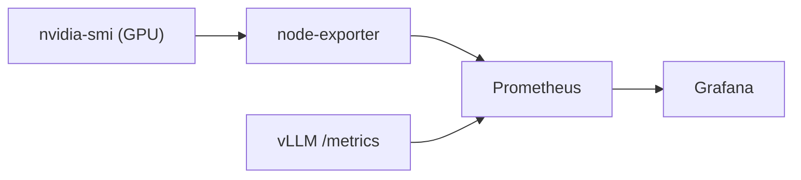

Your client is a large enterprise, a sovereign cloud host, or a public institution. The requirements are uncompromising: host a 70B-class model or an MoE giant of 300B to over 1T parameters, and above all, **serve dozens or even hundreds of users at the same time** with instant response time.

[[04-blueprints/scenario-b-sme-appliance|Scenario B]] (the Appliance) would choke under concurrent load, and [[04-blueprints/scenario-c-desktop-cluster|Scenario C]] (Exo Cluster) has a TTFT that is far too slow. For massive production, there is no secret: you must switch to the standard AI datacenter architecture.

---

## 🏗️ Hardware Architecture

Here, the basic unit is no longer the graphics card, but the **Server Node** and the **Fabric Network**.

*   **The Node (Scale-Up):** A rack-format server (e.g. NVIDIA HGX architecture) containing **8 datacenter-class GPUs** (NVIDIA H200, B200, or B300; AMD Instinct MI350X/MI455X)[^5]. Unlike a classic PC, these 8 chips do not communicate over PCIe, but via **[[00-lexique/nvlink|NVLink]]** and **[[00-lexique/nvswitch|NVSwitch]]**. This bus lets chips exchange data at **1,800 GB/s** (on Blackwell)[^1].
*   **The Network (Scale-Out):** To connect several nodes together, very high-throughput network cards (400 Gbps or 800 Gbps) compatible with **[[00-lexique/rdma|RDMA]]** are used. The standard is **InfiniBand** or **[[00-lexique/roce|RoCEv2]]** (RDMA over Converged Ethernet)[^2].
*   **Storage:** Distributed NVMe flash storage accessible via *GPUDirect Storage*, to load terabytes of model weights in seconds at startup.

**Estimated budget (Q4 2026):** from €250,000 (8× RTX PRO 6000 server, OEM list price $266k) to over €1 million per node (GB300 on quote)[^6], excluding network infrastructure, energy, and cooling costs.

---

## ⚙️ Software Stack and Mechanism

This hardware extravagance demands inference engines that can exploit it to the millisecond: **[[00-lexique/vllm|vLLM]]** (≥ 0.29, `vllm serve`) or the official **[[00-lexique/tensorrt-llm|TensorRT-LLM]]** SDK (`trtllm-serve`; beware, 1.3 has remained a release candidate since July 2026: pin 1.2.1 in production)[^7]. Multi-node orchestration is handled by **[[00-lexique/ray|Ray]]** (Ray Serve LLM, GA since 2.59 with KV-cache-aware routing)[^8].

### The Magic of Tensor Parallelism
On the Mac Cluster (Scenario C), we saw *Pipeline Parallelism* (layer-by-layer splitting), which increases latency.
In an HGX node, the incredible speed of NVLink enables **[[00-lexique/tensor-parallelism|Tensor Parallelism]]** (TP). A single mathematical operation (a matrix) is split and computed *at the same time* by the 8 GPUs.
*   **Result:** The 8 cards act as one giant GPU. Generation latency collapses, and [[00-lexique/tokens-per-second|tokens/s]] explode, even on a massive model.

### Extreme Formats (FP4)
If you deploy NVIDIA Blackwell (B200) chips, the software will natively use **FP4** or **FP8** quantization. This lets gigantic models fit in a single 8-GPU node — DeepSeek V4.1 Flash or GLM-5.3 (~760 GB in FP8) in 8× H200, Kimi K3 (~1.5 TB in MXFP4) in 8× B300 or 16× H200[^9] — avoiding having to cross the RoCE network for every computation[^3].

---

## The Network Engineering Trap (The RoCE drama)

> [!warning] RoCE is not plug-and-play
> Many companies buy GPU servers, then plug everything into their standard Ethernet network hoping RDMA will work on its own.
> This is the biggest trap of this blueprint: **RoCE is not plug-and-play**. It requires a so-called "Lossless" network. If your network switches are not rigorously configured with strict congestion control protocols ([[00-lexique/pfc|PFC]], [[00-lexique/ecn|ECN]]), AI-related data packets will saturate the cables, causing retransmissions.
> **Network latency going from 2 microseconds to 5 milliseconds is enough to divide your AI cluster speed by ten**[^2].

---

## 📋 The Architect's Verdict

### ✅ When to use this Blueprint?
*   **Production at scale:** This is the only viable architecture for serving real sovereign SaaS applications (like an internal enterprise ChatGPT for 1,000 employees).
*   **Need for guarantees (SLA):** When [[00-lexique/ttft|TTFT]] must always stay below 500 ms, regardless of the number of connected users.

### ❌ When to avoid this Blueprint?
*   **If you do not have a dedicated network engineer.** Operating a RoCE/InfiniBand fabric and a Ray cluster requires very specialized administration skills, often from the High Performance Computing (HPC) world.
*   **Datacenter constraints:** These machines are giant radiators. A standard rack often cannot cool such a node without heavy upgrades (Direct Liquid Cooling).

---

## 📊 Recommended Monitoring

Scenario D is the only blueprint that justifies tooling monitoring in production. Minimum elements:

**GPU and VRAM (per node):**

```bash
# Real-time monitoring of all GPUs
watch -n 1 nvidia-smi

# CSV format for Prometheus export
nvidia-smi --query-gpu=timestamp,name,utilization.gpu,utilization.memory,\
memory.used,memory.free,temperature.gpu,power.draw \
--format=csv -l 5
```

**vLLM — native Prometheus metrics:**

vLLM exposes a `/metrics` endpoint compatible with Prometheus. Key metrics (V1 engine names, re-read in the documentation on 2026-10-10; deprecated metrics are hidden one version later)[^10]:
[^11]: vLLM Project, *Release v0.31.0* (`vllm preload`: daemon that keeps post-quantization weights in GPU memory across engine restarts, #56680, #58552), 2026-10-05. [https://github.com/vllm-project/vllm/releases/tag/v0.31.0](https://github.com/vllm-project/vllm/releases/tag/v0.31.0)

| vLLM metric | Description |
| :-- | :-- |
| `vllm:prompt_tokens_total` | Prompt tokens processed |
| `vllm:generation_tokens_total` | Tokens generated |
| `vllm:request_success_total` | Completed requests |
| `rate(vllm:generation_tokens_total[1m])` | Generation throughput (the V0 engine's `avg_generation_throughput` gauge no longer exists) |
| `vllm:kv_cache_usage_perc` | KV Cache occupancy rate (formerly `gpu_cache_usage_perc`) |
| `vllm:num_requests_running` | Requests in progress (continuous batching) |

```bash
# Check metrics endpoint
curl http://localhost:8000/metrics | grep vllm
```

**Recommended stack:**



Grafana dashboards for vLLM are available at [grafana.com/grafana/dashboards](https://grafana.com/grafana/dashboards) (search for "vLLM").

**Network (RoCE/InfiniBand):**

```bash
# RDMA counters (errors, retransmissions)
rdma statistic show

# Packet loss on RoCE interface
ethtool -S <interface> | grep -E "rx_discards|tx_discards"
```

> [!warning] Monitor RoCE congestion
> An increase in RDMA retransmissions is the first signal of misconfigured PFC/ECN. Monitor actively — undetected network degradation can divide cluster throughput by ten without a visible application error.

### Storage Wall — SSD→VRAM boot time (MTTR impact)

The "Memory Wall" covers steady-state performance. The "Storage Wall" covers **restarts**: each vLLM restart requires reloading model weights from SSD to VRAM.

| Model | BF16 size | PCIe 3.0 SSD (3 GB/s) | PCIe 5.0 NVMe SSD (10 GB/s) | GPUDirect Storage |
| :-- | :-- | :-- | :-- | :-- |
| 70B | ~140 GB | **~47 seconds** | ~14 seconds | ~8 seconds |
| 405B | ~810 GB | **~4.5 minutes** | ~81 seconds | ~45 seconds |

For a datacenter SLA with an MTTR (Mean Time To Recovery) target under 2 minutes, a 405B in BF16 on a PCIe 3.0 SSD is **incompatible with that objective**. Solutions:

- **PCIe 5.0 NVMe in RAID 0:** doubles sequential throughput (~20 GB/s real), MTTR < 45 seconds on a 405B
- **GPUDirect Storage** (NVIDIA Magnum IO): direct SSD→VRAM transfer without CPU copy, reduces system load and improves throughput[^4]
- **Quantized model:** a 405B in Q4 (~230 GB) reduces load time by ~65% vs BF16
- **vLLM preload:** since vLLM 0.31 (October 2026), `vllm preload` starts a daemon that keeps the already-quantized weights in GPU memory from one engine restart to the next (with a `/health` endpoint); this shortens service restarts, not a machine reboot or a GPU failure[^11]

> [!note] Link with enterprise SLAs
> For critical deployments (AI in production in business workflows), reload time must be documented in service level agreements. Plan a scheduled restart process (rolling restart with double instance) for updates without downtime.

---

## 🛡️ High Availability and Recovery (DRP)

Blueprint D is the only scenario where a formal disaster recovery plan is economically justified. Two hours of downtime on a production HGX node represents significant operational and reputational cost.

### HA strategies by component

| Component | HA strategy | Notes |
| :-- | :-- | :-- |
| **vLLM** | Dual instance with load balancer (Nginx / HAProxy) | Rolling restart for zero-downtime updates |
| **Qdrant cluster** | Distributed mode (3 nodes minimum) with replication | Qdrant natively supports sharding and replication |
| **PostgreSQL / SQLite** | Streaming replication (Postgres) or WAL archiving | SQLite insufficient for production D — migrate to Postgres |
| **Model storage** | NVMe RAID 0 + daily snapshot to NAS or sovereign S3 | GPUDirect Storage needs a dedicated path — exclude from software RAID |
| **RoCE network** | Switch redundancy (dual-spine) + active PFC/ECN monitoring | Uncontrolled packet loss silently collapses throughput |

### RTO / RPO targets

| Incident | Target RTO | Target RPO | Action |
| :-- | :-- | :-- | :-- |
| vLLM process crash | < 2 min | 0 (no data loss) | Automatic restart (systemd / Docker restart policy) |
| Single GPU failure (8 GPU) | < 5 min | 0 | Tensor Parallelism reduced to 7 GPUs until replacement |
| Full node failure | < 30 min | < 15 min | Failover to pre-configured standby node |
| Vector DB corruption | < 1 h | < 1 h | Restore from latest Qdrant snapshot |
| Site disaster (fire, flood) | < 4 h | < 24 h | Off-site replication (secondary datacenter or sovereign cloud) |

### Minimum daily backup

```bash
# Qdrant snapshot (all collections)
curl -X POST http://localhost:6333/snapshots

# Postgres export (histories, agent metadata)
pg_dump -Fc ia_on_prem_db > /backup/$(date +%F)_pg.dump

# Off-site copy (rsync to secondary NAS example)
rsync -az /backup/ nas-secondary:/ia-on-prem-backup/
```

> [!note] Weight reload time conditions your RTO
> See the **Storage Wall** section above: a 405B model in BF16 on PCIe 3.0 SSD takes ~4.5 minutes to reload. Size your RTO accounting for this non-compressible delay.

---

## 📚 Sources and References

[^1]: NVIDIA Technical Blog, *NVIDIA NVLink and NVIDIA NVSwitch Supercharge Large Language Model Inference* (HGX architecture, Blackwell NVLink 1.8 TB/s), 2024-2026. [https://developer.nvidia.com/blog/nvidia-nvlink-and-nvidia-nvswitch-supercharge-large-language-model-inference/](https://developer.nvidia.com/blog/nvidia-nvlink-and-nvidia-nvswitch-supercharge-large-language-model-inference/)
[^2]: NVIDIA, *RDMA over Converged Ethernet - RoCE | Cumulus Linux* (Critical importance of PFC/ECN to avoid LLM performance collapse), 2026. [https://docs.nvidia.com/networking-ethernet-software/cumulus-linux/Layer-1-and-Switch-Ports/Quality-of-Service/RDMA-over-Converged-Ethernet-RoCE/](https://docs.nvidia.com/networking-ethernet-software/cumulus-linux/Layer-1-and-Switch-Ports/Quality-of-Service/RDMA-over-Converged-Ethernet-RoCE/)
[^3]: NVIDIA Technical Blog, *Optimizing Inference for Long Context and Large Batch Sizes with NVFP4 KV Cache* (Blackwell, native TensorRT-LLM), December 2025. [https://developer.nvidia.com/blog/optimizing-inference-for-long-context-and-large-batch-sizes-with-nvfp4-kv-cache/](https://developer.nvidia.com/blog/optimizing-inference-for-long-context-and-large-batch-sizes-with-nvfp4-kv-cache/)
[^4]: NVIDIA, *GPUDirect Storage Overview* (direct NVMe→VRAM transfer, no CPU copy, Magnum IO). [https://developer.nvidia.com/gpudirect-storage](https://developer.nvidia.com/gpudirect-storage)
[^5]: NVIDIA Newsroom, *NVIDIA Announces Financial Results for Second Quarter Fiscal 2027* (Blackwell Ultra B300 / GB300 shipping; Vera Rubin "in full production", allocated first to the large clouds), 26 August 2026. [https://nvidianews.nvidia.com/news/nvidia-announces-financial-results-for-second-quarter-fiscal-2027](https://nvidianews.nvidia.com/news/nvidia-announces-financial-results-for-second-quarter-fiscal-2027) · AMD, *AAI 2026: AMD Delivers Full-Stack Compute for the Agentic AI Era* (MI350X available, Helios / MI455X rack "in production", first racks 2H 2026), 23 July 2026. [https://ir.amd.com/news-events/press-releases/detail/1294/aai-2026-amd-delivers-full-stack-compute-for-the-agentic-ai-era](https://ir.amd.com/news-events/press-releases/detail/1294/aai-2026-amd-delivers-full-stack-compute-for-the-agentic-ai-era)
[^6]: AMD, *AAI 2026* — note 8 (8× RTX PRO 6000 server at an OEM list price of $265,928 as of 2026-07-16; MI350P server estimated at $327,238), 23 July 2026. [https://ir.amd.com/news-events/press-releases/detail/1294/aai-2026-amd-delivers-full-stack-compute-for-the-agentic-ai-era](https://ir.amd.com/news-events/press-releases/detail/1294/aai-2026-amd-delivers-full-stack-compute-for-the-agentic-ai-era) · NVIDIA HGX H200 and DGX B300: no public list price, third-party estimates of $300–420k (H200) and ≈ US$400k (B300), on quote.
[^7]: PyPI, *tensorrt-llm* (latest stable release 1.2.1 of 2026-04-20; 1.3.0 in release candidates rc22 → rc29 up to 2026-09-29), captured 2026-10-09. [https://pypi.org/project/tensorrt-llm/](https://pypi.org/project/tensorrt-llm/) · NVIDIA, *TensorRT-LLM Release Notes* (TensorRT backend removed in 1.2, PyTorch by default, `trtllm-serve`). [https://nvidia.github.io/TensorRT-LLM/release-notes.html](https://nvidia.github.io/TensorRT-LLM/release-notes.html) · vLLM Project, *Release v0.29.0*, 9 September 2026. [https://github.com/vllm-project/vllm/releases/tag/v0.29.0](https://github.com/vllm-project/vllm/releases/tag/v0.29.0)
[^8]: Ray Project, *Release ray-2.59.0* (Ray Serve LLM GA: KV-aware routing, prefill/decode disaggregation, vLLM pinned at 0.27.0), 2 October 2026. [https://github.com/ray-project/ray/releases/tag/ray-2.59.0](https://github.com/ray-project/ray/releases/tag/ray-2.59.0)
[^9]: DeepSeek AI, *DeepSeek-V4.1-Flash* (≈ 763 GB in FP8, MIT), September 2026. [https://huggingface.co/deepseek-ai/DeepSeek-V4.1-Flash](https://huggingface.co/deepseek-ai/DeepSeek-V4.1-Flash) · Moonshot AI, *Kimi K3* (native MXFP4 weights, ≈ 1.4–1.56 TB), July 2026. [https://huggingface.co/moonshotai/Kimi-K3](https://huggingface.co/moonshotai/Kimi-K3)
[^10]: vLLM, *Metrics* (list of V1 engine Prometheus metrics: `vllm:prompt_tokens`, `vllm:generation_tokens`, `vllm:request_success`, `vllm:kv_cache_usage_perc`, `vllm:num_requests_running`, `vllm:time_to_first_token_seconds`…; deprecation policy "hidden in X.Y+1, removed in X.Y+2"), consulted 2026-10-10. [https://docs.vllm.ai/en/latest/usage/metrics/](https://docs.vllm.ai/en/latest/usage/metrics/)
