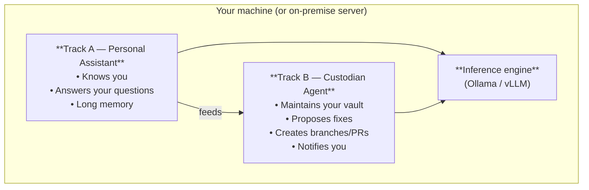

Not all local AI applications do the same thing. Before choosing a tool, it helps to understand which **architectural category** it belongs to — and what that category implies for hardware, complexity, and sovereignty.

---

## 🗂️ Taxonomy: three main families

### 1. Personal Assistant ("AI that knows you")

**Definition:** A personal assistant is an interactive system. You ask questions; it answers using its memory (your documents, notes, past conversations).

**Characteristics:**
- Primary interaction: real-time text dialogue
- Memory: persistent, centered on *your* context (notes, files, past conversations)
- Trigger: a human asks a question
- Autonomy: low — it responds, it does not *act*

**Examples:** Open WebUI, Jan.ai, Khoj, AnythingLLM (OpenHuman, now an agent harness, belongs to the hybrid category)

**Analogy:** a colleague very well informed on your cases, available 24/7, but who waits for you to speak.

---

### 2. Custodian Agent ("AI that acts for you")

**Definition:** A custodian agent runs tasks autonomously on a trigger. It does not answer questions — it *acts*: reads files, detects issues, generates proposals, creates Git branches, waits for human validation.

**Characteristics:**
- Primary interaction: scheduled or event-driven trigger, then report
- Memory: task context (the vault, the repo, error logs)
- Trigger: cron, webhook, Git event, CLI command
- Autonomy: high for read/analysis, **always human-in-the-loop for irreversible actions**

**Examples:** OpenHands Agent Canvas (scheduled or event-driven automations, self-hosted), a Cursor CLI + systemd script pipeline; Aider remains usable but has had no release since August 2025 and no commit since May 2026[^1]

**Analogy:** a junior research assistant who works overnight, leaves proposals on your desk in the morning, and signs nothing without your approval.

---

### 3. Hybrid ("AI that knows you and acts for you")

**Definition:** A combination of both. The assistant remembers your context *and* can trigger actions — web search, file updates, notifications — with or without validation depending on action risk level.

**Characteristics:**
- Can both answer and act
- Requires fine-grained permission and autonomy level management
- Higher complexity; risk of unwanted side effects if misconfigured

**Examples:** Open WebUI with tools and sub-agents (v0.11, July 2026)[^4], OpenHuman, Khoj (agent mode enabled), interactive conversations in OpenHands Agent Canvas

**Warning:** hybrid complexity is real. A poorly designed implementation can give the AI the ability to modify files, send email, or run commands without sufficient guardrails. Prefer an explicit architecture (assistant or custodian) to start.

Most of these tools expose their actions through the **Model Context Protocol (MCP)**. Its July 28, 2026 revision makes the protocol stateless (no more `Mcp-Session-Id`), introduces `server/discover`, and deprecates Roots, Sampling, Logging, and OAuth dynamic client registration (deprecation window of at least twelve months): check that the MCP servers and clients in your stack follow the same revision before stacking permissions[^3].

---

## 📊 Comparison table of the three patterns

| Criterion | Personal Assistant | Custodian Agent | Hybrid |
| :-- | :-- | :-- | :-- |
| **Interaction mode** | Real-time dialogue | Batch / event-driven | Both |
| **Trigger** | Human | Cron / webhook | Human or automatic |
| **Action autonomy** | Low (responses) | High (tasks) | Variable |
| **Memory required** | Long, personal | Short, task context | Both |
| **LLM model** | Large (response quality) | Small OK (routing) + large (synthesis) | Both |
| **Minimum VRAM** | 8–24 GB (7–14B model) | 8 GB (7B often enough) | 24+ GB |
| **Install complexity** | Low to medium | Medium to high | High |
| **Side-effect risk** | Low | Medium (without guardrails) | High without guardrails |
| **Sovereignty** | Varies by tool | Controllable if open stack | Controllable if well architected |

---

## 🔗 Relationship between the two tracks

The two tracks in this section are not competitors — they are **complementary** and can coexist on the same infrastructure.

**How they feed each other:**
- The custodian agent keeps the vault up to date → the personal assistant has a fresh knowledge base to query.
- The personal assistant identifies unclear areas in your notes → the custodian agent can be triggered to enrich them.
- Both share the same inference engine → one Ollama or vLLM server is enough for both tracks.
- Since June 2026, Agent Canvas (OpenHands) can also orchestrate third-party agents via the Agent Client Protocol and assign a local model (vLLM, Ollama) per automation: Track B becomes an orchestration layer rather than a single agent[^1].

---

## 🧭 Which architecture for which need?

| Your situation | Recommended architecture |
| :-- | :-- |
| You want a ChatGPT that knows your documents | Personal Assistant → [[05-agents-et-assistants-on-prem/assistants-personnels/index\|Track A]] |
| You want to automate vault maintenance | Custodian Agent → [[05-agents-et-assistants-on-prem/agents-custodiens/index\|Track B]] |
| You are starting out, hardware budget < €3,500 | [[04-blueprints/scenario-a-dev-lab\|Blueprint A]] + a simple assistant (Jan.ai or Open WebUI) |
| SME, 5–20 concurrent users | [[04-blueprints/scenario-b-sme-appliance\|Blueprint B]] + Open WebUI or AnythingLLM |
| You want both (knows + acts) | Start with Track A, add Track B after validation |
| Production, multi-site, strict SLA | [[04-blueprints/scenario-d-datacenter\|Blueprint D]] + controlled hybrid architecture |

---

## 📐 Hardware sizing

Both tracks share the same inference engine but do not have the same requirements.

| Track | Typical LLM model | Minimum VRAM | Comment |
| :-- | :-- | :-- | :-- |
| Personal Assistant (dialogue quality) | 14B–70B | 16–48 GB | Response quality matters — avoid < 7B |
| Custodian Agent (routing + synthesis) | 7B for routing, 14–32B for synthesis | 8–24 GB | Routing does not need a large model |
| Hybrid | 14B–70B | 24–48 GB | Compromise between the two |

For detailed sizing, see [[04-blueprints/scenario-a-dev-lab|Blueprints A–D]].

---

## 💻 Getting started with code (external resources)

This guide covers architecture theory. To move to practice, here are the recommended entry points for each track:

### Track A — Personal Assistant

| Tool | Starting point |
| :-- | :-- |
| **Open WebUI** | [Official documentation](https://docs.openwebui.com/) — Docker install in 5 minutes, Ollama connection |
| **AnythingLLM** | [AnythingLLM GitHub](https://github.com/Mintplex-Labs/anything-llm) — full local RAG, multi-model interface |
| **Khoj** | [Khoj self-hosting setup](https://docs.khoj.dev/get-started/setup) — personal memory + local file access (maintenance slowed since March 2026)[^5] |

### Track B — Custodian Agent

| Tool | Starting point |
| :-- | :-- |
| **Aider** | [Aider quickstart](https://aider.chat/docs/usage/tutorials.html) — local coding agent, Ollama-compatible; **project with no release since August 2025 and no commit since May 2026**, to be used only with full awareness[^1] |
| **OpenHands Agent Canvas** | [Agent Canvas (README, Docker)](https://github.com/OpenHands/OpenHands) — self-hosted control center for conversations and automations of coding agents (OpenHands, or Claude Code / Codex / Gemini CLI via ACP); the SDK and the agent live in `software-agent-sdk`[^1] |
| **LiteLLM + Ollama** | [LiteLLM proxy quickstart](https://docs.litellm.ai/docs/proxy/quick_start) — unified routing to a local model; **require version ≥ 1.100.4 (or the latest fix in its line)**: three LiteLLM vulnerabilities appear in CISA's KEV catalog in 2026 and a critical escalation (CVSS 9.9) was fixed on 2026-09-30[^2] |
| **SmolAgents** | [SmolAgents cookbook](https://huggingface.co/docs/smolagents/tutorials/building_good_agents) — minimal agent framework, HuggingFace (reduced activity since May 2026)[^6] |
| **LangGraph** | [LangGraph "local agent" tutorial](https://langchain-ai.github.io/langgraph/tutorials/introduction/) — agent orchestration with state graphs |

> [!note] No inline code in this vault
> This guide is an architecture reference, not a step-by-step tutorial. Code snippets have a short shelf life (APIs and versions evolve) — the links above point to the maintained sources. A companion repository `ia-on-prem-starter-kit` is planned to host versioned code examples separately.

---

## 🔗 See also

- [[05-agents-et-assistants-on-prem/fondations-communes/sovereignty-and-privacy|🔒 Sovereignty & Privacy]] — tool evaluation grid
- [[05-agents-et-assistants-on-prem/assistants-personnels/index|🧑‍💼 On-Premise Personal Assistants]]
- [[05-agents-et-assistants-on-prem/agents-custodiens/index|🤖 On-Premise Custodian Agents]]
- [[00-lexique/autonomous-agent|Autonomous agent]] · [[00-lexique/rag|RAG]]

## 📚 Sources and References

[^1]: Aider-AI, *aider* (GitHub repository: last commit on 2026-05-22, latest release v0.86.0 of 2025-08-09), accessed 2026-10-10; OpenHands, *Introducing Agent Canvas* (2026-06-16) and *Use any coding agent in OpenHands with ACP* (2026-06-18). [https://github.com/Aider-AI/aider](https://github.com/Aider-AI/aider) · [https://www.openhands.dev/blog/introducing-agent-canvas](https://www.openhands.dev/blog/introducing-agent-canvas) · [https://www.openhands.dev/blog/use-any-coding-agent-in-openhands-with-acp](https://www.openhands.dev/blog/use-any-coding-agent-in-openhands-with-acp)
[^2]: BerriAI, *GHSA-7hp6-4w63-5g45* (`internal_user` → `proxy_admin` → host execution escalation, CVSS 9.9, fixed in 1.100.4 / 1.101.3 / 1.102.2 / 1.103.1), 2026-09-30; CISA, *Known Exploited Vulnerabilities Catalog* (CVE-2026-42208, CVE-2026-42271, CVE-2026-59822), catalog dated 2026-10-08. [https://github.com/BerriAI/litellm/security/advisories/GHSA-7hp6-4w63-5g45](https://github.com/BerriAI/litellm/security/advisories/GHSA-7hp6-4w63-5g45) · [https://www.cisa.gov/sites/default/files/feeds/known_exploited_vulnerabilities.json](https://www.cisa.gov/sites/default/files/feeds/known_exploited_vulnerabilities.json)
[^3]: Model Context Protocol, *Specification 2026-07-28 — Key Changes* (removal of `Mcp-Session-Id` and of the `initialize` handshake, `server/discover`, deprecation of Roots, Sampling, Logging, and OAuth dynamic client registration, deprecation window of at least twelve months). [https://modelcontextprotocol.io/specification/2026-07-28/changelog](https://modelcontextprotocol.io/specification/2026-07-28/changelog)
[^4]: Open WebUI, *Release v0.11.0* (sub-agents, LDAP group synchronization), 2026-07-27. [https://github.com/open-webui/open-webui/releases/tag/v0.11.0](https://github.com/open-webui/open-webui/releases/tag/v0.11.0)
[^5]: Khoj, *Self-Host* (Docker / pip installation), read on 2026-10-10; khoj-ai, *khoj* — Releases (latest version 2.0.0-beta.28 of 2026-03-26). [https://docs.khoj.dev/get-started/setup](https://docs.khoj.dev/get-started/setup) · [https://github.com/khoj-ai/khoj/releases](https://github.com/khoj-ai/khoj/releases)
[^6]: Hugging Face, *smolagents* — Releases (latest version v1.26.0 of 2026-05-29, repository not archived), accessed 2026-10-10. [https://github.com/huggingface/smolagents/releases](https://github.com/huggingface/smolagents/releases)
