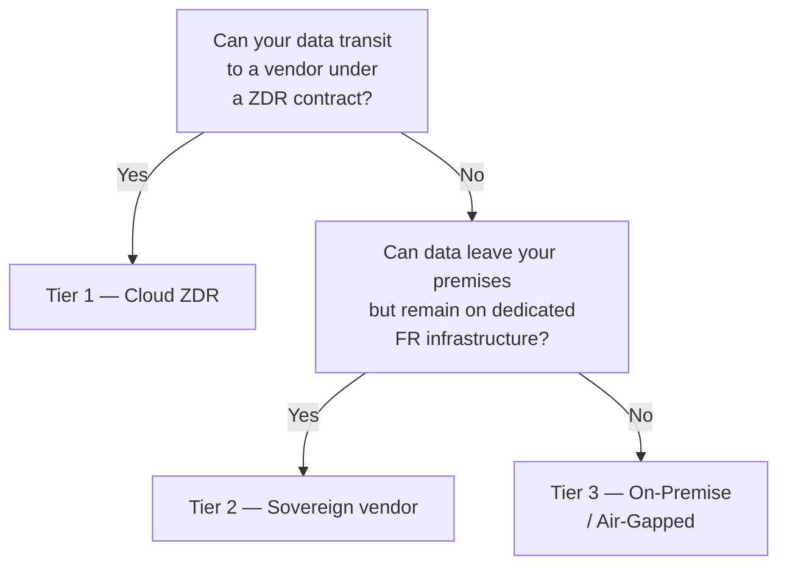

Before choosing a personal assistant or custodian agent, one question deserves an honest answer:

> [!warning] Audit question
> Does this software actually run the model on my machine, or does it send my data somewhere without me noticing?

The answer is not always on the marketing page. It is in the code, the README, and network traffic.

---

## 🧪 The evaluation grid: 6 criteria

The same evaluation protocol is applied to every tool presented in this section.

### Criterion 1 — Data location

> *Where do your files, conversations, and indexed documents end up?*

| Level | Description |
| :-- | :-- |
| ✅ Strict local | Everything stays on your machine. No file leaves the system. |
| ⚠️ Configurable | Local by default, but cloud sync possible if explicitly enabled. |
| ❌ Cloud by default | Data is sent to the vendor's servers even without configuration. |

**How to verify:** look in `.env.example` for variables `SYNC_URL`, `CLOUD_STORAGE`, `UPLOAD_ENDPOINT`. A `grep -r "fetch\|axios\|upload" src/` reveals outbound network calls.

---

### Criterion 2 — Model routing

> *Does inference run on your GPU/CPU, or via a cloud API?*

| Level | Description |
| :-- | :-- |
| ✅ Strict local | Ollama, llama.cpp, vLLM — the LLM runs on your machine. |
| ⚠️ Configurable | Supports Ollama but also offers OpenAI by default at install time. |
| ❌ Cloud by default | The application uses OpenAI, Anthropic, or another API without an obvious local alternative. |

**How to verify:** check the default configuration file. Is `OPENAI_API_KEY` among the *recommended* variables in the install tutorial? If yes, the cloud path is the path of least resistance.

---

### Criterion 3 — Persistent memory

> *Does the tool keep context between sessions? If so, where is it stored?*

| Level | Description |
| :-- | :-- |
| ✅ Strict local | Local SQLite, Markdown files on disk, local vector database (Chroma, self-hosted Qdrant). |
| ⚠️ Configurable | Remote database possible but not required. |
| ❌ Cloud by default | History and embeddings are stored in the vendor's cloud service. |

---

### Criterion 4 — Telemetry

> *Does the software send metrics, logs, or prompt traces to its developers?*

| Level | Description |
| :-- | :-- |
| ✅ Absent | No telemetry confirmed in source code, or explicitly disabled with `false` by default. |
| ⚠️ Opt-out | Telemetry active by default, disableable in configuration. |
| ❌ Not disableable | Built-in telemetry with no documented disable option. |

**How to verify:** search for `posthog`, `segment`, `mixpanel`, `sentry`, `amplitude` in `package.json` or `requirements.txt`. These libraries are classic telemetry vectors in open-source projects.

---

### Criterion 5 — Offline mode

> *Does the tool work with no Internet connection after installation?*

| Level | Description |
| :-- | :-- |
| ✅ Yes | Zero network calls in normal operation once models are downloaded. |
| ⚠️ Partial | Works offline for essentials, but some features (updates, web search) require Internet. |
| ❌ No | An Internet connection is required even for basic conversations. |

---

### Criterion 6 — Sovereignty verdict

Summary of the previous 5 criteria:

| Verdict | Meaning |
| :-- | :-- |
| ✅ Native sovereign | All 5 criteria are at ✅ level without special configuration. |
| ⚠️ Configurable | Can be made sovereign by changing configuration, but that is not default behavior. A non-technical user will use the tool in cloud mode without knowing it. |
| ❌ Strict on-prem incompatible | Cannot be made sovereign. Incompatible with GDPR, HDS, or professional secrecy constraints. |

---

## The "local UI, cloud brain" trap

> [!warning] Local UI, cloud brain
> This is the most dangerous — and most common — pattern.
>
> The interface is installed on your machine. The README says "privacy-first". And yet every conversation is sent to `api.openai.com` (or `api.anthropic.com`, or the vendor's servers) because the model that replies is not local.

**Typical examples:**
- An Electron app that "supports" Ollama but whose default config points to `gpt-4o`.
- An assistant that stores your files locally but sends your prompts to a remote model for embedding.
- An agent that runs on your machine but uses the vendor's web search service for every query.

**The 60-second test:** launch the app normally and monitor network traffic with a proxy (Proxyman, Charles, or simply `sudo tcpdump -i any host api.openai.com`). If you see requests to cloud services during a "local" conversation, you have your answer.

---

## ⚖️ Regulatory context

### GDPR (General Data Protection Regulation)

GDPR requires that personal data of EU residents be processed with explicit consent and protected. Sending conversations containing personal data to a cloud service outside the EU (Article 46) without appropriate safeguards is a potential violation — even if the vendor acts in good faith.

On-premise AI is one of the few architectures that allows processing personal data in an LLM **without exporting it outside the organization's control perimeter**.

### AI Act (EU AI Regulation, applicable from 2025–2026)

The AI Act distinguishes limited-risk systems (general assistants) from high-risk systems (used in healthcare, justice, education, HR, etc.). For high-risk use, traceability, auditability, and human control are mandatory — requirements that are hard to meet with a "black box" cloud model.

### EU AI Act — Transparency obligations (Article 50)

From August 2026, Article 50 of Regulation (EU) 2024/1689 (EU AI Act) imposes transparency obligations on deployers of AI systems that interact with humans[^3][^4]:

1. **Labeling of AI-generated content:** any text, image, or audio generated or significantly modified by an AI system and presented to a human must be clearly identified as such. This covers content suggestions, automatic translations, auto-classification results, and pre-filled forms.

2. **Information about AI interaction:** systems that interact with users via text or voice (chatbots, assistants) must inform the user that they are interacting with AI, unless the context makes this information obvious.

3. **Synthetic media:** deepfakes and AI-generated audio/video content must carry explicit marking, readable by both machines and humans.

**Practical implication for [[00-lexique/on-premise|on-premise]] deployments:** any interface displaying LLM-generated suggestions (summaries, classifications, translations, pre-filled fields) must include a visible indicator. The "suggested by AI" pattern constitutes the minimum compliant implementation. Automated write actions must remain subject to [[00-lexique/human-in-the-loop|human-in-the-loop]] validation until confidence reaches the defined threshold.

**Penalty for non-compliance:** fines of up to €15 million or 3% of worldwide annual turnover (Article 99).

### Sector-specific constraints

| Sector | Constraint | Implication |
| :-- | :-- | :-- |
| Healthcare | HDS (Health Data Hosting) | The host must be HDS-certified. Non-certified clouds are excluded. |
| Legal | Professional secrecy | Attorney–client exchanges cannot transit through third parties. |
| Defense / Government | Defense secrecy, IGI 1300 | Isolated networks mandatory for certain classification levels. |
| Finance | PSD2, NIS2 | Data localization and auditability requirements for critical systems. |

---

## ✅ Practical checklist: audit a new tool in 15 minutes

Before integrating a tool into your on-prem stack:

- [ ] **README:** is "local" accompanied by a local model (Ollama, llama.cpp) or an API key?
- [ ] **`.env.example`:** which variables are pre-filled? `OPENAI_API_KEY=""` present = cloud path facilitated.
- [ ] **`package.json` / `requirements.txt`:** presence of `posthog`, `segment`, `sentry`, `openai`, `anthropic`?
- [ ] **Network traffic (5 min):** tcpdump or proxy during a normal conversation — outbound calls?
- [ ] **Latest release:** is the project maintained? A version 18+ months old is a security risk.
- [ ] **GitHub issues:** search "privacy", "telemetry", "cloud" in closed issues — problems already reported and resolved (or ignored) are revealing.
- [ ] **Offline mode:** disconnect Internet and test. Everything stops = undocumented cloud dependency.

---

## 🏗️ Three sovereign deployment tiers (Privacy Tiers)

This vault advocates on-premise AI, but not every organization faces the same level of constraint. Before investing in dedicated infrastructure, it is useful to position your use case on a three-tier scale.

### Tier 1 — Cloud LLM with Zero Data Retention

**For whom:** organizations without strict legal data localization constraints; SMBs, startups, product teams.

A cloud provider API (Mistral, OpenAI, Anthropic) is used under a **[[00-lexique/zero-data-retention|Zero Data Retention (ZDR)]]** contract: requests and responses are processed in memory only, never written to disk or used for training.

**What ZDR guarantees:** no persistence of your data at the vendor.  
**What ZDR does not guarantee:** your data still transits through the vendor's servers. For organizations subject to strict constraints (HDS, professional secrecy, IGI 1300), this transit alone is enough to rule out Tier 1.

**Recommended models:** Mistral Large, Llama 3 via European-hosted API — Enterprise contracts with explicit GDPR DPA.

---

### Tier 2 — Sovereign SaaS (vendor hosting on certified infrastructure)

**For whom:** B2B players serving the public sector, healthcare, local authorities, and large French enterprises.

The AI vendor is no longer an American cloud but the **vendor itself**, hosting GPUs on **SecNumCloud** and/or **HDS** certified infrastructure in France (OVHcloud, Scaleway, Outscale).

| Aspect | Tier 1 | Tier 2 |
| :-- | :-- | :-- |
| Data transits through a third party | Yes (LLM vendor) | Yes (vendor, GDPR sub-processor) |
| Infrastructure in France | ❌ Variable | ✅ Yes (SecNumCloud / HDS) |
| Open-weights models | ❌ Proprietary | ✅ Mistral, Llama, etc. |
| Applicable to public procurement | ❌ Often no | ✅ Yes with adequate qualification |
| Infrastructure cost | €0 (usage/token) | Shared (subscription) |

European open-weights models (`Mistral-Nemo-12B`, quantized `Llama-3-70B`) served on dedicated GPU deliver performance sufficient for 95% of B2B use cases (RAG, classification, translation) while remaining within the French legal perimeter[^5].

---

### Tier 3 — On-Premise / Air-Gapped (deployment at the customer site)

**For whom:** Defense sector, sensitive R&D, networks cut off from the Internet, ultra-confidential data.

The model and the entire inference stack run **at the end customer**, on their own hardware, with no outbound network calls. This is the core of this vault: the [[04-blueprints/scenario-a-dev-lab|Blueprints A through D]] describe the corresponding hardware architectures.

**Main constraint:** the customer must provide or fund GPU hardware. The vendor delivers the stack as containers (Docker/Kubernetes) with ready-to-use configuration.

---

> [!tip] Which tier to choose?
> Start by identifying your strongest constraint: legal (HDS, IGI 1300), commercial (public tenders), or technical (isolated network). That constraint dictates the minimum tier. Cost and operational complexity do the rest.

---

## 🔗 See also

- [[05-agents-et-assistants-on-prem/fondations-communes/possible-architectures|🏗️ Possible Architectures]] — taxonomy and pattern comparison
- [[05-agents-et-assistants-on-prem/assistants-personnels/index|🧑‍💼 Personal Assistants]] — solution sheets with sovereignty verdict
- [[05-agents-et-assistants-on-prem/agents-custodiens/index|🤖 Custodian Agents]] — solution sheets with sovereignty verdict
- [[00-lexique/on-premise|On-Premise (AI)]] — definition and motivations
- [[00-lexique/rag|RAG]] — common memory architecture in local assistants

[^3]: Regulation (EU) 2024/1689 — Artificial Intelligence Act. [https://eur-lex.europa.eu/eli/reg/2024/1689/oj](https://eur-lex.europa.eu/eli/reg/2024/1689/oj)
[^4]: EU AI Act Service Desk, *Article 50 — Transparency obligations*. [https://ai-act-service-desk.ec.europa.eu/en/ai-act/article-50](https://ai-act-service-desk.ec.europa.eu/en/ai-act/article-50)
[^5]: NVIDIA Developer Blog, *NVIDIA-Accelerated Mistral 3 Open Models Deliver Efficiency and Accuracy at Any Scale* (Mistral-Nemo-Minitron 8B, B2B performance). [https://developer.nvidia.com/blog/nvidia-accelerated-mistral-3-open-models-deliver-efficiency-accuracy-at-any-scale/](https://developer.nvidia.com/blog/nvidia-accelerated-mistral-3-open-models-deliver-efficiency-accuracy-at-any-scale/)
