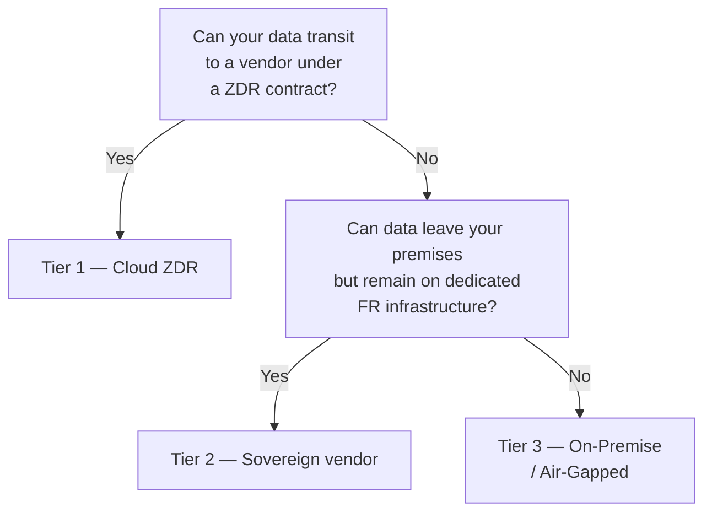

Before choosing a personal assistant or custodian agent, one question deserves an honest answer:

> [!warning] Audit question
> Does this software actually run the model on my machine, or does it send my data somewhere without me noticing?

The answer is not always on the marketing page. It is in the code, the README, and network traffic.

---

## 🧪 The evaluation grid: 6 criteria

The same evaluation protocol is applied to every tool presented in this section.

### Criterion 1 — Data location

> *Where do your files, conversations, and indexed documents end up?*

| Level | Description |
| :-- | :-- |
| ✅ Strict local | Everything stays on your machine. No file leaves the system. |
| ⚠️ Configurable | Local by default, but cloud sync possible if explicitly enabled. |
| ❌ Cloud by default | Data is sent to the vendor's servers even without configuration. |

**How to verify:** look in `.env.example` for variables `SYNC_URL`, `CLOUD_STORAGE`, `UPLOAD_ENDPOINT`. A `grep -r "fetch\|axios\|upload" src/` reveals outbound network calls.

---

### Criterion 2 — Model routing

> *Does inference run on your GPU/CPU, or via a cloud API?*

| Level | Description |
| :-- | :-- |
| ✅ Strict local | Ollama, llama.cpp, vLLM — the LLM runs on your machine. |
| ⚠️ Configurable | Supports Ollama but also offers OpenAI by default at install time. |
| ❌ Cloud by default | The application uses OpenAI, Anthropic, or another API without an obvious local alternative. |

**How to verify:** check the default configuration file. Is `OPENAI_API_KEY` among the *recommended* variables in the install tutorial? If yes, the cloud path is the path of least resistance.

---

### Criterion 3 — Persistent memory

> *Does the tool keep context between sessions? If so, where is it stored?*

| Level | Description |
| :-- | :-- |
| ✅ Strict local | Local SQLite, Markdown files on disk, local vector database (Chroma, self-hosted Qdrant). |
| ⚠️ Configurable | Remote database possible but not required. |
| ❌ Cloud by default | History and embeddings are stored in the vendor's cloud service. |

---

### Criterion 4 — Telemetry

> *Does the software send metrics, logs, or prompt traces to its developers?*

| Level | Description |
| :-- | :-- |
| ✅ Absent | No telemetry confirmed in source code, or explicitly disabled with `false` by default. |
| ⚠️ Opt-out | Telemetry active by default, disableable in configuration. |
| ❌ Not disableable | Built-in telemetry with no documented disable option. |

**How to verify:** search for `posthog`, `segment`, `mixpanel`, `sentry`, `amplitude` in `package.json` or `requirements.txt`. These libraries are classic telemetry vectors in open-source projects.

---

### Criterion 5 — Offline mode

> *Does the tool work with no Internet connection after installation?*

| Level | Description |
| :-- | :-- |
| ✅ Yes | Zero network calls in normal operation once models are downloaded. |
| ⚠️ Partial | Works offline for essentials, but some features (updates, web search) require Internet. |
| ❌ No | An Internet connection is required even for basic conversations. |

---

### Criterion 6 — Sovereignty verdict

Summary of the previous 5 criteria:

| Verdict | Meaning |
| :-- | :-- |
| ✅ Native sovereign | All 5 criteria are at ✅ level without special configuration. |
| ⚠️ Configurable | Can be made sovereign by changing configuration, but that is not default behavior. A non-technical user will use the tool in cloud mode without knowing it. |
| ❌ Strict on-prem incompatible | Cannot be made sovereign. Incompatible with GDPR, HDS, or professional secrecy constraints. |

---

## The "local UI, cloud brain" trap

> [!warning] Local UI, cloud brain
> This is the most dangerous — and most common — pattern.
>
> The interface is installed on your machine. The README says "privacy-first". And yet every conversation is sent to `api.openai.com` (or `api.anthropic.com`, or the vendor's servers) because the model that replies is not local.

**Typical examples:**
- An Electron app that "supports" Ollama but whose default config points to `gpt-4o`.
- An assistant that stores your files locally but sends your prompts to a remote model for embedding.
- An agent that runs on your machine but uses the vendor's web search service for every query.

**The 60-second test:** launch the app normally and monitor network traffic with a proxy (Proxyman, Charles, or simply `sudo tcpdump -i any host api.openai.com`). If you see requests to cloud services during a "local" conversation, you have your answer.

---

## ⚖️ Regulatory context

### GDPR (General Data Protection Regulation)

GDPR requires that personal data of EU residents be processed with explicit consent and protected. Sending conversations containing personal data to a cloud service outside the EU (Article 46) without appropriate safeguards is a potential violation — even if the vendor acts in good faith.

On-premise AI is one of the few architectures that allows processing personal data in an LLM **without exporting it outside the organization's control perimeter**.

The CNIL and the Conseil de l'IA et du Numérique (CIANUM) published on 20 July 2026 an exploratory note on agentic AI: a change of scale in personal data flows between connected services, hyper-personalized profiles built by persistent memory, responsibility diluted between actors, attack surface extended to every connected service. GDPR and the AI Act apply, but their implementation must adapt — one more argument for an agent whose memory stays on your infrastructure[^11].

### AI Act (Regulation (EU) 2024/1689, applicable in stages since 2 February 2025)

The AI Act distinguishes limited-risk systems (general assistants) from high-risk systems (used in healthcare, justice, education, HR, etc.). For the latter, traceability, auditability, and human control will become mandatory from **2 December 2027** (Annex III) and **2 August 2028** (Annex I), deadlines set by Regulation (EU) 2026/1744, the so-called "Digital Omnibus on AI", which replaced the initial deadline of August 2026[^6]. These are requirements that are hard to meet with a "black box" cloud model — better to anticipate them in the architecture.

### EU AI Act — Transparency obligations (Article 50)

Since 2 August 2026, Article 50 of Regulation (EU) 2024/1689 (EU AI Act) has imposed transparency obligations on providers and deployers of AI systems that interact with humans[^3][^4]; generative AI systems already on the market at that date have until 2 December 2026 for the machine-readable marking of Art. 50(2)[^6]:

1. **Marking and labeling of generated content:** the *provider* of a system generating text, image, audio, or video must mark its outputs in a machine-readable way (Art. 50(2)); the *deployer* must label deepfakes and generated texts published to inform the public on matters of public interest without human review (Art. 50(4)). The Commission's guidelines of 20 July 2026 exclude source code and short strings from marking, and refer to the code of practice of 10 June 2026 as a recognized means of compliance[^4][^7].

2. **Information about AI interaction:** systems that interact with users via text or voice (chatbots, assistants) must inform the user that they are interacting with AI, unless the context makes this information obvious.

3. **Synthetic media:** deepfakes and AI-generated audio/video content must carry explicit marking, readable by both machines and humans.

**Practical implication for [[00-lexique/on-premise|on-premise]] deployments:** any conversational interface must announce that it is an AI from the first interaction; for LLM-generated suggestions (summaries, classifications, translations, pre-filled fields), the "suggested by AI" indicator is not always a legal obligation, but it is the good practice that prepares for the audit and avoids the inadvertent publication of unreviewed text. Automated write actions must remain subject to [[00-lexique/human-in-the-loop|human-in-the-loop]] validation until confidence reaches the defined threshold.

**Penalty for non-compliance:** fines of up to €15 million or, for an undertaking, 3% of worldwide annual turnover, whichever is higher (Article 99(4))[^17].

### Sector-specific constraints

| Sector | Constraint | Implication |
| :-- | :-- | :-- |
| Healthcare | HDS (Health Data Hosting) | The host must be HDS-certified. Non-certified clouds are excluded. |
| Legal | Professional secrecy | Attorney–client exchanges cannot transit through third parties. |
| Defense / Government | Defense secrecy, IGI 1300 | Isolated networks mandatory for certain classification levels. |
| Finance | PSD2; NIS2 (not transposed in France as of Q4 2026 — the Commission referred the matter to the CJEU on 8 July 2026[^8]) | Data localization and auditability requirements for critical systems; anticipate NIS2 without waiting for the transposition law. |

---

## ✅ Practical checklist: audit a new tool in 15 minutes

Before integrating a tool into your on-prem stack:

- [ ] **README:** is "local" accompanied by a local model (Ollama, llama.cpp) or an API key?
- [ ] **`.env.example`:** which variables are pre-filled? `OPENAI_API_KEY=""` present = cloud path facilitated.
- [ ] **`package.json` / `requirements.txt`:** presence of `posthog`, `segment`, `sentry`, `openai`, `anthropic`?
- [ ] **Network traffic (5 min):** tcpdump or proxy during a normal conversation — outbound calls?
- [ ] **Latest release:** is the project maintained? A version 18+ months old is a security risk.
- [ ] **GitHub issues:** search "privacy", "telemetry", "cloud" in closed issues — problems already reported and resolved (or ignored) are revealing.
- [ ] **Offline mode:** disconnect Internet and test. Everything stops = undocumented cloud dependency.

---

## 🏗️ Three sovereign deployment tiers (Privacy Tiers)

This vault advocates on-premise AI, but not every organization faces the same level of constraint. Before investing in dedicated infrastructure, it is useful to position your use case on a three-tier scale.

```mermaid
flowchart TD
    A[Can your data transit\nto a vendor under\na ZDR contract?] -- Yes --> B[Tier 1 — Cloud ZDR]
    A -- No --> C[Can data leave your premises\nbut remain on dedicated\nFR infrastructure?]
    C -- Yes --> D[Tier 2 — Sovereign vendor]
    C -- No --> E[Tier 3 — On-Premise\n/ Air-Gapped]
```

### Tier 1 — Cloud LLM with Zero Data Retention

**For whom:** organizations without strict legal data localization constraints; SMBs, startups, product teams.

A cloud provider API (Mistral, OpenAI, Anthropic) is used under a **[[00-lexique/zero-data-retention|Zero Data Retention (ZDR)]]** clause: requests and responses are neither retained after the response nor used for training. As of Q4 2026, the clause is negotiated model by model and endpoint by endpoint: Anthropic has required 30 days of retention for its frontier models (Fable 5 / 5.1, Mythos) since June 2026; OpenAI grants ZDR on approval and retains 30 days of monitoring logs by default; Mistral excludes its Labs/Preview models from any ZDR clause[^10].

**What ZDR guarantees:** no persistence of your data at the vendor, for the models and endpoints explicitly covered by your contract — check the list with every new model.  
**What ZDR does not guarantee:** your data still transits through the vendor's servers. For organizations subject to strict constraints (HDS, professional secrecy, IGI 1300), this transit alone is enough to rule out Tier 1.

**Recommended models:** Mistral Large, Llama 3 via European-hosted API — Enterprise contracts with explicit GDPR DPA.

**What about Chinese vendors' APIs?** They expose the same OpenAI-compatible interfaces, sometimes at very low prices: as of 2026-10-10, DeepSeek V4.1 Flash is billed at $0.30 / $1.20 per million tokens (input / output) at peak hours, half price off-peak[^12]. But "Chinese" does not mean "cheap" in general: Kimi K3 is at $3 / $15 and GLM-5.3 at $1.40 / $4.40, the level of Western proprietary models[^13][^14]. These services are operated from China (DeepSeek states that it stores personal data in the People's Republic of China), a country without an adequacy decision from the European Commission: data leaves the EU just as it does to the United States, and any transfer of personal data falls under Articles 44 to 49 of the GDPR (appropriate safeguards, transfer impact assessment), with in practice the same sector exclusions as the rest of Tier 1[^15]. The alternative exists: these models are released as open weights (DeepSeek V4.1 Flash under the MIT license; Kimi K3 and GLM-5.3 under their own licenses, to be checked before commercial use), so they can be run in-house in Tier 3 when the hardware allows — they are MoE models with several hundred billion parameters, see [[04-blueprints/scenario-c-desktop-cluster|Blueprints C]] and [[04-blueprints/scenario-d-datacenter|D]][^16].

---

### Tier 2 — Sovereign SaaS (vendor hosting on certified infrastructure)

**For whom:** B2B players serving the public sector, healthcare, local authorities, and large French enterprises.

The AI vendor is no longer an American cloud but the **vendor itself**, hosting GPUs on **SecNumCloud**-qualified and/or **HDS**-certified infrastructure in France — as of Q4 2026, OVHcloud and Outscale for SecNumCloud (check the exact offer in the ANSSI catalog: the qualification covers a service, not a provider); Scaleway is HDS-certified and undergoing SecNumCloud qualification[^9].

| Aspect | Tier 1 | Tier 2 |
| :-- | :-- | :-- |
| Data transits through a third party | Yes (LLM vendor) | Yes (vendor, GDPR sub-processor) |
| Infrastructure in France | ❌ Variable | ✅ Yes (SecNumCloud / HDS) |
| Open-weights models | ❌ Proprietary | ✅ Mistral, Llama, etc. |
| Applicable to public procurement | ❌ Often no | ✅ Yes with adequate qualification |
| Infrastructure cost | €0 (usage/token) | Shared (subscription) |

Since the order of 12 August 2026 (JORF of 14 August), issued for Decree No. 2026-272 of 14 April 2026 pursuant to Article 31 of the SREN law, version 3.2 of the SecNumCloud standard is the official reference: State administrations, their operators, and GIPs must host their data "of particular sensitivity" on a cloud qualified by ANSSI (or certified at an equivalent European or national level). For a vendor targeting the public sector, Tier 2 is no longer a commercial advantage but a condition of access[^9].

European open-weights models (Mistral 3 family from Mistral AI, Kolibri from Aleph Alpha) served on dedicated GPU cover most common B2B use cases (RAG, classification, translation) while remaining within the French legal perimeter; measure it on your corpus before committing (see [[06-mise-en-oeuvre/evaluate-local-model|Evaluate a local model]])[^5]. Since 3 October 2026, Aleph Alpha's **Kolibri 1** (Germany, Apache 2.0, ~78 GB in FP8) joins this European open-weights offering; however, it targets only German and English, which restricts it to English-language or bilingual corpora for a French SME[^18].

---

### Tier 3 — On-Premise / Air-Gapped (deployment at the customer site)

**For whom:** Defense sector, sensitive R&D, networks cut off from the Internet, ultra-confidential data.

The model and the entire inference stack run **at the end customer**, on their own hardware, with no outbound network calls. This is the core of this vault: the [[04-blueprints/scenario-a-dev-lab|Blueprints A through D]] describe the corresponding hardware architectures.

**Main constraint:** the customer must provide or fund GPU hardware. The vendor delivers the stack as containers (Docker/Kubernetes) with ready-to-use configuration.

---

> [!tip] Which tier to choose?
> Start by identifying your strongest constraint: legal (HDS, IGI 1300), commercial (public tenders), or technical (isolated network). That constraint dictates the minimum tier. Cost and operational complexity do the rest.

---

## 🔗 See also

- [[05-agents-et-assistants-on-prem/fondations-communes/possible-architectures|🏗️ Possible Architectures]] — taxonomy and pattern comparison
- [[05-agents-et-assistants-on-prem/assistants-personnels/index|🧑‍💼 Personal Assistants]] — solution sheets with sovereignty verdict
- [[05-agents-et-assistants-on-prem/agents-custodiens/index|🤖 Custodian Agents]] — solution sheets with sovereignty verdict
- [[00-lexique/on-premise|On-Premise (AI)]] — definition and motivations
- [[00-lexique/rag|RAG]] — common memory architecture in local assistants

[^3]: Regulation (EU) 2024/1689 — Artificial Intelligence Act. [https://eur-lex.europa.eu/eli/reg/2024/1689/oj](https://eur-lex.europa.eu/eli/reg/2024/1689/oj)
[^4]: EU AI Act Service Desk, *Article 50 — Transparency obligations*. [https://ai-act-service-desk.ec.europa.eu/en/ai-act/article-50](https://ai-act-service-desk.ec.europa.eu/en/ai-act/article-50)
[^5]: NVIDIA Developer Blog, *NVIDIA-Accelerated Mistral 3 Open Models Deliver Efficiency and Accuracy at Any Scale* (Mistral-Nemo-Minitron 8B, B2B performance). [https://developer.nvidia.com/blog/nvidia-accelerated-mistral-3-open-models-deliver-efficiency-accuracy-at-any-scale/](https://developer.nvidia.com/blog/nvidia-accelerated-mistral-3-open-models-deliver-efficiency-accuracy-at-any-scale/)
[^6]: Regulation (EU) 2026/1744 "Digital Omnibus on AI" (OJ of 2026-07-24, in force on 2026-07-27; Art. 113 c: high-risk Annex III on 2027-12-02, Annex I on 2028-08-02; Art. 111(4): deadline of 2026-12-02 for Art. 50(2) marking of systems already on the market), read on 2026-10-09. [https://eur-lex.europa.eu/eli/reg/2026/1744/oj](https://eur-lex.europa.eu/eli/reg/2026/1744/oj)
[^7]: European Commission, *Guidelines on transparency obligations for providers and deployers of certain AI systems* (announcement of 2026-07-20) and *Code of practice on AI-generated content* (2026-06-10). [https://digital-strategy.ec.europa.eu/en/news/commission-publishes-guidelines-transparency-obligations-providers-and-deployers-certain-ai-systems](https://digital-strategy.ec.europa.eu/en/news/commission-publishes-guidelines-transparency-obligations-providers-and-deployers-certain-ai-systems) · [https://digital-strategy.ec.europa.eu/en/policies/code-practice-ai-generated-content](https://digital-strategy.ec.europa.eu/en/policies/code-practice-ai-generated-content)
[^8]: European Commission, *Commission refers Ireland, Spain, France and the Netherlands to the Court of Justice for failing to transpose rules* (NIS2, referral of 2026-07-08). [https://digital-strategy.ec.europa.eu/en/news/commission-refers-ireland-spain-france-and-netherlands-court-justice-failing-transpose-rules](https://digital-strategy.ec.europa.eu/en/news/commission-refers-ireland-spain-france-and-netherlands-court-justice-failing-transpose-rules)
[^9]: Scaleway, *SecNumCloud* ("undergoing SecNumCloud (ANSSI) qualification … not yet granted", HDS-certified), vendor page read on 2026-10-09; order of 12 August 2026 approving the SecNumCloud 3.2 standard (JORF of 2026-08-14, NOR PRMD2617964A); ANSSI, *Cloud* (catalog of qualified providers). [https://www.scaleway.com/en/security-and-compliance/secnumcloud/](https://www.scaleway.com/en/security-and-compliance/secnumcloud/) · [https://www.legifrance.gouv.fr/jorf/id/JORFTEXT000054678082](https://www.legifrance.gouv.fr/jorf/id/JORFTEXT000054678082) · [https://cyber.gouv.fr/enjeux-technologiques/cloud/](https://cyber.gouv.fr/enjeux-technologiques/cloud/)
[^10]: Anthropic, *Covered Models* (Fable 5 / 5.1, Mythos 5 / 5.1: retention of at least 30 days, ZDR unavailable; 2026-06-09 and 2026-08-31), read on 2026-10-10; OpenAI, *Your data* (ZDR on approval, 30-day monitoring logs by default), read on 2026-10-09; Mistral AI, *Commercial Terms of Service* (effective 2026-09-25, Labs/Preview models excluded from ZDR). [https://support.claude.com/en/articles/15425695-covered-models](https://support.claude.com/en/articles/15425695-covered-models) · [https://developers.openai.com/api/docs/guides/your-data](https://developers.openai.com/api/docs/guides/your-data) · [https://legal.mistral.ai/terms/commercial-terms-of-service](https://legal.mistral.ai/terms/commercial-terms-of-service)
[^11]: CNIL and CIANUM, *IA agentique : note exploratoire* (2026-07-20). [https://www.cnil.fr/fr/ia-agentique-cnil-cianum-note](https://www.cnil.fr/fr/ia-agentique-cnil-cianum-note)
[^12]: DeepSeek, *Models & Pricing* (deepseek-flash = DeepSeek-V4.1-Flash: $0.30 input on cache miss / $1.20 output per million tokens at peak hours, $0.15 / $0.60 off-peak; peak hours 01:00–04:00 and 06:00–10:00 UTC on weekdays), recorded on 2026-10-10. [https://api-docs.deepseek.com/quick_start/pricing](https://api-docs.deepseek.com/quick_start/pricing)
[^13]: Moonshot AI, *Kimi API pricing — chat* (kimi-k3: $3.00 input / $15.00 output per million tokens, $0.30 on cache hit; the platform.moonshot.ai URL redirects to platform.kimi.ai), recorded on 2026-10-10. [https://platform.kimi.ai/docs/pricing/chat](https://platform.kimi.ai/docs/pricing/chat)
[^14]: Z.ai, *Pricing* (GLM-5.3: $1.40 input / $4.40 output per million tokens; GLM-5.3-Flash: $0.15 / $0.50), recorded on 2026-10-10. [https://docs.z.ai/guides/overview/pricing](https://docs.z.ai/guides/overview/pricing)
[^15]: DeepSeek, *Privacy Policy* ("store your Personal Data in People's Republic of China", updated 2026-02-10); European Commission, *Adequacy decisions* (list of recognized countries: China is not on it), read on 2026-10-10. [https://cdn.deepseek.com/policies/en-US/deepseek-privacy-policy.html](https://cdn.deepseek.com/policies/en-US/deepseek-privacy-policy.html) · [https://commission.europa.eu/law/law-topic/data-protection/international-dimension-data-protection/adequacy-decisions_en](https://commission.europa.eu/law/law-topic/data-protection/international-dimension-data-protection/adequacy-decisions_en)
[^16]: Hugging Face, model cards *deepseek-ai/DeepSeek-V4.1-Flash* (MIT license, 763B parameters in safetensors), *moonshotai/Kimi-K3* ("Kimi K3" license, 2.8T parameters including 104B active) and *zai-org/GLM-5.3* ("glm-5.3" license, 753B parameters), read on 2026-10-10. [https://huggingface.co/deepseek-ai/DeepSeek-V4.1-Flash](https://huggingface.co/deepseek-ai/DeepSeek-V4.1-Flash) · [https://huggingface.co/moonshotai/Kimi-K3](https://huggingface.co/moonshotai/Kimi-K3) · [https://huggingface.co/zai-org/GLM-5.3](https://huggingface.co/zai-org/GLM-5.3)
[^17]: EU AI Act Service Desk, *Article 99 — Penalties* (§ 4 (g): non-compliance with Art. 50, "whichever is higher"), read on 2026-10-09. [https://ai-act-service-desk.ec.europa.eu/en/ai-act/article-99](https://ai-act-service-desk.ec.europa.eu/en/ai-act/article-99)
[^18]: Aleph Alpha, *Kolibri-1* (78B MoE, 3.46B active, Apache 2.0, German and English, FP8 weights ≈ 78 GB, signatory of the EU GPAI code of practice), 2026-10-03. [https://huggingface.co/Aleph-Alpha/Kolibri-1](https://huggingface.co/Aleph-Alpha/Kolibri-1)
